# 🗄️ Project Kosha

**253 days from `git --version` to running a repository other people depend on.**

Git internals → history → branching → merging → rewriting → recovery → remotes → GitHub → Actions →
security → the API → open source → scale. One committed day at a time, on a free account.

| | |
|---|---|
| **The plan** | [`docs/00_MASTER_PLAN_GITHUB.md`](docs/00_MASTER_PLAN_GITHUB.md) — 253 days, 23 phases, 276 IDs |
| **The doc standard** | [Part 11 — the depth contract](docs/00_MASTER_PLAN_GITHUB.md#part-11--the-depth-contract-doc-architecture-v100) — one document per subtopic |
| **The day map** | [Part 6](docs/00_MASTER_PLAN_GITHUB.md#part-6--the-day-map) — every day, its IDs, its kind |
| **Progress** | [`docs/TRACKER.md`](docs/TRACKER.md) — generated, never hand-edited |
| **Amendments** | [`docs/CHANGELOG_PLAN.md`](docs/CHANGELOG_PLAN.md) |
| **Start here** | [`days/day-00-foundry/LESSON.md`](days/day-00-foundry/LESSON.md) |

---

## What this is

A Git and GitHub curriculum that does not stop at the toy example.

Most Git material teaches you six commands and leaves you frightened of the seventh. This one starts
by taking the object store apart with `sha1sum`, so that by the time `rebase` appears you already
know it writes new objects and moves a pointer — which is not frightening at all.

Most GitHub material is a tour of menus that were renamed last quarter. This one teaches the
*setting* and its effect first, and the path to it second, and every part carries a
**verify-before-you-click** link fetched on the day it was written.

## What is not the subject

The code. `nudge` — the demo command-line tool this curriculum builds — is under two hundred lines at
the end, and a reader who has never written a line of Python can complete every day. It exists to
give Git something to track and GitHub something to build.

## The arc

```mermaid
flowchart LR
    A["Phase 0<br/>foundry"] --> B["Phases 1–3<br/>objects · trees<br/>history"]
    B --> C["Phases 4–7<br/>branch · merge<br/>rewrite · recover"]
    C --> D["Phases 8–10<br/>remotes · config<br/>surgery"]
    D --> E["Phases 11–13<br/>platform · issues<br/>pull requests"]
    E --> F["Phases 14–15<br/>GitHub Actions"]
    F --> G["Phases 16–19<br/>release · security<br/>API · Codespaces"]
    G --> H["Phases 20–21<br/>open source<br/>strategy at scale"]
    H --> I["Phase 22<br/>capstone + gauntlet"]

    style C fill:#8957e5,color:#fff
    style F fill:#1f6feb,color:#fff
    style I fill:#1a7f37,color:#fff
```



## Getting started

```sh
git clone <your fork> kosha && cd kosha
chmod +x k
./k status
```

Then open `days/day-00-foundry/LESSON.md`. The whole loop is seven commands:

```sh
./k status            # how far along am I
./k start 12          # print today's hub and list its parts
./k sandbox conflict   # build a repository with a guaranteed merge conflict
./k depth 12          # does day 12 satisfy the depth contract
./k tracker           # regenerate docs/TRACKER.md
./k done 12           # refuses to close until the checklist is ticked and depth is green
```

`k` is POSIX shell with no dependencies. The point of this repository is that a learner needs Git and
nothing else.

## How a day is written

A day is a folder — a short **hub** plus one document per **subtopic**, never one long page:

```
days/day-00-foundry/
├── LESSON.md                          # the hub: story · map · setup · brief · proof · blast radius
├── parts/                             # THE TEACHING
│   ├── 01-install/
│   │   ├── 1.1-what-git-actually-is.md
│   │   └── 1.2-installing-git.md
│   └── 02-identity/
│       └── 2.1-config-and-scopes.md
├── CHECKLIST.md                       # ./k done refuses to close until this is ticked
└── lab/                               # your own work
```

The number is `<section>.<subtopic>`. The section groups subtopics that share one mental model, and
the hub's §2 map says what each section means. Each section folder carries a one- or two-word slug
after its number — `01-install`, `02-identity`, `04-auth` — so that `ls days/day-00-foundry/parts/`
is already a table of contents.

**Every part carries the same twelve sections**, and they trace one path — from a reader who has never
heard of the idea to one who could defend it in a design review:

one-line answer → **the story** (a scene, no jargon) → the idea in plain language → why the build
needs it → the mechanism → **line by line** → **the same thing, three ways** (terminal · github.com ·
`gh`) → when it breaks (the real error text) → **how to undo it** → **in production** (what changes at
scale, what a senior reviewer says, what it costs, what an interviewer probes) → check yourself.

`./k depth N` fails the day if any is missing.

Two things you will not find in these documents: **a time estimate**, and **an idea that stops at the
toy example**. A day is a unit of subject, not of time.

## The rules this repository runs on

The full list is Part 1 of the plan. The eight that shape every file:

1. **Every day ends in a repository that changed.** Reading is not a completed day.
2. **Mechanism before command.** What a ref is before `git branch`. What a refspec is before
   `git push`.
3. **Break it on purpose.** Every destructive command is executed, watched destroying something, and
   then undone. A person who has never lost a commit does not trust the reflog.
4. **Real error text, verbatim.** Paraphrased errors are useless — the reader searches for the string.
5. **Three surfaces, one truth.** Terminal · github.com · `gh`, every time, with a verdict on which a
   professional actually uses.
6. **Depth over density.** One idea, one document. A wall of text is not depth; it is depth's
   disguise.
7. **No clocks.** A topic is finished when it is understood. Never trim an explanation to fit a day —
   split it.
8. **Assume no prior knowledge, finish at production.** Every part starts from zero and ends with what
   breaks at scale, what a senior reviewer says, and what it costs.

## Writing the days that are not written yet

`docs/TRACKER.md` shows exactly which days exist. To produce the next one, in Claude Code:

```
/day-kosha 12
```

That skill lives at [`.claude/skills/day-kosha/SKILL.md`](.claude/skills/day-kosha/SKILL.md). It
plans the split first, writes one `parts/` document per subtopic, assembles the hub, and ends by
running `./k depth N` — which is what stops a thin day from being called written.

The other three skills:

| Skill | What it does |
|---|---|
| `/depth-audit N` | Audits a written day against the parts of the depth contract a script cannot check |
| `/sandbox <recipe>` | Builds a throwaway repository with a known shape — a guaranteed conflict, a planted bug, a secret in history |
| `/plan-amend <what changed>` | Proposes a versioned plan amendment when GitHub has moved something. Never adapts a lesson quietly. |

## Free tier, deliberately

No card on file, for 253 days. A free personal account, a second free account for the collaboration
days, one free organization, public repositories, and the Actions minutes that come with them. Where
a feature is paid or enterprise-only, the lesson says so plainly, explains what it does, and gives
the free-tier substitute rather than pretending it does not exist.

Cost is taught as a fact: Actions minutes, storage, LFS bandwidth, Codespaces hours and API rate
limits are stated in the part that spends them.

## Repository layout

```
kosha/
├── k                          # the daily driver — POSIX shell, no dependencies
├── CLAUDE.md                  # operating rules for the AI pair-programmer
├── docs/
│   ├── 00_MASTER_PLAN_GITHUB.md
│   ├── CURRICULUM_INDEX.md
│   ├── CHANGELOG_PLAN.md      # every plan amendment, newest first
│   ├── TRACKER.md             # generated by ./k tracker
│   ├── PINS.md                # tool versions, verification dates
│   ├── GLOSSARY.md
│   ├── RUNBOOKS.md            # the incident days, collected
│   └── adr/                   # one decision record per phase
├── days/                      # day-00-foundry … day-252; hub + parts/ + CHECKLIST.md + lab/
├── sandbox/                   # gitignored. ./k sandbox rebuilds it from nothing
├── nudge/                     # the demo project — its own repository, cloned here
└── .claude/skills/            # day-kosha · depth-audit · sandbox · plan-amend
```
