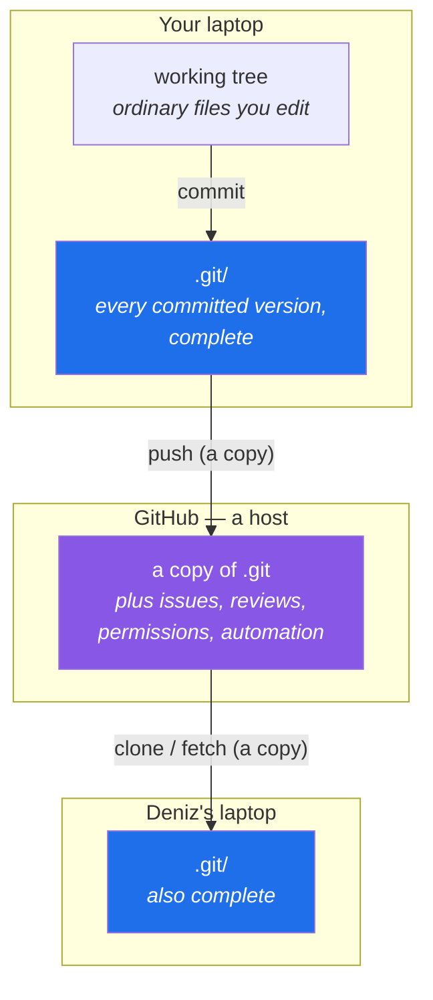

# 1.1 — What Git actually is, and what GitHub is not

> **One-line answer.** Git is a program on your computer that stores every version of your files
> under an address computed from their contents; GitHub is a website that hosts copies of what Git
> produces and adds people, permissions and automation on top — which means Git works perfectly with
> no GitHub at all, and GitHub is useless without Git.

---

## The story

Priya is a wedding photographer. After every shoot she copies the card onto her laptop into a folder
named after the couple, and then she edits.

The first year, her folders looked like this:

```
sharma-wedding/
├── final/
├── final-v2/
├── final-v2-CLIENT/
├── final-v2-CLIENT-fixed/
├── final-USE-THIS-ONE/
└── final-USE-THIS-ONE (2)/
```

It worked, in the sense that nothing was lost. Everything was there, six times over, and the card
that held two hundred photographs now held twelve hundred files.

Two things eventually broke it.

The first was a question. A bride emailed nine months later: *the one where my grandmother is
laughing — you sent me a version with the doorway cropped out, do you still have the one with the
doorway?* Priya had every version. She had no way to ask which folder held that particular change,
or when she made it, or why. The information existed and was unreachable.

The second was her friend Deniz. They agreed to split the editing: Priya would take the ceremony,
Deniz the reception. They emailed folders back and forth. On the Thursday, Deniz opened the folder
Priya had sent, made forty corrections, and sent it back — and Priya, who had not been idle either,
now had two folders that had both changed since they were the same. Neither of them could say which
of the two hundred files differed, or in what way. They chose Deniz's folder and Priya redid her
Thursday.

Those two failures — *I cannot ask questions about the past*, and *two people cannot change the same
thing* — are the entire reason the software in this course exists. Everything you will learn for the
next two hundred and fifty days is an answer to one of them.

---

## The idea in plain language

**Version control** is the practice of recording the history of a set of files, so that any past
state can be recovered, compared, explained and combined with someone else's.

**Git** is one particular version-control program. It runs on your machine. It does not need a
network, a server, an account, or a company. When you use Git, one hidden folder appears next to your
work — `.git` — and inside that folder is every version of every file you have ever committed, plus
the record of who changed what and when.

That last sentence contains the whole architecture. Let us take it apart.

- A **repository** is a folder of your files plus that hidden `.git` folder beside them. The visible
  files are called the **working tree**: they are ordinary files, and every program on your computer
  can open them normally. The `.git` folder is the history.
- A **commit** is one saved state of the whole project — not a saved change to one file, but a
  complete snapshot of every tracked file at one moment, plus a note about who made it, when, and
  why. Committing is deliberate: Git never records anything you did not ask it to record.
- Every commit knows its **parent**, the commit that came before it. So the commits form a chain,
  and — once branching enters, on Day 33 — a graph. That chain is what lets you ask Priya's question:
  *when did the doorway disappear, and what else changed in the same breath?*

Now the second word.

**GitHub** is a commercial website that stores copies of Git repositories and wraps services around
them: an account system, permissions, a way to discuss changes before accepting them, a way to run
tests automatically, a way to publish releases. GitHub did not invent Git and does not own it. Git is
free software that predates GitHub, and there are other hosts that do the same job.

Here is the relationship, stated as plainly as it can be:

> **Git is the file format and the program. GitHub is a host with opinions.**

The practical consequence is the thing most people get wrong for years. Because they meet the two
together, they come to believe that "pushing to GitHub" is what saving means, and that a commit is
somehow incomplete until it is on the website. It is not. When you commit, the work is stored,
permanently and completely, on your own disk. Pushing is a *copy* operation — a later, separate,
optional act. You can commit on an aeroplane for eleven hours and lose nothing.

A **distributed** version-control system is one where every copy is a complete copy. When you clone a
repository from GitHub, you do not get a link to it; you get the entire history, on your disk, with
every commit ever made. If GitHub vanished tonight, every person who had cloned the repository would
still be holding a full, working original. That is not a backup strategy bolted on afterwards; it is
what "distributed" means, and it is the property that makes Git different from the systems that came
before it, where the history lived on one server and a laptop held only the current files.



Read that diagram once more and notice what it does *not* say. There is no arrow from the working
tree to GitHub. Nothing you have merely edited can reach the host. Only what you have committed can
be copied, and that will matter to you concretely on Day 21, when `git clean` deletes files that were
never committed and no amount of GitHub can bring them back.

### The word "GitHub" is doing four jobs

When a colleague says "it's on GitHub", they might mean any of these. Distinguishing them now saves a
year of confusion.

| What they might mean | What it actually is |
|---|---|
| "There is a copy of the repository at github.com" | A **remote** — Git's word for another copy it knows how to talk to. Day 75. |
| "There is a pull request open" | A **GitHub feature**. Not Git. Git has no concept of a pull request. Day 137. |
| "The tests ran and passed" | **GitHub Actions**. Also not Git. Days 153–180. |
| "The project is open source" | A **licence and a visibility setting**. Neither is Git. Days 117 and 122. |

Only the first row is Git. Everything else in this table is a service that GitHub built around Git,
and this course spends its second half on exactly those services — but it spends its first half on
Git, because a policy you do not understand is a policy you cannot debug.

---

## Why the build needs it

Three concrete things in this curriculum break for anyone who has not internalised this separation.

**Day 12** asks you to build a commit by hand using only Git's low-level commands, with no network
and no account. If you believe a commit is "sent somewhere", the exercise is incoherent.

**Day 81** teaches `git push --force-with-lease`, which exists because your copy of the history and
GitHub's copy can genuinely disagree. Understanding that disagreement requires understanding that
they are two independent complete copies, not a thing and a view of the thing.

**Day 238** is an incident runbook for a force-pushed `main` branch. The recovery works because
somebody's laptop still holds the original commits. That recovery is unthinkable if you believe the
history lives on the server.

---

## The mechanism

Here is the claim that makes Git what it is: **Git addresses content by a hash of that content.**

A hash function takes any amount of data and produces a fixed-length string. The same input always
produces the same string; any different input produces a different one. Git uses that string as the
*name* of the stored thing. So in Git, a file's contents and its address are not two facts — the
address is computed from the contents.

Watch it happen. `git hash-object` asks Git what address a piece of content would have.

```sh
printf 'water the plants\n' | git hash-object --stdin
```

```
b9feddc5f8abeae19f45d701ab95533da96557fc
```

**Line by line:**

- `printf 'water the plants\n'` — prints the text with a trailing newline and nothing else. `printf`
  rather than `echo` because `echo`'s handling of `\n` and trailing newlines differs between shells,
  and here a single byte changes the answer.
- `|` — sends that text to the next command instead of the screen.
- `git hash-object` — computes the address Git would store this content under. It does **not** store
  anything and does not need a repository; it is a calculator.
- `--stdin` — read the content from the pipe rather than from a filename. Without it, Git expects a
  path and will refuse.

Now change one byte — drop the newline:

```sh
printf 'water the plants' | git hash-object --stdin
```

```
e215ed4bd0e6b6e68ba7a99f12f3b1b305195139
```

**Line by line:** the only difference from the previous command is the missing `\n`. One byte, and
the address is entirely unrelated to the previous one — not "close to", unrelated. This is the
property that makes Git able to say *these two files are identical* by comparing forty characters
instead of a gigabyte, and it is why Git can tell you with certainty that history has not been
altered.

### The address is not magic — you can compute it yourself

Git does not hash the file's bytes alone. It prefixes a small header: the word `blob`, a space, the
length in bytes, and a zero byte. Then it hashes the whole thing. So a standard hashing tool that
knows nothing about Git can produce the same address:

```sh
printf 'blob 17\0water the plants\n' | sha1sum
```

```
b9feddc5f8abeae19f45d701ab95533da96557fc  -
```

**Line by line:**

- `blob` — Git's name for "the contents of a file". Day 5 is entirely about this object type.
- `17` — the length of `water the plants\n` in bytes: sixteen characters plus the newline.
- `\0` — a single zero byte separating the header from the content. `printf` writes it literally.
- `sha1sum` — a general-purpose hashing tool, part of coreutils, which has never heard of Git.
- The trailing `-` in the output is `sha1sum` telling you the input came from standard input.

It matches `git hash-object` exactly. **Nothing here is proprietary.** Git's storage is a documented
format, which is why you will be able to take a repository apart with `find` and `cat` on Day 10 and
put a commit back together by hand on Day 12.

### What that gets you, in one demonstration

Make a repository, commit one file, and look at what Git wrote.

```sh
mkdir -p /tmp/kosha-demo && cd /tmp/kosha-demo
git init -q -b main
printf 'water the plants\n' > reminders.md
git add reminders.md
git commit -qm "first reminder"
find .git/objects -type f | sort
```

```
.git/objects/b9/feddc5f8abeae19f45d701ab95533da96557fc
.git/objects/ea/c5ce747427342eff28a681c6d21523ea3e1958
.git/objects/eb/64f62b266345db3074a971636f3d4e3df64da6
```

**Line by line:**

- `git init -q -b main` — create a repository here. `-q` suppresses the welcome message; `-b main`
  names the first branch `main` rather than leaving it to a configured default, so that this command
  behaves the same on your machine as on mine. Day 33 explains what a branch actually is; Day 0's
  part 2.3 sets the default permanently.
- `git add reminders.md` — mark this file to be included in the next commit. Day 15 is about the
  surprising amount hiding in this command.
- `git commit -qm "first reminder"` — record the snapshot. `-m` supplies the message inline;
  without it Git opens an editor, which is part 5.2's subject.
- `find .git/objects -type f` — list the files Git created. `-type f` excludes directories.

Three files, for one commit of one file. **Notice the first one**: `b9/feddc5f8…` is the address you
computed by hand two blocks ago, split into a two-character directory and a thirty-eight-character
filename. Git stored the file's contents under the address of its contents.

The other two are the other two object types, and they are Days 6 and 7. But you can already look
inside the commit:

```sh
git cat-file -p HEAD
```

```
tree eac5ce747427342eff28a681c6d21523ea3e1958
author Sandbox <sandbox@example.invalid> 1767258000 +0000
committer Sandbox <sandbox@example.invalid> 1767258000 +0000

first reminder
```

**Line by line:**

- `git cat-file` — print a stored object. This is a *plumbing* command: one of the low-level tools
  Git's own porcelain commands are built from. Day 10 introduces the distinction properly.
- `-p` — "pretty-print": display the object according to its type rather than as raw bytes.
- `HEAD` — Git's name for "the commit I am currently standing on". Day 8 is about `HEAD` and refs.
- The output is the entire commit object. It is five lines of text. A commit is a `tree` (the
  snapshot of the folder), an author, a committer, and a message. **That is all a commit is** — and
  because its address is a hash of exactly these bytes, changing any one of them, including the
  timestamp, produces a different commit with a different address. That single fact is why Day 55's
  `--amend` does not edit a commit but replaces it, and why the rebase phase is far less frightening
  than its reputation.

Your addresses for the tree and the commit will differ from the ones above unless your author name,
email and timestamps match exactly. The **blob** address, `b9feddc5…`, will be identical on your
machine, because it depends on nothing but the sixteen characters and the newline. That difference —
content-only objects hash identically everywhere, objects that carry identity and time do not — is
worth sitting with for a moment.

---

## The same thing, three ways

The subject of this part is a concept rather than an operation, so the three surfaces do not do the
same job — and the way they differ is itself the lesson.

| Surface | What it shows you | Verdict |
|---|---|---|
| Terminal | `git cat-file -p HEAD` — the actual stored object, byte for byte | **The only surface that shows you Git.** Everything in this part is invisible from the other two. |
| github.com | A commit page rendering a *diff* against the parent, plus avatars, reactions and links to pull requests | A presentation layer. GitHub computes that diff on demand; Git never stored one. Useful, and not the truth. |
| `gh` | `gh browse --commit` opens that same web page; `gh api repos/{owner}/{repo}/git/commits/{sha}` returns GitHub's JSON rendering of the object | The API is honest about the object model — note the `git/` in that path — but it is still describing GitHub's copy. |

**Which a professional reaches for:** the browser, ninety per cent of the time, because reading a
rendered diff with syntax highlighting is genuinely faster than reading raw objects. The terminal,
the other ten per cent — and that ten per cent is every moment when something has gone wrong, which
is precisely when the web view's helpful abstractions stop helping. This course teaches the ten per
cent first so that the ninety per cent is a convenience rather than a dependency.

---

## When it breaks

**Running a Git command outside a repository.**

```
fatal: not a git repository (or any of the parent directories): .git
```

*What it means:* Git looked in the current directory for a `.git` folder, did not find one, walked up
to the parent, and kept walking to the root of the filesystem without finding one. There is no
repository here.

*Smallest fix:* `cd` to the folder you meant, or run `git init` if you intended to create a
repository here. Run `git rev-parse --show-toplevel` when you are unsure which repository you are
standing in — it prints the root, or fails with this same message.

**Expecting a commit to have travelled.** No error appears. You commit, close the laptop, open
github.com and see nothing. This is not a failure; it is the architecture. A commit is local until
`git push` copies it, which is Day 80.

**Hashing a file and getting a different answer from the internet.** A tutorial says a piece of
content hashes to one value and your machine says another. Almost always one of: a trailing newline
your editor added or removed; Windows line endings, where every `\n` is stored as `\r\n` and the byte
count changes (Day 92 is entirely about this); or a repository initialised with SHA-256 object names
rather than SHA-1, in which case your addresses are sixty-four characters, not forty.

---

## In production

**Repositories get big, and the object model is why they stay usable.** A repository with several
hundred thousand commits does not slow down proportionally, because content addressing means
identical content is stored exactly once, however many commits reference it. A file that has not
changed across ten thousand commits is one blob, referenced ten thousand times. The loose
`.git/objects/xx/yyyy…` files you saw above are also not the long-term format — Git periodically
repacks them into compressed packfiles with delta compression between similar objects, which is
Day 11's subject, and the reason a repository whose full history is many gigabytes of content can
clone as a few hundred megabytes.

**Content addressing is also an integrity guarantee, and organisations rely on it.** Because a
commit's address is a hash over its tree, its parent, its author and its message, you cannot alter
any historical commit without changing its address, which changes the address of every commit after
it. This is what people mean when they say Git history is tamper-evident. It is the foundation of
commit signing (Day 98) and of build provenance (Day 200): a signature over a commit SHA is
effectively a signature over the entire history leading to it. It is also why Git has been migrating
towards SHA-256 object names — SHA-1 collisions have been demonstrated, and although Git added
collision detection that rejects the known attack, a hash-addressed store wants a hash that nobody
can forge.

**The review comment a senior engineer leaves.** On a pull request that adds a build artefact, a
`node_modules` directory, or a fifty-megabyte binary: *"this is going into the object store forever
— deleting it in a later commit does not remove it from history."* Every reader of this part now
knows why that is true rather than merely being told it is: the object is addressed by its content
and referenced by a tree in a commit that already exists. Days 95 and 104 are the two answers — Git
LFS, and surgery.

**What it costs.** Nothing here spends money or quota. `git hash-object`, `git cat-file` and
`git init` are local, offline and free. This is worth noticing on a course that later spends Actions
minutes and API rate limit: **the majority of Git is free and offline, and the parts that cost
anything are the parts GitHub added.**

**The interview question this is really testing.** *"What's the difference between Git and GitHub?"*
sounds like a trivia question and is not. A weak answer is "Git is local, GitHub is online". A strong
answer names the architecture: Git is a content-addressed object store with a distributed model where
every clone is a complete copy; GitHub is one possible remote for that store, plus a collaboration and
automation layer — pull requests, reviews, permissions, Actions — none of which exist in Git itself. A
follow-up you should be ready for: *"so what breaks if GitHub is down?"* The honest answer is that
committing, branching, merging, rebasing, bisecting and reading history all keep working; what stops
is pushing, fetching, code review and continuous integration.

---

## Check yourself

**Run this now.** Before you press return, predict the output — the exact forty characters:

```sh
printf 'water the plants\n' | git hash-object --stdin
```

If you predicted `b9feddc5f8abeae19f45d701ab95533da96557fc`, you have understood the central claim of
this part: **the address is a function of the content, and of nothing else.** Not the filename, not
the folder, not the machine, not the date, not who you are.

**Say this out loud.** A colleague tells you they have "backed up the project to GitHub". In two
sentences, say what is now true and what is not. Then answer the follow-up: *if their laptop is
stolen tonight, what have they lost?*

---

**Next:** [1.2 — Installing Git on Windows, macOS and Linux](1.2-installing-git.md) ·
[back to the hub](../../LESSON.md)
