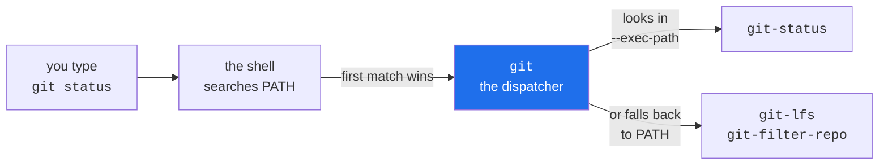

# 1.2 — Installing Git on Windows, macOS and Linux

> **One-line answer.** Installing Git means putting one small program called `git` somewhere your
> terminal will find it; on Windows the installer also brings a whole miniature Unix with it, which
> is why every command in this curriculum works identically on all three systems.

---

## The story

Deniz starts on a Monday at a new studio. The laptop is new, still wrapped in plastic, and the first
task is to fetch the shared archive of edits.

Deniz opens the black window, types the command the handover note says to type, and reads:

```
bash: git: command not found
```

So Deniz searches the web, finds a page with a large friendly download button, installs the thing
behind it, and gets a handsome application with a sidebar and a list of changes. It even shows the
studio's archive once signed in. Back in the black window, the same command produces the same seven
words.

This confuses Deniz for most of a morning, and the confusion is entirely reasonable. Two different
things were downloaded on two different days by two different people, and given names that sound
alike. One of them is an engine. The other is a car built around an engine — which does not help at
all when what you needed was the engine, on its own bench, with room to work.

The distinction matters this morning and then never again. Once the engine is on the bench, every page
you will ever read about this subject makes sense, because those pages are all written about the
engine.

---

## The idea in plain language

When you type a word at a prompt and press return, the program reading what you type does not search
your whole computer for something with that name. That would be slow, and it would be dangerous,
because a stray file in the wrong folder could impersonate a command you trust. Instead it looks in a
short, ordered list of directories called the **PATH**, and runs the first match it finds.

So "installing Git" is not a mystical act. It means two concrete things:

1. A file called `git` — `git.exe` on Windows — now exists somewhere on your disk.
2. That somewhere is on your PATH, so the shell finds it without being told where to look.

Everything else an installer does is convenience. If you copied the `git` program by hand into a
directory already on your PATH, you would have installed Git.

Three terms, before they are used again:

- A **terminal** is the window. A **shell** is the program running inside it that reads what you type
  and decides what to run. They are two things, not one. Day 1's part 1.1 takes them apart properly;
  today you only need to know that the `command not found` message above comes from the shell, and
  that Git never ran.
- **PATH** is an *environment variable* — a named value that a program inherits when it starts. Day
  1's part 3.1 explains environment variables from nothing.
- A **package manager** is a program that installs other programs, remembers what it installed, and
  can update or remove them later. `apt`, `dnf`, `pacman`, `brew` and `winget` are package managers.

### The three platform stories

They differ more than people admit, and the differences surface later in this curriculum.

**Windows.** There is no Git in Windows, and no shell of the kind Git's own documentation is written
for. So the Windows distribution ships Git *plus a small Unix environment to run it in*: a shell (Git
Bash), the standard text tools that Git's own scripts call (`sed`, `awk`, `grep`, `less`), an OpenSSH
client, and a credential helper that talks to the Windows credential store. That bundle is why this
curriculum can give one command to all three platforms. It also means a Windows machine has *two
spellings of every path*, which is Day 1's part 1.4 and a genuine source of confusion until it is
named.

**macOS.** A stub is already there. Typing `git` on a fresh Mac triggers a prompt to install the
Command Line Developer Tools, which include a Git — usually an older one than the current release,
because it moves at the operating system's pace rather than Git's. Most professionals install a
current Git from a package manager alongside it, and the newer one wins by sitting earlier on the
PATH.

**Linux.** The distribution's package manager has Git, and the version you get is the version that
distribution froze. On a long-term-support release that can be years behind. This is the platform
where "my Git does not have that flag" happens most often, and where adding the upstream package
source is an ordinary, expected thing to do.

### Which version is recent enough

This curriculum uses commands and settings that arrived at known points in Git's history. If your Git
is older than these, later days fail in ways that look like your mistake and are not:

| Needs at least | For | Where it is used |
|---|---|---|
| 2.23 | `git switch`, `git restore` | Day 34 onward, and everywhere after |
| 2.28 | `init.defaultBranch` | [2.3](../02-identity/2.3-defaults-worth-changing.md), today |
| 2.34 | SSH commit signing (`gpg.format ssh`) | [6.3](../06-sandbox/6.3-end-to-end-proof.md), today |
| 2.35 | `merge.conflictStyle zdiff3` | Day 46 |
| 2.37 | `push.autoSetupRemote` | [2.3](../02-identity/2.3-defaults-worth-changing.md), today |
| 2.38 | `rebase --update-refs` | Day 61 |

The plan's Part 9 states the requirement as "recent enough for `git switch`, `git restore`,
`git maintenance`, `zdiff3` and `--update-refs`". In practice: install the current release, and stop
thinking about it.

---

## Why the build needs it

Nothing in the remaining two hundred and fifty-two days happens without Git, so the interesting
question is not *why install Git* but *why install a current one*.

**Day 34** teaches `git switch` and `git restore` as the primary verbs and demotes `git checkout` to a
historical note explained once. On a Git older than 2.23 the primary verbs do not exist, and every
command in Phases 4 through 7 has to be mentally translated back.

**Part [6.3](../06-sandbox/6.3-end-to-end-proof.md), later today**, signs a commit with an SSH key rather than
a GPG key. That path did not exist before Git 2.34.

**Day 46** teaches conflict resolution with the `zdiff3` conflict style, which shows the common
ancestor *inside* the conflict markers. Set it on an older Git and the merge stops with
`fatal: unknown style 'zdiff3' given for 'merge.conflictstyle'`, and the day's central demonstration
cannot run at all.

---

## The mechanism

### Prove the program is there, and find out exactly which one

```sh
git --version
```

```
git version 2.54.0.windows.1
```

**Line by line:**

- `git` — the program the shell found on your PATH. If the shell prints `command not found` instead,
  it searched the PATH and found nothing; that failure is dissected at the end of this part.
- `--version` — every well-behaved command-line program answers this. Git's answer carries a platform
  suffix on Windows (`.windows.1`) which is the packaging revision of the Windows distribution, not
  part of upstream Git's version number. Yours will differ from mine and that is expected; what
  matters is the table above.

Now ask *which* `git`, because a real machine frequently has more than one:

```sh
type -a git
```

```
git is /mingw64/bin/git
git is /mingw64/bin/git
git is /cmd/git
```

**Line by line:**

- `type` — a shell builtin that answers "what would you run if I typed this word?" It is not a
  program; it is the shell reporting on its own search. On macOS and Linux, `which -a git` is the more
  commonly typed equivalent, but `type` also reports shell aliases and functions, which makes it the
  more honest answer.
- `-a` — show *every* match on the PATH, in order, rather than only the winner. The first line wins.
- Three lines here, on one Windows machine: the shell's own copy, the same path reached a second time
  through a different PATH entry, and `/cmd/git` — the wrapper that Git for Windows puts on the
  *Windows* PATH so that PowerShell and `cmd.exe` can run Git too. One installation, two spellings, as
  promised.

When two colleagues disagree about what a command does, the difference is very often that `type -a`
would print a different first line on each of their machines.

### Look at what you actually installed

```sh
git version --build-options
```

```
git version 2.54.0.windows.1
cpu: x86_64
built from commit: 2b8a3ab140826ac423c2845ef81d4c6ac4f7bf3c
sizeof-long: 4
sizeof-size_t: 8
shell-path: D:/git-sdk-64-build-installers/usr/bin/sh
rust: disabled
feature: fsmonitor--daemon
gettext: enabled
libcurl: 8.19.0
OpenSSL: OpenSSL 3.5.6 7 Apr 2026
zlib: 1.3.2
SHA-1: SHA1_DC
SHA-256: SHA256_BLK
default-ref-format: files
default-hash: sha1
```

**Line by line:**

- `git version --build-options` — note this is `git version`, the *subcommand*, not `git --version`,
  the flag. The subcommand accepts extra options; the flag does not. Git has several pairs like this
  and they are not interchangeable.
- `built from commit:` — the exact commit in Git's own repository that this binary was compiled from.
  Git's build is itself tracked in Git. This is not decoration: it is the line that identifies your
  build precisely in a bug report.
- `shell-path:` — the shell Git uses when a subcommand needs one, baked in when the installer was
  built. That is why it names a directory that does not exist on your computer: it existed on the
  machine that built the release.
- `SHA-1: SHA1_DC` — the hashing implementation, where `DC` means *collision detection*. This build
  refuses input crafted to force a SHA-1 collision. Part [1.1](1.1-what-git-actually-is.md) explained
  why Git's whole storage model rests on that hash; this line is the countermeasure.
- `default-hash: sha1` — new repositories address objects with forty-character SHA-1 names. Git can
  also create SHA-256 repositories, where every address you see is sixty-four characters.
- `default-ref-format: files` — how branch names are stored on disk. `files` means one small file per
  branch, which is the mechanism Day 8 takes apart with `cat`. If your Git prints `reftable` instead,
  branches live in a single packed store and Day 8's `cat .git/refs/heads/main` will find nothing;
  that day says what to run instead.

### Where the rest of Git lives

Git is not one file. It is one small dispatcher, plus a directory full of subcommand programs.

```sh
git --exec-path
```

```
C:/Program Files/Git/mingw64/libexec/git-core
```

**Line by line:**

- `--exec-path` — prints the directory Git searches for its own subcommands. When you type
  `git status`, the `git` program looks *here* for the thing that implements `status`.
- The consequence is the useful part: any executable named `git-something`, anywhere on your PATH,
  becomes a subcommand called `git something`. That is the entire extension mechanism, and it is how
  `git-filter-repo` (Day 103) and `git-lfs` (Day 95) attach themselves to Git without Git having heard
  of them.



### Getting it, per platform

Fetched from <https://git-scm.com/install/> on 2026-08-23, where the current source release is given
as **2.55.0**. Install the current release rather than matching the version printed in this document;
what matters is being at or above the table earlier in this part.

| Platform | The normal way | What you get |
|---|---|---|
| Windows | The installer from <https://git-scm.com/install/windows> | Git, Git Bash, an OpenSSH client, Git Credential Manager, and the Unix tools Git's scripts call |
| macOS | `brew install git`, or accept the Command Line Developer Tools prompt that appears the first time you type `git` | A current Git from the package manager; the Apple-supplied one lags |
| Linux | `apt install git`, `dnf install git`, `pacman -S git` | Whatever version your distribution froze; add the upstream package source if it is old |

**On the Windows installer's questions.** It asks several, and two of them reach into this curriculum.
The **default editor** question writes `core.editor` for you —
[5.2](../05-cli-tools/5.2-editor-and-pager.md) explains what that setting is and how to change it afterwards, so
answer however you like now. The **line-ending conversion** question writes `core.autocrlf`, whose
Windows default silently rewrites every file as it crosses between your disk and the object store.
That is not a footnote: [2.3](../02-identity/2.3-defaults-worth-changing.md) shows the rewriting happening,
byte by byte, and says what to set instead.

---

## The same thing, three ways

| Surface | How you install and verify Git | Verdict |
|---|---|---|
| Terminal | `git --version`, then `type -a git` to see which of them won | **The only surface that can answer the question at all.** The other two describe a copy of a repository; this describes your machine. |
| github.com | Nothing on the website installs Git. Its help pages link to the installer, and the desktop application bundles a private copy of Git that is deliberately *not* placed on your PATH | A website cannot install a program on your computer, and the bundled copy is invisible by design — which is precisely what cost Deniz a morning. |
| `gh` | `gh --version` proves the GitHub CLI is installed. It is a separate program: it neither installs nor contains Git, though every repository-shaped command it runs shells out to `git` | Installing one does not install the other. Two tools, two installations, two version numbers to check. |

**Which a professional reaches for:** the terminal, and specifically `git --version` as the first
command typed on any new machine, container or continuous-integration runner. It is the cheapest
possible test of "is my assumption about this environment true?" — which is why it is so often the
first line in a pipeline log.

---

## When it breaks

**The shell cannot find the program.**

```
bash: line 1: git: command not found
```

*What it means:* the shell searched every directory on the PATH and found nothing called `git`. Note
who is speaking: `bash`, not Git. Git never ran. The exit code is `127`, the shell's specific number
for "no such command", and Day 1's part 4.1 is about reading those numbers deliberately.

*Smallest fix:* if you have just installed Git, close the terminal and open a new one. A running shell
holds the PATH it was handed at start-up and does not notice an installer changing it. If a fresh
terminal still fails, the installation did not put `git` on the PATH — on Windows, open **Git Bash**
rather than PowerShell for everything in this curriculum.

**Git is found, but the subcommand is not.**

```
git: 'nosuchcommand' is not a git command. See 'git --help'.
```

*What it means:* the shell found `git`, and Git ran. Git then searched its exec-path, and your PATH,
for something implementing `nosuchcommand`, and found nothing. You get this message for a typo, for an
extension you have not installed, and — the case that wastes real time — for a subcommand that exists
only in a newer Git than yours.

Git guesses when it can:

```
git: 'stauts' is not a git command. See 'git --help'.

The most similar command is
	status
```

*Smallest fix:* if it is a typo, fix the typo. If it is a command you expected to have, check
`git --version` against the version table above before doing anything else.

**The documentation is not where Git expects it.**

```
fatal: 'C:/Program Files/Git/mingw64/share/doc/git-doc/gitnosuchtopic.html': documentation file not found.
```

*What it means:* on this Windows machine `git help <topic>` opens a bundled HTML file, and no such
file exists for the topic asked for. On Linux and macOS the equivalent failure names a man page
instead. The message accidentally tells you where your Git keeps its documentation, which is worth
knowing — [1.3](1.3-version-and-help.md) is entirely about that documentation.

---

## In production

**Nobody installs Git by hand at scale.** On a fleet, the version is pinned by a
configuration-management tool or baked into a container image, because a build that behaves
differently on two runners is an expensive bug to chase. When you write a GitHub Actions workflow in
Phase 14, the runner image arrives with a specific Git already installed, and `git --version` in a
step is how you find out which one — those images are updated on GitHub's schedule, not yours.

**Version skew is a genuine production failure, not a beginner's problem.** A repository whose
contributors run Gits from 2.25 to 2.55 will produce arguments in which both sides are reporting
honestly: `push.autoSetupRemote` exists for one and not the other; `zdiff3` conflict markers appear
for one and not the other; `--update-refs` silently does nothing on the older one. Mature projects
state a minimum Git version in their contributing guide for the same reason they state a minimum
language runtime.

**What a senior reviewer says.** On a pull request that adds a release script shelling out to Git:
*"pin or assert the Git version — this uses `--update-refs`, which is a no-op before 2.38 rather than
an error, so an old runner produces a subtly wrong result and a green build."* Silence on failure is
the dangerous kind, and it is why the version assertion goes first, before the work.

**What it costs.** Nothing. Git is free software, the download is a few tens of megabytes, and it
spends no quota of any kind. Worth stating plainly on a curriculum that will later count Actions
minutes and API rate limits: today's entire tool chain has no bill attached.

**The interview question this is really testing.** *"How do you know which Git you are running, and
why would you care?"* A weak answer stops at `git --version`. A strong one continues to `type -a git`,
because a machine often has several and PATH order decides which runs; to `git --exec-path`, because
that is where subcommands and extensions are found; and then gives a reason to care — a flag that is
silently a no-op on an older version, which turns a version question into a correctness question.

---

## Check yourself

**Run this now.** Before you press return, predict how many lines it prints, and which one your shell
actually uses:

```sh
type -a git
```

**Line by line:** you have already met this command in this part; the prediction is the exercise. The
first line is the winner. If your machine prints more than one, you now know that reinstalling Git is
not a reliable way to change which one runs — reordering the PATH is.

**Say this out loud.** Someone tells you they installed Git but their terminal still says
`command not found`. Give the two likely explanations, and name the single cheapest thing to try
first.

---

**Next:** [1.3 — `git --version`, `git help`, and the manual you will actually use](1.3-version-and-help.md) ·
[back to the hub](../../LESSON.md)
