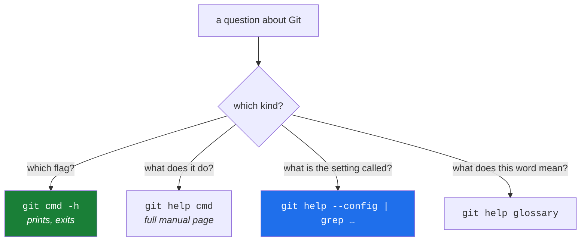

# 1.3 — `git --version`, `git help`, and the manual you will actually use

> **One-line answer.** Git ships its own complete manual on your disk — every command, every flag and
> every one of a thousand configuration variables — and `-h` for the quick answer, `git help` for the
> full one, and `git help --config` for the settings are the three doors into it that make a search
> engine unnecessary for most questions.

---

## The story

Two people are stuck on the same question at the same moment, in different buildings.

The first opens a browser, types a half-remembered phrase into a search box, and lands on a discussion
thread from some years ago. The top answer is confident and has a lot of approving votes. It is also
written for a version of the tool that behaved differently, by somebody who had a slightly different
problem, and the second-most-approved reply — the one that says "careful, this deletes your work" — is
below the fold. The first person copies the command.

The second person types six characters, reads four lines, and gets a list of exactly the flags that
this installed version supports, with one line on each. Not a discussion. Not an opinion. The manual
for the program actually on the disk.

The gap between those two people is not intelligence and it is not experience. It is knowing that the
second door exists. Most people never find it, because the tool never announces it, and because the
first door is always open and always one keystroke closer.

This part is about the second door. It is the shortest part of the day and it will save you more hours
than any other.

---

## The idea in plain language

Git installs its own documentation next to itself. When you ask Git for help, nothing goes over the
network: a file that arrived with the program is displayed. That has three consequences worth holding
on to.

- **It is exactly right for your version.** The web describes some version. Your disk describes yours.
  When those two disagree — and after [1.2](1.2-installing-git.md) you know they can — your disk is
  the one that will run.
- **It works with no internet.** On a plane, in a locked-down build environment, inside a container
  with no outbound network, the manual is still there.
- **It is complete.** Not a summary. Every flag, every configuration variable, every edge case, in
  the same document the people who wrote the code maintain.

There are three doors, and they are for three different questions.

| Your question | The door | What comes back |
|---|---|---|
| "What are this command's flags, quickly?" | `git <command> -h` | A short usage block, printed straight to the screen |
| "What does this command actually do?" | `git help <command>` | The full manual page, in a pager or a browser |
| "What is that setting called?" | `git help --config` | Every configuration variable this Git understands, one per line |

Two terms used above, defined here because they are about to matter:

- A **flag** (or option) is a word starting with `-` or `--` that modifies a command: `-h`, `--quiet`,
  `--force`. A **positional argument** is one that does not, and whose meaning comes from its place.
- A **pager** is a program that shows long output one screenful at a time. If a Git command has ever
  filled your screen and then refused to give the prompt back, you met the pager and did not know its
  name. [5.2](../05-cli-tools/5.2-editor-and-pager.md) makes it yours, and Day 1's part 3.3 explains it as a
  mechanism.

---

## Why the build needs it

**Day 23** is `git log` and its flags. `git log` has more options than any other Git command, and the
day teaches a handful in depth — but the whole point of the day is that you can then find the rest,
because they are one command away.

**Day 89 to Day 100** are Phase 9: configuration as code. That phase leans on the fact that a
thousand-odd configuration variables are enumerable on your own machine — you will grep them, not
guess them.

**Every day where an interface has moved.** Principle 11 says nothing in this repository is written
from memory, and Principle 17 says that when reality has changed, we stop and amend the plan. Both
principles depend on you being able to check quickly, and locally, what your tools actually do.

---

## The mechanism

### Door one: the short answer, printed on the spot

```sh
git switch -h
```

```
usage: git switch [<options>] [<branch>]

    -c, --[no-]create <branch>
                          create and switch to a new branch
    -C, --[no-]force-create <branch>
                          create/reset and switch to a branch
    --[no-]guess          second guess 'git switch <no-such-branch>'
    --[no-]discard-changes
                          throw away local modifications
    -q, --[no-]quiet      suppress progress reporting
    --[no-]recurse-submodules[=<checkout>]
                          control recursive updating of submodules
```

*(Elided: the remaining option lines. Run it yourself for the full list.)*

**Line by line:**

- `-h` — one dash, one letter. This is *not* the same as `--help`. `-h` prints a usage summary and
  exits immediately; `--help` opens the full manual page, which on some machines launches a pager and
  on Windows may open a browser window. When you want a reminder rather than a document, `-h` is the
  one you want, and the difference is worth internalising now.
- `usage: git switch [<options>] [<branch>]` — the **synopsis**, and it has a grammar of its own:
  - `[...]` square brackets mean **optional**.
  - `<...>` angle brackets mean **you substitute something here** — a branch name, a path, a number.
  - `...` an ellipsis means **repeatable**: `[<pathspec>...]` accepts any number of paths.
  - `|` a vertical bar means **choose one**: `[-a | --interactive | --patch]` in `git commit -h` says
    those three are alternatives, not companions.
  Learning those four symbols means every usage line in every Unix tool becomes readable, not only
  Git's.
- `-c, --[no-]create <branch>` — the short form and the long form of one flag, and `[no-]` announces
  that `--no-create` also exists to switch it back off. Nearly every Git boolean flag has a `--no-`
  twin; it exists so that a setting turned on in your configuration can be turned off for one command.

### Door two: the full manual

```sh
git help switch
```

This one does not print inline, so there is no output to paste: it opens a document. **Where** it
opens depends on a setting called `help.format`, and on your platform.

```sh
git config --get help.format
```

```
```

**Line by line:**

- `git config --get help.format` — ask for one configuration value. It printed nothing at all, and
  exited with status `1`, because the value is not set. An empty answer and a failure exit code is
  Git's normal way of saying "no such setting here" — Day 1's part 4.1 is about reading exit codes,
  and [2.1](../02-identity/2.1-config-and-scopes.md), next, is about configuration properly.
- With no setting, Git uses the platform default: a man page on Linux and macOS, and on Windows the
  bundled HTML documentation opened in your browser. Set `help.format` to `man`, `info` or `web` to
  choose deliberately.

If you would rather stay in the terminal on a machine that wants to open a browser:

```sh
git switch -h | less
```

**Line by line:**

- `|` — send the first command's output to the second instead of the screen. Day 1's part 4.3 explains
  pipes and the two output streams properly.
- `less` — the pager. `q` quits it, arrow keys and `Space` move, `/word` searches. If you have ever
  been trapped in a full screen of Git output, `q` was the way out.

### Door three: the setting whose name you cannot remember

This is the door almost nobody knows about, and it is the most useful of the three.

```sh
git help --config | wc -l
```

```
1006
```

**Line by line:**

- `git help --config` — print the name of every configuration variable this Git understands, one per
  line. Not a description; a list of names, designed for exactly what happens next.
- `wc -l` — count lines. A thousand and six settings on this machine. You are not going to remember
  those. You do not have to.

```sh
git help --config | grep -E '^core\.(pager|editor|autocrlf)$'
```

```
core.autocrlf
core.editor
core.pager
```

**Line by line:**

- `grep` — print only the lines matching a pattern. `-E` selects the fuller regular-expression syntax,
  which is what makes `(a|b|c)` mean "any of these".
- `^core\.` — `^` anchors to the start of the line, and `\.` means a literal dot rather than
  "any character", which is what an unescaped `.` means in a pattern.
- `$` — anchors to the end of the line, so `core.editor` matches but `core.editorX` would not.
- The practical version of this command is `git help --config | grep push`, when you half-remember
  that there is a setting about pushing and cannot recall its name. That is the whole trick.

### The map of what your Git contains

```sh
git help -a | grep -cE '^   [a-z]'
```

```
178
```

**Line by line:**

- `git help -a` — list every available subcommand, grouped: main porcelain commands, ancillary
  commands, low-level plumbing, and — at the end — external commands.
- `grep -cE '^   [a-z]'` — count the lines that begin with three spaces and a lowercase letter, which
  is how the listing indents command names. `-c` counts instead of printing.
- A hundred and seventy-eight commands. You will use perhaps thirty regularly. This curriculum teaches
  roughly ninety, and the point of this part is that the other eighty-eight are discoverable without
  anybody's help.

The end of that listing is worth reading, because it proves something from
[1.2](1.2-installing-git.md):

```sh
git help -a | tail -12
```

```
   protocol-common         Things common to various protocols
   protocol-http           Git HTTP-based protocols
   protocol-pack           How packs are transferred over-the-wire
   protocol-v2             Git Wire Protocol, Version 2

External commands
   askpass
   askyesno
   credential-helper-selector
   credential-manager
   lfs
   update-git-for-windows
```

**Line by line:**

- `tail -12` — the last twelve lines.
- **External commands** — these are not part of Git. They are separate programs named `git-something`
  that happen to sit on this machine's PATH, so Git lists them as its own. `lfs` is Git LFS (Day 95);
  `credential-manager` is the credential helper that [4.4](../04-auth/4.4-credential-helpers.md) takes
  apart later today. This is the extension mechanism from 1.2, visible.

And there is a second body of documentation that is not about commands at all:

```sh
git help -g | grep -E 'glossary|everyday'
```

```
   everyday         A useful minimum set of commands for Everyday Git
   glossary         A Git Glossary
```

**Line by line:**

- `-g` — list the *concept guides* rather than the commands. `git help glossary` is Git's own
  dictionary — the authoritative definition of "index", "ref", "tree-ish" and every other term this
  curriculum uses. When [`docs/GLOSSARY.md`](../../../../docs/GLOSSARY.md) and Git's own glossary
  disagree, Git's is right and ours is a bug.



---

## The same thing, three ways

| Surface | Where the documentation comes from | Verdict |
|---|---|---|
| Terminal | `git help <cmd>` renders the manual page shipped with **your** installed version, offline | **The authoritative one.** It cannot disagree with the program you are running, because it was installed alongside it. |
| github.com | Neither Git's manual nor `gh`'s lives on github.com. The Git manual is published at `git-scm.com/docs`, and GitHub's own documentation at `docs.github.com` covers the *platform* — pull requests, Actions, rulesets — which Git has no opinion about | Two different subjects with two different homes; conflating them is the most common way to end up reading the wrong page. |
| `gh` | `gh help`, `gh <command> --help`, and `gh help environment` for the variables that change its behaviour | Same model, different program. `gh` documents itself locally too, and `gh help environment` is the equivalent of `git help --config` for settings you did not know existed. |

**Which a professional reaches for:** `-h` constantly, `git help` a few times a week, and the web when
the question is about *the platform* rather than about Git — because GitHub's rulesets and merge
queues are not documented in any manual page on your disk, and their interfaces genuinely do move,
which is why Principle 11 makes every platform-facing part in this repository carry a fetched link and
a date.

---

## When it breaks

**Asking for help on something that is not a topic.**

```
fatal: 'C:/Program Files/Git/mingw64/share/doc/git-doc/gitnosuchtopic.html': documentation file not found.
```

*What it means:* Git turned your topic into a filename, looked for that file where its documentation
lives, and did not find it. On Linux and macOS the same failure names a man page instead. The message
does tell you where your Git's documentation is installed, which is worth noticing.

*Smallest fix:* `git help -a` and `git help -g` list every valid topic. Spelling is the usual cause.

**`--help` opening a browser when you wanted a paragraph.** No error message; it simply is not what you
wanted. On Windows, `git commit --help` opens the bundled HTML in a browser window.

*Smallest fix:* use `-h` for the summary. To make the long form stay in the terminal, set the format
once: `git config --global help.format man` on a machine with man pages, and read
[2.1](../02-identity/2.1-config-and-scopes.md) next for what `--global` means before you type it.

**Being trapped in a screen you cannot leave.** Not an error either, and the single most common
first-week experience:

```
(END)
```

*What it means:* the pager is showing you the end of a document and waiting. Git has not hung.

*Smallest fix:* press `q`. If a screenful of a *diff* has you stuck rather than a manual page, `q`
still works; [5.2](../05-cli-tools/5.2-editor-and-pager.md) makes the pager behave, and Day 1's part 3.3
explains why it is there.

---

## In production

**Reading the manual is a professional habit, and it is visible in code review.** The reviewer who
writes *"`--force-with-lease` without `--force-if-includes` does not do what you think when your
fetch is stale"* has read the `git push` page recently. That knowledge is not obtainable from a search
engine's top result, because the top result is optimised for the common case and this is the corner.

**On a locked-down machine, the local manual is the only manual.** Build agents, air-gapped
environments and hardened container images routinely have no outbound network. Someone who can only
work with a browser open is not much use on that machine, and those machines are where the expensive
incidents happen.

**Version-specific documentation is the whole point at scale.** `git help` on the build agent
describes the build agent's Git. `git-scm.com` describes the current release. When a pipeline behaves
unlike your laptop, that difference is where you look first — and the two `git --version` outputs from
[1.2](1.2-installing-git.md) are how you confirm it in one line.

**What it costs.** Nothing, and no network. `git help` reads files that are already on your disk.

**The interview question this is really testing.** *"You need a flag you cannot remember, on a machine
with no internet. What do you do?"* The answer that lands is specific: `git <cmd> -h` for the summary,
`git help <cmd>` for the page, `git help --config | grep <word>` for the setting name, and
`git help glossary` when the confusion is about a term rather than a command. A candidate who answers
"I'd search for it" has, without meaning to, told you what happens when the network is gone.

---

## Check yourself

**Run this now.** Predict the answer first — is the number closer to fifty, or to a thousand?

```sh
git help --config | wc -l
```

**Line by line:** `git help --config` prints every configuration variable your Git understands, one
per line, and `wc -l` counts them. The prediction is the exercise: the number is large enough that
memorising the list is not a plan, which is exactly why the command exists.

**Say this out loud.** A colleague asks how to make Git stop asking about line endings. Without
looking anything up, describe the two commands you would type — one to find the setting's name, one to
read what it does — and say why you would not open a browser first.

---

**Next:** [2.1 — `git config` and the four scopes](../02-identity/2.1-config-and-scopes.md) ·
[back to the hub](../../LESSON.md)
