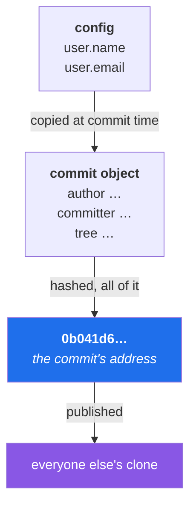

# 2.2 — `user.name`, `user.email`, and the address baked into every commit forever

> **One-line answer.** Your name and email address are copied into the body of every commit you make,
> and because a commit's address is a hash of its own bytes, changing them afterwards does not edit
> the commit — it makes a different commit and abandons the old one, which is cheap today and
> expensive once anyone else has pulled it.

---

## The story

A contractor spends five weeks on a project. Good work, delivered on time, and at the end of it the
studio asks for a note of what was done and when, because a client is disputing an invoice.

The record is all there. Five weeks of it, every change, every day, timestamped.

And every single entry is signed by a person who does not exist. The laptop had been set up in a
hurry on the first morning; a name was typed into a field with a typo in it, and an email address that
belonged to nobody — a placeholder, a stand-in, the kind of thing you type meaning to fix it later.
Nothing ever complained. The work was accepted, the archive was shared, the entries piled up.

Now the studio has a five-week record that proves the work happened and cannot prove who did it, on a
website that shows a grey silhouette instead of a face because the address matches no account. Fixing
it means rewriting all five weeks — which changes the identifier of every entry, which breaks
everybody else's copy of the record, which is a conversation with four other people and an afternoon.

The cost is not the typo. The cost is that nothing complained for five weeks.

---

## The idea in plain language

When Git records a commit, it does not store a link to your account or a reference to a user database.
There is no user database. It copies two strings — a name and an email address — directly into the
commit, as text, and there they stay.

Two facts follow, and they are the whole part.

**First: nobody checks.** Git will write whatever you configured. It does not verify the address, does
not send mail to it, does not care whether it exists. Any address at all is accepted, including one
belonging to somebody else. Identity in a plain commit is a *claim*, not a proof — which is exactly
why cryptographic signing exists, and why [6.3](../06-sandbox/6.3-end-to-end-proof.md) ends today by signing a
commit and Day 98 makes it routine.

**Second: it is part of the commit's address.** From [1.1](../01-install/1.1-what-git-actually-is.md): a
commit's forty-character name is a hash computed over its own contents, and those contents include the
author line and the committer line. Change one character of your email address and you do not have a
corrected commit — you have a **different commit**, with a different name, and the old one still
exists until Git eventually collects it.

There are, in fact, *two* identities on every commit, and almost nobody knows this until it bites
them:

| Field | Who it is | When they differ |
|---|---|---|
| **author** | The person who wrote the change | Preserved through rebases, cherry-picks and patches |
| **committer** | The person who created *this commit object* | Becomes you when you rebase, amend or cherry-pick somebody else's work |

GitHub renders the author's avatar, which is why a rebased branch still shows the original author's
face. The committer is who actually made the object. On Day 57 you will cherry-pick a colleague's
commit and see your own name appear as committer while theirs stays as author, and this table is why
that is correct rather than a bug.

One more term, because it is about to matter: **rewriting history** means producing new commit objects
to replace existing ones. It is not editing. Phase 6 — Days 53 to 66 — is entirely about it, and
Day 53's single idea is the one under this part: commits are immutable, branches are not.

---

## Why the build needs it

**Later today**, [3.3](../03-accounts/3.3-noreply-and-email-privacy.md) chooses *which* address to use, and
[6.3](../06-sandbox/6.3-end-to-end-proof.md) makes a commit that GitHub must recognise as yours. Both depend
on this address matching an address your GitHub account has verified. If it does not, the commit
appears on the website attributed to nobody, and no amount of pushing again will fix it.

**Day 22's gate** asks for a clean, reviewable feature commit on `nudge`. A gate is proof of work, and
work attributed to a placeholder address is proof of nothing.

**Day 99** gives you a different identity per directory, so that work commits carry the work address
automatically and personal ones do not. That mechanism only makes sense once you have felt why the
address matters at all.

**Day 104** removes a leaked secret from history and is one of the hardest days in the plan. Its
difficulty is the same difficulty as this part: the fix requires new commit objects for everything
after the mistake, and everyone else's copy has to be reconciled.

---

## The mechanism

### Git refuses to guess, when you tell it not to

```sh
git -c user.useConfigOnly=true commit -m "first reminder"
```

```
Author identity unknown

*** Please tell me who you are.

Run

  git config --global user.email "you@example.com"
  git config --global user.name "Your Name"

to set your account's default identity.
Omit --global to set the identity only in this repository.

fatal: no email was given and auto-detection is disabled
```

**Line by line:**

- `-c user.useConfigOnly=true` — for this command only (the `command` scope from
  [2.1](2.1-config-and-scopes.md)), forbid Git from inventing an identity. Without it, Git tries to
  construct one from your operating-system username and your machine's hostname.
- The exit code is `128`. Nothing was committed; the work is untouched in the working tree.
- Read the last line carefully. **"auto-detection is disabled"** is the interesting half. It means
  there *is* an auto-detection, and it is on by default.

Without that flag, on a machine with no configured identity, Git guesses and then usually rejects its
own guess:

```
fatal: unable to auto-detect email address (got '…@….(none)')
```

*(Elided: my operating-system username and my machine's hostname, which appeared in the brackets.
Yours will show yours.)*

**Line by line:** Git assembled `username@hostname` and refused it, because the hostname carries no
domain — that is what `(none)` means. The refusal is a kindness. On a machine whose hostname *does*
look like a domain, Git accepts its own guess silently and you get a history signed by an address that
never existed. That is precisely the contractor's five weeks.

**This is the single most valuable setting on this page:**

```sh
git config --global user.useConfigOnly true
```

**Line by line:** never guess, on any repository, ever. If the identity is not configured, refuse to
commit. It converts a silent five-week failure into a loud one-second failure, and there is no
downside — the only thing it costs you is one command on a new machine.

### Setting it, in the right scope

```sh
git config --global user.name "Priya Raman"
git config --global user.email "priya@example.com"
```

**Line by line:**

- `--global` — write to *your* file, so every repository you clone inherits it.
  [2.1](2.1-config-and-scopes.md) is the part about that choice; the mistake to avoid is omitting the
  flag, which writes to the current repository only and leaves every future clone unconfigured.
- The name is a display string. It can contain spaces, accents, anything — quote it. It is not a
  username, not a handle, and does not have to match anything on GitHub.
- The email address is the one that matters, because it is what GitHub matches on.
  [3.3](../03-accounts/3.3-noreply-and-email-privacy.md) decides which address that should be, and there is a
  good chance it is not your everyday one.

### Watch it land in the object

```sh
git commit -qm "first reminder"
git log -1 --format='%H%n%an <%ae>'
```

```
0b041d6e9c30dc37a5a4a0efdda9deffd6cbdd82
Priya Raman <priya@old-laptop.example>
```

**Line by line:**

- `--format='%H%n%an <%ae>'` — a format string. `%H` is the full commit hash, `%n` a newline, `%an`
  the author name, `%ae` the author email. Day 23 teaches these placeholders as a language; today they
  are just a way to see the fields.
- The address in this demonstration is deliberately wrong — a local override left behind from
  [2.1](2.1-config-and-scopes.md). This is exactly how it happens in real life: a repository-scoped
  setting from months ago, silently winning.

And both identities, in the raw object:

```sh
git cat-file -p HEAD | head -4
```

```
tree eac5ce747427342eff28a681c6d21523ea3e1958
parent 8dae4251554d5c4b0e8d50e6957da8d42f85d9fa
author Deniz Kaya <deniz@example.com> 1787484645 +0530
committer Priya Raman <priya@example.com> 1787484645 +0530
```

**Line by line:**

- `git cat-file -p HEAD` — print the commit object itself, as introduced in
  [1.1](../01-install/1.1-what-git-actually-is.md). No formatting, no interpretation: this is what is stored.
- `author` and `committer` are separate lines with separate names, separate addresses and separate
  timestamps. This commit was made with `--author="Deniz Kaya <deniz@example.com>"`, which sets the
  author and leaves the committer as the configured identity.
- `1787484645 +0530` — seconds since 1970, then the offset from UTC. The offset is stored, so Git
  knows the *local* time you committed, not merely the instant.
- Every byte you can see here is inside the hash. Change any of it and `0b041d6…` becomes something
  else entirely.



Read the diagram right to left to see the cost curve: while the commit is only on your disk, changing
the config box and remaking the object is free. Once the right-hand box exists, remaking the object
means every other copy disagrees with yours.

---

## The same thing, three ways

| Surface | Setting and checking who you are | Verdict |
|---|---|---|
| Terminal | `git config --global user.email …` writes it; `git log --format='%ae'` proves what actually landed in the objects | **The only place the value is decided.** Everything else is a rendering of what this wrote. |
| github.com | Cannot set your Git identity. It *matches* on it: the address in the commit is compared against the verified addresses on accounts, and the matching account's avatar and link are shown. No match means a grey silhouette and a plain name | This is where a wrong address becomes visible, hours after it stopped being cheap to fix. |
| `gh` | `gh api user --jq .email` shows the address your account exposes to the API; `gh auth status` shows which account the CLI is acting as. Neither writes `user.email` for you — but `gh repo clone` will happily clone a repository you then commit to with the wrong identity | Useful for checking *which account you are*, useless for checking *which address your commits will carry*. Two different questions. |

**Which a professional reaches for:** the terminal to set it, once per machine, and then
`git log -1 --format='%an <%ae>'` as a reflex after the first commit in any new repository — because
the local scope can override the global one and the first commit is when that is cheapest to discover.

---

## When it breaks

**A commit made with the wrong address, discovered immediately.**

No error text; that is the problem. The symptom is `git log` showing an address you did not intend:

```
6c4fda3 Priya Raman <priya@example.com> second reminder
0b041d6 Priya Raman <priya@old-laptop.example> first reminder
```

*What it means:* those two commits carry different authors because the configuration changed between
them. Both are already immutable.

*Smallest fix:* the next section — but note now that the fix scales with how many commits are wrong
and whether anyone has pulled them.

**The commit shows on GitHub with no avatar and no link.**

No error text here either. GitHub's own documentation, fetched from
<https://docs.github.com/en/pull-requests/how-tos/commit-changes/troubleshooting-commits> on
2026-08-23, states the rule plainly: *"GitHub links a commit to a user by matching the email address
in the commit header to an email address on a GitHub account."*

*What it means:* the address in your commit is not a verified address on any account. The commit is
perfectly valid Git; it is only the platform's attribution that is missing.

*Smallest fix — and this is the good news:* **add the address to your GitHub account and verify it.**
The commits do not need rewriting. Attribution is computed by matching, so adding the missing address
retroactively links the past commits that carry it, without changing a single object. The same
documentation cautions that *"Old commits might not be linked after you update your email settings"*
in some cases, so check a specific commit page afterwards rather than assuming.

**Trying to amend a commit that would become empty.**

```
You asked to amend the most recent commit, but doing so would make
it empty. You can repeat your command with --allow-empty, or you can
remove the commit entirely with "git reset HEAD^".
```

*What it means:* you reached for `--amend` on a commit whose changes are no longer distinguishable
from its parent. Git stops rather than quietly making an empty commit.

*Smallest fix:* read what you actually want. `--allow-empty` if the commit is a marker;
`git reset HEAD^` if it should not exist. Day 54 is `git reset` in full, and it is not a command to
use from a hint message before then.

---

## How to undo it

This part is rated `caution` because the repair path rewrites commits, and a rewrite is a destructive
operation on anything that has already been shared. **Rehearse this in the sandbox before you do it
anywhere else** — `./k sandbox fresh` builds one, and [6.2](../06-sandbox/6.2-the-sandbox.md) explains it.

Before any rewrite, write down where you are:

```sh
git rev-parse HEAD
```

```
6c4fda31d0e2a4d5b4a2b4bdcbd35a9a5eea3d0e
```

**Line by line:** `rev-parse HEAD` prints the commit you are standing on. That forty-character string
is your way back from anything in this section, because the old commits remain in the repository until
Git collects them. Copy it somewhere outside the terminal.

### Case 1 — the wrong identity is on the most recent commit only, and it is not pushed

```sh
git config --global user.email "priya@example.com"
git commit --amend --reset-author --no-edit
```

```
de2f7ab Priya Raman <priya@example.com> second reminder
0b041d6 Priya Raman <priya@old-laptop.example> first reminder
```

**Line by line:**

- Fix the configuration *first*. `--reset-author` copies the currently configured identity into the
  commit, so a wrong configuration produces a second wrong commit.
- `--amend` — replace the most recent commit with a new one. Note the hash changed from `6c4fda3` to
  `de2f7ab`: nothing was edited; a new object was written and the branch was moved to point at it.
- `--reset-author` — set *both* author and committer to the current identity, and reset the author
  timestamp. Without it, `--amend` keeps the original author and only updates the committer.
- `--no-edit` — keep the existing message instead of opening an editor.
- Look at the second line of output. The earlier commit is untouched, because `--amend` only ever
  reaches the last one.

### Case 2 — several commits are wrong, and none of them are pushed

```sh
git rebase --root --exec 'git commit --amend --no-edit --reset-author'
```

```
e426c89 Priya Raman <priya@example.com> first reminder
8940eb2 Priya Raman <priya@example.com> second reminder
```

**Line by line:**

- `git rebase` — replay commits as new objects. Day 58 explains why "replay" is the accurate word and
  "move" is not.
- `--root` — go all the way back to the first commit, which has no parent. Without it the very first
  commit is out of reach.
- `--exec '…'` — run this command after each replayed commit. So every commit in the branch is amended
  with the current identity, one at a time.
- **Every hash in the branch changes.** `0b041d6` became `e426c89`. That is not a side effect to
  tolerate; it is what rewriting *is*.

The old commits are still there:

```sh
git reflog --format='%h %gd %gs' | head -6
```

```
8940eb2 HEAD@{0} rebase (finish): returning to refs/heads/main
8940eb2 HEAD@{1} commit (amend): second reminder
040d12a HEAD@{2} rebase (pick): second reminder
e426c89 HEAD@{3} commit (amend): first reminder
0b041d6 HEAD@{4} rebase: fast-forward
af569ed HEAD@{5} rebase (start): checkout af569ed05d67a509023e99110f7b3f4af331504a
```

**Line by line:**

- `git reflog` — the log of every position `HEAD` has held on this machine, including positions no
  branch points at any more. `%gd` is the reflog selector, `%gs` its description.
- `0b041d6` — the pre-rewrite commit, still present and still reachable by name. `git reset --hard
  0b041d6` would put the branch back exactly as it was. Phase 7, Days 67 to 74, is the whole safety
  net; today you only need to know it is there, and that it is local to your machine.

### Case 3 — the wrong identity is already pushed, and other people have it

**Stop.** This is not a rewriting problem first; it is a coordination problem.

1. **Try the free fix.** If the address is merely unrecognised by GitHub, add and verify it on your
   account. Attribution appears with no rewrite, nobody's clone changes, and the incident is over.
2. **If the address is genuinely wrong** — somebody else's, or a fabricated one that must not stay in
   the record — the repair is a history rewrite of everything from the bad commit onwards, followed by
   a force push, followed by every other clone being reset. That is Day 55 for one commit, Day 103 for
   many, and Day 81 for the push. Do not improvise it from this page.
3. **In the meantime**, `.mailmap` (Day 99) rewrites how a name and address are *displayed* in
   `git log` and `git shortlog` without touching a single object. It is the honest interim fix: the
   record still says what it says, and the report reads correctly.

**The one-line summary of case 3:** the cost of this mistake is a function of how long it took you to
notice, which is the argument for `user.useConfigOnly` at the top of this part.

---

## In production

**On a shared machine or a build agent, identity is set per-invocation, not per-user.** A pipeline that
creates a commit — a release bot bumping a version, a formatter pushing a fix — passes the identity on
the command line or writes it into the job's own configuration, because there is no human home
directory to inherit from. `git -c user.name=… -c user.email=… commit` is the shape you will write on
Day 187, and it exists precisely because there is no user to configure.

**Large repositories accumulate identity debt.** Run `git log --format='%ae' | sort | uniq -c | sort
-rn` on a ten-year-old project and you find the same human under four addresses: a university one, two
employers, and a laptop that once auto-detected `name@hostname.local`. Nobody rewrites ten years of
history to tidy that up. They ship a `.mailmap` file, which is Day 99, and which exists *only* because
this mistake is universal and permanent.

**Attribution has legal and audit weight.** In regulated environments the author line is evidence: who
changed the control, on what date, under whose authority. That is also where the second half of this
part lands — an unsigned commit's identity is a claim anyone can make, which is why signing
([6.3](../06-sandbox/6.3-end-to-end-proof.md), Day 98) and vigilant mode exist, and why a serious audit trail
requires them rather than politely assuming.

**What a senior reviewer says.** On a pull request whose commits carry three different addresses for
one person: *"squash these or fix your local config — I can't tell from the history whether this is
one contributor or three, and neither can the release notes generator."* Machine-readable history is a
deliverable, not an aesthetic.

**What it costs.** Nothing, in money. In time: seconds today, an afternoon and four other people's
attention in five weeks.

**The interview question this is really testing.** *"You've made twenty commits with the wrong email
address. Walk me through fixing it."* The strong answer separates the cases before touching anything:
not pushed and one commit — `--amend --reset-author`; not pushed and many — a rebase with `--exec`;
already pushed — first ask whether adding the address to the account solves it without a rewrite, and
only then discuss `filter-repo`, a force push, and the cost imposed on every other clone. A candidate
who reaches straight for `filter-repo` has skipped the two cheap answers and told you they have never
had to coordinate one.

---

## Check yourself

**Run this now.** Predict which address will come back — the global one, or something a repository set
behind your back:

```sh
git config --show-origin --get user.email
```

**Line by line:** `--get` asks for the effective value and `--show-origin` names the file it came from.
If the file is `.git/config` rather than your global one, a repository is overriding you, and the next
commit you make here will not carry the address you think it will.

**Say this out loud.** Explain, without using the word "edit", what `git commit --amend` does to a
commit — and then say what makes the same operation safe on your laptop and dangerous on a branch two
colleagues have already pulled.

---

**Next:** [2.3 — The defaults you will regret leaving alone](2.3-defaults-worth-changing.md) ·
[back to the hub](../../LESSON.md)
