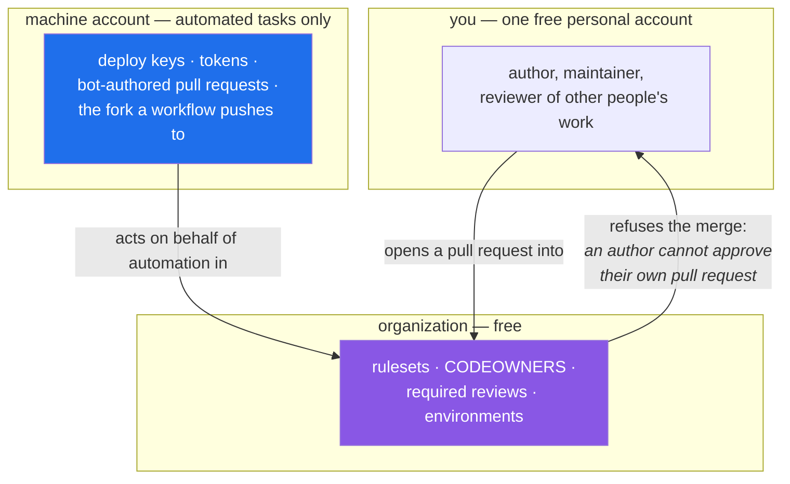

# 3.1 — One account, one machine account, one organization — and why not two of you

> **One-line answer.** Half of this subject only exists because two parties are involved, and you are
> one person — so the plan gives you the three identities GitHub's Terms of Service actually permit,
> and teaches the one thing you genuinely cannot do alone as the lesson rather than the obstacle.

---

## The story

A flight school has a simulator, and the simulator is not there to teach flying. It is there to teach
the twenty minutes after something breaks.

You can learn to fly in the air. You cannot learn engine failure on take-off in the air, because the
only way to practise it is for the engine to fail, and if the engine fails you do not get a second
attempt at the lesson. So the school buys a machine that can fail on purpose, in a building, on a
Tuesday.

What the school does *not* do is pretend that the simulator is a passenger aircraft. The instructor
never says "and now imagine there are ninety people behind you". The simulator teaches the parts that
can be rehearsed, and the parts that cannot — the weight of the real thing, the noise, the actual
passengers — are named honestly as things the simulator does not contain.

This part builds your simulator, and names honestly what it does not contain.

---

## The idea in plain language

Everything you have done so far is a solitary activity. A repository on your disk, a name in a
configuration file, a commit you made and can read back. From Phase 11 onward — GitHub the platform —
almost nothing is solitary. Consider what these words mean:

- **Review.** Somebody who is not the author reads a change and says yes or no.
- **Permission.** Somebody can do a thing and somebody else cannot.
- **A fork.** A copy of a repository owned by an account that cannot write to the original.
- **A protected branch.** A rule that stops *some* people doing *some* things.

Each of those needs a second party to be real. A "review" you perform on your own change is not a
review; it is a re-read. A "permission" that everyone has is not a permission.

So the curriculum needs more than one identity. But identities are not free to invent, because a
platform is a legal agreement as well as a website, and this is where most tutorials quietly tell you
to do something you are not allowed to do.

### What GitHub actually permits

From GitHub's Terms of Service, §B.3 Account Requirements, fetched from
<https://docs.github.com/en/site-policy/github-terms/github-terms-of-service> on 2026-08-23:

> *"One person or legal entity may maintain no more than one free Account (if you choose to control a
> machine account as well, that's fine, but it can only be used for running a machine)."*

And the definition of the exception, from the same page:

> *"A machine account is an Account set up by an individual human who accepts the Terms on behalf of
> the Account, provides a valid email address, and is responsible for its actions. A machine account
> is used exclusively for performing automated tasks."*

Read that twice, because it rules out the thing you were probably about to do. **A second personal
account for yourself is not permitted.** A machine account is permitted, and it is not a loophole
with a different name: it is for automation, and "pretending to be a colleague reviewing my code" is
not automation.

### The three identities this curriculum uses

| Identity | What it is | What it is for here | What it must never do |
|---|---|---|---|
| **Your account** | One free personal account — you | Everything you do as yourself: commits, repositories, issues, pull requests, reviews of other people's work | — |
| **A machine account** | One free account for automated tasks, permitted by the clause above | Bots and automation: deploy keys, tokens with narrow scopes, a fork that a workflow pushes to, pull requests opened by a scheduled job, the "other side" of an authorisation test | Impersonate a human reviewer. It is a machine; if it approves your pull request you have learned nothing and misrepresented a review. |
| **A free organization** | A container that owns repositories and has members, roles and rules | Rulesets, CODEOWNERS, required reviews, required checks, environments, teams — everything that is *policy* rather than *content* | Nothing; an organization is not a person and never pretends to be |

An **organization**, defined properly since it is new here, is an account that owns repositories on
behalf of a group rather than a person. It has members with roles, and it is where the platform keeps
the settings that apply to many repositories at once. It is free for public repositories and for an
unlimited number of members. Phase 11 is where it stops being a container and starts being the
subject.

### The one thing you cannot simulate, and what to do about it

From GitHub's documentation on required reviews, fetched from
<https://docs.github.com/en/pull-requests/collaborating-with-pull-requests/reviewing-changes-in-pull-requests/approving-a-pull-request-with-required-reviews>
on 2026-08-23:

> *"Pull request authors cannot approve their own pull requests."*

That is not a bug in your setup and it is not something to route around. It is the platform enforcing
the reason review exists, and it means a solo learner working honestly will reach a pull request that
**cannot be merged**, sitting behind a rule that will not move.

This plan treats that as a lesson rather than a failure, in three ways:

1. **Watch the refusal, and read it.** A required-review rule blocking your own merge is the clearest
   possible demonstration that the rule works, and the message it produces is one you will meet again
   in every job you ever have. Days 141 and 148 make you cause it deliberately.
2. **Use the administrator's override, and feel what it costs.** The same documentation notes that
   *"Repository owners and administrators can merge a pull request even if it hasn't received an
   approving review"*. On Day 148 you will do exactly that, and then look at what the audit trail
   says about you afterwards — because "the admin overrode the rule" is a sentence that appears in
   real incident reports.
3. **Bring a real person where one exists.** If you have a colleague, a friend or a study partner
   with their own account, the collaboration days are substantially better with them, and each of
   those days says so at the top. This is the honest version of the simulator's limits.



---

## Why the build needs it

**Day 3's gate** — the end of this phase — asks for a signed commit, pushed from the command line,
verified on the platform and attributed to the right identity. Getting the *right* identity onto a
commit requires knowing that there is more than one and which is which.

**Day 137 onward** is Phase 13, pull requests and review. Every day in it involves two parties by
definition. The parties are set up today or the phase does not run.

**Day 191 onward** is Phase 17, security and supply chain: deploy keys, tokens with narrow scopes,
secret scanning, Dependabot's pull requests. Almost all of it is about *machine* identities and what
they are allowed to do, which is precisely what a machine account exists to teach.

**Day 220 onward** is Phase 20, working in the open — the contributor's view. You fork a repository
you do not administer, open a pull request, and get told to change something. Days 249 runs the whole
cycle end to end.

---

## The mechanism

There are no local commands in this part: identities live on the platform, and creating them is
[3.2](3.2-creating-the-accounts.md). What can be shown here is how your machine *reports* which
identity is acting, because that is the question you will ask most often.

```sh
gh auth status
```

```
github.com
  ✓ Logged in to github.com account USERNAME (keyring)
  - Active account: true
  - Git operations protocol: https
  - Token: gho_************************************
  - Token scopes: 'gist', 'read:org', 'repo'
```

*(Elided: my own username, replaced with `USERNAME`. Everything else is exactly as printed.)*

**Line by line:**

- `gh auth status` — ask the GitHub CLI which identities it holds and which is currently acting. The
  flags for this command were fetched from <https://cli.github.com/manual/gh_auth_status> on
  2026-08-23.
- `Logged in to github.com account USERNAME (keyring)` — the identity, and where its token is stored.
  `keyring` means the operating system's credential store rather than a file;
  [4.4](../04-auth/4.4-credential-helpers.md) is about that distinction and why it matters.
- `Active account: true` — **the important line.** `gh` can hold several identities at once and only
  one is acting. When a command does something you did not expect on a repository you did not expect,
  this is the first line to read. [5.1](../05-cli-tools/5.1-gh-auth-login.md) is about holding two and switching
  between them.
- `Token: gho_***…` — masked by `gh` itself. It will only print the real value if you explicitly ask
  with `--show-token`, and you should not; a token is a password that happens to be typeable.
- `Token scopes` — what this token is permitted to do. `repo`, `read:org` and `gist` are the minimum
  `gh` needs. A machine account's token should have *fewer*, which is
  [4.5](../04-auth/4.5-personal-access-tokens.md).

The Git-level equivalent asks a different question — not "who am I on the platform?" but "who will be
recorded as the author?":

```sh
git config --get user.email
```

```
priya@example.com
```

**Line by line:** the address from [2.2](../02-identity/2.2-identity-in-every-commit.md), which is copied into
every commit you make. **These two commands can disagree**, and when they do, your commits are
attributed to one identity while your pull requests are opened by another. That combination produces
the most confusing kind of afternoon, and the two commands above are how you end it in ten seconds.

---

## The same thing, three ways

| Surface | Seeing and choosing which identity acts | Verdict |
|---|---|---|
| Terminal | `git config --get user.email` — who will be recorded as author. It has no idea which account you are on the platform, because Git has no accounts at all | Answers the authorship question completely and the platform question not at all. |
| github.com | The avatar in the top-right corner is the whole answer. One browser session is signed in as one account, which is why the second identity always ends up in a second browser profile or a private window | The clearest surface for *seeing* which identity is acting, and the most awkward for holding two at once. |
| `gh` | `gh auth status` lists every identity; `gh auth switch` changes the active one without logging anything out | **The only surface that holds several identities comfortably.** This is why [5.1](../05-cli-tools/5.1-gh-auth-login.md) exists, and why professionals with a work account and a personal account live in `gh`. |

**Which a professional reaches for:** `gh auth status` before anything that writes to the platform,
and a separate browser profile per identity rather than repeatedly logging out. The mistake this
avoids is the expensive one: opening a pull request, filing an issue or — worst — publishing a
repository as the wrong identity, which is visible to everyone and cannot be un-seen even after it is
deleted.

---

## When it breaks

**Trying to create a second personal account for yourself.** There is no error message. GitHub will
let you complete the sign-up, and you will have violated the Terms of Service quoted at the top of
this part. The consequence is not a polite warning; the platform's enforcement options include
suspending the accounts, and the accounts in question are the ones holding your work.

*Smallest fix:* do not. Use the machine account for automation and the organization for policy —
which is what [3.2](3.2-creating-the-accounts.md) sets up.

**Two accounts, one email address.**

```
Error adding EMAIL: email is already in use
```

*What it means:* an email address can be associated with exactly one GitHub account at a time, so the
address on your personal account cannot also be the machine account's. The message and the remedies
are documented at
<https://docs.github.com/en/account-and-profile/how-tos/email-preferences/troubleshooting-adding-an-email>,
fetched 2026-08-23; GitHub's advice is to sign in to the account that holds the address and remove it
there, or to recover that account by password reset if you have lost access to it.

*Smallest fix:* use a genuinely separate address for the machine account rather than trying to free up
the one you are already using. [3.2](3.2-creating-the-accounts.md) treats a second mailbox as a
prerequisite for exactly this reason.

**Committing as one identity and pushing as another.** No error at all, which is what makes it costly.
Your commit carries `user.email` from [2.2](../02-identity/2.2-identity-in-every-commit.md); your push carries
whatever credential the helper supplied. They can be different people. The commit appears on the
website attributed to one account, pushed by another, and the audit trail reads strangely for the rest
of the repository's life.

*Smallest fix:* run the two commands from the mechanism section together, as one habit, before the
first push in any new repository:

```sh
git config --get user.email && gh auth status --active
```

**Line by line:** `&&` runs the second command only if the first succeeds — Day 1's part 4.2 is about
that operator. `--active` restricts the status output to the identity that is currently acting, so
the two answers sit next to each other and disagreements are obvious.

---

## In production

**Machine identities are the normal case at work, not an exotic one.** Every organisation of any size
has accounts that are not people: a release bot that tags and publishes, a documentation bot that
opens pull requests, a deployment identity that has write access to exactly one environment. Phase 17
teaches how to give them the narrowest possible power, and Phase 18 teaches GitHub Apps, which are the
grown-up version — an App gets its own identity and short-lived tokens without occupying a user
account at all, and it is what a serious organisation uses instead of a shared machine account.

**"The admin merged it" is an audit finding.** In a regulated environment, an administrator merging
past a required review is recorded, reviewed, and sometimes has to be explained to somebody outside
the team. The override you will use on Day 148 exists for genuine emergencies — the reviewer left the
company mid-incident — and every use of it in ordinary circumstances erodes the rule until nobody
believes in it. This is the human half of the platform and it is not taught by any command.

**Separation of identity is separation of blast radius.** The reason a deployment identity is not your
account is that a leaked credential should cost one capability, not everything you can reach. When
Day 194 has you rotate a compromised token, the question that decides how bad the day is: what could
that credential do? A machine account with one narrow token is a small answer; your personal account
with a classic token carrying `repo` scope is a very large one.

**What a senior reviewer says.** On a pull request adding a workflow that pushes with a personal access
token belonging to a human: *"this should be the `GITHUB_TOKEN` or an App installation token — right
now the pipeline can do everything you can do, and it keeps working after you leave."* Day 161 is
where that sentence becomes a workflow you write.

**What it costs.** Nothing. A personal account, a machine account and an organization are free, public
repositories are free, and the Actions minutes that come with them are free — this is Principle 12,
and Day 237 puts real numbers on the point where it stops being free.

**The interview question this is really testing.** *"How would you set up a repository so that no
single person can push a change to production without another human seeing it?"* The strong answer
names the pieces — a ruleset requiring a pull request with at least one approval, CODEOWNERS to say
who that approver must be, required status checks, and the fact that the author cannot approve their
own work — and then names the leak: administrators can override, so the honest design also monitors
the override rather than assuming it will not be used.

---

## Check yourself

**Run this now.** Predict which two answers you will get, and whether they will refer to the same
person:

```sh
git config --get user.email && gh auth status --active
```

**Line by line:** the first command prints the address that will be baked into your next commit; the
second prints the identity `gh` is currently acting as. `&&` chains them so the second runs only if
the first succeeds. If `gh` is not yet signed in it will fail — that is expected today, and
[5.1](../05-cli-tools/5.1-gh-auth-login.md) is where it stops failing.

**Say this out loud.** Explain why a machine account approving your pull request would satisfy the
rule and defeat the purpose — and then say what a team that genuinely has only one engineer should do
instead.

---

**Next:** [3.2 — Creating them: verified email, two-factor, recovery codes](3.2-creating-the-accounts.md) ·
[back to the hub](../../LESSON.md)
