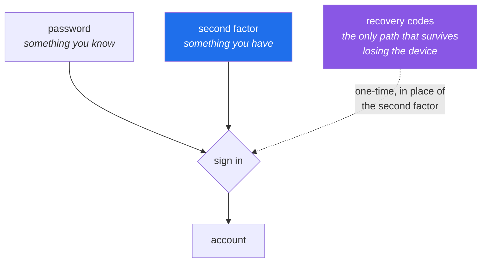

# 3.2 — Creating them: verified email, two-factor, recovery codes

> **One-line answer.** Creating the accounts takes a few minutes; the part that matters is the second
> factor, because from the moment you enable it the recovery codes are the only thing standing between
> a lost phone and an account you cannot get back into.

---

## The story

A developer changes phone. The old one is wiped and traded in on the Saturday; the new one is set up
on the Sunday, and everything moves across — messages, photos, the banking app that made a fuss and
then worked.

On the Monday morning the authenticator app is empty. Not broken: empty. It had never been part of
the backup, because the whole point of it is that it does not leave the device. The six-digit codes
it used to produce are gone, and every account that asks for one is now asking a question that has no
answer.

Most of them have a way back. There is a support line, or a passport photograph to upload, or a
colleague with administrative rights. One of them does not, because it is a free account on a
platform with no support line for free accounts, and the only key was a text file downloaded eleven
months earlier onto a laptop that has since been reformatted.

Four years of work. Public repositories, so the code still exists — anyone can clone it. But the
account that owns them, the one that other projects link to and that the packages are published
under, is now a monument to somebody who cannot log in.

The download button for those recovery codes appears on screen for about four seconds during setup.
This part is going to make you press it.

---

## The idea in plain language

Three things get created here, and they are not the same kind of thing.

- **Your personal account** — probably already exists. If it does, do not make another one:
  [3.1](3.1-why-two-accounts.md) quotes the Terms of Service clause that permits exactly one.
- **A machine account** — an ordinary sign-up with a different email address, which you will then
  treat as a machine: no browsing, no social features, one narrow token at a time.
- **An organization** — not a login. Nobody signs in as an organization. It is a container that owns
  repositories, has members with roles, and holds the policy settings that Phase 11 onward is about.

Then the security work, which is the same for both accounts and is the actual subject of this part.

**Two-factor authentication** (2FA) means proving who you are with two things of different kinds:
something you know, which is the password, and something you *have*, which is a device. The second
factor exists because passwords leak — in bulk, from other websites, from people who reused one — and
a leaked password on its own then buys the attacker nothing.

GitHub offers these methods, named exactly as its documentation names them (fetched from
<https://docs.github.com/en/authentication/securing-your-account-with-two-factor-authentication-2fa/configuring-two-factor-authentication>
on 2026-08-23): a **time-based one-time password (TOTP) application**, **text messages**, **security
keys**, a **passkey**, and **GitHub Mobile**.

| Method | What it is | Honest assessment |
|---|---|---|
| TOTP application | An app that generates a six-digit code from a shared secret and the clock | The sensible default. Choose one that can be backed up, or you are the person in the story. |
| Security key | A physical device you touch | The strongest, because the secret never leaves the hardware and it cannot be phished. Costs money. |
| Passkey | A credential held by your device or password manager | Satisfies both the password and the second factor at once. |
| GitHub Mobile | Approve a prompt in GitHub's own app | Convenient, and it is one more thing on the phone you might lose. |
| Text messages | A code by SMS | The weakest. Numbers get transferred to attackers by people who genuinely believe they are helping. Use it as a fallback, not a primary. |

And the thing this part exists for:

**Recovery codes** are a short list of one-time strings that each work exactly once in place of the
second factor. GitHub generates them when you enable 2FA and offers them for download. They are the
only recovery path that does not depend on a device you might lose, and on a free account they are
very close to the only recovery path at all.

Note also, from the same documentation: *"As of March 2023, GitHub required all users who contribute
code on GitHub.com to enable one or more forms of two-factor authentication (2FA)."* This is not
optional hygiene you can defer to a keener week.

---

## Why the build needs it

**Everything after Day 3** is on the platform. An account you cannot sign in to ends the curriculum,
and unlike almost everything else in this repository, it is not recoverable with a clever command.

**Day 194** rotates a compromised credential, and **Day 202's gate** is a repository that defends
itself. Both assume the account underneath is itself defended; a repository with perfect rulesets and
a phishable owner is theatre.

**Day 216 onward** uses tokens and Codespaces bound to these accounts. Losing the machine account is
survivable — you make another. Losing the personal one is not.

---

## The mechanism

There is nothing to run at a terminal here; this is a browser part, and Principle 15 says the GUI is
taught rather than sneered at. What follows describes the **settings and their effects first**, then
where they currently live, because menu paths move and settings do not.

### Create the machine account

The setting: a second account, with its own verified email address, which will do only automated
things. The path: <https://github.com/signup>, in a private browser window or a second browser
profile so that you are not signed out of your own account.

Choose a username that says what it is. `priya-bot`, `nudge-ci`, `kosha-machine` — something no
reasonable person would mistake for a human. A machine account with a human-looking name and a
picture of a face is how "the bot approved it" becomes a sentence somebody says without noticing.

### Verify the email address on each account

The setting: an address is confirmed to belong to you, which is what makes it usable for attribution
and recovery. The path today, from
<https://docs.github.com/en/account-and-profile/how-tos/email-preferences/setting-your-commit-email-address>
(fetched 2026-08-23): *"In the upper-right corner of any page on GitHub, click your profile picture,
then click **Settings**"*, then *"In the "Access" section of the sidebar, click **Emails**"*, then
*"In "Add email address", type your email address and click **Add**"*, and follow the link that
arrives by mail.

**Why it matters here:** [2.2](../02-identity/2.2-identity-in-every-commit.md) established that GitHub
attributes a commit by matching its email address against verified addresses on accounts. An
unverified address matches nothing.

### Enable two-factor authentication on **both** accounts

The setting: a second factor is required to sign in. The path, from the 2FA documentation fetched
today: *"In the upper-right corner of any page on GitHub, click your profile picture, then click
Settings. In the Access section of the sidebar, click **Password and authentication**."*

Then, and this is the sentence to read slowly, from the same page:

> *"Under 'Save your recovery codes', click **Download** to download your recovery codes to your
> device. Save them to a secure location because your recovery codes can help you get back into your
> account if you lose access."*

**Do this now, for both accounts, before you continue reading.** Then put the file somewhere that is
not the laptop you are sitting at — a password manager, a printed sheet, a second machine. A recovery
code stored only on the device that holds the authenticator app is not a recovery code; it is a copy
of the same single point of failure.

The checklist for today has a box for this, and it is one of the two boxes on the whole day that
cannot be recovered from later.

### Create the organization

The setting: a container that owns repositories on behalf of a group, with its own members, roles and
policy. The path, from
<https://docs.github.com/en/organizations/collaborating-with-groups-in-organizations/creating-a-new-organization-from-scratch>
(fetched 2026-08-23): profile picture → **Settings** → *"In the 'Access' section of the sidebar, click
**Organizations**"* → *"Next to the 'Organizations' header, click **New organization**"*, then choose
the free plan.

The free plan gives unlimited public repositories, unlimited members, and the policy features this
curriculum needs on public repositories. Some settings — most notably rulesets on **private**
repositories — are paid, and Principle 12 requires that to be said plainly rather than discovered on
the day it blocks you. Day 118 states which of them are which and what the free substitute is.

### Prove it worked, from the terminal

This is the only runnable block in the part, and it belongs at the end because it is the proof rather
than the work:

```sh
gh api user --jq '.login, .created_at, .two_factor_authentication'
```

```
USERNAME
2015-01-30T10:03:35Z

```

*(Elided: my username, replaced with `USERNAME`. The blank third line is real and is the point of the
next paragraph.)*

**Line by line:**

- `gh api user` — call the REST API endpoint that describes the authenticated user. This is the same
  API the website uses; Phase 18 is about it in depth.
- `--jq '…'` — filter the JSON response with a jq expression, which `gh` has built in. The three
  fields asked for are the username, when the account was created, and whether 2FA is on.
- **The third line came back empty**, and that is not a bug in the command. `two_factor_authentication`
  is only included in the response when the token making the request carries the `user` scope, and the
  token `gh` creates by default does not. A missing field and a field whose value is `false` look
  identical through `--jq`, which is a genuinely dangerous shape for a security check: *absence read as
  a negative answer*. **When it breaks**, below, shows the error that reveals what is really going on
  and the one command that fixes it.
- This command needs `gh` to be signed in, which is [5.1](../05-cli-tools/5.1-gh-auth-login.md), later today. If
  you have not done that yet, the failure text is in that part.



---

## The same thing, three ways

| Surface | Creating and securing an account | Verdict |
|---|---|---|
| Terminal | Cannot create an account, and this is deliberate: sign-up requires accepting terms, verifying a human and confirming an email address, none of which a command line should be able to do on your behalf | The one genuinely browser-only operation in the whole curriculum. A command that could create accounts would be a tool for creating them in bulk. |
| github.com | Creates the account, verifies the address, enables 2FA, downloads the recovery codes, creates the organization | **The only surface for the work**, which is why this part describes settings before paths. |
| `gh` | Cannot create an account either. It can *inspect* one — `gh api user --jq .two_factor_authentication` — and it must be signed in to an account that already exists to do so | Verification, not creation. Useful for exactly one thing here: proving from the terminal that 2FA is really on. |

**Which a professional reaches for:** the browser, once, and then never again — followed by
`gh api user` in a script when they need to *assert* the state rather than remember it. In an
organisation this is enforced rather than requested: an owner can require 2FA for every member, and
Day 236 covers that setting and what happens to members who have not complied when it is turned on.

---

## When it breaks

**The email address is already attached to another account.**

```
Error adding EMAIL: email is already in use
```

*What it means:* an address belongs to exactly one GitHub account at a time, and this one is already
somewhere — very often on an old account you forgot you made. Documented at
<https://docs.github.com/en/account-and-profile/how-tos/email-preferences/troubleshooting-adding-an-email>,
fetched 2026-08-23.

*Smallest fix:* use a different address for the machine account. If you need *this* address, GitHub's
advice is to sign in to the account that currently holds it and remove it there, recovering that
account by password reset if necessary.

**The authenticator's codes are all rejected.** No error text worth quoting — just "incorrect code",
repeatedly, while the app shows a code that is obviously right.

*What it means:* almost always clock drift. A TOTP code is computed from a shared secret and the
current time, so a device whose clock is a minute out generates codes for a minute that has not
happened.

*Smallest fix:* turn on automatic time synchronisation on the device, or use the authenticator app's
own "sync time" function if it has one. Do not disable 2FA to get in; use a recovery code, which is
what they are for.

**Two-factor set up, recovery codes not saved.** No error, no symptom, and no way to find out except
the day it matters.

*Smallest fix:* go and look now. The same **Password and authentication** page will show you the
recovery codes again while you are signed in, and can generate a fresh set — which invalidates the
old ones, so download the new list and delete any stale copy.

**Asking the API a question your token is not allowed to answer.**

```sh
gh api user/emails
```

```
gh: This API operation needs the "user" scope. To request it, run:  gh auth refresh -h github.com -s user
```

*What it means:* a token carries **scopes** — a list of things it is permitted to do — and yours does
not include `user`. This is the same mechanism that hid `two_factor_authentication` from the command
above: the API answers with what your token is entitled to see and silently omits the rest.
[4.5](../04-auth/4.5-personal-access-tokens.md) is about choosing scopes deliberately.

*Smallest fix:* run the command in the message — `gh auth refresh -h github.com -s user` — which adds
the scope to the existing login rather than creating a second one. Then the field appears and the
check above answers `true` or `false` instead of nothing.

---

## How to undo it

This part is rated `caution` because two of its actions are hard to reverse: enabling a second factor
you cannot satisfy locks you out, and an account, unlike a commit, has no reflog.

### If you have lost the second factor but still have the recovery codes

Sign in with the password, choose the option to use a recovery code, and paste one from the file. Each
code works once. Then, immediately, set up the second factor again on the new device and **download a
fresh set of recovery codes** — the ones you have just spent one of are no longer a complete set.

### If you have lost the second factor and the codes

GitHub documents an ordered list of alternatives, fetched from
<https://docs.github.com/en/authentication/securing-your-account-with-two-factor-authentication-2fa/recovering-your-account-if-you-lose-your-2fa-credentials>
on 2026-08-23:

1. *"Using a two-factor authentication recovery code"* — the file you were told to download.
2. *"Authenticating with a passkey"* — and note GitHub's remark that *"Passkeys satisfy both password
   and 2FA requirements, so you don't need to know your password in order to recover your account."*
3. *"Authenticating with a security key"*.
4. *"Authenticating with a fallback number"* — the SMS number you may have registered as a backup.
5. *"Authenticating with a verified device, SSH token, or personal access token"* — GitHub may accept
   *"a recovery authentication factor, such as an SSH key or previously verified device"*. **This is
   why [4.2](../04-auth/4.2-generating-an-ssh-key.md), next, matters more than it looks.**

And the sentence that this whole part exists to keep you away from, quoted exactly because paraphrase
would soften it:

> *"If you cannot use any recovery methods, you have permanently lost access to your account. However,
> you can unlink an email address tied to the locked account."*

*Permanently.* The email address can be freed for use elsewhere; the account, its username, its
repositories and everything published under it cannot be recovered.

### If you created a second personal account before reading [3.1](3.1-why-two-accounts.md)

Delete it rather than leaving it dormant — Settings → Access → **Account settings** → *Delete account*
— or convert its purpose: if it has no personal activity on it, treat it as the machine account and
give it a name that makes that obvious. What you should not do is keep a second human-looking account
around "just in case", because the Terms of Service clause in
[3.1](3.1-why-two-accounts.md) does not have a "just in case" exception.

### The one that cannot be undone from a terminal

Nothing in this section is a Git operation, and none of it appears in a reflog. `./k sandbox` cannot
rebuild an account. This is the single most important asymmetry of the whole day: everything else you
break today is rebuildable in seconds, and this is not.

---

## In production

**Organisations enforce this rather than asking.** An organisation owner can require two-factor
authentication for every member; members who have not enabled it are removed from the organisation
when the requirement is turned on, and have to re-enable and be reinstated. Day 236 covers that
setting alongside single sign-on and IP allow lists. If you have ever wondered why a company insists
on a hardware key, the reason is that phishing works on people who know better, and a security key is
the only factor on the list that cannot be relayed to an attacker's browser in real time.

**Machine accounts are the weak link in most organisations.** They are created for one task, given a
broad token because that was quicker, and then never audited — the credential outlives the project,
the person who made it, and sometimes the company's memory of what it was for. Day 199 is about
finding those, and the professional answer is to prefer a GitHub App, which has its own identity and
issues short-lived tokens, over a long-lived machine account token. Day 210 builds one.

**What a senior reviewer says.** On a proposal to share one machine account between four services:
*"one identity per consumer, or the first leak costs us all four and the audit log can't tell us which
service was compromised."* Identity is a blast-radius decision before it is a convenience decision —
the same argument [3.1](3.1-why-two-accounts.md) made about your own account.

**What it costs.** Nothing in money: both accounts and the organization are free on the plans this
curriculum uses. A hardware security key costs about the price of a meal and is the single
highest-value purchase in this subject.

**The interview question this is really testing.** *"What happens to your access if you lose your
phone tonight?"* It sounds like small talk. A strong answer is specific: recovery codes stored
somewhere that is not the phone, a second factor of a different kind registered as a backup, and — for
an organisation account — a second owner who can restore access, because a single-owner organisation
is one lost device away from nobody being able to administer it.

---

## Check yourself

**Run this now.** Predict both values before you press return — your username, and roughly when you
created the account:

```sh
gh api user --jq '.login, .created_at'
```

**Line by line:** `gh api user` fetches the authenticated user's record from the REST API; `--jq`
picks two fields out of the JSON. Both are always present, whatever scopes your token holds — which
is exactly why this is the check and the 2FA field is not. If the command fails because `gh` is not
signed in yet, that is expected; [5.1](../05-cli-tools/5.1-gh-auth-login.md) fixes it later today.

Then confirm the thing that actually matters in the browser, on the **Password and authentication**
page: 2FA enabled, on **both** accounts, with recovery codes downloaded and stored somewhere that is
not this laptop.

**Say this out loud.** Describe what you would do, in order, if your authenticator app were empty
tomorrow morning — and then say where your recovery codes physically are. If the second answer is "on
this laptop", fix that before the next part.

---

**Next:** [3.3 — The noreply address, and the privacy setting that blocks a push](3.3-noreply-and-email-privacy.md) ·
[back to the hub](../../LESSON.md)
