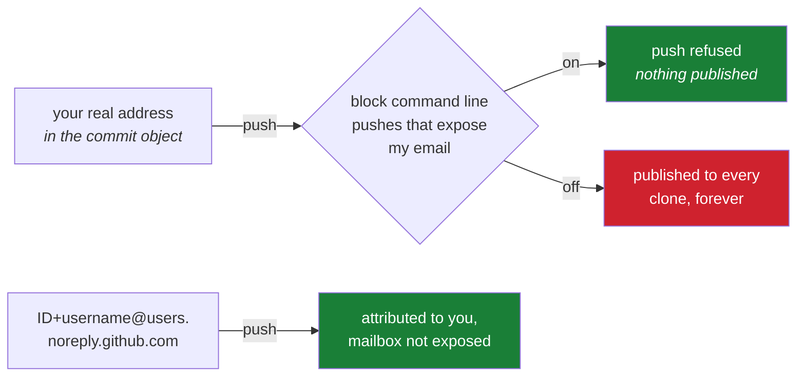

# 3.3 — The noreply address, and the privacy setting that blocks a push

> **One-line answer.** Every commit you publish carries your email address in plain text to anyone who
> clones the repository, so GitHub issues you a permanent forwarding address that identifies you
> without exposing your mailbox — and a setting that stops a push carrying the real one by accident.

---

## The story

Someone publishes a small utility. It solves one annoying problem, it is four hundred lines long, and
for two years almost nobody notices.

Then it appears in a list somewhere, and for a fortnight it is briefly famous. Traffic, stars,
issues — and, unexpectedly, mail. Not to the address on the profile page, which is a deliberately
public one. To the personal address, the one used for the doctor, the bank and the family group
thread.

The author never published it. But every commit in the repository contains it, in plain text, because
that is what a commit is, and a repository with any attention at all is scraped by people building
lists of addresses. The address has left. There is no recall.

Deleting the repository would not fix it: hundreds of people have complete clones, and each clone is
a complete copy of every commit — that is what "distributed" means, and
[1.1](../01-install/1.1-what-git-actually-is.md) said so on the first page. Rewriting the history to swap the
address would change every commit's identifier and break every one of those clones, and the address
would still be in the copies people already have.

The mistake took one second on the first day: a global setting typed with the address that was
already in the clipboard.

---

## The idea in plain language

From [2.2](../02-identity/2.2-identity-in-every-commit.md): your email address is copied into every commit and
is part of the bytes its hash is computed over. From [1.1](../01-install/1.1-what-git-actually-is.md): a clone
is a complete copy. Put those together and the consequence is unavoidable — **publishing a repository
publishes every address in its history, to everyone, permanently.**

That is not a flaw. Attribution needs a stable identifier, and email addresses were the identifier
available when Git was designed. But it does mean the choice of *which* address deserves a minute's
thought on the first day rather than a shrug.

GitHub's answer is a **noreply address**: an address on the domain `users.noreply.github.com` that
belongs to your account, matches it for attribution, and does not deliver mail anywhere. It is a
name-tag, not a mailbox.

There are two forms, and the difference matters. From GitHub's email addresses reference, fetched from
<https://docs.github.com/en/account-and-profile/reference/email-addresses-reference> on 2026-08-23:

> For accounts created after July 18, 2017, *"your `noreply` email address is an ID number and your
> username in the form of `ID+USERNAME@users.noreply.github.com`"*.
>
> For older accounts with privacy enabled, the *"`noreply` email address is
> `USERNAME@users.noreply.github.com`"*.

And the reason to prefer the first, from the same page:

> *"If you use your `noreply` email address for GitHub to make commits and then change your username,
> those commits will not be associated with your account. This does not apply if you're using the
> ID-based `noreply` address from GitHub."*

Read that carefully, because it is a genuine trap. The username form points at a *name*, and names can
be given up — change your username and every commit you ever made stops being yours. The ID form
points at a *number* that never changes.

Two settings sit alongside it, both on the same page of your account:

- **Keep my email addresses private** — GitHub stops exposing your real address in the places it
  controls, and gives you the noreply address to use.
- **Block command line pushes that expose my email** — the safety net. GitHub inspects what you push
  and refuses it if the commit carries an address you have marked private.

That second one is the interesting one, because it is the only setting in this part that can *stop*
you, and being stopped is the entire point: the failure happens before publication rather than after.



---

## Why the build needs it

**Day 113** makes `nudge` public. Every commit you have made up to that day becomes readable by
anyone, including the address in each one. The decision is made today; Day 113 only reveals it.

**Later today**, [6.3](../06-sandbox/6.3-end-to-end-proof.md) requires a commit that GitHub attributes to you
*and* considers signed. Attribution matches on the address, so the address in the commit has to be one
your account actually holds — real or noreply, but not a third thing you invented.

**Day 220 onward** is contributing to other people's projects. Your address goes into their history,
on their terms, and stays there. A noreply address is the difference between contributing and
publishing your mailbox in a stranger's repository.

**Day 104** removes a secret from history and is one of the hardest days in the plan. An email address
you did not mean to publish is the same problem with the same cost, and the same lesson: what is
published cannot be unpublished, only superseded.

---

## The mechanism

### Find your noreply address

The setting: whether GitHub exposes your real address, and which noreply address it issues you. The
path today, from
<https://docs.github.com/en/account-and-profile/how-tos/email-preferences/setting-your-commit-email-address>
(fetched 2026-08-23): profile picture → **Settings** → *"In the "Access" section of the sidebar, click
**Emails**"*. The noreply address is shown there, next to the privacy checkbox.

From the terminal you can assemble it, because it is built from two facts the API will tell you:

```sh
gh api user --jq '"\(.id)+\(.login)@users.noreply.github.com"'
```

**Line by line:**

- `gh api user` — the authenticated user's record, as in [3.2](3.2-creating-the-accounts.md).
- `--jq '"\(.id)+\(.login)@…"'` — a jq string with two interpolations. `\(.id)` inserts the numeric
  account ID and `\(.login)` the username, producing exactly the `ID+USERNAME@users.noreply.github.com`
  form quoted above.
- The whole expression is inside single quotes so that the shell passes the backslashes and
  parentheses through to jq untouched — Day 1's part 2.2 is about why that quoting is not optional.
- **Check the result against the address shown on the Emails page** rather than trusting the
  construction. If your account predates July 2017 and has never had privacy re-enabled, yours may be
  the older `USERNAME@` form, and the page is authoritative.

### Point Git at it

```sh
git config --global user.email "1000+octocat@users.noreply.github.com"
```

**Line by line:**

- `--global` — every repository, as [2.1](../02-identity/2.1-config-and-scopes.md) established. This is the
  setting that decides what the next commit carries.
- The example address here is GitHub's own documentation example, not a real account. Substitute the
  one you just looked up.
- Nothing retroactive happens. Commits already made keep the address they were made with — that was
  [2.2](../02-identity/2.2-identity-in-every-commit.md)'s whole subject, and its **How to undo it** section is
  the repair path if you have already committed with an address you would rather not publish.

Prove what the next commit will carry:

```sh
git config --get user.email
```

```
priya@example.com
```

**Line by line:** the effective value, from whichever scope won. If this prints a personal address and
you have just set a noreply one globally, a repository-local setting is overriding you — run
`git config --show-origin --get user.email` and the file will name itself.

### Turn on the setting that can stop you

The setting: GitHub refuses a pushed commit whose author address is one you have marked private. From
<https://docs.github.com/en/account-and-profile/how-tos/email-preferences/blocking-command-line-pushes-that-expose-your-personal-email-address>
(fetched 2026-08-23), it is labelled **"Block command line pushes that expose my email"**, and it sits
on the same Settings → Access → **Emails** page as the privacy checkbox.

What it does, in GitHub's own description: each time you push, GitHub checks the most recent commit,
and if the author email on that commit is a private email on your account, the push is blocked with a
warning.

`TODO(verify)` — the exact remote rejection text is not reproduced in this document, because
reproducing it requires enabling the setting on a live account and pushing a commit that violates it,
which this part will not do to your account on your behalf. Turn the setting on, make a commit with
your real address in the sandbox, push it, and paste what you get into your own notes — that failure
is worth meeting once, deliberately, which is Principle 3.

Note the limit in the description, because it is easy to misread: GitHub checks **the most recent
commit**. This is a guard against the common accident, not an audit of your whole history.

### The two addresses, side by side

| | Real address | `ID+USERNAME@users.noreply.github.com` |
|---|---|---|
| Attribution on GitHub | Works, if verified on your account | Works, always |
| Visible to anyone who clones | Yes, in every commit | Yes — but it is a name-tag, not a mailbox |
| Survives a username change | Yes | Yes — the ID never changes |
| Receives mail | Yes | No |
| Good for | A work repository where colleagues legitimately need to reach you | Anything public, and anything you contribute to |

**Which to use here:** the noreply address for `nudge` and for everything you contribute to. If you
use a real address anywhere, make it one you would put on a business card.

---

## The same thing, three ways

| Surface | Choosing and enforcing the published address | Verdict |
|---|---|---|
| Terminal | `git config --global user.email …` decides what goes into every future commit; `git log --format='%ae'` shows what actually went into the past ones | **Where the decision is made.** Git has no idea the address is private; it copies what you gave it. |
| github.com | Settings → Access → Emails holds all three controls: the noreply address itself, **Keep my email addresses private**, and **Block command line pushes that expose my email** | **The only surface with the safety net.** The block lives on the server, which is the one place that can refuse a push. |
| `gh` | `gh api user --jq .id` gives you the number the noreply address is built from. It cannot change the privacy settings, and `gh repo create` does not choose your commit address | Useful for assembling the address, useless for enforcing it. |

**Which a professional reaches for:** the noreply address in the global config on every machine, set
once and never revisited, plus the blocking setting turned on as the backstop for the day a fresh
laptop or a container has different configuration. The rule is the same one that runs through this
whole day: make the mistake impossible on the server rather than remembering not to make it.

---

## When it breaks

**A commit is attributed to nobody after switching to a noreply address.** No error; a grey silhouette
on the commit page.

*What it means:* almost always a typo in the address, or the wrong form — `USERNAME@` when your
account was issued `ID+USERNAME@`, or the ID digits transposed. Attribution is an exact string match
against the addresses GitHub knows for you.

*Smallest fix:* copy the address from the Emails page rather than typing it, and check a commit page
after the next push. [2.2](../02-identity/2.2-identity-in-every-commit.md)'s undo section covers repairing the
commits already made.

**The API refuses to tell you your addresses.**

```
gh: This API operation needs the "user" scope. To request it, run:  gh auth refresh -h github.com -s user
```

*What it means:* listing your account's email addresses through `gh api user/emails` needs a token
with the `user` scope, and the default `gh` login does not have it. The command in the message adds
the scope to your existing login.

*Smallest fix:* run it — or just read the address off the Emails page, which needs no scope at all.
Adding a scope you do not need is the wrong instinct; [4.5](../04-auth/4.5-personal-access-tokens.md) is
about that habit.

**Your address is already published in a public repository.** No error, and no undo. This is the
story at the top of this part.

*Smallest fix:* there is not a small one, and pretending otherwise would be dishonest. Rewriting the
history changes every commit identifier and does nothing about the clones that already exist. The
proportionate response is to stop the bleeding — switch to the noreply address now, turn on the
blocking setting — and treat the exposed address as exposed. Day 104 is the rewrite, with its full
cost stated, for the cases where the exposure is serious enough to justify it.

---

## In production

**Companies choose this deliberately, in both directions.** Some require the corporate address in
every commit, because the history is an audit record and an anonymous-looking noreply address defeats
it. Others require a noreply address in public repositories, because a scrapeable list of every
employee's address is a phishing campaign waiting to be written. Both are defensible; what is not
defensible is having no policy and discovering the answer from the outside.

**`.mailmap` is the honest repair at scale.** A committed `.mailmap` file maps addresses and names to
canonical ones for the purposes of `git log`, `git shortlog` and the reports built on them, without
changing a single commit. Day 99 builds one. It is what large projects use instead of rewriting
history, and it is the reason a twenty-year-old project can produce a clean contributor list from a
messy record.

**Scrapers are real and automatic.** Public repositories are enumerated continuously, and the commit
objects are the richest structured source of verified addresses on the internet — each one attached to
a name, a project, and evidence that the person writes software. Nobody has to target you.

**What a senior reviewer says.** On a first contribution from a new colleague: *"your commits are
going out with your personal address — set the noreply one before this merges, because after it lands
in `main` it is in everyone's clone."* Note the timing: before the merge is cheap, after it is not,
which is the same asymmetry as [2.2](../02-identity/2.2-identity-in-every-commit.md).

**What it costs.** Nothing. The noreply address is free, and the blocking setting is free.

**The interview question this is really testing.** *"How do you keep your personal email address out
of a public Git history?"* A weak answer is "I don't commit it". A strong one names the three layers:
the noreply address so the right thing is easy, the privacy setting so GitHub stops exposing the real
one, and the push block so the wrong thing is refused rather than merely discouraged — plus the
recognition that none of the three helps retroactively, because a published commit is in everyone's
clone.

---

## Check yourself

**Run this now.** Predict the address before you press return, and then compare it against the one
shown on your Emails page:

```sh
gh api user --jq '"\(.id)+\(.login)@users.noreply.github.com"'
```

**Line by line:** `gh api user` fetches your account record; the jq expression interpolates the ID and
the username into the documented noreply form. If the two do not match — because your account is old
enough to have the username-only form — the page wins, and the reason is in the reference quoted
earlier in this part.

**Say this out loud.** A colleague asks why you bother with a noreply address when your address is
"already public anyway". Answer in two sentences: one about what a clone actually contains, and one
about what changing your mind afterwards would cost.

---

**Next:** [4.1 — HTTPS or SSH: two ways to authenticate, and what each actually sends](../04-auth/4.1-https-or-ssh.md) ·
[back to the hub](../../LESSON.md)
