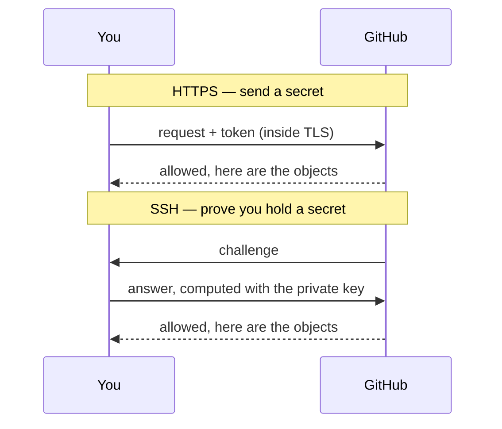

# 4.1 — HTTPS or SSH: two ways to authenticate, and what each actually sends

> **One-line answer.** Both protocols carry exactly the same Git data; they differ in what proves you
> are you — HTTPS sends a secret you possess and a helper remembers, SSH proves you hold a private key
> without ever transmitting it — and that difference is the whole basis for choosing.

---

## The story

A building has two doors.

The front door takes a code. You type the six digits, the lock opens, and you are in. It works from
any door in the group that uses the same code, it works when you are standing there with wet hands
and a box, and if you forget the code there is a keypad and you can try again. The weakness is
obvious once you say it out loud: the code exists as a thing that can be repeated. Somebody watching
over your shoulder has it. Somebody who reads the note in your wallet has it. It is knowledge, and
knowledge copies perfectly.

The side door takes a key of the kind where the lock asks the key a question and the key answers.
Nothing that passes between them can be reused: watch the exchange, record it, replay it, and the door
stays shut, because the question is different every time. The key itself never goes into the lock's
side of the conversation at all. The weakness is also obvious: you have to be carrying the key, and if
you leave it in a taxi, somebody has it and the lock cannot tell them from you until you phone the
building and say so.

Neither door is the correct door. They are different trade-offs, and the person who understands both
picks per building.

---

## The idea in plain language

When your Git talks to GitHub, two separate things happen and it is worth keeping them apart.

1. **Transport** — moving the objects: commits, trees and blobs, the things
   [1.1](../01-install/1.1-what-git-actually-is.md) took apart. This is identical either way. The same
   objects, the same negotiation, the same result.
2. **Authentication** — convincing the far end that you are allowed to do this. This is where the two
   protocols genuinely differ.

**HTTPS** is the web's protocol. Git makes an ordinary encrypted web request and includes a secret —
in practice a **personal access token**, a long string that acts as a password with a defined set of
permissions ([4.5](4.5-personal-access-tokens.md) is about them). The token is transmitted, inside the
encrypted connection, on every request. Something has to remember it for you, and that something is a
**credential helper** ([4.4](4.4-credential-helpers.md)).

Note what is no longer possible, from GitHub's documentation on remote repositories, fetched from
<https://docs.github.com/en/get-started/git-basics/about-remote-repositories> on 2026-08-23:

> *"Password-based authentication for Git has been removed in favor of more secure authentication
> methods."*

So "HTTPS with your account password" is not one of the options; it is a token or nothing.

**SSH** is a protocol built for logging in to remote machines. Instead of sending a secret, it proves
possession of one. You hold a **key pair**: a private key that never leaves your disk, and a public
key you hand out freely. The server sends a challenge, your machine answers it using the private key,
and the answer proves you hold the key without revealing it. [4.2](4.2-generating-an-ssh-key.md)
generates the pair.

Two consequences of that difference, and they are the entire decision:

- **What travels.** HTTPS transmits the secret every time, protected by the encryption around it. SSH
  never transmits the secret at all.
- **What leaking one costs.** A stolen token can be used by anyone who has it, from anywhere, until it
  is revoked or expires. A stolen private key can be used by anyone who has it *and* can decrypt it,
  which is why you give it a passphrase.



---

## Why the build needs it

**Later today**, [6.3](../06-sandbox/6.3-end-to-end-proof.md) pushes a commit. It cannot push until one of
these two paths works, and the failure text is entirely different for each — which is why this part
comes before both of them.

**Day 82** is protocols in full: what the negotiation actually exchanges, packfiles on the wire, the
smart HTTP protocol. This part is the outline that day fills in.

**Day 87** runs your own remote over SSH, with no GitHub involved at all, which is only comprehensible
once you know that SSH is a general-purpose login protocol and Git is merely a passenger on it.

**Day 195** uses deploy keys — an SSH key granting access to one repository rather than one account.
That idea does not exist on the HTTPS side in the same shape, and it is the standard answer for a
server that needs read access to exactly one repository.

---

## The mechanism

### The two URL forms

The choice is expressed in one place: the URL of the remote. From the GitHub documentation fetched
above, the two documented forms are `https://github.com/user/repo.git` and
`git@github.com:user/repo.git`.

```sh
git clone https://github.com/octocat/Hello-World.git hw
cd hw && git remote -v
```

```
origin	https://github.com/octocat/Hello-World.git (fetch)
origin	https://github.com/octocat/Hello-World.git (push)
```

**Line by line:**

- `git clone <url> hw` — copy the repository into a directory called `hw`. This one is public, so no
  credential was needed at all: **anonymous read over HTTPS works without any authentication**, which
  is a genuine asymmetry with SSH.
- `git remote -v` — list the remotes and their URLs. `-v` adds the URLs; without it you get only the
  names. Day 75 is about what a remote actually is.
- Two lines, one for fetching and one for pushing, because Git allows them to differ — a detail that
  becomes useful on Day 87.

```sh
git remote set-url origin git@github.com:octocat/Hello-World.git
git remote -v
```

```
origin	git@github.com:octocat/Hello-World.git (fetch)
origin	git@github.com:octocat/Hello-World.git (push)
```

**Line by line:**

- `git remote set-url` — change where a remote points. Nothing is downloaded and nothing is verified;
  this only edits `.git/config`, which [2.1](../02-identity/2.1-config-and-scopes.md) taught you to read.
- `git@github.com:octocat/Hello-World.git` — this is **SSH's** syntax, not a URL in the web sense. It
  reads: log in to the host `github.com` as the user `git`, and ask for the path after the colon. The
  long form `ssh://git@github.com/octocat/Hello-World.git` means the same thing and is what you must
  use when you need a non-default port.
- **Everyone is `git`.** Every person authenticating to GitHub over SSH logs in as the same Unix user.
  Your identity comes entirely from which key answered the challenge, which is why registering the
  correct key matters so much in [4.3](4.3-registering-and-testing-the-key.md).

### What each one does when it cannot authenticate

This is the part worth memorising, because the two failures look nothing alike and telling them apart
saves the twenty minutes people usually spend regenerating keys they did not need to touch.

```sh
GIT_TERMINAL_PROMPT=0 git -c credential.helper= ls-remote https://github.com/octocat/kosha-definitely-not-a-real-repo.git
```

```
fatal: could not read Username for 'https://github.com': terminal prompts disabled
```

**Line by line:**

- `git ls-remote <url>` — ask a remote what refs it has, without cloning anything. Day 83 is about
  this command as a diagnostic instrument.
- `GIT_TERMINAL_PROMPT=0` — forbid Git from asking interactively. Without it the command would sit
  waiting for a username, which is useless in a script and confusing in a lesson.
- `-c credential.helper=` — an empty helper for this command only, so no stored credential is used
  and we see the unauthenticated behaviour. [4.4](4.4-credential-helpers.md) is the helper.
- **The interesting part:** the repository does not exist, yet the error is about credentials. HTTPS
  cannot distinguish "no such repository" from "you may not see this repository" without telling you
  which private repositories exist, so it asks for authentication in both cases. Every "repository not
  found" over HTTPS is really "not found *for you*".

Now the SSH failure, with a key GitHub has never seen:

```sh
ssh -T -o IdentitiesOnly=yes -i ~/.ssh/id_ed25519 git@github.com
```

```
git@github.com: Permission denied (publickey).
```

**Line by line:**

- `ssh -T` — connect but do not ask for a terminal. GitHub does not offer shell access, so a terminal
  request would fail for an unrelated reason and muddy the result.
- `-i ~/.ssh/id_ed25519` — offer this specific key.
- `-o IdentitiesOnly=yes` — offer *only* that key. Without it, SSH offers every key it can find,
  which makes "which key was accepted?" unanswerable — and on a machine with several keys, causes the
  wrong account to answer.
- `(publickey)` — the list of authentication methods that were tried and failed. GitHub accepts no
  other method, so this is always the complete list.
- The exit code is `255`, SSH's general failure code. Note what the message does *not* say: it does
  not mention the repository, because no repository was involved. **SSH fails at the door; HTTPS fails
  at the room.**

### When the network itself is the problem

Some networks block outbound port 22, which is SSH's default, and the symptom is a connection that
hangs rather than an error. GitHub publishes a second endpoint on port 443, the HTTPS port, which
almost nothing blocks. From
<https://docs.github.com/en/authentication/troubleshooting-ssh/using-ssh-over-the-https-port>, fetched
2026-08-23:

> *"The hostname for port 443 is `ssh.github.com`, not `github.com`."*

```sh
ssh -T -p 443 git@ssh.github.com
```

**Line by line:**

- `-p 443` — connect to port 443 rather than 22. This is still SSH; it is only borrowing the port
  number that firewalls leave open.
- The documented success message is *"Hi USERNAME! You've successfully authenticated, but GitHub does
  not provide shell access."* — quoted from that page rather than pasted from my own terminal, because
  the machine this was written on has no key registered with GitHub and I will not register one on
  your behalf. You will see it yourself in [4.3](4.3-registering-and-testing-the-key.md).

To make it permanent, GitHub's documented configuration block for `~/.ssh/config`:

```
Host github.com
    Hostname ssh.github.com
    Port 443
    User git
```

**Line by line:**

- `Host github.com` — when I say `github.com`, apply the following.
- `Hostname ssh.github.com` — actually connect to this name instead.
- `Port 443` · `User git` — the port to use, and the user everyone logs in as.
- With this in place, `git@github.com:owner/repo.git` keeps working unchanged while the connection
  quietly goes out over 443. [4.2](4.2-generating-an-ssh-key.md) uses the same file for a different
  purpose.

### Choosing

| | HTTPS | SSH |
|---|---|---|
| What is sent | A token, on every request, inside TLS | Nothing secret, ever |
| Anonymous read of a public repository | Works with no credential at all | Not possible — always authenticates |
| Where the secret lives | A credential helper: OS keychain, or a plain file ([4.4](4.4-credential-helpers.md)) | `~/.ssh/`, ideally encrypted with a passphrase |
| Blocked by corporate firewalls | Almost never | Port 22 often; port 443 fixes it |
| Revoking one machine | Revoke the token | Delete that machine's public key |
| Scoped to one repository | A fine-grained token can be | A deploy key is, exactly (Day 195) |
| What `gh auth login` sets up for you | Yes, by default | Yes, with `--git-protocol ssh` |

**The honest recommendation for this curriculum:** either. Pick one and be consistent, because mixing
them per-repository is how you end up with a push failing for a reason unrelated to the one you are
debugging. If your network blocks port 22 and you cannot use the 443 endpoint, HTTPS is the answer.
If you want the day-to-day experience with the fewest moving parts once it works, SSH — because a key
does not expire and there is nothing to rotate on a schedule.

---

## The same thing, three ways

| Surface | Choosing and using the protocol | Verdict |
|---|---|---|
| Terminal | `git remote -v` shows which protocol a repository uses; `git remote set-url` changes it; `git config --global url.<base>.insteadOf` rewrites one form to the other everywhere | **Complete control**, including the rewrite rule that quietly converts every HTTPS URL you are given into SSH — which is what people with a strong preference actually do. |
| github.com | The repository's green **Code** button offers HTTPS, SSH and GitHub CLI as tabs, and remembers your choice per account | The place most people first meet the choice, presented as three tabs with no explanation of the trade-off — which is what this part exists to supply. |
| `gh` | `gh config get git_protocol` shows the CLI's preference; `gh auth login --git-protocol ssh` sets it, and `gh repo clone` then uses it for every clone | **The most convenient**, because it also offers to create and upload an SSH key during login — one flow instead of the four steps in [4.2](4.2-generating-an-ssh-key.md) and [4.3](4.3-registering-and-testing-the-key.md). Do the four steps once anyway; Principle 16. |

**Which a professional reaches for:** SSH on their own machines, and HTTPS in automation — because a
continuous-integration job gets a short-lived token issued to it, and giving a build agent a
long-lived private key is exactly the thing Phase 17 spends a fortnight teaching you not to do. The
two protocols end up split by *who is authenticating*: a person, or a machine.

---

## When it breaks

**HTTPS, with no credential available.**

```
fatal: could not read Username for 'https://github.com': terminal prompts disabled
```

*What it means:* Git needed a credential, had no helper that could supply one, and was forbidden to
ask. In a script or a container this is the normal shape of "authentication is not configured".

*Smallest fix:* configure a credential helper ([4.4](4.4-credential-helpers.md)) or let
`gh auth login` do it ([5.1](../05-cli-tools/5.1-gh-auth-login.md)). If you are debugging a pipeline, this
message means the token was never supplied — look at the job's environment, not at the repository.

**SSH, with a key the server does not recognise.**

```
git@github.com: Permission denied (publickey).
```

*What it means:* the connection succeeded, GitHub offered only public-key authentication, your machine
offered one or more keys, and none of them are registered on any account.

*Smallest fix:* [4.3](4.3-registering-and-testing-the-key.md) registers the key. To find out which key
was actually offered, add `-v` and read the `Offering public key` lines — that flag is the single most
useful thing in this part when there is more than one key on the machine.

**SSH, where the host is not who you have been told to expect.**

```
Host key verification failed.
fatal: Could not read from remote repository.

Please make sure you have the correct access rights
and the repository exists.
```

*What it means:* SSH remembers the host's own key in `~/.ssh/known_hosts` and refuses to continue when
what it is offered does not match what it recorded — either because the entry is missing under a
strict setting, or because the recorded value differs. That second case is the one worth taking
seriously: it is what an interception attack looks like from the client side.

*Smallest fix:* **verify before you trust.** [4.3](4.3-registering-and-testing-the-key.md) checks the
fingerprint against GitHub's published list rather than typing `yes` at a prompt. Note also the second
half of the message: Git's advice mentions access rights and the repository existing, neither of which
is the actual problem here. Read the first line, not the friendly paragraph.

---

## In production

**Automation uses neither of these, quite.** Inside GitHub Actions the checkout step receives a token
minted for that single workflow run, which expires when the job ends — Day 161 is about it. That is
better than both options in this part, because a credential that lives for four minutes cannot be
stolen and used next month. When you see a workflow with a personal access token pasted into a secret,
you are looking at somebody who has not learned this yet, and Day 172's OIDC work is the same idea for
cloud deployments: short-lived, issued on demand, scoped to one job.

**Deploy keys are the SSH idea used properly.** A deploy key is a key pair registered against **one
repository** rather than an account, optionally read-only. A server that needs to clone one repository
should have one of those, not a token belonging to a human who might leave the company. Day 195.

**`insteadOf` is what a strong preference looks like at scale.** One line in a global config rewrites
every `https://github.com/` URL into `git@github.com:` for every repository, including the ones a
tool generated for you. Day 89 writes it. It is the correct answer to "half our submodules use HTTPS
and half use SSH", which is otherwise a genuinely annoying Day 107 problem.

**What a senior reviewer says.** On a Dockerfile that copies a private key into an image to clone a
dependency: *"that key is now in a layer forever and in every registry that mirrors this image — use a
build secret or a short-lived token."* The key idea is the same one from
[2.2](../02-identity/2.2-identity-in-every-commit.md): things that get copied into immutable artefacts do not
come back out.

**What it costs.** Nothing, on either protocol. GitHub does not charge for either, and both are
subject to the same rate limits and the same bandwidth accounting — Day 237 has the numbers.

**The interview question this is really testing.** *"SSH or HTTPS, and why?"* The answer that lands is
not a preference. It is: they are identical for the data and differ in what proves identity — HTTPS
transmits a token every request and needs a helper to store it, SSH proves possession of a key that
never leaves the machine; HTTPS survives firewalls and allows anonymous reads, SSH gives you deploy
keys and nothing to rotate; and for automation you use neither, because a workflow-scoped short-lived
token beats both.

---

## Check yourself

**Run this now.** Predict, before you press return, whether this needs any credential at all:

```sh
git ls-remote --heads https://github.com/octocat/Hello-World.git
```

**Line by line:** `ls-remote --heads` asks a remote to list its branches without cloning anything.
The repository is public and the protocol is HTTPS, so the answer is that no credential is needed —
and the same command against `git@github.com:octocat/Hello-World.git` would need a registered key,
even though the repository is equally public. That asymmetry is the single most useful fact in this
part.

**Say this out loud.** Explain to somebody why a stolen access token is a worse day than a stolen
public key — and then say what makes a stolen *private* key worse than either.

---

**Next:** [4.2 — Generating an SSH key, and what the four files are](4.2-generating-an-ssh-key.md) ·
[back to the hub](../../LESSON.md)
