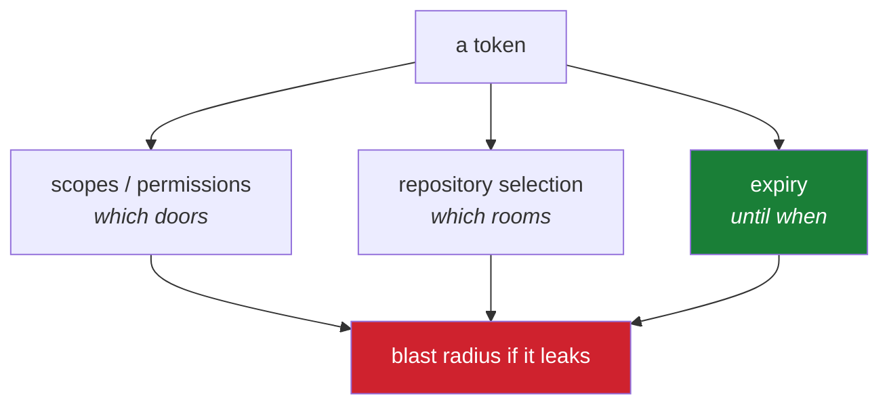

# 4.5 — Personal access tokens: classic, fine-grained, and choosing scopes

> **One-line answer.** A token is a password with a list of permissions and an expiry date attached,
> and the entire craft is choosing the shortest list and the nearest date that still let the job
> finish.

---

## The story

A building manager is asked for a key so a contractor can service the boiler on Thursday.

There is a master key in the drawer. It opens the boiler room. It also opens the server cupboard, the
records room, the office where the safe is, and the roof. Handing it over takes four seconds, the
contractor is standing there, and cutting a boiler-room-only key means walking to the locksmith.

The master key is handed over. The boiler is serviced. The key comes back on Friday, and everything is
fine — which is how the same decision gets made the following month, and the month after, until the
question "who has had a master key?" has an answer nobody can produce.

The interesting thing about this story is that nothing goes wrong in it. It is not a story about a
theft. It is a story about a decision that is imperceptibly cheap each time it is made and
enormously expensive to reconstruct once, at the moment somebody needs to know what a lost credential
could reach.

---

## The idea in plain language

A **personal access token** is a long random string that acts on your behalf when you are not there to
type a password. Git uses one to push over HTTPS; `gh` uses one for every API call; a script that
files an issue uses one.

Three properties define a token, and choosing them well is the whole subject:

- **What it can do** — its **scopes** (or, for the newer type, its **permissions**). `repo` means "act
  on repositories"; `admin:public_key` means "manage SSH keys"; `gist` means "manage gists".
- **What it can reach** — every repository you can reach, or a named few.
- **How long it lives** — a date after which it stops working, whether or not anyone remembers it
  exists.

GitHub offers two kinds, and their official names are worth using precisely, from
<https://docs.github.com/en/authentication/keeping-your-account-and-data-secure/managing-your-personal-access-tokens>,
fetched 2026-08-23:

| | **Personal access token (classic)** | **Fine-grained personal access token** |
|---|---|---|
| What it can reach | Everything your account can reach | Repositories you select, in one account or organization |
| How permissions are expressed | Coarse scopes, e.g. `repo` covers read *and* write on *all* repositories | Per-resource permissions, each read-only or read-and-write |
| Expiry | Optional | Documented maximum of **366** days, or `none` for an unlimited lifetime |
| Unused tokens | *"GitHub automatically removes personal access tokens that haven't been used in a year"* | — |
| GitHub's own advice | — | *"GitHub recommends that you use fine-grained personal access tokens instead of personal access tokens (classic) whenever possible"* |

The sentence to sit with is the one about `repo`. A classic token with `repo` can read, write, delete
branches and change settings on **every repository you have access to**, including private ones
belonging to organisations that trusted you personally. There is no narrower version of `repo` in the
classic model. That is why the fine-grained type exists.

### Scopes are a list of doors, not a level of trust

The mental model people arrive with is a dial: "read-only", "normal", "admin". The reality is a
checklist of unrelated capabilities, and a token has exactly the ones you ticked. A token with `gist`
and nothing else cannot read a repository. A token with `repo` and nothing else cannot manage your SSH
keys — which you can watch happening in the mechanism section below, because it is the most
instructive error in this part.

---

## Why the build needs it

**[5.1](../05-cli-tools/5.1-gh-auth-login.md), next**, signs `gh` in, which creates a token with a specific set
of scopes. Knowing what those are is what stops `gh` being magic.

**Day 203 onward** is Phase 18, the API surface. Every call is authorised by a token, and the whole
phase is a study in what a given token may do.

**Day 196** is about secrets in GitHub Actions, and **Day 194** rotates a compromised credential.
Both assume you can say what a token could reach — which is a question about scopes.

**Day 237** counts what things cost, and API rate limits are one of them. Your limit depends on
whether you are authenticated at all.

---

## The mechanism

### Look at the token you already have

If `gh` is signed in, you have a token right now:

```sh
gh auth status
```

```
github.com
  ✓ Logged in to github.com account USERNAME (keyring)
  - Active account: true
  - Git operations protocol: https
  - Token: gho_************************************
  - Token scopes: 'gist', 'read:org', 'repo'
```

*(Elided: my username. The masking of the token is `gh`'s own.)*

**Line by line:**

- `Token: gho_****…` — masked by `gh` unless you pass `--show-token`, which you should not; a token is
  a password that happens to be typeable, and this one would be in your terminal scrollback and your
  screen recording.
- `gho_` — the prefix. GitHub gives its credential types distinct prefixes so that automated scanners
  can recognise one on sight, which is the mechanism behind secret scanning (Day 197). `gho_` marks a
  token issued through an OAuth flow, as `gh auth login` uses.
- `Token scopes: 'gist', 'read:org', 'repo'` — three scopes. `gh`'s own documentation states its
  minimum as `repo`, `read:org` and `gist`. Note what is absent: nothing about SSH keys, nothing about
  workflows, nothing about packages. That absence is a design, and the next block shows it working.

### Watch a scope be missing

```sh
gh api user/keys
```

```
{"message":"Not Found","documentation_url":"https://docs.github.com/rest/users/keys#list-public-ssh-keys-for-the-authenticated-user","status":"404"}
gh: Not Found (HTTP 404)
gh: This API operation needs the "admin:public_key" scope. To request it, run:  gh auth refresh -h github.com -s admin:public_key
```

**Line by line:**

- `gh api user/keys` — list the SSH keys on the authenticated account, the API behind
  [4.3](4.3-registering-and-testing-the-key.md)'s settings page.
- **`404 Not Found`, not `403 Forbidden`.** This is deliberate on GitHub's part and worth
  internalising: rather than confirm that a resource exists and refuse it, the API frequently answers
  as though it does not exist. An unauthorised caller learns nothing. It also means "404" in your logs
  does not reliably mean "wrong URL" — it may mean "wrong token".
- `needs the "admin:public_key" scope` — `gh` translates the API's silence into the actual diagnosis,
  which the raw API did not give you.
- `gh auth refresh -h github.com -s admin:public_key` — add a scope to the *existing* login rather
  than creating a second token. `-s` may be repeated. **Do not run this unless you need it.** Adding a
  scope permanently widens what that token can do, on every machine that holds it.

### Create a token deliberately

**The setting:** a credential with a named set of permissions, an expiry date, and — for the
fine-grained kind — a list of repositories it may touch. **The path today**, from the documentation
fetched above:

- Fine-grained: Settings → Developer settings → Personal access tokens → **Fine-grained tokens** →
  **Generate new token**.
- Classic: Settings → Developer settings → Personal access tokens → **Tokens (classic)** →
  **Generate new token (classic)**.

Four decisions, in the order they matter:

1. **Type.** Fine-grained, unless something you need is genuinely unavailable there. GitHub's own
   recommendation is quoted at the top of this part.
2. **Resource owner and repositories.** Select the specific repositories. "All repositories" recreates
   the master-key problem inside the new system.
3. **Permissions.** Add one, try the job, add the next when it fails. Starting narrow and widening on
   evidence takes minutes; starting wide and narrowing later never happens.
4. **Expiry.** The documented maximum for fine-grained tokens is **366** days, and `none` is offered
   for an unlimited lifetime. Choose a date. A token that expires is a token that stops being a
   liability on a known day, and expiry is the only control on this page that works without anybody
   remembering anything.

**Copy the token once.** It is displayed exactly once, at creation. Put it straight into the OS vault
via a credential helper ([4.4](4.4-credential-helpers.md)) rather than into a note, a chat message or
a file.

### What being authenticated is worth

Tokens are not only about permission; they are about capacity.

```sh
gh api rate_limit --jq '.resources.core'
```

```
{"limit":5000,"remaining":4847,"reset":1787488475,"used":153}
```

```sh
curl -s https://api.github.com/rate_limit
```

```
{'limit': 60, 'remaining': 58, 'reset': 1787488446, 'used': 2}
```

*(The second is the `core` section of the unauthenticated response, printed as a Python dictionary
after parsing.)*

**Line by line:**

- `gh api rate_limit` — ask the API about your own limits, which does not itself consume the core
  limit.
- `--jq '.resources.core'` — the main pool, used by ordinary REST calls.
- **5000 per hour authenticated, 60 per hour unauthenticated** — measured live on 2026-08-23, from
  this machine, against github.com. Two orders of magnitude. `reset` is a Unix timestamp, the moment
  the window rolls over.
- Search has its own, much smaller allowance (`limit: 30`, per minute), and GraphQL its own pool of
  5000 — measured in points rather than calls, which Day 208 explains.
- The practical consequence: a script that loops over a hundred repositories unauthenticated will stop
  halfway through, and the failure looks like a network error rather than a quota error unless you
  read the headers. Day 205 is about that.



---

## The same thing, three ways

| Surface | Working with tokens | Verdict |
|---|---|---|
| Terminal | `gh auth status` shows the active token's scopes; `gh api rate_limit` shows what it is worth; `gh auth refresh -s <scope>` widens it | **Where you find out what a token can do.** Git itself has no notion of a token beyond "a password the helper supplied". |
| github.com | Settings → Developer settings: create, list, see the last-used date, and **revoke instantly**. The only place a token can be created, and the only place it can be destroyed | **The revocation surface**, and therefore the most important page in this part. Bookmark it before you need it. |
| `gh` | Creates a token for you during `gh auth login` and stores it; `gh auth token` prints it. It cannot create the fine-grained tokens a script or server should use | Convenient for the CLI's own use, not a substitute for creating a purpose-built token for a purpose-built job. |

**Which a professional reaches for:** the website to create one narrow token per job with an expiry
date, and `gh auth status` to check what the CLI is carrying. At scale, neither — a GitHub App
(Day 210) issues short-lived installation tokens and belongs to the organisation rather than to a
person, which means it survives that person leaving and cannot be walked out of the building with
them.

---

## When it breaks

**The token lacks a scope.**

```
gh: This API operation needs the "admin:public_key" scope. To request it, run:  gh auth refresh -h github.com -s admin:public_key
```

*What it means:* the operation exists, your token may not perform it. Remember that the raw API said
`404 Not Found` — `gh` is doing the interpretation for you.

*Smallest fix:* the command in the message, **if** you actually need that capability permanently.
Otherwise do the operation in the browser and leave the token narrow.

**The token has expired or been revoked.** Git and `gh` both report an authentication failure, and the
confusing part is that nothing on your machine changed — the credential helper is faithfully offering
a secret that is now inert ([4.4](4.4-credential-helpers.md)).

*Smallest fix:* create a replacement, then clear the stale copy so the helper stops offering it:
`printf 'protocol=https\nhost=github.com\n\n' | git credential reject`.

**A push over HTTPS fails despite a "correct" password.** Password authentication for Git was removed;
from <https://docs.github.com/en/get-started/git-basics/about-remote-repositories>, fetched
2026-08-23: *"Password-based authentication for Git has been removed in favor of more secure
authentication methods."*

*Smallest fix:* when Git asks for a password, the answer is a token. Better, let
[5.1](../05-cli-tools/5.1-gh-auth-login.md) configure it once.

**A token appears in a place you did not intend.** A commit, a log, a screenshot, a chat message.

*Smallest fix:* revoke it. Now, before reading the rest of this document. The undo section is next and
it says the same thing at greater length.

---

## How to undo it

This part is rated `caution` because a token is a live credential and because the reflex people have —
delete the file, delete the message, delete the commit — does nothing at all to a secret that has
already been read.

Rehearse the shape of this in the sandbox, where the "token" is a fake string in a fake host entry, as
[4.4](4.4-credential-helpers.md) did: `./k sandbox fresh`, then practise `git credential reject` until
the sequence is muscle memory. What cannot be rehearsed is the revocation, because that requires a
real token — so read this section before you need it rather than during.

### A token has leaked

**In this order. The order is the lesson.**

1. **Revoke it first.** Settings → Developer settings → Personal access tokens → the token → delete.
   From that moment the string is worthless, everywhere, to everyone. Every other step is cleanup.
2. **Then** create a replacement with narrower scopes than the one you just lost, and a nearer expiry.
3. **Then** clear the local copies: `git credential reject` for the helper
   ([4.4](4.4-credential-helpers.md)), and `gh auth logout` followed by `gh auth login` if it was the
   CLI's.
4. **Then** find out what happened while it was live. Your account's security log records
   authentications and changes; Day 236 covers reading one properly. For a token with `repo` scope,
   the question is every repository you can reach — which is precisely why narrow tokens are worth the
   extra minute at creation.
5. **If it was committed**, deleting it in a later commit does **not** remove it —
   [1.1](../01-install/1.1-what-git-actually-is.md) explains why, and Day 104 is the surgery. Revoke first
   regardless. A committed token is compromised whether or not you ever rewrite the history, and
   GitHub's secret scanning (Day 197) may well have found it and told you before you noticed.

### A token was created with too many scopes

You cannot narrow an existing token's scopes; the model is create-and-replace. Make a new one with the
correct permissions, move whatever used the old one across, then delete the old one. Doing it in that
order means nothing breaks in between.

### `gh` has more scopes than you want

```sh
gh auth logout
gh auth login
```

**Line by line:** `logout` discards the stored token — note that this removes the local copy;
revoking the authorisation itself is done on the website under Settings → Applications. Then log in
again to receive a fresh token with the default minimum scopes. This is the clean way back from an
enthusiastic `gh auth refresh`.

### The already-pushed case

A token is not part of any commit, so pushing does not publish one — unless the token *is* in a file
you committed, which is the case covered above, and the answer is the same: revoke first, rewrite
later, and treat the string as burnt.

---

## In production

**Long-lived personal tokens are a finding in every security review.** They belong to a person, they
outlive that person's employment, they usually carry more scope than the job needs, and nobody can say
what they are used by. The mature answer is a **GitHub App** (Day 210): it has its own identity, is
installed on selected repositories with selected permissions, and issues installation tokens that
expire in an hour. Inside Actions, the built-in `GITHUB_TOKEN` (Day 161) already works this way — one
run, one token, gone at the end.

**Rotation is a schedule, not an incident response.** Expiry dates are what turn "we should rotate
these" into something that happens. A token with a 366-day life will surprise somebody in a year; a
token with a 30-day life surprises them in a month, when it is a small surprise, and the automation
around it gets written.

**Rate limits are a production constraint with a real cost.** 5000 authenticated requests per hour
sounds generous until a script paginates through every issue in a large repository. The professional
habits are conditional requests using `ETag`s, which do not count against the limit when nothing has
changed, and reading the `x-ratelimit-remaining` header rather than discovering the wall. Day 205 and
Day 237 are those two habits.

**What a senior reviewer says.** On a workflow that uses a personal access token stored as a secret:
*"why isn't this `GITHUB_TOKEN`? And if it genuinely needs cross-repository access, it should be an
App installation token — right now this pipeline can push to every repository the token owner can
reach, and it keeps working after they leave."* The recurring lesson of Phase 17 in one comment:
narrow the credential, shorten its life, and prefer an identity that belongs to the organisation.

**What it costs.** Tokens are free. What is not free is the incident: a leaked token with broad scope
turns a five-minute revocation into a multi-day audit of everything it could reach, which is exactly
the cost the story at the top of this part is about.

**The interview question this is really testing.** *"A token with `repo` scope has leaked. What do you
do?"* The order is the answer: revoke immediately — before investigating, before telling anyone,
before cleaning up — then rotate what depended on it, then audit what happened while it was live, then
work out how it leaked and close that path. A candidate who starts with "I'd delete the commit" has
told you they think the secret is the file rather than the string.

---

## Check yourself

**Run this now.** Predict both numbers before you press return — how many requests per hour, and how
many you have used:

```sh
gh api rate_limit --jq '.resources.core'
```

**Line by line:** `gh api rate_limit` asks GitHub about your own limits without consuming any;
`--jq '.resources.core'` selects the main REST pool. Then predict the other number: run
`curl -s https://api.github.com/rate_limit` with no credential at all and compare. The gap between the
two is what being authenticated is worth, in one line.

**Say this out loud.** Explain the difference between a classic token with `repo` scope and a
fine-grained token with `Contents: read-write` on one repository — in terms of what each one could do
on the worst day of its life.

---

**Next:** [5.1 — `gh auth login`, and two identities in one CLI](../05-cli-tools/5.1-gh-auth-login.md) ·
[back to the hub](../../LESSON.md)
