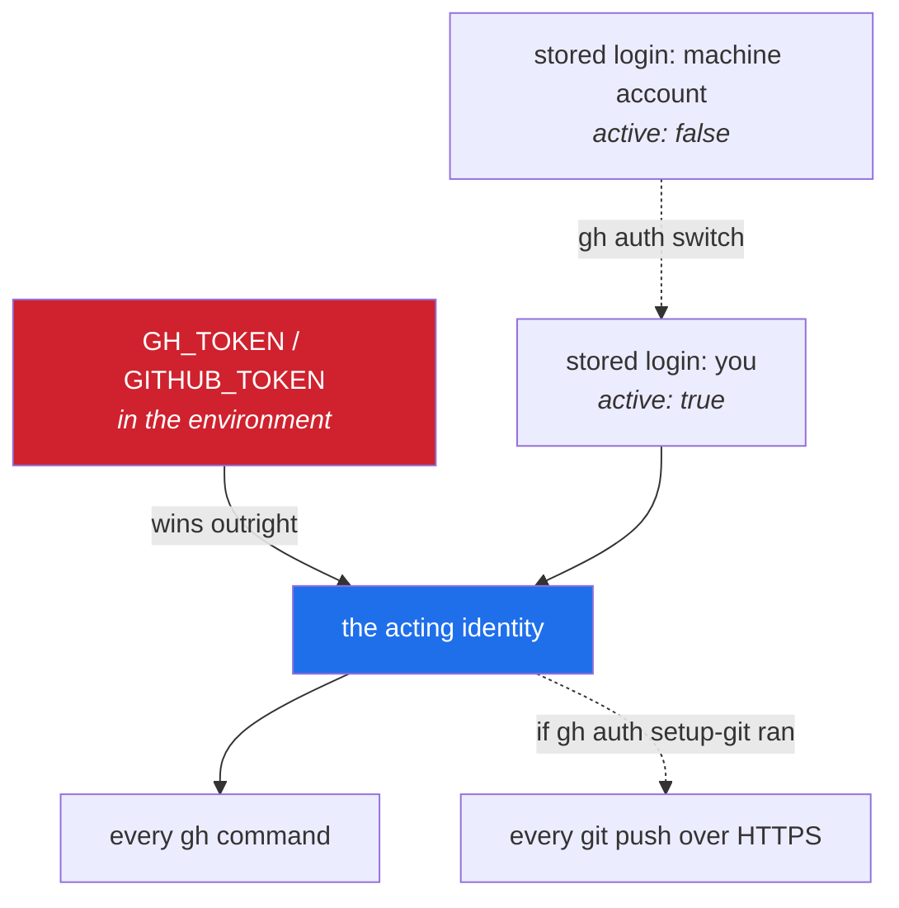

# 5.1 — `gh auth login`, and two identities in one CLI

> **One-line answer.** `gh` holds several logins at once and acts as exactly one of them, chosen by an
> "active account" setting that an environment variable can silently override — so the habit worth
> building today is checking who you are before you do anything that writes.

---

## The story

A hotel gives its night manager two passes on one lanyard.

One opens guest rooms during an emergency. The other opens the safe room behind reception. They are
the same size, the same colour, and the same shape, and the lanyard holds whichever was clipped on
last.

For a year this is fine, because the manager is careful and the two are used at different hours. Then
there is a fire alarm at four in the morning, and in the dark, half awake, with an alarm going, the
pass that gets presented is whichever one is at the front. The door does not open. Thirty seconds of
confusion in a corridor, in an emergency, for a reason that had nothing to do with the emergency.

The hotel's fix afterwards was not training. It was a red pass and a blue pass, and a habit: look at
the colour before you raise your hand.

`gh` puts two passes on one lanyard by design, and it is genuinely useful. This part is the colour and
the habit.

---

## The idea in plain language

`gh` is GitHub's own command-line program: a client for the platform, quite separate from Git. Git
moves objects; `gh` opens pull requests, reads issues, watches workflow runs, calls the API. Where Git
has no concept of an account at all, everything `gh` does is done *as somebody*.

To do that, it needs a token ([4.5](../04-auth/4.5-personal-access-tokens.md)). `gh auth login` obtains one and
stores it — in the operating system's keyring where there is one, and its own help is explicit about
the alternative: *"If a credential store is not found or there is an issue using it gh will fallback
to writing the token to a plain text file."* That is the same choice
[4.4](../04-auth/4.4-credential-helpers.md) made you look at for Git.

Three ideas make the rest of this part:

- **Several logins, one active.** `gh` can hold your account and your machine account at the same
  time. Exactly one is *active*, and every command uses that one.
- **The environment wins.** If `GH_TOKEN` or `GITHUB_TOKEN` is set, `gh` uses it and ignores the
  stored logins entirely. This is how automation authenticates, and it is the source of the most
  confusing failure in this part.
- **`gh` can lend Git its credentials.** `gh auth setup-git` registers `gh` as a Git credential
  helper, so HTTPS pushes authenticate through it — one credential, two tools.

---

## Why the build needs it

**[6.3](../06-sandbox/6.3-end-to-end-proof.md), later today**, creates a repository on GitHub and checks a
commit's signature status, both through `gh`.

**Day 3's gate** requires a push from the command line and a check that GitHub agrees with what you
did — Principle 5's three surfaces, and `gh` is one of them.

**Day 137 onward** is pull requests, where `gh pr create` and `gh pr review` are used constantly, and
where doing something as the wrong identity is visible to everyone.

**Day 203 onward** is the API, and `gh api` is the way in. The token behind it is the one you set up
here.

---

## The mechanism

### Signing in

```sh
gh auth login
```

This is interactive: it asks which host, which protocol for Git operations, whether to authenticate
Git with your GitHub credentials, and how to sign in. From the local help text, which is the same
documentation published at <https://cli.github.com/manual/gh_auth_login> (fetched 2026-08-23):

> *"The default authentication mode is a web-based browser flow. After completion, an authentication
> token will be stored securely in the system credential store. If a credential store is not found or
> there is an issue using it gh will fallback to writing the token to a plain text file. See
> `gh auth status` for its stored location."*

The flags worth knowing, from that manual page:

| Flag | What it does | When you want it |
|---|---|---|
| `-p, --git-protocol {ssh\|https}` | Which protocol Git operations use for this host | Set it to match what you chose in [4.1](../04-auth/4.1-https-or-ssh.md) |
| `-w, --web` | Browser flow with a one-time code | The normal path on a desktop |
| `--with-token` | Read a token from standard input | Scripts, and any machine without a browser |
| `-s, --scopes` | Request extra scopes at login | Rarely — [4.5](../04-auth/4.5-personal-access-tokens.md) argues for narrow |
| `--skip-ssh-key` | Do not offer to generate and upload an SSH key | When you already did that in [4.2](../04-auth/4.2-generating-an-ssh-key.md) |
| `--insecure-storage` | *"Save authentication credentials in plain text instead of credential store"* | Essentially never |

Note the interaction with [4.2](../04-auth/4.2-generating-an-ssh-key.md), described in the same help text:
choosing `ssh` as the protocol makes `gh` *"detect existing SSH keys to upload, prompting to create
and upload a new key if one is not found"*. That is a real convenience and it is why Principle 16 had
you do it by hand first — the prompt is now a thing you understand rather than a thing that happens.

For the machine account, the same command in a private browser session, or:

```sh
gh auth login --with-token < token.txt
```

**Line by line:**

- `--with-token` — read the token from standard input rather than opening a browser. The machine
  account's token is created on the website ([4.5](../04-auth/4.5-personal-access-tokens.md)) and pasted
  into a file.
- `< token.txt` — redirect a file into the command's standard input. Day 1's part 4.3 covers
  redirection.
- **Delete `token.txt` afterwards**, and be aware it was on disk. `gh auth login --with-token` reading
  from a here-string or a variable keeps it out of the filesystem entirely.

### Who am I, right now

```sh
gh auth status
```

```
github.com
  ✓ Logged in to github.com account USERNAME (keyring)
  - Active account: true
  - Git operations protocol: https
  - Token: gho_************************************
  - Token scopes: 'gist', 'read:org', 'repo'
```

*(Elided: my username.)*

**Line by line:**

- `(keyring)` — where the token is stored. This is the good answer; a file path here would mean the
  fallback described above.
- `Active account: true` — **the line this part exists for.** With two logins, one says `true` and one
  says `false`, and every `gh` command uses the `true` one.
- `Token scopes` — what this identity may do ([4.5](../04-auth/4.5-personal-access-tokens.md)).
- `gh auth status --active` restricts the output to the acting identity, which is the form to use in a
  habit or a script.

### Switching

```sh
gh auth switch
```

From the local help, matching <https://cli.github.com/manual/gh_auth_switch> (fetched 2026-08-23):

> *"If the specified host has two accounts, the active account will be switched automatically. If
> there are more than two accounts, disambiguation will be required either through the `--user` flag
> or an interactive prompt."*

```sh
gh auth switch --user priya-bot
```

**Line by line:**

- `--user` — name the identity explicitly. In a script, always: the automatic switch is convenient
  interactively and ambiguous everywhere else.
- Nothing is logged out. Both tokens remain stored; only the "active" flag moves. That is the whole
  difference between `gh auth switch` and the `logout`/`login` cycle people do instead.

### The trap: the environment outranks everything

```sh
GH_TOKEN=not-a-real-token gh auth status
```

```
github.com
  X Failed to log in to github.com using token (GH_TOKEN)
  - Active account: true
  - The token in GH_TOKEN is invalid.

  ✓ Logged in to github.com account USERNAME (keyring)
  - Active account: false
  - Git operations protocol: https
```

*(Elided: my username.)*

**Line by line:**

- `GH_TOKEN=… gh auth status` — set an environment variable for one command only. Day 1's part 3.1 is
  about that syntax and why it does not persist.
- **Read the two `Active account` lines.** The environment token is active *even though it is
  invalid*, and the perfectly good stored login is now inactive. `gh` is not confused; it is following
  the documented rule that an explicit token in the environment wins.
- This is the shape of a genuinely puzzling afternoon: a `GH_TOKEN` exported in a shell profile months
  ago, or inherited from a parent process, and every `gh` command quietly acting as somebody else — or
  failing while `gh auth status` shows a healthy login two lines below.
- The full list of variables `gh` reads is documented at
  <https://cli.github.com/manual/gh_help_environment> (fetched 2026-08-23) and includes `GH_TOKEN`,
  `GITHUB_TOKEN`, `GH_HOST`, `GH_REPO`, `GH_EDITOR`, `GH_PAGER` and `GH_CONFIG_DIR`. `GH_REPO` is
  worth knowing about for the same reason: it makes commands act on a repository other than the one
  you are standing in.

### Lending the credential to Git

```sh
gh auth setup-git
```

From the local help text:

> *"This command configures `git` to use GitHub CLI as a credential helper. […] By default, GitHub CLI
> will be set as the credential helper for all authenticated hosts."*

**Line by line:**

- It writes a `credential.helper` entry pointing at `gh`, which is the mechanism
  [4.4](../04-auth/4.4-credential-helpers.md) took apart. Git then asks `gh` for credentials, and `gh` answers
  from its own store.
- The consequence to keep in mind: **your Git pushes now follow `gh`'s active account.** Switching
  identity in `gh` silently changes who pushes. That is either exactly what you want or a
  cross-account push you did not intend, which is why the check-yourself command at the end of this
  part pairs the two questions.

### What `gh` remembers about itself

```sh
gh config list
```

```
git_protocol=https
editor=
prompt=enabled
prefer_editor_prompt=disabled
pager=
http_unix_socket=
browser=
color_labels=disabled
accessible_colors=disabled
accessible_prompter=disabled
spinner=enabled
telemetry=enabled
```

**Line by line:**

- A third configuration system, as [2.1](../02-identity/2.1-config-and-scopes.md) warned: Git's four scopes,
  GitHub's server-side settings, and this.
- `git_protocol=https` — what `gh repo clone` will use. If you chose SSH in
  [4.1](../04-auth/4.1-https-or-ssh.md), set it: `gh config set git_protocol ssh`.
- `editor=` and `pager=` are empty, meaning `gh` falls back to the environment —
  [5.2](5.2-editor-and-pager.md), next, is about those two programs and the chain that chooses them.



---

## The same thing, three ways

| Surface | Choosing which identity acts | Verdict |
|---|---|---|
| Terminal (Git) | `git config user.email` decides who is recorded as the *author*. Git has no accounts and cannot tell you who will *push* | Authorship and authorisation are different questions, and Git only answers the first. |
| github.com | The avatar in the corner. One browser session, one identity — which is why the second identity ends up in a second browser profile or a private window | Unambiguous and hard to hold two of. |
| `gh` | `gh auth status` lists every identity and marks the active one; `gh auth switch` changes it without logging anything out | **The only surface built for several identities at once**, which is exactly why the active-account line matters. |

**Which a professional reaches for:** `gh auth status --active` before anything that writes, and
separate browser profiles rather than logging in and out. The failure being avoided is public and
permanent: a pull request, an issue comment or a published repository under the wrong name is visible
to everyone and stays in the timeline even after deletion.

---

## When it breaks

**A stale or invalid token in the environment.**

```
X Failed to log in to github.com using token (GH_TOKEN)
- Active account: true
- The token in GH_TOKEN is invalid.
```

*What it means:* `GH_TOKEN` is set and is not a working token. `gh` prefers it over anything stored,
so every command fails while a healthy login sits below it in the same output.

*Smallest fix:* `unset GH_TOKEN` in this shell, and then find where it is being set — a shell profile,
a `.env` file, a parent process. Day 1's part 3.1 covers `printenv` and inheritance, which is how you
track it down.

**A command needs a scope the token does not carry.**

```
gh: This API operation needs the "admin:public_key" scope. To request it, run:  gh auth refresh -h github.com -s admin:public_key
```

*What it means:* the login succeeded; the *authorisation* did not. `gh`'s default scopes are `repo`,
`read:org` and `gist` — anything outside that needs an explicit refresh.

*Smallest fix:* run the suggested command if you genuinely need the capability;
[4.5](../04-auth/4.5-personal-access-tokens.md) argues for not adding scopes reflexively.

**Acting on the wrong repository.** No error — `gh` operates on some other repository entirely.

*What it means:* `GH_REPO` is set in the environment, or you are not standing where you think you are.
`gh` determines the repository from the current directory's remotes unless told otherwise.

*Smallest fix:* `gh repo view --json nameWithOwner` before anything destructive, and `unset GH_REPO`
if that is the cause.

---

## How to undo it

This part is rated `caution` because the token `gh` stores is a live credential, and because acting as
the wrong identity produces public artefacts that cannot be fully retracted.

Rehearse the switching in the sandbox — `./k sandbox fresh` gives you a repository with no remote, so
`gh` commands there act on nothing and cannot publish anything by accident. Practise
`gh auth status`, `gh auth switch`, and reading the active-account line until it is automatic.

### Remove one identity from this machine

```sh
gh auth logout --hostname github.com --user priya-bot
```

**Line by line:**

- `logout` — delete the stored token for that identity from this machine. Other logins are untouched.
- **This does not revoke the token on GitHub.** Revoking is Settings → Applications for an OAuth
  authorisation, or Settings → Developer settings for a token you created yourself
  ([4.5](../04-auth/4.5-personal-access-tokens.md)).
- On a lost or shared machine, `logout` is not enough. Revoke.

### Undo `gh auth setup-git`

```sh
git config --global --unset-all credential.helper
git config --show-origin --get-all credential.helper
```

**Line by line:** remove the helper entries `gh` added to your global configuration, then confirm what
remains — remembering from [4.4](../04-auth/4.4-credential-helpers.md) that unsetting a value in one scope
uncovers whatever the system file says rather than removing the behaviour.

### If you did something as the wrong identity

Order matters, and speed matters less than people think — the record is already written.

1. **Undo the artefact where you can.** Close the pull request, delete the comment, delete the
   repository if it was newly created and empty. Deletion removes it from view.
2. **Know what remains.** A pushed commit is in anyone's clone that fetched it. An issue comment
   arrives by email notification. A published repository may have been forked or indexed within
   minutes. Treat "deleted" as "no longer displayed", not as "did not happen".
3. **Fix the cause before repeating the action.** Switch identity, confirm with
   `gh auth status --active`, and only then redo the work as the right identity.
4. **If the artefact was a commit with the wrong author**, that is
   [2.2](../02-identity/2.2-identity-in-every-commit.md)'s undo section, and the same rule applies: cheap
   before anyone pulled it, coordinated afterwards.

### The already-pushed case

There is no `gh` command that unpublishes. Deleting a repository through `gh repo delete` is
irreversible and does not recall clones or forks, which is why that command requires an extra
confirmation and a token scope you probably do not have. If the mistake is public and consequential,
the honest response is to fix it forward and say what happened.

---

## In production

**Automation never runs `gh auth login`.** Inside a GitHub Actions workflow, `gh` reads `GH_TOKEN`
from the environment, and the recommended value is the run-scoped `GITHUB_TOKEN` — the local help even
gives the line: *"To use gh in GitHub Actions, add `GH_TOKEN: ${{ github.token }}` to `env`."* That is
the same precedence rule that caused the trap above, used deliberately: no stored login, no keyring,
one token that expires when the job ends. Day 161.

**Several identities on one machine is the normal professional setup.** A work account for the
employer's organisation and a personal account for everything else, with `gh auth switch` between
them, `~/.ssh/config` host aliases from [4.2](../04-auth/4.2-generating-an-ssh-key.md), and a per-directory
Git identity so commits carry the right address without thinking (Day 99). The pieces exist because
the situation is universal.

**What a senior reviewer says.** On a script that runs `gh auth login --with-token` with a token from
a secret: *"this leaves a credential in the runner's config — use `GH_TOKEN` in the environment
instead, so nothing is written to disk and it disappears with the job."* Writing a credential where
something else has to clean it up is the pattern being avoided.

**What it costs.** Nothing directly. `gh` calls the API, so it spends rate limit —
[4.5](../04-auth/4.5-personal-access-tokens.md) measured 5000 requests an hour authenticated against 60
unauthenticated. A `gh` command that loops over repositories is spending that budget, and Day 205
covers noticing before you hit the wall.

**The interview question this is really testing.** *"Your `gh` commands are acting as the wrong user.
Where do you look?"* The ordered answer: `gh auth status` to see every stored login and which is
active; then the environment, because `GH_TOKEN` or `GITHUB_TOKEN` overrides all of them; then
`GH_HOST` and `GH_REPO` for commands hitting the wrong host or repository; and finally whether
`gh auth setup-git` has tied your Git pushes to the same active account, which turns an identity
question into a push question.

---

## Check yourself

**Run this now.** Predict both answers, and whether they name the same person:

```sh
gh auth status --active && git config --get user.email
```

**Line by line:** `--active` prints only the identity `gh` will act as; `&&` runs the second command
only if the first succeeded (Day 1's part 4.2); `git config --get user.email` prints the address your
next commit will carry. One is *who acts on the platform*, the other is *who is recorded as author*.
They can disagree, and the day they do is the day this command saves you.

**Say this out loud.** Explain what `gh auth switch` changes and what it does not — and then say what
would still be wrong if you switched identities but had not changed anything in Git.

---

**Next:** [5.2 — The editor, the pager, and a diff you can actually read](5.2-editor-and-pager.md) ·
[back to the hub](../../LESSON.md)
