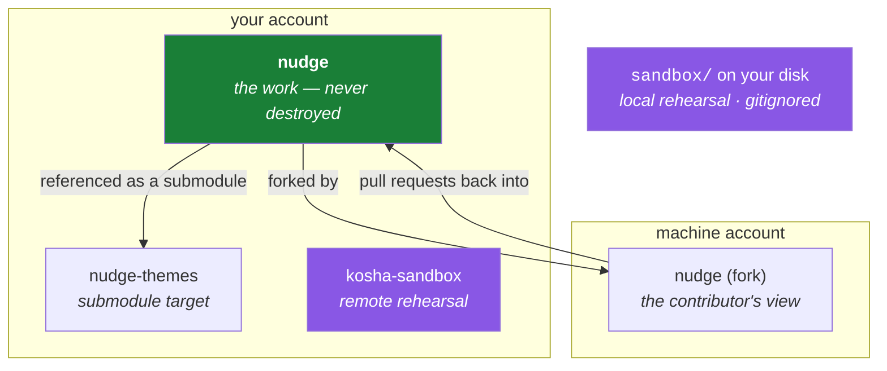

# 6.1 — The four repositories this curriculum builds

> **One-line answer.** Four repositories, each with one job — the work, the submodule target, the
> contributor's fork, and one you are actively encouraged to destroy — and knowing which is which is
> what makes every dangerous command in the next two hundred days safe to practise.

---

## The story

A kitchen has two boards.

One is for the fish. It is scored, stained, slightly warped, and nobody minds — its whole purpose is
to take the knife. The other is for bread and it is treated differently, not because it is more
expensive but because what happens on it has to stay clean.

Nobody in that kitchen thinks about this. A new cook is told once, on the first morning, and then it
is simply how the room works. The rule is not "be careful". Being careful is not a system; it fails
the moment you are tired, and the whole point of a kitchen is that it keeps working when everyone is
tired.

The rule is that there is a board for that.

Every practitioner who is relaxed about dangerous commands has the equivalent. They are not braver
than you, and they have not memorised more flags. They have somewhere the knife is allowed to land.

---

## The idea in plain language

A **repository** is a folder plus the `.git` directory beside it holding its history —
[1.1](../01-install/1.1-what-git-actually-is.md)'s definition. Nothing stops you having many, and this
curriculum uses four because each one teaches something the others cannot.

| Repository | Owner | Its one job | May I destroy it? |
|---|---|---|---|
| `nudge` | your account | The main line of work. Every feature, branch, tag and release lands here. Public from Phase 11 | **No.** This is the record of the whole curriculum |
| `nudge-themes` | your account | The submodule target: a second repository referenced *from inside* the first | No |
| `kosha-sandbox` | your account | Disposable by design. Every destructive command is rehearsed here first | **Yes. That is what it is for** |
| `nudge` (a fork) | the machine account | The contributor's view: forking, keeping a fork in sync, opening pull requests into a repository the maintainer identity does not own | Yes — it is re-forkable |

Three terms, defined on first use:

- A **fork** is a copy of a repository owned by a different account, which GitHub tracks as related to
  the original. It is the mechanism by which someone with no write access proposes a change. Day 221.
- A **submodule** is a reference from one repository to a specific commit in another, so a project can
  depend on a pinned version of something maintained separately. Day 107 covers the contract and the
  pain.
- The **sandbox** here means two things that are easy to confuse: a local directory `sandbox/`
  rebuilt by `./k sandbox` — [6.2](6.2-the-sandbox.md) — and a `kosha-sandbox` repository on GitHub
  for rehearsing things that involve a *remote*, like force-pushing. Local rehearsal for local danger;
  a real remote for remote danger.

### Why four rather than one

Each repository exists because a specific lesson is impossible without it.

**You cannot learn forks with one account.** A fork is defined by the copy being owned by somebody
else. Opening a pull request from a branch of your own repository is a different operation with
different permissions and a different review experience.

**You cannot learn submodules with one repository.** The entire subject is one repository pinning a
commit in another, and the pain — the detached HEAD inside the submodule, the pointer that moved
without the parent noticing — needs two real histories.

**You cannot learn recovery on a repository you care about.** This is the important one. Principle 3
says every destructive command is executed, watched destroying something, and then undone. That is
only true if there is somewhere the destruction does not matter, and Principle 10 says the learner's
own repositories are never the first place a dangerous command runs.



---

## Why the build needs it

**[6.2](6.2-the-sandbox.md), next**, builds the local one and shows you it being rebuilt after being
wrecked.

**Day 66's gate** turns fourteen messy commits into four reviewable ones, on `nudge`, with an
interactive rebase. Nobody should attempt that on the record of their own work without having done it
twice on something disposable.

**Day 74's gate** is "destroy and recover, five ways, from memory". It is entirely a sandbox day, and
it is the day the whole arrangement pays for itself.

**Day 81** is force pushing, which needs a *remote* to push to and rewrite — hence `kosha-sandbox`
existing on GitHub rather than only on disk.

**Day 107** is submodules, and needs `nudge-themes` to have been a real repository with real commits
for some time.

---

## The mechanism

### Creating them

You do not need all four today. Today's proof, [6.3](6.3-end-to-end-proof.md), needs `nudge`. The
others arrive on the day they are first used, which is Principle 1: a day ends in a repository that
changed, not in a repository that was prepared for later.

```sh
gh repo create nudge --public --clone
```

**Line by line:**

- `gh repo create <name>` — create a repository on GitHub, as the identity `gh` is currently acting as.
  Check that first — [5.1](../05-cli-tools/5.1-gh-auth-login.md) — because a repository created by the wrong
  account is a small public embarrassment rather than a private mistake.
- `--public` — visible to everyone. This curriculum uses public repositories deliberately: Principle
  12, because Actions minutes and most policy features are free on public repositories and are not on
  private ones.
- `--clone` — clone it locally straight after creating it, so the remote is configured for you. Day 75
  is what a remote actually is.

### Knowing which one you are standing in

The single habit this part exists to build:

```sh
git rev-parse --show-toplevel && git remote -v
```

```
C:/kosha-demo/nudge
origin	https://github.com/octocat/Hello-World.git (fetch)
origin	https://github.com/octocat/Hello-World.git (push)
```

**Line by line:**

- `git rev-parse --show-toplevel` — the root directory of the repository you are standing in,
  regardless of how deep in it you are. Day 1's part 1.2 is about why "where am I" is the question
  underneath most confusing Git output.
- `&&` — run the second command only if the first succeeded, so outside a repository you get the
  `not a git repository` error and nothing misleading after it. Day 1's part 4.2.
- `git remote -v` — where this repository pushes to. **This is the line that distinguishes the four**,
  because their working directories can look identical and their remotes never do.
- Run this before anything destructive. It takes a second and it is the entire safety procedure.

### The `sandbox/` directory is not one of the four

```sh
cat .gitignore
git check-ignore -v sandbox/fresh/reminders.md
```

```
sandbox/
nudge/
.DS_Store
*.log
.env
```
```
.gitignore:1:sandbox/	sandbox/fresh/reminders.md
```

**Line by line:**

- `.gitignore` — a list of paths this repository refuses to track. Day 20 is about its pattern rules,
  which are subtler than they look.
- `git check-ignore -v <path>` — ask *why* a path is ignored. The answer names the file, the line
  number and the pattern: line 1 of `.gitignore`, the pattern `sandbox/`.
- So `sandbox/` is inside the curriculum repository on disk and is not part of its history. It is
  disposable in the strongest sense: nothing preserves it and nothing is meant to.
- `nudge/` is ignored here too, because `nudge` is its own repository that happens to be cloned inside
  this one. Nesting one repository inside another without this line is how people accidentally commit
  a whole project into another project — a mistake Day 107's submodule work exists partly to prevent.

---

## The same thing, three ways

| Surface | Managing several repositories | Verdict |
|---|---|---|
| Terminal | `git rev-parse --show-toplevel` and `git remote -v` say which one you are in; `git -C <path> …` runs a command in another without changing directory | **The surface that answers "am I about to do this in the right place?"** — the only question that matters before a destructive command. |
| github.com | The repository list shows all four with their visibility, and a fork is labelled *"forked from …"* under its title | **Best for seeing the relationships**, especially fork-to-upstream, which is invisible from the terminal unless you look at the remotes. |
| `gh` | `gh repo list` enumerates them for the active account; `gh repo view` shows one; `gh repo create` makes one | Useful, and it lists the repositories of whichever identity is active — so a fork owned by the machine account is absent until you switch. |

**Which a professional reaches for:** `git remote -v` reflexively, because it is the fastest way to
find out whether the directory you are in is the one you meant. On a machine with a personal, a work
and a fork copy of the same project, the working directories are all called the same thing, and the
remote is the only thing that differs.

---

## When it breaks

**Running a Git command outside any repository.**

```
fatal: not a git repository (or any of the parent directories): .git
```

*What it means:* Git looked for `.git` here, walked up to the root, and found nothing.

*Smallest fix:* `cd` to the right place, or `git -C <path> <command>` to run without moving. Day 1's
part 1.2 covers the working directory properly.

**Doing the right thing in the wrong repository.** No error at all, which is what makes it costly. A
force push, a `reset --hard`, or a branch deletion runs perfectly — in the wrong place.

*Smallest fix:* the habit above, before the command. Then Phase 7 — Days 67 to 74 — is what gets it
back, and the reason the sandbox exists is that Phase 7 is much easier to learn when the practice runs
have no stakes.

**A repository nested inside another by accident.** You clone `nudge` into the curriculum repository
and forget the ignore line; `git status` in the outer repository suddenly lists hundreds of files.

*Smallest fix:* add the directory to `.gitignore`, as this repository already does. If it has already
been committed, `git rm -r --cached <dir>` removes it from tracking while leaving it on disk — Day 15
is that command, and Day 20 is why the ignore did not work on an already-tracked file.

---

## In production

**Every serious engineer has a scratch repository.** It is where a stranger's `curl | sh` gets tried,
where a rebase is rehearsed before it is done for real, and where a "does Git actually do that?"
question gets answered in thirty seconds instead of argued about. `git init /tmp/scratch` is a
professional reflex, not a beginner's crutch.

**Repository boundaries are an organisational decision with real consequences.** One repository or
many is the monorepo-versus-polyrepo question, which Days 233 and 234 take seriously in both
directions: a monorepo makes cross-cutting changes atomic and makes tooling harder; many repositories
make each one simple and make coordinated change a project. Neither is correct, and the reason it is
worth a day each is that the choice is expensive to reverse.

**Forks are not only for open source.** Inside companies they are how contractors, interns and
adjacent teams contribute without write access, and they are how a compromised account's blast radius
stays small. Phase 20 teaches both sides — contributing to a repository you do not control, and
maintaining one other people contribute to.

**What a senior reviewer says.** To somebody who has just force-pushed a shared branch: *"which
repository were you in?"* — not "why did you do that". The question assumes the command was fine and
the place was wrong, which is the usual truth.

**What it costs.** Nothing. Public repositories are free and unlimited on the plans this curriculum
uses, and a local sandbox costs a few kilobytes. Day 237 covers where storage does start to cost —
large files, LFS bandwidth and Actions artefacts.

**The interview question this is really testing.** *"How do you practise something dangerous in Git?"*
The answer people give is "carefully". The answer that lands is structural: a disposable repository
with a script that rebuilds it to a known shape, so the dangerous command is run at least once with
its consequences visible and nothing at risk — plus the recognition that a *local* sandbox cannot
rehearse anything involving a remote, which is why there is a throwaway repository on the platform
too.

---

## Check yourself

**Run this now.** Predict both lines before you press return — the directory, and where it pushes:

```sh
git rev-parse --show-toplevel && git remote -v
```

**Line by line:** the first command prints the root of the repository you are standing in; `&&` runs
the second only if the first succeeded; `git remote -v` prints the remotes with their URLs. If the
second command prints nothing, this repository has no remote — which is a perfectly good state, and
exactly what the local sandbox in [6.2](6.2-the-sandbox.md) looks like.

**Say this out loud.** Name the one repository in this curriculum you are allowed to destroy, and say
what "destroy" is allowed to mean for it. Then say what you would run, right now, before typing any
command that could destroy something.

---

**Next:** [6.2 — `./k sandbox fresh`: a repository you are allowed to ruin](6.2-the-sandbox.md) ·
[back to the hub](../../LESSON.md)
