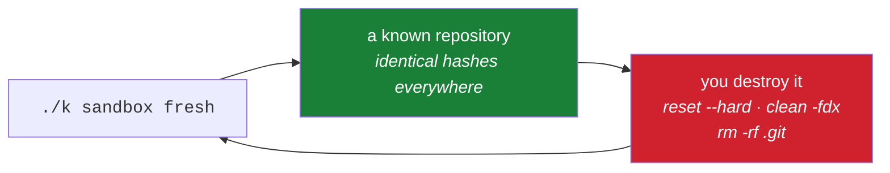

# 6.2 — `./k sandbox fresh`: a repository you are allowed to ruin

> **One-line answer.** One command builds a repository with a known shape and identical object
> addresses on every machine, so that when a lesson says "your history now looks like this", it does —
> and when you wreck it, the same command hands you a fresh one.

---

## The story

A woodworking teacher keeps a box of offcuts by the door, all the same size, all the same timber.

Every new technique starts there. Not because the offcuts are special, but because they are
*identical*: when the teacher says "you should feel it catch about halfway", everyone feels it catch
about halfway, and a student who does not knows immediately that something is wrong with their grip
rather than with the wood.

The second, quieter benefit shows up later. A student who ruins an offcut reaches for another one
without thinking about it. Ruining is what the box is for, so nothing about the ruin needs discussing
— no apology, no hesitation, no careful little movements to avoid a mistake that costs nothing.

That second benefit is the one that makes people good. The first makes lessons reproducible; the
second removes the flinch.

---

## The idea in plain language

A **sandbox** here is a repository that exists to be destroyed. It is built from a script, has no
remote, contains nothing you need, and can be recreated at any moment.

The Kosha driver, `./k`, builds one. Two properties make it more useful than `git init` in a temporary
folder:

**It has a known shape.** Recipes build specific arrangements: `fresh` is one commit on `main`;
`conflict` is a branch structure guaranteed to collide. When a part says "you have two branches that
have both changed the same line", you actually do.

**Its object addresses are identical on every machine.** The script pins the author, the committer and
the timestamps, so the resulting commits hash to the same values everywhere —
[1.1](../01-install/1.1-what-git-actually-is.md)'s content addressing, used deliberately. That means this
document can print a real SHA and you will see the same one, which is not normally true and is
genuinely useful.

One thing to keep separate, from [6.1](6.1-the-four-repositories.md): this is the **local** sandbox,
under `sandbox/` and gitignored. Anything involving a *remote* — force pushing, deleting a remote
branch, rewriting published history — needs the `kosha-sandbox` repository on GitHub instead, because
those operations have nothing to bite locally.

---

## Why the build needs it

**Principle 10** says every command that rewrites history, deletes refs or changes remote state is
first run in a throwaway repository. This is that repository, and this part is where it is built.

**Day 21** is `git clean -fdx`, which deletes untracked files permanently. It is run here first.

**Days 53 to 66** are Phase 6, rewriting history. Every one of those days opens in the sandbox.

**Day 74's gate** is "destroy and recover, five ways, from memory". That day is nothing but this
repository, wrecked five times.

**Every part of this curriculum with `sandbox: required` in its frontmatter** — including four of
today's — means this command.

---

## The mechanism

### Build it

```sh
./k sandbox fresh
```

```
sandbox: /c/Users/nisha_gnzw/OneDrive/Desktop/Projects/kosha/sandbox/fresh

* eb64f62 first reminder

reset with:  ./k sandbox fresh
```

**Line by line:**

- `./k` — the driver script at the root of this repository. The leading `./` says "the file called `k`
  in this directory" rather than "a program called `k` on the PATH" — a shell distinction Day 1's part
  1.3 explains, and a safety feature: you cannot run the wrong `k` by accident.
- `sandbox fresh` — the subcommand and the recipe name.
- The path printed is where it built; yours will differ.
- `* eb64f62 first reminder` — the log, one commit.
- `reset with: ./k sandbox fresh` — the command reminding you that it is disposable. Running it again
  deletes the directory and rebuilds it.

### The shape it builds, exactly

```sh
cd sandbox/fresh
git log --format='%H %an <%ae> %ad' --date=iso
```

```
eb64f62b266345db3074a971636f3d4e3df64da6 Sandbox <sandbox@example.invalid> 2026-01-01 09:00:00 +0000
```

**Line by line:**

- `--format='%H %an <%ae> %ad'` — full hash, author name, author email, author date. Those
  placeholders are Day 23's subject.
- `--date=iso` — a fixed, unambiguous date format rather than the locale-dependent default.
- `Sandbox <sandbox@example.invalid>` — a pinned identity, and note the domain: `.invalid` is reserved
  by specification precisely so that it can never be a real address. Nothing here can accidentally be
  attributed to a person.
- `2026-01-01 09:00:00 +0000` — a pinned timestamp. Author *and* committer dates are fixed by the
  script, which is what makes the hash reproducible: from
  [2.2](../02-identity/2.2-identity-in-every-commit.md), those bytes are inside the hash.
- **`eb64f62b266345db3074a971636f3d4e3df64da6` will be identical on your machine.** If it is not,
  something differs about your Git — a different object hash algorithm, or a different line-ending
  conversion writing `\r\n` into the blob ([2.3](../02-identity/2.3-defaults-worth-changing.md)).

Every object, and there are only three:

```sh
find .git/objects -type f | sort
for o in b9feddc5f8abeae19f45d701ab95533da96557fc \
         eac5ce747427342eff28a681c6d21523ea3e1958 \
         eb64f62b266345db3074a971636f3d4e3df64da6; do
  printf '%s %s %s\n' "$(git cat-file -t $o)" "$(git cat-file -s $o)" "$o"
done
```

```
.git/objects/b9/feddc5f8abeae19f45d701ab95533da96557fc
.git/objects/ea/c5ce747427342eff28a681c6d21523ea3e1958
.git/objects/eb/64f62b266345db3074a971636f3d4e3df64da6
```
```
blob 17 b9feddc5f8abeae19f45d701ab95533da96557fc
tree 40 eac5ce747427342eff28a681c6d21523ea3e1958
commit 181 eb64f62b266345db3074a971636f3d4e3df64da6
```

**Line by line:**

- `find .git/objects -type f` — the loose object files, one per object, named by their address split
  into a two-character directory and the remaining thirty-eight characters.
- `git cat-file -t <sha>` — the object's **type**; `-s` — its **size** in bytes.
- Three objects: a blob of seventeen bytes (`water the plants` plus a newline), a tree of forty, a
  commit of a hundred and eighty-one. **`b9feddc5…` is the blob whose address you computed by hand in
  [1.1](../01-install/1.1-what-git-actually-is.md)**, and it is the same here because the content is the same.
  That is content addressing, demonstrated across two parts of the same day.
- The whole repository's history is 238 bytes. Phase 1 — Days 4 to 12 — takes these three objects
  apart completely.

### Wreck it, then rebuild it

This is the point of the part. Do something irreversible:

```sh
git reset --hard HEAD~1
```

**Line by line:**

- `git reset --hard` — move the branch pointer and make the working tree match, discarding anything
  that does not. Day 54 teaches it properly; Principle 3 says you should see it destroy something
  before you ever need it.
- `HEAD~1` — the commit before the one you are on. Since the sandbox has exactly one commit, this
  fails — which is itself informative:

```
fatal: ambiguous argument 'HEAD~1': unknown revision or path not in the working tree.
Use '--' to separate paths from revisions, like this:
'git <command> [<revision>...] -- [<file>...]'
```

Something that does work, and destroys thoroughly:

```sh
rm -rf .git
git status
```

```
fatal: not a git repository (or any of the parent directories): .git
```

**Line by line:**

- `rm -rf .git` — delete the entire history. Not a Git command; the operating system removing a
  directory. There is no reflog for this, no recovery, nothing.
- The error is [1.1](../01-install/1.1-what-git-actually-is.md)'s: Git looked for `.git`, walked up to the
  filesystem root, and found nothing.
- **This is completely fine here, and would be a catastrophe two directories up.** That difference is
  the entire subject of [6.1](6.1-the-four-repositories.md).

```sh
cd ../.. && ./k sandbox fresh
```

```
sandbox: /c/Users/nisha_gnzw/OneDrive/Desktop/Projects/kosha/sandbox/fresh

* eb64f62 first reminder

reset with:  ./k sandbox fresh
```

**Line by line:** the same commit, the same hash, the same three objects. Nothing was recovered — it
was *rebuilt*, which is a different and much stronger guarantee, because rebuilding works no matter
what you did.

### The other recipe: a guaranteed conflict

```sh
./k sandbox conflict
```

```
sandbox: /c/Users/nisha_gnzw/OneDrive/Desktop/Projects/kosha/sandbox/conflict

* ef046c7 add an evening reminder
| * 8984d48 add a morning reminder
|/  
* 9b6700e two reminders

reset with:  ./k sandbox conflict
```

**Line by line:**

- The graph reads bottom-up: one commit, `9b6700e`, then two branches that each changed the same
  region of the same file.
- `|/` — the point where the two lines of work separate. Day 38 is an entire day on reading these
  graphs.

To actually produce the conflict, note **which branch you are on**, because it matters:

```sh
cd sandbox/conflict
git branch -v
```

```
  evening ef046c7 add an evening reminder
* main    9b6700e two reminders
  morning 8984d48 add a morning reminder
```

**Line by line:** `git branch -v` lists branches with the commit each points at, and `*` marks the one
you are on — `main`, which is the shared ancestor. Merging either branch from here does **not**
conflict, because `main` has nothing the other branch lacks:

```sh
git merge morning
```

```
Updating 9b6700e..8984d48
Fast-forward
 reminders.md | 1 +
 1 file changed, 1 insertion(+)
```

**Line by line:** a **fast-forward** — Git moved the branch pointer rather than combining anything,
because there was nothing to combine. Day 42 is about exactly this distinction. Now the second merge
has two genuinely divergent lines to reconcile:

```sh
git merge evening
```

```
Auto-merging reminders.md
CONFLICT (content): Merge conflict in reminders.md
Automatic merge failed; fix conflicts and then commit the result.
```

```sh
cat reminders.md
```

```
water the plants
<<<<<<< HEAD
stretch
=======
read
>>>>>>> evening
call the dentist
```

**Line by line:**

- `<<<<<<< HEAD` to `=======` — what your current branch says. `=======` to `>>>>>>> evening` — what
  the branch you are merging says.
- Note what Git did *not* do: it did not choose, and it did not lose either version. Phase 5 — Days 42
  to 52 — is this subject in full, and [2.3](../02-identity/2.3-defaults-worth-changing.md) set
  `merge.conflictStyle zdiff3` so that from Day 46 a third section appears showing what was there
  before either change.
- `git merge --abort` puts everything back. Try it now; then run `./k sandbox conflict` and notice
  that rebuilding is even simpler than aborting.



---

## The same thing, three ways

| Surface | Getting a disposable repository | Verdict |
|---|---|---|
| Terminal | `./k sandbox <recipe>`, or `git init` in a temporary directory for something ad hoc | **The only one that gives a reproducible shape.** A hand-built repository has different hashes every time, so a document cannot print one. |
| github.com | A throwaway repository on the platform — `kosha-sandbox` — which is what you need for anything involving a remote. Creating and deleting repositories is a few clicks, and deletion is permanent | Necessary for Day 81's force-push work and Day 88's gate. A local sandbox cannot rehearse a remote operation, because there is no remote to break. |
| `gh` | `gh repo create kosha-sandbox --public`, and `gh repo delete` to remove it — the delete needs an extra confirmation and a token scope you probably do not have, which is deliberate | Faster than the browser and correctly harder for the destructive half. |

**Which a professional reaches for:** a local scratch repository for anything that does not involve a
network, because it is instant and free, and a real throwaway repository on the platform for anything
that does. The mistake worth avoiding is rehearsing a *remote* operation locally and concluding it is
safe — a force push against a local clone teaches you nothing about what a colleague's fetch will do
afterwards.

---

## When it breaks

**The recipe does not exist.**

```
recipe "banana" has no built-in script yet.
Ask Claude Code:  /sandbox banana
```

*What it means:* `./k sandbox` builds an empty repository for an unknown recipe name and tells you the
recipe itself is not written. The built-in ones are `fresh` and `conflict`.

*Smallest fix:* use one of those, or write the recipe. `./k` is POSIX shell with no dependencies —
CLAUDE.md's rule for this repository — so adding a recipe is adding a `case` branch.

**The script is not executable.**

```
bash: ./k: Permission denied
```

*What it means:* the file exists but does not carry the executable bit, which is common immediately
after cloning on some systems.

*Smallest fix:* `chmod +x k`. Day 6 explains why Git tracks that bit at all — a tree entry records
mode `100755` for executable files and `100644` for ordinary ones, and the difference is one of the
few pieces of filesystem metadata Git stores.

**A revision that does not exist.**

```
fatal: ambiguous argument 'HEAD~1': unknown revision or path not in the working tree.
Use '--' to separate paths from revisions, like this:
'git <command> [<revision>...] -- [<file>...]'
```

*What it means:* you asked for the commit before the first commit. `HEAD~1` is a *revision
expression*, and Day 24 teaches the whole grammar. The advice about `--` is generic and unrelated
here: Git cannot tell whether `HEAD~1` was meant as a revision or a filename, so it offers the syntax
that disambiguates.

*Smallest fix:* in the `fresh` sandbox there is only one commit, so there is nothing before it. Use
the `conflict` recipe when you need history to move around in.

---

## In production

**Reproducible fixtures are how real test suites work.** A pinned author, a pinned date and therefore a
pinned hash is exactly what a Git tool's own tests do, because a test that asserts on a SHA has to
know the SHA. Git's own test suite sets `GIT_AUTHOR_DATE` and `GIT_COMMITTER_DATE` for the same
reason, and when you write a workflow that asserts on repository state in Phase 15, this is the
technique you will reach for.

**Disposable environments are the same idea, scaled.** A container that is rebuilt rather than
repaired, a preview environment created per pull request and destroyed on merge, a Codespace that is
deleted rather than tidied — Day 216 is the last of those, and the principle underneath all of them is
this part's: **rebuilding beats repairing when the build is cheap and deterministic.**

**The professional habit is a scratch repository that already exists.** Not "I'll make one when I need
it" — by the time you need it you are already halfway through something frightening. `./k sandbox
fresh` before you start reading a dangerous day, so the offcut is on the bench before the knife is in
your hand.

**What a senior reviewer says.** To somebody who has just described an alarming recovery: *"can you
reproduce it in a scratch repo? If it reproduces there, we can fix it properly; if it doesn't, we have
learned something about our repo."* Reproduction is the first step of every real diagnosis, and Day
101's `git bisect` is the industrial version of the same instinct.

**What it costs.** A few kilobytes and a fraction of a second. The three objects in the `fresh`
sandbox total 238 bytes.

**The interview question this is really testing.** *"How do you know a Git command does what you
think?"* The answer that lands is not "I read the manual" — it is "I build a repository with a known
shape, run it, and look at what changed", plus the recognition that the interesting half is what
happens when it goes wrong, which is why the sandbox is rebuilt rather than protected.

---

## Check yourself

**Run this now.** Predict the forty characters before you press return — they are printed earlier in
this part, and they should be identical on your machine:

```sh
./k sandbox fresh >/dev/null && git -C sandbox/fresh rev-parse HEAD
```

**Line by line:** `./k sandbox fresh` rebuilds the sandbox and `>/dev/null` discards its chatty output;
`&&` runs the next command only on success (Day 1's part 4.2); `git -C sandbox/fresh` runs `rev-parse`
in that directory without changing your own — the flag from [6.1](6.1-the-four-repositories.md).
The answer should be `eb64f62b266345db3074a971636f3d4e3df64da6`. If it is not, the difference is worth
chasing: your Git is hashing something differently from mine, and
[2.3](../02-identity/2.3-defaults-worth-changing.md)'s line-ending demonstration is the first place to look.

**Say this out loud.** Explain why the sandbox is *rebuilt* rather than *restored*, and what that
buys you that a backup would not.

---

**Next:** [6.3 — End to end: a signed commit from the terminal, visible on the platform](6.3-end-to-end-proof.md) ·
[back to the hub](../../LESSON.md)
