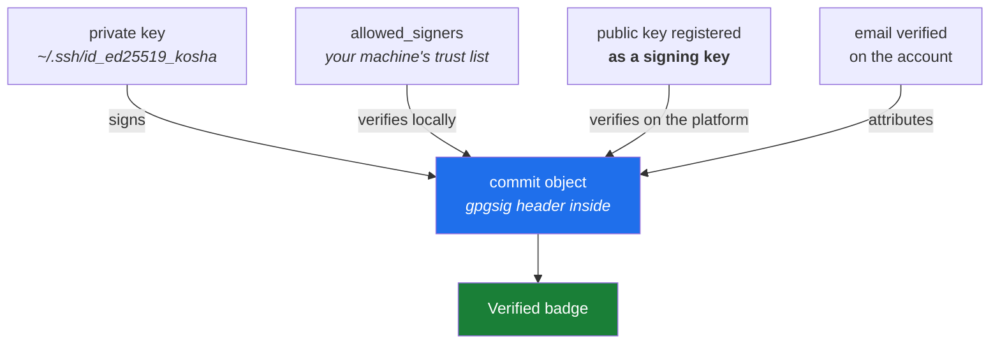

# 6.3 — End to end: a signed commit from the terminal, visible on the platform

> **One-line answer.** A signed commit carries a cryptographic proof inside the commit object itself,
> and making one verify takes *four* independent things to be true at once — which is why this is the
> day's proof, and why it fails in four distinguishable ways.

---

## The story

A gallery hangs a print and puts a small card beside it: the title, the year, and a name.

Anybody can write a card. The card is a claim, and for most of the history of prints that was
considered sufficient, because the community was small enough that a false card would be noticed by
somebody who was there.

Then prints became valuable, and cards became worth forging. So the practice changed: the artist signs
the print itself, in pencil, in the margin — the signature is part of the object rather than beside
it. And a buyer who cares does two separate things. They check that the signature is genuine. And they
check, from a source that is not the gallery, that the person who made those marks is the person the
card names.

Those are two different checks, and doing only one is how forgeries move.

Everything you have committed so far has been a card. This part signs the print, and then does both
checks.

---

## The idea in plain language

From [2.2](../02-identity/2.2-identity-in-every-commit.md): a commit's author line is text you configured, and
nobody verifies it. Anyone can commit as anyone. That is fine in a small trusted context and not fine
when a commit's authorship decides whether code ships.

**Signing** solves it by adding a cryptographic signature *inside the commit object*. The signature is
computed over the commit's own content, so it cannot be copied onto a different commit, and it can
only be produced by whoever holds the private key.

Git supports several signing formats. This curriculum uses **SSH signing**, added in Git 2.34, because
you already have an SSH key from [4.2](../04-auth/4.2-generating-an-ssh-key.md) and the alternative — GPG —
brings a key-management model that deserves its own day. Day 98 covers both properly.

Four settings, each doing a distinct job:

| Setting | What it decides |
|---|---|
| `gpg.format ssh` | Sign with an SSH key rather than GPG. The setting name says `gpg` for historical reasons |
| `user.signingkey <path-to-.pub>` | Which key signs |
| `commit.gpgsign true` | Sign every commit, rather than only when asked with `-S` |
| `gpg.ssh.allowedSignersFile` | Which keys **your machine** should believe — the local trust list |

That last one is the one nobody expects, and it is where this part earns its place. Signing and
verifying are separate capabilities: making a signature needs the private key; checking one needs a
list saying *this address is allowed to sign with this key*. Without that list your own commits
verify as nothing at all — demonstrated below.

And GitHub performs its own, completely independent check. From
<https://docs.github.com/en/authentication/managing-commit-signature-verification/telling-git-about-your-signing-key>
(fetched 2026-08-23), the configuration is the same three commands; but the platform verifies against
keys registered on *the account*, marked as **signing** keys —
[4.3](../04-auth/4.3-registering-and-testing-the-key.md)'s key-type choice, which is why that part insisted
on it.

So four things must be true, and each fails on its own:

1. Git signs the commit — needs the private key and the three settings.
2. Your machine can verify it — needs the allowed-signers file.
3. GitHub can verify it — needs the public key registered **as a signing key**.
4. GitHub attributes it to you — needs the commit's email address to be verified on your account
   ([2.2](../02-identity/2.2-identity-in-every-commit.md), [3.3](../03-accounts/3.3-noreply-and-email-privacy.md)).

---

## Why the build needs it

**This is the day's proof.** The hub's §5 is the command at the end of this part, and Day 3's gate —
a signed commit, pushed from the CLI, verified on the platform, attributed to the right identity — is
this part done unprompted.

**Day 98** makes signing routine: signing tags, verifying other people's commits, vigilant mode, and
the GPG alternative.

**Day 200** is build provenance, where an artefact is signed and traced back to the commit that
produced it. The chain of trust starts here: a signature over a commit is effectively a signature over
the whole history leading to it, because of the content addressing in
[1.1](../01-install/1.1-what-git-actually-is.md).

**Day 191 onward** is Phase 17, where "who wrote this" stops being an administrative question and
becomes a security control.

---

## The mechanism

Do this in the sandbox first — `./k sandbox fresh` — and then repeat it in `nudge`, which is the day's
actual deliverable.

### Configure signing

```sh
git config --global gpg.format ssh
git config --global user.signingkey ~/.ssh/id_ed25519_kosha.pub
git config --global commit.gpgsign true
```

**Line by line:**

- `gpg.format ssh` — use the SSH signing implementation. Needs Git 2.34 or newer
  ([1.2](../01-install/1.2-installing-git.md) has the version table); on an older Git this setting is accepted
  and does nothing useful, which is the silent-failure case that part warned about.
- `user.signingkey` — **point at the `.pub` file**, the public half. That looks wrong and is not: Git
  uses the public key to identify which private key to sign with, handing the actual signing to
  `ssh-keygen` or the agent.
- `commit.gpgsign true` — sign every commit. Without it you would add `-S` to each `git commit`, and
  the commits you forgot would be the interesting ones.
- All three are `--global`, so every repository signs. [2.1](../02-identity/2.1-config-and-scopes.md) is the
  scope choice; Day 99 shows how to sign only in some directories.

### Sign a commit, and watch verification fail

```sh
git commit -qm "first reminder"
git log --show-signature -1
```

```
error: gpg.ssh.allowedSignersFile needs to be configured and exist for ssh signature verification
commit 64ed703af7b5ff7f00ec653fa5ed0d7b2afd700a
No signature
Author: Priya Raman <priya@example.com>
Date:   Sun Aug 23 16:51:50 2026 +0530

    first reminder
```

**Line by line:**

- `--show-signature` — verify the signature and print the result above the commit.
- **The commit was signed.** The signature is in the object; the next block proves it. What failed is
  *verification*, and the error says exactly why: there is no allowed-signers file.
- `No signature` is therefore misleading, and worth remembering — Git is reporting "I have no
  verifiable signature", not "this commit is unsigned". Those are different states and they look the
  same here.

The signature really is in the object:

```sh
git cat-file -p HEAD
```

```
tree eac5ce747427342eff28a681c6d21523ea3e1958
author Priya Raman <priya@example.com> 1787484110 +0530
committer Priya Raman <priya@example.com> 1787484110 +0530
gpgsig -----BEGIN SSH SIGNATURE-----
 U1NIU0lHAAAAAQAAADMAAAALc3NoLWVkMjU1MTkAAAAgxCloH67p4ljamGvReKanmPE7io
 RMfvDU+z9qqDmEW88AAAADZ2l0AAAAAAAAAAZzaGE1MTIAAABTAAAAC3NzaC1lZDI1NTE5
 AAAAQBdZgBntbG0ezgTqj/ElCOLDMIN+ELGp43C11Ks4HWtSKUYVeg280TeCi3dz9H9LoJ
 DQfM1dKJYo7qGqPJ8e7gY=
 -----END SSH SIGNATURE-----

first reminder
```

**Line by line:**

- `git cat-file -p HEAD` — the commit object itself, as in [1.1](../01-install/1.1-what-git-actually-is.md).
- `gpgsig` — a header holding the signature, continuation lines indented by one space. Compare against
  the unsigned commit in [1.1](../01-install/1.1-what-git-actually-is.md): same structure, one extra header.
- **The signature is part of the object, so it is part of the hash.** You cannot strip a signature and
  keep the commit; removing it produces a different commit with a different address. That is why a
  signature over a commit implies the whole history behind it.
- Note the tree: `eac5ce74…`, the same tree as the sandbox's unsigned commit, because the *content* is
  identical. Only the commit object differs.

### Tell your machine whose keys to believe

```sh
printf 'priya@example.com %s\n' "$(cut -d' ' -f1-2 ~/.ssh/id_ed25519_kosha.pub)" > ~/.ssh/allowed_signers
cat ~/.ssh/allowed_signers
git config --global gpg.ssh.allowedSignersFile ~/.ssh/allowed_signers
```

```
priya@example.com ssh-ed25519 AAAAC3NzaC1lZDI1NTE5AAAAIMQpaB+u6eJY2phr0Ximp5jxO4qETH7w1Ps/aqg5hFvP
```

**Line by line:**

- The format is `<identity> <keytype> <key>` — an email address, then the public key with its comment
  removed.
- `cut -d' ' -f1-2` — take the first two space-separated fields of the `.pub` file, dropping the
  comment. Leaving the comment in is the most common reason this file silently does not match.
- `>` — write to the file, replacing it. Use `>>` to append when adding a colleague. Day 1's part 4.3
  covers redirection.
- `gpg.ssh.allowedSignersFile` — where Git looks. **This file is a local trust decision**: it says
  which addresses you are willing to believe, signed by which keys. It is not sent anywhere and GitHub
  does not use it.

### Verify again

```sh
git log --show-signature -1
```

```
commit 64ed703af7b5ff7f00ec653fa5ed0d7b2afd700a
Good "git" signature for priya@example.com with ED25519 key SHA256:KIgkqx7Jvzd2DC5eZUAy2p7MAzFjPlkdSkFGiaW9S60
Author: Priya Raman <priya@example.com>
Date:   Sun Aug 23 16:51:50 2026 +0530

    first reminder
```

**Line by line:**

- `Good "git" signature` — the signature verified. `"git"` is the *namespace*: SSH signatures are
  scoped to a purpose so that a signature made for Git cannot be replayed as, say, an authentication.
- `for priya@example.com` — the identity from the allowed-signers file, matched against the commit's
  author address.
- `with ED25519 key SHA256:KIgkqx…` — the fingerprint of the key that signed, comparable against
  `ssh-keygen -lf` and against what GitHub lists ([4.3](../04-auth/4.3-registering-and-testing-the-key.md)).
- Same commit hash as before. Nothing was re-signed; only your machine's ability to check it changed.

### Signed and unsigned, side by side

```sh
git commit -qam "second reminder" --no-gpg-sign
git log --format='%h %G? %GS %s' -2
```

```
a56f711 N  second reminder
64ed703 G priya@example.com first reminder
```

**Line by line:**

- `--no-gpg-sign` — do not sign this one, overriding `commit.gpgsign`. Useful for demonstrating, and
  for the rare commit made on a machine without the key.
- `%G?` — the verification status in one character: `G` good, `B` bad, `U` good with unknown validity,
  `N` no signature, `E` cannot be checked. The `N` line has an empty `%GS` because there is no signer.
- `%GS` — the signer's identity.
- **This format is how you audit a branch.** `git log --format='%G? %h %s' main..feature` shows at a
  glance whether every commit in a proposed change is signed, which is Day 152's review work and
  Day 202's gate.

And the machine-readable version, for a script or a hook:

```sh
git verify-commit HEAD~1
git verify-commit HEAD
```

```
Good "git" signature for priya@example.com with ED25519 key SHA256:KIgkqx7Jvzd2DC5eZUAy2p7MAzFjPlkdSkFGiaW9S60
```

**Line by line:**

- `git verify-commit <commit>` — verify and exit `0` if good. The first call printed the result to
  standard error and exited `0`; the second, on the unsigned commit, printed nothing and exited `1`.
- That exit code is the point: `git verify-commit HEAD || echo "unsigned"` is a one-line check in a
  hook. Day 1's part 4.1 is exit codes, and Day 96 is the pre-push hook that uses them.

### Register the key with GitHub — as a *signing* key

Local verification is now working, and GitHub still knows nothing. From
[4.3](../04-auth/4.3-registering-and-testing-the-key.md): the settings page offers a **Key type** of
*authentication* or *signing*, and they are independent. Add the same public key a second time with
the type set to **signing**, or:

```sh
gh ssh-key add ~/.ssh/id_ed25519_kosha.pub --type signing --title "kosha signing"
```

**Line by line:**

- `--type signing` — the documented value, from
  <https://docs.github.com/en/authentication/connecting-to-github-with-ssh/adding-a-new-ssh-key-to-your-github-account>,
  fetched 2026-08-23.
- Needs the `admin:public_key` scope ([4.5](../04-auth/4.5-personal-access-tokens.md)); the browser needs no
  scope at all.
- **A key registered only for authentication will push fine and show every commit as Unverified.**
  That is the single most common cause of "I set up signing and GitHub disagrees".

### Push, and check the platform's answer

```sh
gh repo create nudge --public --source=. --push
git push
```

**Line by line:**

- `gh repo create --source=. --push` — create the repository from the current directory and push it,
  in one command. Check `gh auth status --active` first ([5.1](../05-cli-tools/5.1-gh-auth-login.md)): this
  publishes under whichever identity is active.
- Then confirm on the commit's page on github.com, where a verified commit carries a **Verified**
  badge. From
  <https://docs.github.com/en/authentication/managing-commit-signature-verification/about-commit-signature-verification>
  (fetched 2026-08-23), the statuses are **Verified**, **Partially verified** and **Unverified**, and
  the same page describes **vigilant mode**, which marks *all* your unsigned commits as Unverified so
  that a missing signature is visible rather than invisible. Day 98 turns it on deliberately.



---

## The same thing, three ways

| Surface | Proving who made a commit | Verdict |
|---|---|---|
| Terminal | `git log --show-signature`, `git log --format='%G? %GS'` for a whole branch, `git verify-commit` for an exit code | **The only surface that verifies against *your* trust list.** GitHub's answer tells you what GitHub believes; this tells you what you can check yourself. |
| github.com | The **Verified** badge on a commit, with a hover explaining why; the signing keys list in settings; vigilant mode | **The surface everybody else sees** — and the one that catches the registration mistakes, because it verifies against the account rather than your disk. |
| `gh` | `gh api repos/{owner}/{repo}/commits/{sha} --jq .commit.verification` returns the platform's verdict as JSON: `verified`, `reason`, and the payload | The scriptable form of the badge, and what you would use in a check that refuses to release from an unsigned commit (Day 200). |

**Which a professional reaches for:** the badge, day to day, because it is where a reviewer's eye
already is. The terminal when something disagrees — and the reason to know both is that they can
legitimately differ: a commit can be locally verified and Unverified on GitHub, and that difference
tells you precisely which of the four requirements is missing.

---

## When it breaks

**Signed, but the machine cannot check it.**

```
error: gpg.ssh.allowedSignersFile needs to be configured and exist for ssh signature verification
```

*What it means:* Git has no local trust list, so it cannot say whether the signature is one it should
believe. The commit *is* signed. Note the wording: "and exist" — the setting can point at a file that
is not there, and the message is the same.

*Smallest fix:* create the file and set the option, as above. Check the path is right with
`git config --get gpg.ssh.allowedSignersFile` and `ls -l` on the result.

**Verified locally, Unverified on GitHub.** No error text; a grey badge.

*What it means:* one of the two platform requirements is missing — the key is not registered **as a
signing key**, or the commit's email address is not verified on the account.

*Smallest fix:* check the signing-keys list in settings first, because it is the more common of the
two, then the Emails page. [3.3](../03-accounts/3.3-noreply-and-email-privacy.md) covers the address, and note
that a noreply address works for this as long as it is the one GitHub issued you.

**The key is not available to sign with.**

```
error: Load key "/c/kosha-demo/home/.ssh/id_ed25519_kosha.copy": incorrect passphrase supplied to decrypt private key
fatal: failed to write commit object
```

*What it means:* the private key is encrypted and the agent could not supply it —
[4.2](../04-auth/4.2-generating-an-ssh-key.md)'s agent section. The commit was **not** made; nothing is
lost, and your staged changes are untouched. *(The first line is reproduced from `ssh-keygen`
directly; `TODO(verify)` the exact second line on a machine with a passphrase-protected signing key.)*

*Smallest fix:* `ssh-add ~/.ssh/id_ed25519_kosha`, enter the passphrase once, and commit again.

**Signing configured on a Git older than 2.34.** No error, and no signature. The settings are accepted
and ignored.

*Smallest fix:* `git --version` and the table in [1.2](../01-install/1.2-installing-git.md). This is the
version-skew failure that part described: silence rather than an error, and a wrong result.

---

## In production

**Signing is a policy, not a personal habit.** Organisations turn on a ruleset requiring signed commits
on protected branches, and the push is rejected when a commit is not signed. That turns "I remember to
sign" into "the branch cannot contain an unsigned commit", which is the only version that survives
contact with a busy week. Day 143 configures that rule and Day 202's gate depends on it.

**What signing does and does not prove.** It proves that whoever holds the private key made the commit
object. It does not prove the person is trustworthy, that the code is good, or that the key has not
been stolen — and, importantly, it does not prove *when* the commit was made, because the timestamp is
part of the signed payload and the signer chose it. Day 200's provenance work adds the missing pieces:
an attestation produced by a build system that nobody could have run locally.

**Rebases and cherry-picks discard signatures.** A rebase produces new commit objects, and a new object
has no signature unless the rebase re-signs — `git rebase --exec 'git commit --amend --no-edit -S'`,
or `rebase.gpgSign` set. On a repository with a signed-commits rule, the person who rebases their
branch and then cannot push has met this, and Days 58 and 65 are where it is explained rather than
worked around.

**Bots sign too, and differently.** Commits made through GitHub's web interface or API are signed by
GitHub's own key, which is why a merge made in the browser shows Verified while the same merge done
locally may not. That is worth knowing before you conclude something suspicious is happening — and it
is the mechanism behind Day 187's release automation, where a bot's commits are verifiable because the
platform signs them.

**What a senior reviewer says.** On a pull request where three of eight commits are signed: *"either
sign the branch or don't — a partially signed history is worse than an unsigned one, because it
implies a guarantee that isn't there."* The check they ran to notice is
`git log --format='%G? %h %s' origin/main..HEAD`, which is the format string from this part.

**What it costs.** Nothing in money. In time: one command per machine, and the passphrase prompt once
per session. In friction: rebases need re-signing, which is a real cost and the main argument people
make against requiring signatures.

**The interview question this is really testing.** *"Your commits show as Unverified on GitHub even
though you set up signing. Debug it."* The strong answer separates the layers rather than guessing:
`git cat-file -p HEAD` to see whether a `gpgsig` header exists at all — that separates "not signed"
from "not verified"; `git log --show-signature` for local verification, which needs the allowed-signers
file; then GitHub's side, where the key must be registered *as a signing key* and the commit's email
must be verified on the account. Four requirements, four distinct failures, and naming them in order
is the answer.

---

## Check yourself

**Run this now**, in the repository where you have just committed. Predict the two characters in the
second column before you press return:

```sh
git log --format='%h %G? %GS %s' -3
```

**Line by line:** `%h` is the abbreviated hash, `%G?` the signature status in one character — `G` for
good, `N` for none — `%GS` the signer, and `%s` the subject. Every commit made after you set
`commit.gpgsign true` should read `G`; everything before it reads `N`. If a commit you expected to be
signed reads `N`, `git cat-file -p <sha>` tells you immediately whether the signature is missing or
merely unverifiable.

**Say this out loud.** Explain why a commit can be "Good signature" on your laptop and "Unverified" on
GitHub at the same moment, without either being wrong — and name the two account-side facts that close
the gap.

---

**Previous:** [6.2 — `./k sandbox fresh`: a repository you are allowed to ruin](6.2-the-sandbox.md) ·
[back to the hub](../../LESSON.md)
