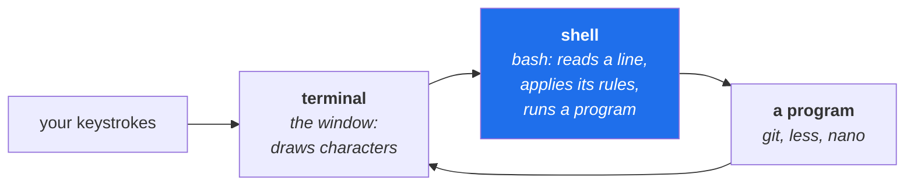

# 1.1 — What a terminal, a shell and a prompt actually are

> **One-line answer.** The window, the program reading what you type, and the characters it prints
> before your cursor are three separate things — and every confusing thing that happens in the next
> two hundred and fifty days is easier once you know which of the three is talking to you.

---

## The story

Someone is given directions over the telephone.

*"Go to the third door on the left, and ask for the blue folder."*

They get to the corridor and the third door on the left is a cupboard. Not because the directions were
wrong — the directions were for the second floor, and the caller assumed that was obvious, because the
caller was standing on the second floor when they said it.

Neither person has made an error you could point at. The information was correct and incomplete in a
way neither of them could see, because "where you are" was never said out loud by either party. It was
assumed to be shared, and it was not.

Almost every early bad afternoon with this subject is that phone call. The instructions were right.
The room was different. And the terminal, unlike the caller, will not notice and will not object: it
will carry out the instruction perfectly, in the cupboard.

---

## The idea in plain language

Three things are involved when you "use the terminal", and people use the words interchangeably until
the day the distinction matters.

**The terminal** is the window. Its job is to draw characters on the screen and send your keystrokes
somewhere. It knows nothing about commands, files or Git. On Windows, Git Bash's window is a terminal;
so are the Terminal app on macOS and every terminal emulator on Linux. Changing the terminal changes
the colours and the fonts and nothing about how commands behave.

**The shell** is the program running *inside* that window. Its job is to read a line of text, work out
what you meant, run the right program, and show you the output. `bash`, `zsh`, `sh`, `fish` and
PowerShell are shells. **The shell is the thing that has rules** — about quoting, about the `*`
character, about what `~` means — and those rules run before Git ever sees your words. Sections 02 and
03 of this day are about those rules.

**The prompt** is what the shell prints when it is ready for a line. Something like `$`, or a long
coloured thing with a folder name and a branch in it. It is decoration you can change, and its only
job is to tell you the shell is waiting. The important part is not what it says; it is what it
*means*: **the shell is idle, and anything you type now is for the shell.**

The distinction earns its keep the moment something else takes over the screen. When Git opens an
editor ([3.2](../03-child-processes/3.2-the-editor-chain.md)) or a pager ([3.3](../03-child-processes/3.3-the-pager.md)), the shell is
not reading your keystrokes any more — another program is. Every "my terminal is frozen" is really
"something other than the shell has the keyboard, and I do not know which thing".



Two more terms, because they turn up immediately:

- A **command** is a line you type. Its first word names the program; the rest are **arguments**
  handed to that program.
- A **builtin** is a command the shell performs itself rather than launching a program — `cd` is one,
  and [1.2](1.2-the-working-directory.md) explains why it has to be.

---

## Why the build needs it

**Day 0's parts assumed a working terminal.** This day is where that assumption is paid for — the
plan's Part 2 says Day 1 exists to close the terminal gap, because every later day depends on it and
most Git material silently assumes it.

**[3.2](../03-child-processes/3.2-the-editor-chain.md), later today**, explains the screen that appears when Git wants
a commit message — and the explanation only lands if you already know that the shell has stopped
reading your keys.

**Day 96** writes Git hooks, which are shell scripts Git executes. A hook is a file the *shell*
interprets, so everything in this day's Sections 02 and 04 is directly the material of that day.

**Day 153 onward** is GitHub Actions, where every `run:` step is a shell script executed on a machine
you cannot see. The commonest cause of a mysterious pipeline failure is a shell rule that behaved
differently there — a different shell, a different working directory, a different environment.

---

## The mechanism

### Which shell are you actually running?

```sh
echo "$SHELL"
echo "bash version: $BASH_VERSION"
```

```
/bin/bash.exe
bash version: 5.3.9(1)-release
```

**Line by line:**

- `echo` — print its arguments. The most boring command on the machine and the one you will use most
  while learning what the shell does to your words.
- `"$SHELL"` — the value of the environment variable `SHELL`, which records your *login* shell.
  [3.1](../03-child-processes/3.1-environment-variables.md) explains environment variables properly. The quotes are
  not decoration: [2.2](../02-quoting/2.2-quoting.md) shows what happens without them when a value contains a
  space.
- `.exe` gives away that this is Windows, where Git Bash provides a POSIX-style shell on a system that
  has none natively — [1.4](1.4-two-spellings-of-a-path.md) is about the consequences.
- `$BASH_VERSION` — set only by `bash`. **If this prints nothing, you are not in bash**, and some
  syntax in this curriculum will behave differently. On macOS the default is `zsh`, which is close
  enough for everything here; PowerShell is genuinely different and Git Bash is the recommended
  environment on Windows.

Note the difference between "which shell am I logged in as" and "which shell is running right now" —
they can differ, because a shell can start another shell. `echo $0` prints the name of the shell
currently executing, which is the honest answer for a script.

### What the shell does with a line

The whole of Sections 02 and 03 is detail on this sequence, so it is worth seeing whole, once:

1. **Read** the line you typed, up to the return.
2. **Split** it into words at spaces — [2.1](../02-quoting/2.1-the-line-becomes-words.md).
3. **Expand** things: `~` becomes your home directory, `$NAME` becomes a value, `*.md` becomes a list
   of filenames — [2.2](../02-quoting/2.2-quoting.md) and [2.3](../02-quoting/2.3-globs-and-pathspecs.md).
4. **Find** the program named by the first word, on the PATH — Day 0's part
   [1.2](../../../day-00-foundry/parts/01-install/1.2-installing-git.md).
5. **Run** it, handing it the remaining words as arguments.
6. **Wait**, then collect its **exit code** — Section 04.

Git is step five. Everything above it has already happened, invisibly, and *that* is why a command can
fail in a way that has nothing to do with Git:

```sh
git commit -m add a reminder
```

```
error: pathspec 'a' did not match any file(s) known to git
error: pathspec 'reminder' did not match any file(s) known to git
```

**Line by line:**

- The shell split the line into six words and handed Git five arguments: `commit`, `-m`, `add`, `a`,
  `reminder`.
- Git read `-m add` — so the commit message is the single word `add` — and then treated `a` and
  `reminder` as file paths, because that is what `git commit` expects after its options.
- **Nothing malfunctioned.** Both programs did exactly what they are specified to do. The error is
  about `pathspec` because Git is describing its own model, not because Git misunderstood you.
- [2.1](../02-quoting/2.1-the-line-becomes-words.md) is this failure in full, with the fix.

### What the prompt is

The prompt is a string the shell prints, and you can prove it is only a string:

```sh
echo "PS2=[$PS2]"
```

```
PS2=[]
```

**Line by line:**

- `PS1` is the main prompt; `PS2` is the **continuation** prompt, printed when the shell has read a
  line and decided your command is not finished — usually because a quote is open
  ([2.2](../02-quoting/2.2-quoting.md)).
- Here `PS2` is empty because this shell was started non-interactively for capture; in your
  interactive shell it is normally `>`. **That `>` is the most misread character in this subject**: a
  line starting with `>` and no output means the shell is still waiting for you to close a quote, not
  that a command is running.
- If that happens: press `Ctrl-C` to abandon the line and get a fresh prompt.

### The three keystrokes worth knowing before anything else

| Keys | What it does | When |
|---|---|---|
| `Ctrl-C` | Interrupt: abandon the current line, or ask the running program to stop | Stuck at a continuation prompt; a command running longer than you meant |
| `Ctrl-D` | End of input: tells a program reading input that there is no more | A command waiting for text; typing it at a prompt ends the shell |
| `q` | Not a shell key at all — it quits the **pager** | The screen filled with output and the prompt did not come back ([3.3](../03-child-processes/3.3-the-pager.md)) |

The reason `q` is in a table of shell keys is that people reach for `Ctrl-C` when the pager has the
screen, and `Ctrl-C` frequently does nothing there. Knowing *which program has the keyboard* is the
skill; the table is just its consequence.

---

## The same thing, three ways

| Surface | Where you type things | Verdict |
|---|---|---|
| Terminal | A shell reading lines, applying its own rules, launching programs | **The only surface with a shell**, and therefore the only one where quoting, globs and exit codes exist at all. Everything in this day is about that. |
| github.com | A web interface: forms, buttons and text areas. No shell, no quoting rules, no exit codes — a field with a space in it is simply a field with a space in it | The absence is the lesson: half of this day's difficulties are *shell* difficulties, not Git ones, and they vanish in a browser along with the ability to script anything. |
| `gh` | A program you run *from* the shell, so every rule in this day applies to it identically — `gh issue create --title "two words"` needs the quotes for the same reason `git commit -m` does | Worth noticing: `gh` feels like the website and behaves like a command, because the shell processes your line before `gh` ever sees it. |

**Which a professional reaches for:** the terminal for anything they might do twice, the browser for
anything they will do once and want to look at. The reason the terminal wins on repetition is exactly
the machinery in this day — output that can be piped, exit codes that can be tested, and commands that
can be put in a file and re-run.

---

## When it breaks

**The command does not exist.**

```
bash: line 1: git: command not found
```

*What it means:* the **shell** is speaking, not Git. It searched the PATH and found nothing called
`git`. Reading the first word of an error message — `bash:` — tells you which of the three things in
this part is complaining, and that single habit resolves an enormous number of confusing sessions.

*Smallest fix:* Day 0's part
[1.2](../../../day-00-foundry/parts/01-install/1.2-installing-git.md) covers installation and PATH. If Git was
installed after this terminal was opened, open a new terminal — the shell holds the PATH it was given
at start-up.

**The line never finishes.** You press return and get a `>` with no output.

*What it means:* the shell has read your line, found an unclosed quote, and is waiting for the rest.
Nothing has run. Everything you type now is being appended to the same command.

*Smallest fix:* `Ctrl-C`, then retype with the quote closed. [2.2](../02-quoting/2.2-quoting.md) is the part
about that, including what the error looks like when a script hits the end of the file instead:

```
bash: -c: line 1: unexpected EOF while looking for matching `"'
```

**The screen fills and the prompt does not come back.** No error text at all.

*What it means:* a pager has the screen. Git launched it because the output was longer than the
window, and the shell is not reading your keys.

*Smallest fix:* `q`. [3.3](../03-child-processes/3.3-the-pager.md) is the part about it, and it is worth doing on
purpose once so the state is familiar rather than alarming.

---

## In production

**Every continuous-integration job is a shell script somebody wrote quickly.** A GitHub Actions `run:`
step is handed to a shell on the runner — `bash` on Linux and macOS, PowerShell on Windows by default.
Day 156 covers the `shell:` key that makes the choice explicit, and it matters because a workflow that
works on one runner and fails on another is usually a shell difference rather than a Git one.

**Interactive and non-interactive shells behave differently on purpose.** A non-interactive shell reads
no prompt configuration, and a program that detects it is not attached to a terminal changes behaviour
— Git pages only when its output is a terminal ([3.3](../03-child-processes/3.3-the-pager.md)), and colours output only
when it is. This is why a command's output in a pipeline can look nothing like the same command on
your laptop, and why `--no-pager` and `--color=always` exist.

**Shell literacy is what separates a person who *uses* Git from a person who *automates* it.** The
hooks of Day 96, the `bisect run` script of Day 102, and every workflow in Phases 14 and 15 are shell
programs. None of them are hard, and all of them assume the material in this day.

**What a senior reviewer says.** On a workflow step that fails only sometimes: *"this depends on the
shell's word splitting — quote the variable."* It is one of the most common review comments on
pipeline code, and [2.2](../02-quoting/2.2-quoting.md) is why.

**What it costs.** Nothing. The shell is already running.

**The interview question this is really testing.** *"What happens between pressing return and the
program starting?"* A weak answer is "it runs the command". A strong one names the sequence: the shell
reads the line, splits it into words, performs expansions — tilde, variables, globs — resolves the
first word against the PATH, runs the program with the remaining words as arguments, waits, and
collects an exit code. Every question in Sections 02 and 04 of this day is a detail of that sentence.

---

## Check yourself

**Run this now.** Predict both lines before you press return — and in particular predict whether the
second one will print anything at all:

```sh
echo "$SHELL" && echo "bash version: $BASH_VERSION"
```

**Line by line:** the first prints your login shell; the second prints a version only if the shell
running right now is `bash`. `&&` runs the second only if the first succeeded, which is
[4.2](../04-exit-and-streams/4.2-chaining-commands.md). If the second line comes back empty, find out what you are
running with `echo $0` — it changes nothing today and it will matter on Day 96.

**Say this out loud.** A colleague says "my terminal is frozen". Name the three different things that
could have the keyboard, and give the one question you would ask to tell them apart.

---

**Next:** [1.2 — The working directory: `pwd`, `cd`, and why every Git command depends on it](1.2-the-working-directory.md) ·
[back to the hub](../../LESSON.md)
