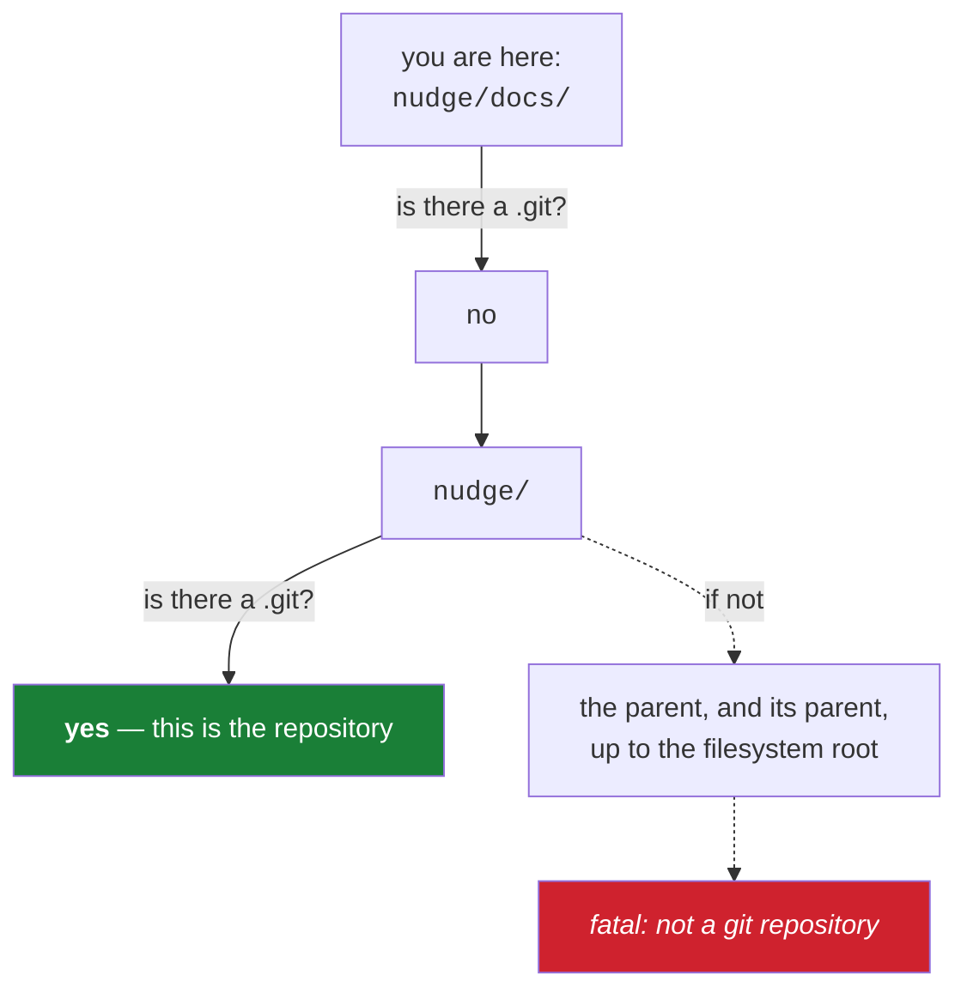

# 1.2 — The working directory: `pwd`, `cd`, and why every Git command depends on it

> **One-line answer.** Every command runs *somewhere*, that somewhere is a single directory the shell
> remembers for you, and Git finds its repository by starting there and walking upwards — which is why
> "where am I" is the first question of nearly every confusing Git session.

---

## The story

A hospital porter is asked to take a trolley to Room 4.

There is a Room 4 on this floor. There is also a Room 4 two floors up, and one in the older wing that
was renumbered in 2011 and is still called Room 4 by everybody who worked there before the
renumbering.

The porter is not confused, and does not ask. There is a Room 4 right here; the instruction is
unambiguous from where they are standing. The trolley arrives at a Room 4 within ninety seconds, and
it is the wrong one, and nobody finds out for an hour.

The building's fix was not better instructions. It was a sign at every lift saying which floor you are
on, at eye height, where you cannot avoid reading it — because the failure was never about following
instructions. It was about knowing where you were when you followed them.

---

## The idea in plain language

Every running program has a **working directory**: one directory that it treats as "here". When you
give a command a filename with no directory in front of it, that name is resolved relative to the
working directory.

Your shell has one. It remembers it between commands, which is why you can `cd` once and then run ten
commands that all act in the same place. When the shell launches a program — Git, for instance — the
new program **inherits** the shell's working directory, which is why `git status` acts on the
repository you are standing in rather than asking which one you meant.

Three commands, and one of them is not what it looks like:

- `pwd` — **p**rint **w**orking **d**irectory. It answers "where am I".
- `cd` — **c**hange **d**irectory. It moves you.
- `ls` — list what is here.

`cd` is a **shell builtin**, not a program, and it has to be. A program runs as a separate process
with its own working directory, and changing your own working directory has no effect on the process
that started you. If `cd` were a program it would move itself and exit, leaving the shell exactly
where it was. This is not a quirk; it is the same rule that makes
[3.1](../03-child-processes/3.1-environment-variables.md)'s `eval "$(ssh-agent -s)"` look so strange.

### How Git finds its repository

This is the mechanism that makes the working directory matter more in Git than in most tools. When you
run a Git command, Git:

1. looks in the working directory for a `.git` directory;
2. if it does not find one, moves to the parent directory and looks again;
3. repeats until it finds one, or reaches the root of the filesystem and fails.

So Git works from any depth inside a repository, and fails everywhere outside one. Both halves of that
sentence produce a distinctive symptom, and both are in **When it breaks**.



---

## Why the build needs it

**Day 15** is `git add` with pathspecs, where the same command means different things depending on
which directory you run it from — `git add .` in a subdirectory stages that subdirectory only.

**Day 20** is `.gitignore`, whose patterns are interpreted relative to the file's own directory. Not
knowing where you are makes those rules unlearnable.

**Day 40** checks out several branches at once as worktrees — several directories, one repository. The
working directory stops being a convenience there and becomes the thing that decides which branch you
are acting on.

**Day 96** writes hooks, which Git runs with the working directory set to the top of the repository —
not to where you were standing. A hook that assumes otherwise works on your machine and fails on
somebody else's.

---

## The mechanism

### Where am I

```sh
pwd
```

```
/c/kosha-demo/nudge
```

**Line by line:**

- `pwd` takes no arguments in normal use and prints one line.
- The leading `/` means this path starts at the root of the filesystem — an **absolute** path, which
  [1.3](1.3-paths-and-who-expands-them.md) covers.
- `/c/...` is this shell's spelling of the `C:` drive, which is a Windows-specific translation and the
  subject of [1.4](1.4-two-spellings-of-a-path.md). On macOS or Linux you would see something like
  `/home/priya/nudge`.

### Where does Git think I am

```sh
cd docs
pwd
git rev-parse --show-prefix
git rev-parse --show-toplevel
```

```
/c/kosha-demo/nudge/docs
docs/
C:/kosha-demo/nudge
```

**Line by line:**

- `cd docs` — move into a subdirectory. The argument is a **relative** path: no leading `/`, so it is
  resolved from where you already are.
- `git rev-parse` — a plumbing command that answers questions about the repository. Day 24 teaches it
  as a revision parser; today it is being used as a locator.
- `--show-prefix` — how deep inside the repository you are, as a path with a trailing slash. `docs/`
  means "one level down". This is exactly the prefix Git prepends when you name a file relative to
  here.
- `--show-toplevel` — the root of the repository, wherever you are standing. **Learn this command.**
  It is the answer to "which repository am I actually in", which
  [6.1](../../../day-00-foundry/parts/06-sandbox/6.1-the-four-repositories.md) argued is the question to ask
  before anything destructive.
- Notice the two different spellings: `pwd` printed `/c/...` and Git printed `C:/...`. Same directory,
  two answers, and [1.4](1.4-two-spellings-of-a-path.md) explains why.

### Git works from anywhere inside

```sh
git status
```

```
On branch main
nothing to commit, working tree clean
```

**Line by line:**

- Run from `docs/`, and it reports on the **whole repository**, not on the subdirectory. Git found
  `.git` by walking up, and its model is always the whole tree.
- This surprises people who expect a directory-scoped answer. `git status .` limits it to the current
  directory — Day 14 covers `status` as a diagnostic instrument, and the difference between "what
  changed" and "what changed here" is one of its subjects.

### Acting elsewhere without moving

```sh
git -C /c/kosha-demo/nudge log --oneline -1
```

```
857eeec first reminder
```

**Line by line:**

- `-C <path>` — run as if Git had been started in that directory. It is an option to `git` itself, so
  it comes **before** the subcommand.
- Nothing about your shell changes; `pwd` afterwards is unchanged. That is the whole point: a script
  that `cd`s around is a script whose later lines depend on its earlier lines succeeding, and `-C`
  removes that dependency.
- This is the form to use in every script, hook and workflow you write from now on. It is also how
  the day's proof command reaches into the lab directory without moving you.

### Getting back

```sh
cd /c/kosha-demo/nudge/docs
pwd
cd -
pwd
```

```
/c/kosha-demo/nudge/docs
/c/kosha-demo/nudge
/c/kosha-demo/nudge
```

**Line by line:**

- `cd -` — go back to the previous directory, and print where you landed. That extra printed line is
  why the output shows the path twice: once from `cd -` itself, once from the following `pwd`.
- `cd` with **no arguments** goes to your home directory. Useful, and a small trap: a script that runs
  `cd $SOMEWHERE` where the variable is empty ends up in your home directory rather than failing,
  which is one of the ways a destructive script destroys the wrong thing.
  [2.2](../02-quoting/2.2-quoting.md) covers the quoting that prevents it.

---

## The same thing, three ways

| Surface | "Where am I, and which repository is this?" | Verdict |
|---|---|---|
| Terminal | `pwd` for the directory, `git rev-parse --show-toplevel` for the repository, `git -C` to act elsewhere | **The only surface where the question exists.** Everything else has already decided the answer for you. |
| github.com | The breadcrumb at the top of a repository page — owner, repository, branch, then the path. There is no ambiguity: a URL is an absolute address | The web has no working directory, which is exactly why it never confuses anyone about *where* — and why it cannot batch a command across directories. |
| `gh` | Determines the repository from the current directory's remotes, so it inherits your working directory the same way Git does — and `gh repo view --json nameWithOwner` tells you which one it decided on; `GH_REPO` overrides it entirely | The same question with a second answer to check: `gh` can be acting on a repository that is not the one you are standing in ([5.1](../../../day-00-foundry/parts/05-cli-tools/5.1-gh-auth-login.md)). |

**Which a professional reaches for:** `git rev-parse --show-toplevel` — reflexively, before anything
irreversible — and `git -C` in every script. The shell prompt is often configured to show the current
directory and branch for the same reason the hospital put signs at the lifts: making the answer
unavoidable beats remembering to ask.

---

## When it breaks

**You are not in a repository.**

```
fatal: not a git repository (or any of the parent directories): .git
```

*What it means:* Git looked here, walked up through every parent to the filesystem root, and found no
`.git` anywhere. The message even tells you the search included the parents. Exit code `128`.

*Smallest fix:* `pwd` to see where you are, then `cd` to the repository — or `git -C <path>` to act on
it without moving. If you meant to create one, `git init` is the command, and Day 0's part
[2.3](../../../day-00-foundry/parts/02-identity/2.3-defaults-worth-changing.md) explains the hint it prints.

**You are in the *wrong* repository.** There is no error. Everything works, in the wrong place.

*What it means:* Git found a `.git` by walking up — possibly the one for a project two levels above
the directory you thought you were in. This is how a command intended for a scratch repository lands
on real work.

*Smallest fix:* the habit. `git rev-parse --show-toplevel && git remote -v` before anything that
rewrites or deletes. The second command distinguishes repositories whose directories look identical.

**A relative path that was right a moment ago.**

```
fatal: pathspec 'reminders.md' did not match any files
```

*What it means:* you `cd`'d into a subdirectory, and the file is in the repository root. Git resolved
`reminders.md` relative to where you are standing, found nothing, and said so in its own vocabulary —
`pathspec` is Git's word for a path pattern, and Day 15 teaches it properly.

*Smallest fix:* `git add :/reminders.md` names it from the repository root — the `:/` prefix is a
pathspec magic word, also Day 15 — or simply `cd` back up. `git rev-parse --show-prefix` tells you how
deep you are when you are unsure.

---

## In production

**Scripts should never depend on the caller's directory.** A shell script that begins by `cd`-ing to
its own location, or that uses `git -C "$(git rev-parse --show-toplevel)"`, works whether it is invoked
from the root, from a subdirectory, or by a hook. One that assumes the caller's directory works until
somebody runs it from somewhere else — which, in a repository with a hundred contributors, is
immediately.

**Hooks run from the top level, not from where you were.** Git sets the working directory to the root
of the repository before running a hook, so a hook that reads `./config.json` reads the one at the
root regardless of where you typed `git commit`. Day 96 relies on this and Day 97 shares hooks across a
team, where the assumption has to hold on everyone's machine.

**Monorepos make the working directory a routing decision.** In a repository with forty projects, "run
the tests" means "run the tests for the part I changed", and that is decided by paths — Actions path
filters (Day 233), sparse-checkout (Day 86), and `CODEOWNERS` rules that map directories to reviewers.
The working directory stops being about convenience and starts being how work is routed.

**What a senior reviewer says.** On a `Makefile` or workflow step with a bare `cd` and no error
handling: *"if that `cd` fails, the next line runs in the wrong directory — use `cd … || exit 1`, or
better, don't `cd` at all."* [4.2](../04-exit-and-streams/4.2-chaining-commands.md) is the operator that makes the first
fix work, and it is one of the most common real-world uses of it.

**What it costs.** Nothing. `pwd` and `cd` are shell builtins that touch no disk.

**The interview question this is really testing.** *"How does Git know which repository you mean?"* The
answer is the walk: it looks for `.git` in the working directory and then in each parent, up to the
filesystem root. The good follow-up — and the reason this is asked — is *"so what happens if you clone
one repository inside another?"* Nested repositories, submodules (Day 107), and the `.gitignore` entry
that Day 0's part [6.1](../../../day-00-foundry/parts/06-sandbox/6.1-the-four-repositories.md) uses for exactly
this reason are all consequences of that single upward walk.

---

## Check yourself

**Run this now**, from inside any subdirectory of a repository. Predict all three lines first:

```sh
pwd && git rev-parse --show-prefix && git rev-parse --show-toplevel
```

**Line by line:** the first is where the shell thinks you are, the second is how deep inside the
repository that is, and the third is the repository's root. `&&` chains them so a failure stops the
sequence ([4.2](../04-exit-and-streams/4.2-chaining-commands.md)). If the second line is empty, you are at the top; if
the whole thing fails, you are not in a repository at all — and now you know precisely which of those
two it is.

**Say this out loud.** Explain why `cd` cannot be an ordinary program, and then say what that same
rule implies about a script that changes directory: does your shell move when the script finishes?

---

**Next:** [1.3 — Paths: absolute, relative, `~`, `.`, `..`, and who expands them](1.3-paths-and-who-expands-them.md) ·
[back to the hub](../../LESSON.md)
