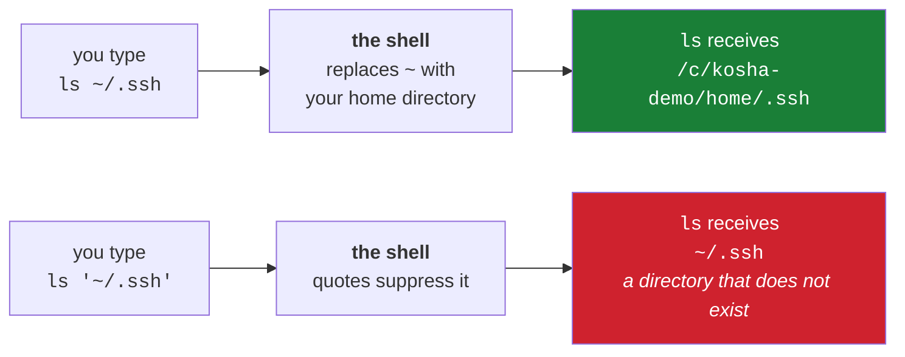

# 1.3 — Paths: absolute, relative, `~`, `.`, `..`, and who expands them

> **One-line answer.** A path is either counted from the root of the filesystem or from where you are
> standing, and `~` is neither — it is a character the *shell* replaces before the program runs, which
> is why quoting it breaks it.

---

## The story

Two people are told to file a document "in the archive".

The first takes the lift to the basement and files it in the archive room. The second walks four
metres to the cabinet behind her desk, which her team has called the archive since before either of
them started.

Both did as they were told. One instruction, two destinations, and the difference is not carelessness:
one of them heard an address that starts at the building's front door, and the other heard an address
that starts where she was sitting.

Filing systems solve this with a rule about which kind of address is meant, printed on the form.
Computers solve it with a character: an address that begins with a slash starts at the front door, and
one that does not starts where you are.

---

## The idea in plain language

A **path** names a location in the filesystem. There are two kinds, and the difference is the first
character.

- **Absolute** — begins with `/`. It starts at the root of the filesystem and means the same thing
  from anywhere. `/c/kosha-demo/nudge/reminders.md`.
- **Relative** — does not begin with `/`. It is resolved from the working directory
  ([1.2](1.2-the-working-directory.md)). `reminders.md`, `docs/notes.md`, `../reminders.md`.

Two directory names exist inside every directory and are worth understanding rather than memorising:

- `.` — this directory. `./script.sh` and `script.sh` name the same file, and the explicit `./` is how
  you say "run the file here" rather than "find a program with this name on the PATH". That is why
  Day 0 says `./k` and not `k`.
- `..` — the parent. `../reminders.md` is "up one, then the file".

And then there is `~`, which is different in kind from all of the above, and the difference is the
whole reason this part exists.

### `~` is not a path. It is a substitution the shell performs.

The filesystem has no idea what `~` means. There is no directory called `~`. When you type
`~/.ssh/config`, **the shell** replaces `~` with the value of your home directory *before* running the
program, and the program receives a perfectly ordinary absolute path. The program never sees a tilde.

Three consequences follow, and each one bites somebody weekly:

1. **Quoting it breaks it.** `"~/.ssh"` is a literal string starting with a tilde character, because
   quotes suppress the substitution — [2.2](../02-quoting/2.2-quoting.md) is the part about that suppression.
2. **It only works at the start of a word.** `path=~/.ssh` expands in some shells and positions but
   `"path=~/.ssh"` never does.
3. **A configuration file is not a shell.** Whether `~` works inside `~/.gitconfig`,
   `~/.ssh/config` or a workflow file depends entirely on whether that particular program chose to
   implement tilde expansion. Git does; some tools do not. When a path with a tilde in a config file
   mysteriously does not work, this is why — Day 0's part
   [4.3](../../../day-00-foundry/parts/04-auth/4.3-registering-and-testing-the-key.md) met exactly this with
   `IdentityFile`.



---

## Why the build needs it

**Day 20** is `.gitignore`, whose patterns behave differently depending on whether they contain a
slash — a leading or embedded `/` anchors the pattern to the file's own directory. That rule is
unlearnable without this one.

**Day 15** is `git add` and pathspecs, where `git add .` means "everything under here" and therefore
means something different in a subdirectory.

**Day 50** writes `.gitattributes` patterns, and Day 233 writes Actions path filters. Both are path
matching, and both are where an incorrect mental model becomes a rule that silently matches nothing.

**Day 96** writes hooks that reference files. A hook runs with the working directory at the repository
root ([1.2](1.2-the-working-directory.md)), so a relative path in a hook means something different
from the same path typed at your prompt.

---

## The mechanism

### Watch the shell do the substitution

```sh
echo ~
echo '~'
echo "~"
```

```
/c/kosha-demo/home
~
~
```

**Line by line:**

- `echo ~` — the shell substituted, so `echo` received an absolute path and printed it.
- `echo '~'` — single quotes suppress every expansion, so `echo` received a tilde character.
- `echo "~"` — **double quotes suppress it too.** This surprises people, because double quotes do
  allow `$VARIABLE` expansion. Tilde expansion and variable expansion are different mechanisms with
  different rules, and [2.2](../02-quoting/2.2-quoting.md) sets them out side by side.

The consequence, immediately:

```sh
ls "~/.ssh"
```

```
ls: cannot access '~/.ssh': No such file or directory
```

**Line by line:**

- `ls` was handed the literal string `~/.ssh` and looked for a directory called `~` in the current
  directory. There isn't one, so this is an honest report of a genuine absence.
- Exit code `2` — `ls` uses `2` for "serious trouble", `1` for minor problems.
  [4.1](../04-exit-and-streams/4.1-exit-codes.md) is about reading those numbers.
- Without the quotes it works, because the shell hands over an absolute path:

```sh
ls ~/.ssh
```

```
allowed_signers
config
```

*(Elided: the key files, listed in Day 0's part
[4.2](../../../day-00-foundry/parts/04-auth/4.2-generating-an-ssh-key.md).)*

### Position matters too

```sh
echo path=~/.ssh
echo "path=~/.ssh"
```

```
path=/c/kosha-demo/home/.ssh
path=~/.ssh
```

**Line by line:**

- Unquoted, this shell expanded the tilde even though it follows `path=` — because tilde expansion
  applies after an unquoted `=` in an assignment-like word.
- Quoted, nothing is expanded at all.
- The lesson is not the rule; it is that **there is a rule, it has edges, and the edges differ between
  shells.** When a path must be absolute and correct — in a config file, a script, a workflow — write
  it out or use `$HOME`, which is an ordinary variable and expands inside double quotes.

### `.` and `..`, and why `./k` is spelled that way

```sh
ls -d . ..
```

```
.
..
```

**Line by line:**

- `ls -d` — list the directories themselves rather than their contents. Without `-d` you would get
  everything inside them.
- Both entries exist in every directory. `.` is the directory itself; `..` is its parent. In the
  filesystem root, `..` is the root again.
- `./k` from Day 0 is now readable: "the file named `k`, in this directory" — as opposed to `k`,
  which the shell would look for on the PATH and not find. It is also a safety property: a program
  in the current directory can never be run by accident just because you typed its name.

```sh
realpath ./docs/../reminders.md
```

```
/c/kosha-demo/nudge/reminders.md
```

**Line by line:**

- `realpath` — resolve a path to its absolute, canonical form, following `..` and any symbolic links.
- `./docs/../reminders.md` goes down into `docs` and straight back up, which is a roundabout way of
  naming a file in the current directory — and exactly what a script assembling paths from pieces
  produces. It is a valid path and it names the same file.
- Useful when a path in an error message is long and you want to know what it actually refers to.

### Relative paths inside Git

```sh
cd docs
git log --oneline -1 -- ../reminders.md
cd ..
git log --oneline -1 -- reminders.md
```

```
b847710 three reminders
b847710 three reminders
```

**Line by line:**

- `--` — the separator that says "everything after this is a path, not a revision or an option". Git
  uses it because `main` could be a branch *or* a file, and this removes the ambiguity. It appears
  throughout this curriculum from here on.
- Two spellings of one file from two directories, and the same answer. Git resolves the path relative
  to where you are, then interprets it relative to the repository — which is what `--show-prefix` in
  [1.2](1.2-the-working-directory.md) was showing you.
- The alternative spelling, from anywhere: `git log -- :/reminders.md`. The `:/` prefix means
  "relative to the repository root" and it is one of Git's pathspec magic words — Day 15 covers the
  full set.

---

## The same thing, three ways

| Surface | Naming a location | Verdict |
|---|---|---|
| Terminal | Absolute and relative paths, with `~`, `.` and `..` expanded by the shell before the program sees them | **The only surface where the expansion question exists** — and therefore the only one where quoting a path can break it. |
| github.com | A URL: `github.com/owner/repo/blob/main/docs/notes.md`. Absolute, unambiguous, and it also encodes the branch, which a filesystem path cannot | The web has no "here", so there is no relative form and no confusion — at the cost of having to state everything every time. |
| `gh` | `gh browse docs/notes.md` opens that path on the web from a repository-relative path; `gh api repos/{owner}/{repo}/contents/{path}` takes a path relative to the repository root, never to your directory | The bridge between the two models, and a place where the difference bites: `gh` wants repository-relative paths where your shell wants directory-relative ones. |

**Which a professional reaches for:** relative paths when typing, absolute paths when writing anything
that will run unattended. A script that says `~/.ssh/id_ed25519` inside quotes, or a workflow that
assumes the runner's home directory, is a script that works until it is run by something with a
different idea of home — cron, a service account, a container.

---

## When it breaks

**A quoted tilde.**

```
ls: cannot access '~/.ssh': No such file or directory
```

*What it means:* quoting suppressed the shell's substitution and the program looked for a directory
literally named `~`. Note that the error is entirely truthful — there really is no such directory —
which is why it is confusing: nothing says "you quoted this".

*Smallest fix:* remove the quotes, or use `"$HOME/.ssh"`, which does expand inside double quotes
because it is a variable rather than a tilde.

**A tilde in a configuration file that the program does not expand.** No error message with a tilde in
it; instead something like Day 0's SSH failure:

```
no such identity: /c/Users/nisha_gnzw/.ssh/id_ed25519_kosha: No such file or directory
```

*What it means:* the program *did* expand it — to a home directory that is not the one you meant.
This is the version that costs an hour, because the path looks right and refers to somewhere real.

*Smallest fix:* write the absolute path in the config file. When two environments disagree about home
— which is normal on Windows, where a POSIX-style shell and native programs can resolve it differently
([1.4](1.4-two-spellings-of-a-path.md)) — an absolute path is the only thing that is unambiguous.

**A relative path from the wrong directory.**

```
fatal: pathspec 'reminders.md' did not match any files
```

*What it means:* you named a file relative to where you are standing and it is not there. Almost
always you are one directory deeper than you thought.

*Smallest fix:* `git rev-parse --show-prefix` to see how deep you are, then either `cd` up or use
`:/reminders.md` to name it from the repository root.

---

## In production

**Absolute paths in automation, relative paths in repositories.** A workflow, a hook or a cron job runs
with a working directory you did not choose, so anything it references is either absolute or derived —
`"$(git rev-parse --show-toplevel)/scripts/build.sh"` is the idiom, and it works from any depth. But
paths *committed into* a repository — in `.gitignore`, `.gitattributes`, `CODEOWNERS`, a workflow's
`paths:` filter — must be repository-relative, because they have to mean the same thing on every
machine that clones it.

**Path handling is where cross-platform bugs live.** Case sensitivity is the sharpest edge: `Docs/` and
`docs/` are two directories on Linux and one on macOS and Windows, so a repository containing both
cannot be checked out correctly on half the machines that clone it. Day 92 covers this alongside line
endings, and it is why `core.ignoreCase` exists.

**A path with a space or a non-ASCII character is a normal path, not an exotic one.** `My Documents`
exists on every Windows machine. Repositories contain filenames in many scripts. Code that only works
for `[a-z_]` filenames is code that fails for a user, and [2.2](../02-quoting/2.2-quoting.md) is the part that
makes it robust.

**What a senior reviewer says.** On a script containing `cd ~/project && ./build.sh`: *"this breaks
under cron and in the container — take the path as an argument or derive it from the script's own
location."* The general rule underneath: **a program should not assume where it was started from.**

**What it costs.** Nothing. Path resolution is free.

**The interview question this is really testing.** *"What is the difference between `~/.ssh/config` and
`'~/.ssh/config'`?"* It is a small question that reveals whether you know where expansion happens. The
strong answer: the shell expands the first before the program runs, so the program receives an
absolute path; the second is passed through literally, so the program looks for a directory named `~`.
And the follow-up that matters: *"so what does a tilde in a config file do?"* — it depends entirely on
whether that program implements the expansion itself, because the shell is not involved.

---

## Check yourself

**Run this now.** Predict both lines — and specifically, predict whether they will be the same:

```sh
echo ~/.ssh && echo "~/.ssh"
```

**Line by line:** the first has the tilde expanded by the shell into your home directory; the second
is quoted, so it is passed through literally. `&&` runs the second only if the first succeeded
([4.2](../04-exit-and-streams/4.2-chaining-commands.md)). If you predicted two identical lines, re-read the mechanism
section — this is the single most common path mistake in shell scripts, and it is invisible until it
is not.

**Say this out loud.** Explain why `./k` is written with a `./` when `k` is right there in the
directory — and say what would happen, and why it would be worse, if the shell searched the current
directory automatically.

---

**Next:** [1.4 — One directory, two spellings: Windows paths, MSYS translation, and WSL](1.4-two-spellings-of-a-path.md) ·
[back to the hub](../../LESSON.md)
