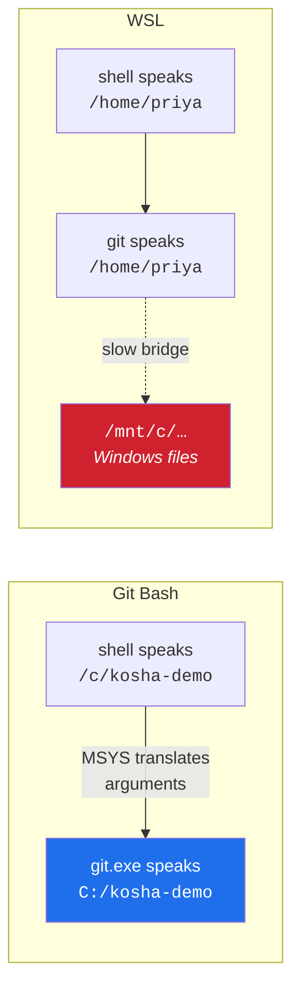

# 1.4 — One directory, two spellings: Windows paths, MSYS translation, and WSL

> **One-line answer.** On Windows your shell speaks a POSIX dialect and the programs it runs speak
> Windows, so a translation layer rewrites paths as they cross between them — usually correctly,
> occasionally on an argument that was never a path at all.

---

## The story

A translator sits between two people who are negotiating in good faith.

She is very good, and her habit is to convert units as she goes — the buyer says feet and the seller
hears metres, and the conversation flows. Both sides have stopped noticing she is there, which is what
a good translator wants.

Then the buyer mentions a part number. Nine-slash-four. And the translator, doing what she has always
done, converts it.

Nothing about the conversation looks wrong. The seller heard a number, wrote it down, and repeated it
back in a form the buyer accepts because it is the form she is used to hearing. The order is placed.
The wrong part arrives in eleven days, and the argument that follows is between two people who each
have an accurate record of what they said.

If you use Git Bash on Windows, this translator is running for you right now, and it is genuinely
making your life easier — until the day it converts something that was not a path.

---

## The idea in plain language

Windows names files differently from Unix:

| | Windows | POSIX (macOS, Linux, Git Bash) |
|---|---|---|
| Separator | `\` backslash | `/` forward slash |
| Root | one per drive: `C:\`, `D:\` | a single `/` for everything |
| A directory | `C:\kosha-demo\nudge` | `/c/kosha-demo/nudge` |

Git's documentation, Git's own scripts and every command in this curriculum are written in the POSIX
dialect. Windows has no such shell, so Git for Windows ships one — Git Bash, built on an environment
called **MSYS2** — along with the Unix tools those scripts need. Day 0's part
[1.2](../../../day-00-foundry/parts/01-install/1.2-installing-git.md) is where that bundle was installed.

That shell presents a POSIX view: your `C:` drive appears at `/c`, and paths use forward slashes. But
the programs it launches — `git.exe`, `ssh.exe`, anything native — expect Windows paths. So MSYS
**translates arguments** as they are handed over: an argument that looks like a POSIX path is
rewritten into the Windows form before the program sees it.

This is why the same directory has two spellings that are both correct, and why one command prints one
and another prints the other. It is not a bug and neither answer is wrong.

**If you are on macOS or Linux, none of this applies.** There is one spelling. Read the section on
`git rev-parse` for the general habit and skip the rest — though the *ideas* here recur wherever a
tool translates for you, including inside containers.

---

## Why the build needs it

**Day 0's part [4.3](../../../day-00-foundry/parts/04-auth/4.3-registering-and-testing-the-key.md)** produced
this exact failure: an SSH configuration file said `~/.ssh/id_ed25519_kosha`, and SSH resolved it to a
different home directory from the shell's, so the key "did not exist" while sitting on disk.

**Day 95** is Git LFS and **Days 176–177** are Docker, where paths are handed to a program that also
has its own idea of what a path is. Volume mounts on Windows are the canonical place people meet
argument mangling.

**Day 96** writes hooks: shell scripts, executed by Git, on whatever platform the contributor is
using. A hook that assumes one spelling is a hook that breaks for half the team.

**Day 153 onward** is Actions, where the same workflow runs on Ubuntu and Windows runners and the
`shell:` key decides which dialect each step speaks.

---

## The mechanism

### The same directory, twice

```sh
pwd
git rev-parse --show-toplevel
```

```
/c/kosha-demo/nudge
C:/kosha-demo/nudge
```

**Line by line:**

- `pwd` is the shell's own answer, in the POSIX dialect the shell presents.
- `git rev-parse --show-toplevel` is Git's answer. `git.exe` is a Windows program, so it reports a
  Windows path — though with forward slashes, which Windows accepts perfectly well.
- **Both name the same directory.** When a script compares these two strings for equality, it fails,
  and the failure looks like nonsense unless you have read this part.

### Translating deliberately

```sh
cygpath -w /c/kosha-demo/nudge
cygpath -u 'C:\kosha-demo\nudge'
cygpath -m /c/kosha-demo/nudge
```

```
C:\kosha-demo\nudge
/c/kosha-demo/nudge
C:/kosha-demo/nudge
```

**Line by line:**

- `cygpath` — the translator, available as a command. It ships with Git Bash.
- `-w` — to the **W**indows form with backslashes. This is what a native program wants when you build
  a path in a script.
- `-u` — to the **U**nix form. Note the single quotes around the Windows path:
  [2.2](../02-quoting/2.2-quoting.md) explains why, and the short version is that a backslash means something
  to the shell unless you stop it.
- `-m` — the "mixed" form: a Windows path with forward slashes. This is the form Git itself prints,
  and it is the most portable of the three because both worlds accept it.

### The translator converting something that is not a path

```sh
git -c "alias.showit=!echo" showit /usr/bin
```

```
C:/Program Files/Git/usr/bin
```

**Line by line:**

- `-c "alias.showit=!echo"` — define a Git alias for this command only, using the `-c` mechanism from
  Day 0's part [2.1](../../../day-00-foundry/parts/02-identity/2.1-config-and-scopes.md). The leading `!` makes it
  a shell command rather than a Git subcommand; Day 90 is about aliases.
- `showit /usr/bin` — the alias runs `echo` with the argument `/usr/bin`.
- **The argument arrived rewritten.** `/usr/bin` inside the MSYS view maps to the Git installation's
  own `usr\bin`, and the translator dutifully converted it on the way across.
- Nothing is broken here — that translation is exactly what makes `ls /usr/bin` work. But if you had
  meant `/usr/bin` as a *literal string* — a path inside a container, a value in an API call, a
  refspec — you have just sent something else.

```sh
MSYS_NO_PATHCONV=1 git -c "alias.showit=!echo" showit /usr/bin
```

```
/usr/bin
```

**Line by line:**

- `MSYS_NO_PATHCONV=1` — set an environment variable for this command only
  ([3.1](../03-child-processes/3.1-environment-variables.md)), telling MSYS not to translate arguments.
- The string arrives intact.
- This is the fix for the classic Docker case on Windows —
  `docker run -v /c/data:/data` becoming something unrecognisable — and for any command where an
  argument starting with `/` is not a local path. The other common workaround is a leading double
  slash, `//usr/bin`, which the translator leaves alone.

### Two ideas of home on one machine

```sh
echo "shell HOME=$HOME"
echo "USERPROFILE=$USERPROFILE"
git config --show-origin --get user.name
```

```
shell HOME=/c/Users/nisha_gnzw
USERPROFILE=C:\Users\nisha_gnzw
file:C:/Users/nisha_gnzw/.gitconfig	aignishant
```

*(Elided: nothing — this is my own machine's real output, username included, because the point is
that three tools spell one directory three ways.)*

**Line by line:**

- `$HOME` is the shell's, in POSIX form; `$USERPROFILE` is Windows', in Windows form. On this machine
  they agree about *which* directory — they do not always, and when they disagree, tools disagree
  about where your configuration lives.
- `git config --show-origin` prints the mixed form, which is Git's convention.
- This is the mechanism behind the Day 0 SSH failure: the shell expanded `~` one way
  ([1.3](1.3-paths-and-who-expands-them.md)), and `ssh.exe` resolved its own idea of home another way,
  so the key file was looked for somewhere it was not.
- **When something cannot find a file that is definitely there, print the path the tool is actually
  using.** `ssh -v` does this ([4.3](../../../day-00-foundry/parts/04-auth/4.3-registering-and-testing-the-key.md));
  most tools have an equivalent.

### The other Windows option: WSL

The Windows Subsystem for Linux runs an actual Linux system, so there is no translation layer — inside
WSL there is one dialect and it is POSIX. That removes this entire part's subject and introduces a
different one: WSL and Windows have **two filesystems**, connected by a bridge, and files on the other
side are reached over that bridge with a real performance cost.

The practical guidance, for this curriculum:

| You are using | Then | Watch out for |
|---|---|---|
| Git Bash | Everything in this curriculum works as written | Argument translation, the two spellings, `core.autocrlf` (Day 0's [2.3](../../../day-00-foundry/parts/02-identity/2.3-defaults-worth-changing.md)) |
| WSL | Everything works as written, with no translation at all | Keep repositories **inside** the Linux filesystem, not under `/mnt/c` — Git on a repository across the bridge is dramatically slower |
| PowerShell | Git works; this curriculum's shell syntax does not | Quoting, `&&`, and redirection differ. Use Git Bash for the lessons |



---

## The same thing, three ways

| Surface | How a path is spelled | Verdict |
|---|---|---|
| Terminal | Two dialects on Windows, one everywhere else; `cygpath` converts deliberately; `MSYS_NO_PATHCONV=1` turns the automatic conversion off | **The only surface where the ambiguity exists**, because it is the only one that hands strings between two operating-system conventions. |
| github.com | Always forward slashes, always repository-relative, in URLs and in file listings. A repository does not record a drive letter or a backslash | **The canonical form** — which is why the repository is the right place to settle path questions, and why a path committed into `.gitignore` or a workflow means the same thing on every machine. |
| `gh` | Speaks the repository's dialect: `gh browse docs/notes.md` wants forward slashes regardless of your platform, because it is addressing the repository rather than your disk | A useful reminder that "the path in the repository" and "the path on my machine" are two different strings that happen to look alike. |

**Which a professional reaches for:** forward slashes, everywhere, always — Windows accepts them in
almost every context, so they are the one spelling that does not need a conversation. And when a script
must hand a path to a native Windows program, `cygpath -w` explicitly, rather than hoping the
translator guesses right.

---

## When it breaks

**A file that is definitely there cannot be found.**

```
no such identity: /c/Users/nisha_gnzw/.ssh/id_ed25519_kosha: No such file or directory
```

*What it means:* the program resolved a path — probably from a `~` in a configuration file
([1.3](1.3-paths-and-who-expands-them.md)) — to a home directory that is not the one your shell means.
The path in the message is real, and nothing is there.

*Smallest fix:* `ls -l` the exact path from the message. Then write the absolute path in the
configuration file rather than relying on `~`.

**An argument arrives as something else.**

```
C:/Program Files/Git/usr/bin
```

*What it means:* you passed `/usr/bin` and MSYS translated it, because it looked like a path. No error
— which is what makes it expensive. It is the wrong-part-number failure from the story.

*Smallest fix:* `MSYS_NO_PATHCONV=1` before the command, or double the leading slash: `//usr/bin`.

**A shell script fails on a colleague's machine with a `\r`.** Covered in Day 0's part
[2.3](../../../day-00-foundry/parts/02-identity/2.3-defaults-worth-changing.md): line-ending conversion, the other
half of the Windows translation story. Day 92 is the full incident.

*Smallest fix:* `core.autocrlf false` plus a committed `.gitattributes` (Day 91), so the policy travels
with the repository instead of depending on each machine.

**Paths that differ only in case.** No error on Windows or macOS; a duplicate file on Linux.

*What it means:* `Docs/notes.md` and `docs/notes.md` are two paths in the repository and one path on a
case-insensitive filesystem. Git records both; your checkout can only have one.

*Smallest fix:* `git mv` with an intermediate name to change the case deliberately, and Day 92 for the
`core.ignoreCase` setting behind it.

---

## In production

**Cross-platform teams pay this tax continuously, and the mature answer is to move the policy into the
repository.** `.gitattributes` for line endings (Day 91), forward slashes in every committed path,
lowercase filenames by convention, and a continuous-integration matrix that actually runs on Windows
(Day 165) rather than assuming. The alternative — "it works on my machine" — is a Windows contributor
discovering on their own that the project does not really support them.

**Container and runner boundaries are the same problem in a new hat.** A path inside a container is not
a path on the host; a path on a GitHub Actions runner is not a path on your laptop.
`${{ github.workspace }}` exists because the workflow cannot assume the checkout is anywhere in
particular, and every "file not found" in a pipeline is the same question as this part's: *whose idea
of this path is being used?*

**Performance is a real consideration on Windows.** Git does many small file operations, and Windows
filesystem calls are more expensive than their Linux equivalents. Git for Windows enables
`core.fscache` for this reason — you saw it in the system configuration in Day 0's part
[2.1](../../../day-00-foundry/parts/02-identity/2.1-config-and-scopes.md) — and a repository on WSL's `/mnt/c`
bridge is slower again by a large factor. On a big repository, "Git is slow on Windows" is usually
"Git is on the wrong side of a bridge".

**What a senior reviewer says.** On a script that builds paths by string concatenation with a `/`:
*"use the platform's path join, or at least normalise — this breaks the first time somebody runs it
from PowerShell."* The general form of the lesson: **paths are structured data being passed around as
strings**, and every bug in this part comes from something treating a string as a path or a path as a
string.

**What it costs.** Nothing in money; a real amount in confusion, which is why it gets its own part
rather than a footnote.

**The interview question this is really testing.** *"Why does the same directory print as
`/c/projects/app` in one command and `C:/projects/app` in another?"* The answer names the layer: the
shell presents a POSIX view of a Windows filesystem, and native programs report Windows paths, with an
argument-translation layer between them. The follow-up that separates people who have actually met
this: *"when does that translation cause a problem?"* — when an argument that looks like a path is not
one, and the fix is `MSYS_NO_PATHCONV=1` or a doubled leading slash.

---

## Check yourself

**Run this now.** Predict whether the two lines will be identical, and if not, exactly how they will
differ:

```sh
pwd && git rev-parse --show-toplevel
```

**Line by line:** the first is the shell's spelling of where you are, the second is Git's spelling of
the repository root. On macOS or Linux they match exactly when you are at the top of a repository. On
Windows they will not, and the difference is the whole subject of this part. `&&` chains them
([4.2](../04-exit-and-streams/4.2-chaining-commands.md)).

**Say this out loud.** Explain to a colleague on macOS why their instructions "just use `~/.ssh/config`"
did not work for you — and name the one change that would have made the instruction portable.

---

**Next:** [2.1 — The line becomes words](../02-quoting/2.1-the-line-becomes-words.md) ·
[back to the hub](../../LESSON.md)
