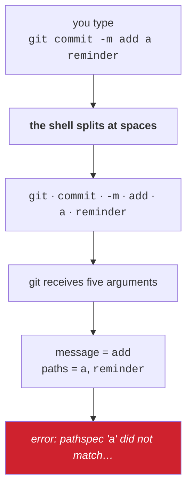

# 2.1 — The line becomes words: splitting, and why `git commit -m my message` fails

> **One-line answer.** The shell cuts your line into words at every run of spaces before any program
> starts, so a program never sees the sentence you typed — it sees a list, and the most common
> beginner's error in Git is a sentence that became five list items.

---

## The story

A cook writes a shopping list on a single line, because the paper is small.

*apples oranges cream cheese bread*

Somebody else does the shopping, and comes back with five things: apples, oranges, cream, cheese and
bread. The cook wanted four: apples, oranges, **cream cheese**, and bread.

The shopper did not make a mistake. There is no rule of English by which "cream cheese" survives being
written in a list separated by spaces; the separator and the space inside the item are the same
character, and the only person who could tell them apart was the person holding the intention.

The fix in a kitchen is a comma, or a new line, or a circle drawn around two words. The fix at a
terminal is a pair of quotes, and until somebody explains that the shopper is a separate person from
the cook, the failure is baffling — because the list looked perfectly clear to the person who wrote
it.

---

## The idea in plain language

When you press return, the shell takes your line and cuts it into **words** — the technical term is
*fields* — at whitespace. One or more spaces or tabs, any number, are one separator.

Then the first word is used to find the program, and **the remaining words are handed to that program
as a list**. Not as a sentence. Not with the spacing preserved. A list of separate strings.

That is the entire mechanism, and almost every quoting problem in this curriculum is a consequence of
it.

Two terms, since they are the vocabulary for the rest of the day:

- An **argument** is one item in that list. `git commit -m hello` passes three arguments to `git`:
  `commit`, `-m`, `hello`.
- An **option** or **flag** is an argument that begins with `-` or `--` and modifies behaviour. A
  program decides for itself which of its arguments are options and which are values — the shell does
  not know or care.

The consequence worth internalising: **the shell has no idea what your arguments mean.** It does not
know that `-m` takes a value. It splits, hands over, and steps out of the way. Anything about what
belongs together must be expressed in a way the *shell* understands, and that means quoting —
[2.2](2.2-quoting.md).



---

## Why the build needs it

**Day 18** is commit message craft — a subject, a blank line, a body, and trailers. Every one of those
is a message containing spaces and newlines, and none of them can be written without understanding
this part first.

**Day 15** is `git add` and pathspecs, and the errors in this part are pathspec errors: Git is telling
you it received a path it could not match, which is what a stray word becomes.

**Day 96** writes hooks and **Day 153 onward** writes workflow steps. Both are shell scripts where a
variable holding a filename with a space in it is the most common source of a bug that only appears
for one contributor.

---

## The mechanism

### Watch a sentence become a list

```sh
git commit -m add a reminder
```

```
error: pathspec 'a' did not match any file(s) known to git
error: pathspec 'reminder' did not match any file(s) known to git
```

**Line by line:**

- The shell split the line into six words and gave Git five arguments.
- Git parsed `-m add`, so **the commit message is the single word `add`**. That part succeeded
  silently.
- `a` and `reminder` were left over. `git commit` accepts paths after its options — you can commit
  specific files — so Git tried to interpret them as paths, and reported that neither matched anything
  it tracks.
- **`pathspec` is Git's word for a path pattern**, and Day 15 teaches it properly. Seeing `pathspec`
  in an error is a strong hint that a word you meant as prose was received as a filename.
- Exit code `1`, and no commit was made. Nothing is lost; your staged changes are untouched.

### The fix, and the proof that it is one word

```sh
git commit -qm "add a reminder"
git log -1 --format='%s'
```

```
add a reminder
```

**Line by line:**

- `"add a reminder"` — double quotes make the enclosed text **one word**, so the shell hands Git
  exactly two arguments after `commit`: `-m` and the whole message.
- `-q` — quiet; suppresses the summary Git normally prints. Combined here as `-qm`, which is the usual
  shorthand for two single-letter flags.
- `%s` — the **subject** of the commit message: everything up to the first blank line. Day 23 covers
  these format placeholders and Day 18 covers why a commit message has a subject and a body at all.
- The output is the whole message, spaces intact, proving it arrived as one argument.

### Any number of spaces is one separator

```sh
printf '[%s]\n' one     two			three
```

```
[one]
[two]
[three]
```

**Line by line:**

- `printf '[%s]\n'` — print each argument inside brackets on its own line. `printf` reuses its format
  string for every argument it is given, which makes it the perfect tool for seeing how many arguments
  arrived.
- The input had multiple spaces and a tab between the words. All of it collapsed: **whitespace is a
  separator, not data.** Three arguments arrived, cleanly bracketed.
- This is why alignment in a command has no effect on meaning, and why a filename with two spaces in
  it is genuinely hard to type correctly without quotes.

### The same trap, with a filename

```sh
printf 'x\n' > "shopping list.md"
git add shopping list.md
```

```
fatal: pathspec 'shopping' did not match any files
```

**Line by line:**

- `> "shopping list.md"` — create a file whose name contains a space. The quotes matter here too:
  without them the shell would create a file called `shopping` and pass `list.md` to `printf`.
- `git add shopping list.md` — two arguments, so Git looked for a file called `shopping`, did not find
  one, and stopped at the first failure. Note it says `did not match any files` — slightly different
  wording from the `commit` case, because a different code path in Git produced it. Both mean the same
  thing.
- The fix is the same shape as before:

```sh
git add "shopping list.md"
git status --short
```

```
A  "shopping list.md"
```

**Line by line:**

- `A` — added to the index, which is Day 13's subject.
- **Git quotes the filename in its own output**, because it contains a character that would be
  ambiguous when unquoted. That is Git telling you the same thing this part is: a space inside a name
  needs marking. The `core.quotePath` setting controls this display, and Day 91 covers it alongside
  filenames in other scripts.

### How to see what a program actually received

When a command does something inexplicable, look at the arguments rather than reasoning about them:

```sh
printf '[%s]\n' git commit -m add a reminder
```

```
[git]
[commit]
[-m]
[add]
[a]
[reminder]
```

**Line by line:**

- Substituting `printf '[%s]\n'` for the real command shows the argument list exactly as the shell
  produced it — six items, one per line, brackets making empty ones visible.
- This trick works for any command and costs nothing. It is the fastest way to settle "did the shell
  or the program mangle this?" and it answers the question with evidence instead of theory.

---

## The same thing, three ways

| Surface | Giving a program a value with spaces in it | Verdict |
|---|---|---|
| Terminal | Quote it, or the shell splits it. `git commit -m "add a reminder"` | **The only surface where the problem exists** — and the price of everything else the shell gives you. |
| github.com | A form field. Type a sentence, press the button; there is no splitting because there is no shell | Genuinely easier for one-off text, and this is a fair point for Principle 15: the web interface is better at some things and this is one of them. |
| `gh` | Identical rules, because `gh` is a program the shell launches: `gh issue create --title "two words" --body "…"` needs the quotes for exactly the same reason | Worth stating explicitly: people who learn quoting for Git are sometimes surprised to need it again for `gh`. It is not Git's rule; it is the shell's. |

**Which a professional reaches for:** quotes, by reflex, around every value that could contain a space
— which is every filename, every message, every branch name typed by a human. The habit is cheap and
the failure it prevents is the confusing kind, because the error message talks about paths when the
problem was punctuation.

---

## When it breaks

**A message that became paths.**

```
error: pathspec 'a' did not match any file(s) known to git
error: pathspec 'reminder' did not match any file(s) known to git
```

*What it means:* the words after your intended message were handed to Git as paths. The commit was not
made.

*Smallest fix:* quote the message. To check what the message *would* have been, run the `printf`
trick above on the same line.

**A filename that became several.**

```
fatal: pathspec 'shopping' did not match any files
```

*What it means:* a filename containing a space, unquoted. Git looked for the first word.

*Smallest fix:* quote the filename. Tab completion also quotes or escapes for you — type the first few
characters and press Tab, and the shell fills in the rest correctly, which is the real reason
professionals rarely type long filenames.

**Nothing at all happens, and the prompt changes.** You typed an opening quote and never closed it, so
the shell is still reading.

*What it means:* the line has not run. Everything you type is being added to it.

*Smallest fix:* `Ctrl-C`. [2.2](2.2-quoting.md) covers the unterminated-quote case in full, including
what it looks like when a script hits it.

---

## In production

**Unquoted variables are the classic shell bug, and they are a security issue as well as a correctness
one.** A script that runs `rm $FILE` where `FILE` contains `notes.md extra.md` deletes two files; where
it contains something an attacker controls, it can do considerably more. Shell linters exist largely to
catch this one pattern, and a reviewer scanning a `run:` step in a workflow looks for it before
anything else.

**Filenames with spaces are normal, not exotic.** `My Documents`, `Screen Shot 2026-08-23 at
14.02.11.png`, anything a designer produced. Code that only handles `[a-z-]` filenames is code that
breaks on real repositories, and `git ls-files -z` piped into `xargs -0` exists precisely so that
tooling can handle them — Day 91 covers the `-z` family of flags, which use a zero byte as the
separator because a zero byte cannot appear in a filename.

**In GitHub Actions, the same rule applies twice.** A `run:` step is a shell script, so shell splitting
applies; and the `${{ }}` expressions are substituted into that script *as text* before it runs. An
interpolated value with a space — or a quote — becomes part of the script, which is why Day 179 treats
untrusted input in a `run:` block as a genuine injection risk rather than a style issue.

**What a senior reviewer says.** On a workflow step containing `git commit -m ${{ inputs.message }}`:
*"quote it, and pass it through the environment rather than interpolating it into the script — right
now a message with a space breaks the step and a message with a semicolon runs a command."* Two bugs,
one cause, and this part is the cause.

**What it costs.** Nothing but two characters.

**The interview question this is really testing.** *"Why does `git commit -m my message` fail?"* The
strong answer does not say "you need quotes" — it says what happened: the shell split the line at
whitespace and passed six words, Git took `my` as the message and treated `message` as a pathspec, and
the error mentions paths because that is the last thing Git tried to do with the leftovers. Then the
generalisation: the shell splits before the program starts, so anything meant as one value has to be
quoted.

---

## Check yourself

**Run this now.** Predict how many bracketed lines will print before you press return:

```sh
printf '[%s]\n' git commit -m "add a reminder"
```

**Line by line:** `printf '[%s]\n'` prints each argument it receives on its own line inside brackets,
reusing the format string. The quotes around the message make it one argument, so the answer is four
lines, not six. Now run it again without the quotes and count the difference — that difference is the
entire subject of this part.

**Say this out loud.** A colleague says Git "ate" their commit message and complained about a file that
does not exist. Explain what actually happened, without using the word "quotes" until the last
sentence.

---

**Next:** [2.2 — Quoting: single, double, backslash, and the characters that still bite](2.2-quoting.md) ·
[back to the hub](../../LESSON.md)
