# 2.2 — Quoting: single, double, backslash, and the characters that still bite

> **One-line answer.** Single quotes mean "this text, exactly"; double quotes mean "this text, but
> still substitute values"; a backslash means "this one character, literally" — and choosing the wrong
> one is how a password ends up truncated and a filename ends up as two.

---

## The story

A printer takes an order for a shop sign.

The customer writes it on a form: `SALE — 50% off everything`. The printer's software treats `%` as
the start of an instruction, because in that software `%d` inserts a date and `%n` inserts a page
number. What arrives is a sign that says `SALE — 50` followed by whatever the software thought
`% off everything` meant.

Nobody typed anything wrong. The customer wrote plain English; the software read a language in which
some characters are instructions. The two systems shared an alphabet and disagreed about which marks
were content and which were commands.

Every quoting bug is that sign. The shell has a handful of characters that mean *do something* rather
than *these letters*, and quoting is how you say which one you meant.

---

## The idea in plain language

From [2.1](2.1-the-line-becomes-words.md): the shell splits your line into words before any program
runs. It also **expands** things as it goes — replacing `$NAME` with a value, `*.md` with a list of
filenames, `~` with your home directory.

Quoting controls both behaviours. There are exactly three tools:

| Form | Splitting | Expansion | Use it for |
|---|---|---|---|
| `'single quotes'` | Off | **All off** | Text that must survive exactly: passwords, regular expressions, format strings, Windows paths |
| `"double quotes"` | Off | `$variable` and `` `command` `` **still happen**; `~` and `*` do not | Almost everything, especially values that come from variables |
| `\` backslash | Off, for that one character | Off, for that one character | One awkward character in an otherwise plain word |

The rule most people eventually settle on: **double quotes by default, single quotes when you need the
text untouched.** Bare, unquoted words only when you actively want the shell to expand something.

Two things that catch people even after they know the table:

- **Quotes are not part of the value.** `"hello"` is the five characters `hello`. The quotes are
  instructions to the shell and are removed before the program sees anything. This is why you cannot
  "see" whether a value was quoted by looking at the output.
- **Quoting is not the same as escaping for another program.** A regular expression, a `grep` pattern
  or a JSON string has its own escaping rules on top of the shell's. When both apply, single quotes
  around the whole thing keep the shell out of it and leave the other language's rules intact.

---

## Why the build needs it

**Day 24** is `gitrevisions` — `HEAD~3`, `@{u}`, `:/text` — and several of those contain characters
the shell would otherwise interpret. `git log :/fix` needs thought; `git show 'HEAD^{tree}'` needs
quoting, because `{` and `}` and `^` are shell characters.

**Day 23** builds log format strings full of `%` placeholders, which must reach Git untouched.

**Day 90** writes aliases containing shell commands, where quoting happens twice — once when you
define the alias and once when it runs.

**Day 96** and **Day 153 onward** are hooks and workflow steps: shell scripts where a filename in a
variable must survive being passed to another command.

---

## The mechanism

### The three forms, side by side

```sh
name=Priya
printf '%s\n' "hello $name" 'hello $name' hello\ $name "cost \$5" 'cost $5'
```

```
hello Priya
hello $name
hello Priya
cost $5
cost $5
```

**Line by line:**

- `name=Priya` — a shell variable. **No spaces around the `=`**; the shell would read
  `name = Priya` as a command called `name`. [3.1](../03-child-processes/3.1-environment-variables.md) covers
  variables properly.
- `"hello $name"` — double quotes: one word, and `$name` was substituted.
- `'hello $name'` — single quotes: one word, and `$name` was **not** substituted. Single quotes are
  absolute; there is nothing you can put inside them that the shell will act on.
- `hello\ $name` — a backslash before the space makes that one space part of the word rather than a
  separator. The `$name` outside the backslash still expanded.
- `"cost \$5"` — inside double quotes, a backslash escapes the `$`, so the dollar sign is literal.
- `'cost $5'` — the same result with less ceremony, which is the argument for single quotes when
  nothing needs expanding.

### The scanner has three states

Quoting is easier to predict once you stop thinking of quotes as *wrapping* and start thinking of them
as *switching*. The shell walks the line one character at a time, and at every point it is in one of
three states. A quote character does not become part of your text; it changes which state the scanner
is in, and the state decides which characters are still instructions.

```mermaid
flowchart LR
    S(["start of a word"]) --> U

    U["<b>Unquoted</b><br/>live: $ &#96; * ? ~ and backslash<br/><i>a space ends the word</i>"]
    Q1["<b>Inside single quotes</b><br/>nothing is live<br/>not even a backslash<br/><i>only ' can end it</i>"]
    Q2["<b>Inside double quotes</b><br/>$ and &#96; are still live<br/>backslash live before $ &#96; &quot; and itself<br/><i>a space is ordinary text</i>"]

    U -->|"reads '"| Q1
    Q1 -->|"reads '"| U
    U -->|"reads &quot;"| Q2
    Q2 -->|"reads &quot;"| U
    U --> E(["word handed to the program"])

    style Q1 fill:#1a7f37,color:#fff
    style Q2 fill:#9a6700,color:#fff
```



**Reading it:**

- **There is no state in which the quote characters themselves survive.** They are consumed by the
  transition. This is why `git commit -m "add a reminder"` gives Git a message with no quotes in it,
  and why a message that should genuinely contain a quotation mark needs an escaped one.
- **A word can pass through several states.** `"one"'two'three` is a single word, `onetwothree`, that
  visited all three states without a space anywhere. That is also why `--author="A U Thor"` works with
  the quotes starting in the middle: the scanner was already inside the word when it switched.
- **Only the matching character switches back.** A `"` inside single quotes is text, and a `'` inside
  double quotes is text — which is the mechanical reason for the rule of thumb that you nest one kind
  of quote inside the other rather than trying to escape it.
- **The green state is the safe one.** Nothing at all is live inside single quotes, which is why every
  fix in the table below is *"use single quotes"*, and why the one exception —
  [2.3](2.3-globs-and-pathspecs.md)'s quoted pathspec — is quoted precisely so the shell stays out of it.
- The state machine runs *before* any program starts. What comes out of it is a list of finished
  words, which is [2.1](2.1-the-line-becomes-words.md)'s subject; what a program then does with those
  words is its own business, and the two are often confused.

### Why `printf` and not `echo`

Every demonstration in this part uses `printf` deliberately. `echo`'s handling of backslashes and
options differs between shells and even between builds of the same shell, so `echo "-n"` or
`echo "a\tb"` can produce different output on two machines. `printf 'FORMAT' args…` is specified
precisely and behaves the same everywhere — which is why Day 0's part
[1.1](../../../day-00-foundry/parts/01-install/1.1-what-git-actually-is.md) used it when a single byte decided a
hash.

### What double quotes still let through

```sh
printf '%s\n' "today is $(date +%Y)" "home is ~" "files are *.md"
```

```
today is 2026
home is ~
files are *.md
```

**Line by line:**

- `$(date +%Y)` — **command substitution**: run `date`, put its output here. Double quotes do not stop
  it. This is enormously useful and is the thing to be careful with when the text comes from somewhere
  untrusted.
- `"home is ~"` — tilde expansion **is** suppressed by double quotes, which
  [1.3](../01-paths/1.3-paths-and-who-expands-them.md) covered. Use `"$HOME"` when you need the value inside
  quotes.
- `"files are *.md"` — glob expansion is also suppressed. [2.3](2.3-globs-and-pathspecs.md) is the
  part on when you want that and when you do not.
- So double quotes stop three of the four things and let two through: variables and command
  substitution. That asymmetry is the whole reason single quotes exist.

### Backslashes, and Windows paths

```sh
printf '%s\n' 'C:\Users\priya' "C:\Users\priya"
```

```
C:\Users\priya
C:\Users\priya
```

**Line by line:**

- Single quotes: every character survives, always.
- Double quotes: the backslashes survived here too, because inside double quotes a backslash is only
  special before `$`, `` ` ``, `"`, `\` or a newline — and `\U` and `\p` are none of those.
- **Do not rely on that.** `"C:\test\new"` contains `\n` in some contexts and a path with a `$` in it
  will bite. For a Windows path, use single quotes — or forward slashes, which
  [1.4](../01-paths/1.4-two-spellings-of-a-path.md) recommends anyway.

### The characters that are still special

Even inside a correctly quoted command, these are the ones to watch:

| Character | What the shell does with it | Safe form |
|---|---|---|
| `$` | Substitutes a variable | `'single quotes'` or `\$` |
| `` ` `` and `$( )` | Runs a command and inserts its output | `'single quotes'` |
| `*` `?` `[` | Matches filenames | `'single quotes'`, or `"double"` |
| `~` | Your home directory, at the start of a word | Use `"$HOME"` |
| `!` | History expansion — recalls a previous command. On by default in an **interactive** bash, off by default in a script | `'single quotes'`, or `set +H`. This one surprises people, because the same line runs quietly in a script and fails when typed |
| `;` `&` `\|` `&&` | Ends the command and starts another | Quote it, and read [4.2](../04-exit-and-streams/4.2-chaining-commands.md) |
| `#` | Starts a comment, at the start of a word | Quote it |
| newline | Ends the command | A quoted string may contain real newlines |

### The one that is not a shell problem at all

```sh
printf 'x\n' > -weird.md
git add -weird.md
```

```
error: unknown switch `w'
usage: git add [<options>] [--] <pathspec>...
```

**Line by line:**

- The file is called `-weird.md`. The shell passed that word through untouched — no quoting problem
  anywhere.
- **Git** saw an argument beginning with `-` and parsed it as options: `-w`, which it does not have.
  Quoting cannot help, because the quotes are gone by the time Git sees the string.
- The fix is Git's own convention, visible in the usage line it printed:

```sh
git add -- -weird.md
```

**Line by line:**

- `--` — "no more options; everything after this is a path". Nearly every Unix program supports it and
  Git uses it throughout, including to separate paths from revisions, which
  [1.3](../01-paths/1.3-paths-and-who-expands-them.md) met and Day 24 formalises.
- The other fix is `./-weird.md`, which is the same file named in a way that does not start with a
  dash.
- **Remember the distinction this block teaches:** quoting is between you and the shell; `--` is
  between you and the program. Mixing them up produces a lot of wasted effort.

### Multi-line strings

```sh
git commit -m "Add the morning reminder

The list is edited by hand, so this file is where conflicts
will come from in Phase 5."
```

**Line by line:**

- A quoted string may contain real newlines: the shell keeps reading until the closing quote, and the
  whole thing arrives as one argument.
- That produces a commit with a subject, a blank line and a body, which is the shape Day 18 requires
  — and it is why the second `-m` trick (`-m "subject" -m "body"`, which Git joins with a blank line)
  exists as an alternative.
- While the quote is open, your shell shows its continuation prompt — normally `>`. That is the state
  described in **When it breaks**, and here it is expected rather than alarming.

---

## The same thing, three ways

| Surface | Passing text that contains awkward characters | Verdict |
|---|---|---|
| Terminal | Three quoting forms, applied before the program starts; `--` for arguments the program would misread as options | **Where all the rules live.** Every other surface is comparatively rule-free, and comparatively unable to be scripted. |
| github.com | A text area. Type anything; nothing is interpreted, and a commit message with a `$` in it is a commit message with a `$` in it | Simplest possible model, and a real argument for writing a long commit message in the browser when the alternative is fighting a shell. |
| `gh` | The same shell rules, plus its own: `gh issue create --body "$(cat notes.md)"` uses command substitution to avoid quoting an entire file, and `gh api -f key=value` sends the value without a shell in the middle | Reading a body from a file with `--body-file` is the professional habit — it removes the shell from the question entirely. |

**Which a professional reaches for:** double quotes around every variable, single quotes around
anything with `$` or `%` or backslashes in it, and a *file* rather than a quoted argument once the text
is longer than a line. `git commit -F message.txt` and `gh pr create --body-file body.md` exist
precisely so that prose never has to survive a shell.

---

## When it breaks

**An unclosed quote.**

```
bash: -c: line 1: unexpected EOF while looking for matching `"'
```

*What it means:* the shell reached the end of the input while still inside a quoted string. In a script
that is this error; typed interactively, you simply get a continuation prompt and nothing runs.

*Smallest fix:* interactively, `Ctrl-C` and retype. In a script, find the unbalanced quote — most
editors will show the rest of the file in string colours from that point, which makes it obvious.

**A value that silently lost its tail.** No error at all. A password or a message that contained a
space arrives truncated at the first space, and the program behaves as though you gave it something
shorter.

*What it means:* an unquoted variable was split by the shell —
[2.1](2.1-the-line-becomes-words.md)'s mechanism operating on a value rather than on your typing.

*Smallest fix:* quote the variable: `"$MESSAGE"`, not `$MESSAGE`. This is the single most valuable
habit in shell scripting and the one that shell linters check first.

**A program rejecting an argument that starts with a dash.**

```
error: unknown switch `w'
usage: git add [<options>] [--] <pathspec>...
```

*What it means:* the program parsed your filename as options. Note that the usage line Git prints
contains the answer — `[--]` — which is a rare case of an error message documenting its own fix.

*Smallest fix:* `git add -- -weird.md`, or `./-weird.md`.

**A `!` that behaves differently interactively.** This is the one failure in this part that a script
cannot show you, because it only happens when a human is typing. Type these three lines at an
interactive bash prompt — the `false` first, so that `$?` holds a number you will recognise two lines
later:

```sh
false
echo "hello!ls"
echo "status is $?"
```

```
$ false
$ echo "hello!ls"
bash: !ls: event not found
$ echo "status is $?"
status is 1
```

**Line by line:**

- `false` — a command whose entire job is to fail. It exists here only to put a `1` into `$?`; the
  number itself is [4.1](../04-exit-and-streams/4.1-exit-codes.md)'s subject.
- `echo "hello!ls"` — never runs. Bash sees `!ls` and reads it as *recall my last command beginning
  with `ls`*; there is no such command in this fresh session, so it refuses the line. **Double quotes
  do not stop it**, which is what makes this different from every other row in the table above.
- `status is 1` — the tell. That `1` is still `false`'s. The rejected line did not run, did not fail,
  and never touched `$?` at all: it was discarded a whole stage earlier than the stage where exit
  codes are set. This is the mechanism from [2.1](2.1-the-line-becomes-words.md) again — expansion
  order decides what a program ever sees — pushed one step further back, to before the line is even
  cut into words.

Now put exactly the same three lines in a file and run it:

```sh
printf '%s\n' 'false' 'echo "hello!ls"' 'echo "status is $?"' > s.sh
bash s.sh
```

```
hello!ls
status is 0
```

**Line by line:**

- `printf '%s\n' …` — writes the three arguments as three lines. Single quotes throughout, so the
  `!`, the `"` and the `$?` reach the file exactly as written rather than being touched on the way.
- `hello!ls` — the `!` is now an ordinary character. Nothing expanded it, nothing complained.
- `status is 0` — and this `0` is the `echo` above it succeeding. `false` ran here too, but the line
  after it ran as well and overwrote `$?`. Same three lines, two different stories.

*What it means:* history expansion is a convenience for people typing, not part of the language your
scripts are written in. The manual is explicit that it happens earlier than everything else in this
part: *"History expansion is performed immediately after a complete line is read, before the shell
breaks it into words, and is performed on each line individually"* — and *"History expansion is
enabled by default for interactive shells… Non-interactive shells do not perform history expansion by
default, but it can be enabled with `set -H`."* Both quoted from
<https://www.gnu.org/software/bash/manual/html_node/History-Interaction.html>, fetched 2026-08-23.

That last clause is worth testing rather than believing, because it is only half the story. `set -H`
on its own in a script changes nothing — the history list is off too, and both are needed:

```sh
printf '%s\n' 'set -o history' 'set -H' 'echo "hello!ls"' > h.sh
bash h.sh
```

```
h.sh: line 3: !ls: event not found
```

**Line by line:**

- `set -o history` — turns on the history list itself. Without it, `-H` has nothing to search.
- `set -H` — `help set` describes this as *"Enable ! style history substitution. This flag is on by
  default when the shell is interactive."* Run `help set` yourself; it is built into the shell and
  matches the version you are running, the same argument Day 0's part
  [1.3](../../../day-00-foundry/parts/01-install/1.3-version-and-help.md) makes about `git help`.
- `h.sh: line 3:` — the same failure as at the prompt, but the prefix has changed. Interactively bash
  named itself, `bash:`; here it names the file and line it was reading. The prefix tells you where
  the shell was reading from, which is worth knowing before you search for an error string that has
  your own filename in the middle of it.

*Smallest fix:* single quotes — `echo 'hello!ls'` prints `hello!ls` at the prompt too. To turn the
feature off for a whole interactive session, `set +H`. It is the one case in this part where double
quotes are not enough.

---

## In production

**Unquoted variables are the top finding of every shell linter, for two reasons.** The correctness one:
a path with a space becomes two arguments. The security one: a value containing `;` or `$(…)` becomes
*commands*. In a GitHub Actions workflow, `${{ }}` expressions are substituted into the script as text
before the shell runs, so untrusted input — an issue title, a branch name — interpolated into a `run:`
block is command injection. Day 179 is that subject, and the mitigation is always the same shape: pass
the value through the environment and reference it as `"$VALUE"`, so the shell receives data rather
than source code.

**Beyond a line, stop quoting and use a file.** `git commit -F -` reads the message from standard
input, `-F file` from a file, and `gh pr create --body-file` does the same. Every serious release
script does this, because a changelog entry with backticks in it should not have to survive two levels
of shell.

**Different shells, different rules.** A workflow step that works on Ubuntu can fail on a Windows
runner because PowerShell's quoting is not bash's. Day 156 covers the `shell:` key that pins it, and
the general professional instinct: if a script's correctness depends on quoting subtleties, state which
shell it is for.

**What a senior reviewer says.** On `run: git commit -m ${{ github.event.issue.title }}`: *"quote it
and move it into `env:` — an issue title with a space breaks the step, and one with a semicolon runs
whatever comes after it."* One line, two bugs, both from this part.

**What it costs.** Two characters, and a habit.

**The interview question this is really testing.** *"What is the difference between single and double
quotes in a shell?"* The complete answer names what each stops: both prevent word splitting; double
quotes still perform variable and command substitution, single quotes prevent everything. Then the
follow-up that shows real experience: *"so how do you pass a literal `$` inside double quotes?"* —
`\$` — *"and what does quoting not protect you from?"* — an argument the program itself misreads as an
option, which is what `--` is for.

---

## Check yourself

**Run this now.** Predict all three lines, exactly, before you press return:

```sh
name=Priya; printf '%s\n' "hello $name" 'hello $name' "cost \$5"
```

**Line by line:** `name=Priya` sets a shell variable and `;` runs the next command regardless
([4.2](../04-exit-and-streams/4.2-chaining-commands.md)); `printf '%s\n'` prints each argument on its own line. Double
quotes substitute the variable, single quotes do not, and `\$` inside double quotes produces a literal
dollar sign. If you predicted all three, you have the model; if the second surprised you, that is the
one worth remembering.

**Say this out loud.** Explain why quoting a filename does not help when the filename begins with a
dash — and name the two different fixes, saying which layer each one operates on.

---

**Next:** [2.3 — Globs and pathspecs: who expands the star](2.3-globs-and-pathspecs.md) ·
[back to the hub](../../LESSON.md)
