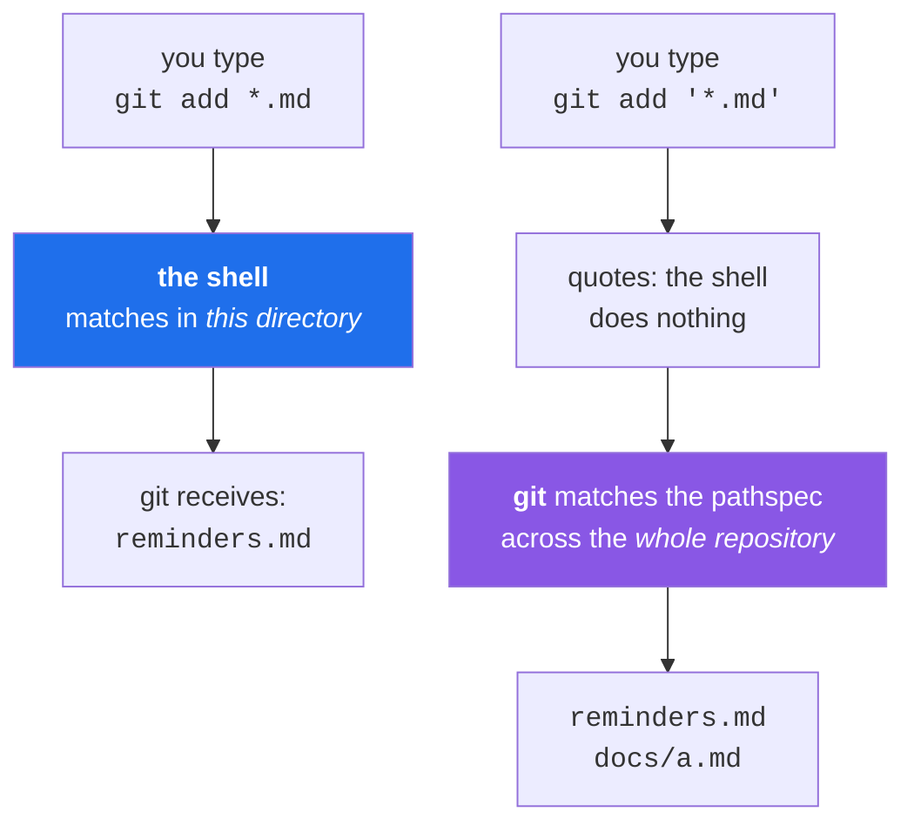

# 2.3 — Globs and pathspecs: who expands the star

> **One-line answer.** `git add *.md` and `git add '*.md'` are different commands — in the first the
> shell expands the star against the current directory and hands Git a list of names, in the second
> Git expands it against the whole repository — and knowing which you meant is the difference between
> staging two files and staging two hundred.

---

## The story

Two people are asked to bring "all the red folders".

The first looks around the room she is standing in, gathers the four red folders on the table, and
brings those. The second walks the whole building, floor by floor, and comes back with a trolley.

Both answered the question. The question did not say where to look, and each person supplied the
missing part from where they happened to be standing.

At a terminal, the same instruction is answered by two different parties depending on a detail that
looks like punctuation. One of them looks in the room. The other walks the building. And the
punctuation that decides it is a pair of quotes.

---

## The idea in plain language

A **glob** is a pattern that matches filenames: `*` matches any run of characters, `?` matches one,
`[abc]` matches one of those characters. It is not a regular expression — a different, larger language
that Day 23 introduces for searching *content*.

Here is the fact that this part exists for: **there are two entirely separate glob engines involved
when you type a Git command.**

**The shell's glob.** Before Git starts, the shell looks at `*.md`, finds every matching filename **in
the current directory**, and replaces the pattern with that list. Git receives filenames and never
sees a star. If nothing matches, bash leaves the pattern alone and Git receives a literal `*.md`.

**Git's pathspec.** If the pattern reaches Git unexpanded — because you quoted it — Git does its own
matching, and Git's rules are different: it matches against **every path in the repository**, at any
depth, not only the current directory.

So:

| You type | Who expands | What is matched |
|---|---|---|
| `git add *.md` | The shell | `.md` files **in this directory only** |
| `git add '*.md'` | Git | `.md` files **anywhere in the repository** |
| `git add .` | Nobody — `.` is a literal path | Everything under the current directory |

A **pathspec** is Git's name for a path or pattern argument. Day 15 teaches the full language,
including magic prefixes like `:/` (from the repository root) and `:(exclude)`. Today's job is only
this: know which engine you are addressing.



---

## Why the build needs it

**Day 15** is `git add` in full: `-A`, `-u`, `-N`, pathspecs, and the files you did not mean to stage.
Every one of its surprises is a consequence of this part.

**Day 20** is `.gitignore`, whose patterns are Git's own glob dialect — with rules about `/`, `**` and
negation that only make sense once you know Git has a glob engine of its own.

**Day 23** and **Day 26** filter logs and diffs by pathspec, which is how you ask "what happened to
this directory" on a repository too large to read.

**Day 233** writes Actions path filters for a monorepo, deciding which jobs run for which changes.
Those are the same patterns, evaluated by GitHub rather than by Git.

---

## The mechanism

### See what the shell hands over

```sh
printf '%s\n' *.md
```

```
reminders.md
shopping list.md
```

**Line by line:**

- `printf '%s\n'` — one argument per line, the argument inspector from
  [2.1](2.1-the-line-becomes-words.md).
- The shell expanded `*.md` **before `printf` started**, so `printf` received two filenames. It never
  saw a star.
- Only files in the current directory appear. A `docs/a.md` one level down does not match, because
  `*` does not cross a `/` in the shell's default matching.
- Note the second entry: a filename with a space, arriving correctly as one argument, because the
  shell's expansion produces separate arguments regardless of what is inside them. **Glob expansion is
  safe with awkward filenames in a way that unquoted variables are not** —
  [2.2](2.2-quoting.md)'s subject.

### The same command, two results

```sh
git add *.md
git status --short
```

```
A  "shopping list.md"
?? docs/
```

**Line by line:**

- The shell expanded the pattern to the files in this directory; Git staged those.
- `?? docs/` — still untracked, and note that Git printed the **directory** rather than the file
  inside it. Short status collapses a directory containing nothing but untracked files into one line,
  which keeps the output short and hides how much is in there. Day 14 covers that collapse and the
  `-uall` flag that undoes it.
- The file `docs/a.md` was never offered to Git at all, because the shell's star does not descend into
  a subdirectory.
- `A` means added to the index (Day 13), and Git quotes the filename with the space in it as
  [2.1](2.1-the-line-becomes-words.md) noted.

Now hand the pattern to Git instead:

```sh
git reset -q
git add '*.md'
git status --short
```

```
A  docs/a.md
A  "shopping list.md"
```

**Line by line:**

- `git reset -q` — unstage everything, leaving files on disk untouched. Day 54 is `reset` in full; here
  it is only clearing the board between demonstrations, and `-q` keeps it quiet.
- `'*.md'` — single quotes stop the shell, so Git receives a literal `*.md` and applies **its own**
  matching.
- **`docs/a.md` is now staged.** Git's pathspec matched across the whole repository, one level down, in
  a directory the shell's star never looked at.
- This is the difference between four red folders and a trolley, and it is expressed entirely in two
  apostrophes.

### When nothing matches, the two engines disagree

```sh
printf '%s\n' *.nosuchextension
```

```
*.nosuchextension
```

**Line by line:**

- Nothing matched, so bash left the pattern **as a literal string** and `printf` printed it. That is
  bash's default behaviour, and it is a trap: a command that expected filenames receives a pattern
  and treats it as a name.
- This is why a loop over `*.md` in an empty directory can process a file called `*.md`. The
  `nullglob` shell option changes it to expand to nothing instead; scripts that care set it
  deliberately.

```sh
git add '*.nosuchextension'
```

```
fatal: pathspec '*.nosuchextension' did not match any files
```

**Line by line:**

- Git's engine is stricter: a pathspec matching nothing is an error, not a silently passed-through
  string. Exit code `128`.
- **That difference is worth having in your hands.** When you want a failure if nothing matched — in a
  script, in a hook — let Git do the matching and check the exit code
  ([4.1](../04-exit-and-streams/4.1-exit-codes.md)).

### The third case, which is neither

```sh
git add .
```

**Line by line:**

- `.` is not a pattern. It is a literal path meaning "this directory"
  ([1.3](../01-paths/1.3-paths-and-who-expands-them.md)), and Git stages everything under it, recursively.
- From the repository root that is "everything". From `docs/` it is "everything in `docs/`". **The same
  three characters mean different things depending on where you are standing**, which is
  [1.2](../01-paths/1.2-the-working-directory.md)'s subject and the reason `git add .` has a bad reputation.
- The safer habits are `git add -A` for "everything in the repository regardless of where I am
  standing", and naming files explicitly. Day 15 compares all of them, including the case where `.`
  quietly stages a file you were still experimenting with.

### Git's own dialect has a wildcard the shell does not

Git's pathspecs — and `.gitignore` patterns — support `**`, meaning "any number of directories":

```sh
git add 'docs/**/*.md'
```

**Line by line:**

- `docs/**/*.md` — every `.md` file at any depth under `docs/`. Bash supports `**` only when the
  `globstar` option is enabled, so this pattern usually means "let Git do it" — hence the quotes.
- If you write this unquoted and it behaves unexpectedly, that is the shell's version of `**` (which,
  without `globstar`, is just `*`) rather than Git's.
- Day 20 covers `**` in `.gitignore` properly, including the rules for leading and trailing slashes,
  which are the most consequential and least intuitive part of that file.

---

## The same thing, three ways

| Surface | Selecting a set of files | Verdict |
|---|---|---|
| Terminal | Shell globs against the current directory, or quoted pathspecs against the whole repository — and Git's are the more powerful of the two, with `**`, `:/` and `:(exclude)` | **The only surface where you choose which engine matches**, and the only one where "everything ending in `.md`" can mean two different things. |
| github.com | The file finder (`t` on a repository page) does fuzzy matching over paths; path filters in a pull request's Files tab narrow the diff. Neither uses your shell | Different matching entirely, and no ambiguity — but also no way to *act* on the result beyond looking at it. |
| `gh` | Passes patterns through to Git or to the API depending on the command; `gh api` accepts no globs at all, because REST endpoints take exact paths | A reminder that globbing is a filesystem-and-Git concept: the API has no idea what a star is. |

**Which a professional reaches for:** quoted pathspecs, so Git does the matching. The reason is
consistency — a quoted pattern behaves identically from any directory and on any shell, while an
unquoted one depends on where you are standing and which shell options are set. In a script, that is
the difference between a command that is correct and one that is correct today.

---

## When it breaks

**A pattern matched nothing and was passed through.**

```
*.nosuchextension
```

*What it means:* not an error at all — bash's default when a glob matches nothing is to leave the
pattern in place. The command that receives it then usually fails with a confusing message about a
file whose name contains a star.

*Smallest fix:* quote the pattern so Git does the matching and errors honestly, or set `shopt -s
nullglob` in a script where "no matches" should mean "no arguments".

**Git refuses a pathspec that matches nothing.**

```
fatal: pathspec '*.nosuchextension' did not match any files
```

*What it means:* Git's engine treats an unmatched pathspec as an error. Exit code `128`, and nothing
was staged.

*Smallest fix:* check the pattern with `git ls-files '<pattern>'` first — it lists what a pathspec
matches without doing anything, which is the safe way to test one before using it in a command that
changes something.

**A pattern staged far more than expected.** No error. `git status` shows a hundred files.

*What it means:* you quoted the pattern, so Git matched it across the whole repository. Correct
behaviour, wrong instruction.

*Smallest fix:* `git reset` to unstage everything — files on disk are untouched — then repeat with the
pattern you meant. `git ls-files '<pattern>'` beforehand would have shown you the list without acting
on it.

**A pattern that behaved differently in a script.**

*What it means:* shell options differ between your interactive shell and a script — `globstar` for
`**`, `nullglob` for empty matches, `dotglob` for hidden files. A pattern that works at your prompt can
match a different set inside a script or a workflow step.

*Smallest fix:* quote it and let Git match. Git's pathspec rules do not depend on shell options, which
is the strongest practical argument for the quoted form.

---

## In production

**Ignore files, attribute files and CI filters are all this same matching, evaluated by different
engines.** `.gitignore` (Day 20) and `.gitattributes` (Day 91) are matched by Git; Actions `paths:`
filters (Day 233) are matched by GitHub's own implementation; `CODEOWNERS` (Day 145) is matched by
GitHub with its own precedence rules. They look alike and are not identical, which is why each of those
days tests its patterns rather than assuming — and why `git check-ignore -v <path>` from Day 0's part
[6.1](../../../day-00-foundry/parts/06-sandbox/6.1-the-four-repositories.md) is so valuable: it names the rule
that matched.

**`git add .` is the origin of a large share of accidental commits.** A build directory, a `.env` file,
a two-hundred-megabyte binary that then lives in the history forever
([1.1](../../../day-00-foundry/parts/01-install/1.1-what-git-actually-is.md) explains why deleting it later does
not help). The professional habits are staging by hunks (Day 16) and reading `git status` before every
commit, which is Day 14's subject and the reason that day calls `status` a diagnostic instrument
rather than a greeting.

**Pathspecs are how you work in a repository too big to read.** `git log -- 'src/**/*.ts'`,
`git diff --stat -- ':(exclude)vendor/'`, sparse-checkout patterns (Day 86) that fetch only part of a
monorepo. At a certain size, every command needs a pathspec, and the ones who know the language are
the ones who can still answer questions about the repository.

**What a senior reviewer says.** On a pull request containing an unrelated `dist/` directory: *"this
looks like `git add .` — check your `.gitignore` and drop these before we merge, because they're
noise in every future blame."* Day 20 is the ignore file, and Day 16's hunk staging is the habit that
would have prevented it.

**What it costs.** Nothing. Both engines are local and fast, though a pathspec on a very large
repository is doing real work — Git evaluates it against the index, which Day 13 introduces and Day 86
optimises with sparse-checkout.

**The interview question this is really testing.** *"What is the difference between `git add *.md` and
`git add '*.md'`?"* It is a small question with a big answer: unquoted, the shell expands the pattern
against the current directory and hands Git a list of filenames; quoted, Git receives the pattern and
matches it against every path in the repository, at any depth. Then the follow-up that shows you have
been bitten: *"which one fails when nothing matches?"* — Git's, with `fatal: pathspec … did not match
any files`; the shell's silently passes the pattern through.

---

## Check yourself

**Run this now**, from the root of a repository with at least one `.md` file in a subdirectory.
Predict which list will be longer:

```sh
printf '%s\n' *.md && git ls-files '*.md'
```

**Line by line:** the first prints what the **shell** matches — this directory only. The second asks
**Git** which tracked files its pathspec matches — the whole repository, at any depth.
`git ls-files` is the safe way to test a pathspec because it only reports; it changes nothing. `&&`
chains them ([4.2](../04-exit-and-streams/4.2-chaining-commands.md)). If the two lists are the same length, you have no
`.md` files in subdirectories — add one and run it again, because the difference is the lesson.

**Say this out loud.** Explain to a colleague why quoting a pattern makes Git see *more* files rather
than fewer — which is the opposite of what most people expect quotes to do.

---

**Next:** [3.1 — Environment variables, and how a child process inherits them](../03-child-processes/3.1-environment-variables.md) ·
[back to the hub](../../LESSON.md)
