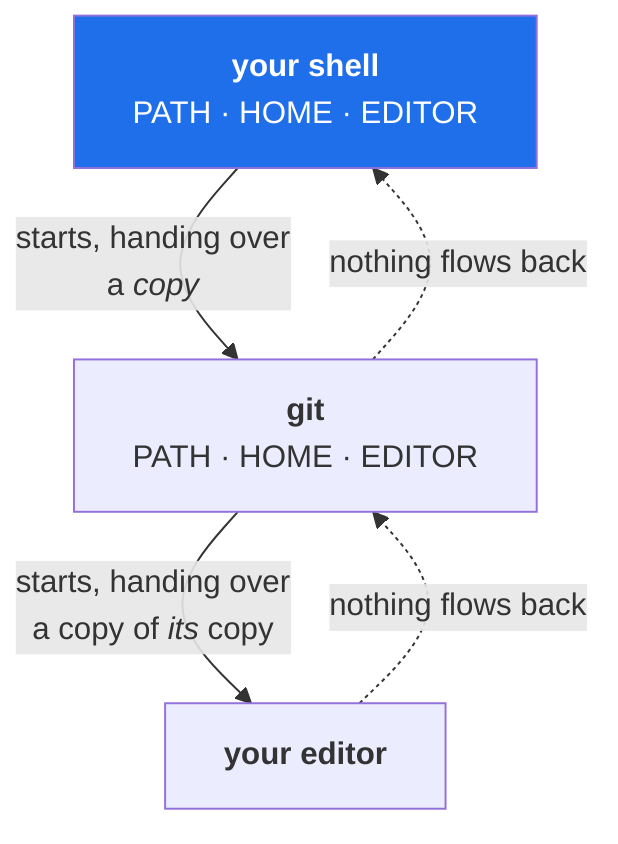

# 3.1 — Environment variables, and how a child process inherits them

> **One-line answer.** Every program starts with a copy of a set of named values handed down by
> whatever started it — a copy, not a link — which is why `export` exists, why a variable set in a
> script cannot reach your shell, and why a stale value in one terminal outlives the fix you made in
> another.

---

## The story

A relay team hands over a baton.

The second runner receives it, and everything the first runner knew about the race — the pace, the
wind, the fact that the inside lane is wet — has to be *on the baton* or it is not received at all.
The second runner cannot ask the first anything. The first is behind them, slowing down, and the race
has moved on.

Now imagine the second runner writes on the baton mid-race. The third runner sees it. The first
runner, standing at the start with their hands on their knees, never will.

That is the whole model. Information flows forwards, at the moment of handover, as a copy. Nothing
flows back, and nothing that happens after the handover reaches the runner behind you.

---

## The idea in plain language

A **variable** is a named value. In a shell there are two kinds, and the distinction is the point of
this part.

- A **shell variable** exists only inside the shell that set it. `name=Priya`.
- An **environment variable** is a shell variable that has been **exported**, which means it is copied
  into every program the shell starts from then on. `export name=Priya`, or `export name`.

When any program starts, the operating system hands it a block of `NAME=value` pairs — its
**environment**. The new process gets a **copy**. Three consequences follow, and every confusing thing
in this part is one of them:

1. **Changes flow downwards only.** A program can change its own environment, and pass the changes to
   programs *it* starts, but it cannot alter the environment of the program that started it. This is
   why `cd` had to be a shell builtin ([1.2](../01-paths/1.2-the-working-directory.md)) and why
   `eval "$(ssh-agent -s)"` from Day 0's part
   [4.2](../../../day-00-foundry/parts/04-auth/4.2-generating-an-ssh-key.md) looks so odd: `ssh-agent` cannot
   set variables in your shell, so it *prints* the commands and you run them yourself.
2. **A copy is taken at start time.** A terminal opened this morning holds this morning's environment.
   Editing a profile file afterwards changes nothing about it — the reason "open a new terminal" fixes
   so much.
3. **Every program you run can read all of it.** Environment variables are not secret from the
   programs you launch. That is what makes them the standard way to pass a token to a job, and also
   why a process listing or a crash dump can expose one.

You have already relied on all three. `PATH` is how the shell found `git`
([1.2](../../../day-00-foundry/parts/01-install/1.2-installing-git.md)). `HOME` is what `~` expands to
([1.3](../01-paths/1.3-paths-and-who-expands-them.md)). `GH_TOKEN` overriding a stored login
([5.1](../../../day-00-foundry/parts/05-cli-tools/5.1-gh-auth-login.md)) is exactly rule three.



---

## Why the build needs it

**[3.2](3.2-the-editor-chain.md) and [3.3](3.3-the-pager.md), next**, are two chains that consult
environment variables — `GIT_EDITOR`, `VISUAL`, `EDITOR`, `GIT_PAGER`, `PAGER`. Neither is
comprehensible without this part.

**Day 0's part [5.1](../../../day-00-foundry/parts/05-cli-tools/5.1-gh-auth-login.md)** showed `GH_TOKEN` in the
environment silently outranking a stored login. That is this mechanism producing a genuinely puzzling
afternoon.

**Day 161** passes secrets to GitHub Actions steps as environment variables, and **Day 179** is about
what happens when an untrusted value gets into one.

**Day 96** writes hooks, which Git runs with a modified environment — `GIT_DIR`, `GIT_INDEX_FILE` and
others are set for the hook, and a hook that runs Git commands without understanding that can act on
the wrong repository.

---

## The mechanism

### Shell variable, or environment variable?

```sh
GREETING="hello"
sh -c 'echo "child sees: [$GREETING]"'
```

```
child sees: []
```

**Line by line:**

- `GREETING="hello"` — a shell variable. No spaces around `=`, and quotes because
  [2.2](../02-quoting/2.2-quoting.md).
- `sh -c '…'` — start a **new shell** and run that command in it. This is the child process; the
  single quotes matter, because they stop *your* shell from expanding `$GREETING` before the child
  ever sees the text.
- `[]` — the child received nothing. The variable exists in your shell and was never handed over.

```sh
export GREETING
sh -c 'echo "child sees: [$GREETING]"'
```

```
child sees: [hello]
```

**Line by line:**

- `export GREETING` — mark this variable for export. Every program started from now on gets a copy.
  `export GREETING="hello"` does both steps at once and is what you will normally write.
- The child now sees it, because the value was copied into its environment at start-up.

### One command only

```sh
COLOUR=blue sh -c 'echo "one-shot: [$COLOUR]"'
sh -c 'echo "afterwards: [$COLOUR]"'
```

```
one-shot: [blue]
afterwards: []
```

**Line by line:**

- `COLOUR=blue <command>` — an assignment *before* a command sets that variable in the environment of
  that command only. Nothing persists.
- The second invocation sees nothing, proving it did not stick.
- **This is the form to use constantly.** `GIT_EDITOR=cat git commit`, `MSYS_NO_PATHCONV=1 docker …`,
  `GH_TOKEN="$TOKEN" gh api …` — every one of those is a temporary answer that cannot leak into your
  next command or contaminate another terminal.

### Removing one for a single command

```sh
env -u GREETING sh -c 'echo "unset for this child: [$GREETING]"'
```

```
unset for this child: []
```

**Line by line:**

- `env` — run a program with a modified environment. Without arguments it prints the whole environment,
  which is the other way people use it.
- `-u NAME` — **u**nset that variable for the command being run. Nothing about your shell changes.
- This is how you test whether a variable is causing a problem — the `GH_TOKEN` case from Day 0's part
  [5.1](../../../day-00-foundry/parts/05-cli-tools/5.1-gh-auth-login.md) is diagnosed in exactly one command this
  way.

### Asking whether one is set

```sh
printenv GREETING; echo "exit=$?"
printenv NOT_SET_ANYWHERE; echo "exit=$?"
```

```
hello
exit=0
exit=1
```

**Line by line:**

- `printenv NAME` — print one environment variable, exiting `1` if it does not exist. That exit code is
  what makes it usable in a script, and [4.1](../04-exit-and-streams/4.1-exit-codes.md) is the part about reading it.
- Note the difference from `echo "$NAME"`, which prints an empty line and succeeds whether or not the
  variable exists. **Empty and absent are different states**, and a script that cannot tell them apart
  behaves oddly for exactly one user.

### Git reads the environment too

```sh
GIT_AUTHOR_NAME="Deniz" GIT_AUTHOR_EMAIL="deniz@example.com" git commit -q --allow-empty -m "an empty commit by Deniz"
git log -1 --format='author: %an <%ae>%ncommitter: %cn <%ce>'
```

```
author: Deniz <deniz@example.com>
committer: Priya Raman <priya@example.com>
```

**Line by line:**

- `GIT_AUTHOR_NAME` and `GIT_AUTHOR_EMAIL` — environment variables that override the configured
  identity for this one command. Day 0's part
  [2.2](../../../day-00-foundry/parts/02-identity/2.2-identity-in-every-commit.md) taught the two identities on a
  commit; here the author came from the environment and the committer from the configuration.
- `--allow-empty` — permit a commit with no changes, so the demonstration needs no file edits.
- **This is how a script commits as a specific identity** without writing anything into a configuration
  file — the technique Day 187's release automation uses, and the reason a build agent needs no global
  configuration at all.
- Git has dozens of these. `git help environment` lists them, using the door from Day 0's part
  [1.3](../../../day-00-foundry/parts/01-install/1.3-version-and-help.md).

### Why `eval "$(ssh-agent -s)"` is spelled that way

Rule one, in the wild. `ssh-agent` starts a background process and needs two variables set **in your
shell** so that other programs can find it. It cannot set them: it is a child, and children cannot
write to a parent's environment. So it prints shell commands instead, and `eval` runs those commands in
your current shell rather than in a new one.

Every time you see that idiom — for `ssh-agent`, for version managers, for cloud CLIs — it is this
rule being worked around. **Nothing can set a variable in your shell except your shell.**

---

## The same thing, three ways

| Surface | Passing configuration to a program | Verdict |
|---|---|---|
| Terminal | `export` for the session, `NAME=value command` for one invocation, `env -u` to remove one — plus Git's own `GIT_*` variables for per-command overrides | **The most immediate surface**, and the only one where "for this command only" exists. |
| github.com | Repository, environment and organization **secrets and variables**, set in Settings and injected into workflow runs. Same concept, stored on the server and audited | **The right place for anything shared or sensitive**: a secret in the settings is rotatable and access-controlled, one in a file is not. Day 161. |
| `gh` | Reads `GH_TOKEN`, `GH_HOST`, `GH_REPO`, `GH_EDITOR`, `GH_PAGER` and more — documented at <https://cli.github.com/manual/gh_help_environment>, fetched 2026-08-23 — and `gh secret set` writes the repository secrets the workflow will receive | The bridge: the same mechanism on your machine and on the runner, which is what makes a workflow debuggable locally. |

**Which a professional reaches for:** the one-command form, almost always. A variable exported into a
long-lived shell is a variable you will forget you set, and the failure it eventually causes will look
like something else entirely — which is precisely the `GH_TOKEN` story from Day 0.

---

## When it breaks

**A value that will not go away.** You edited your profile, or unset the variable, and the old value is
still in effect.

*What it means:* the running shell holds the copy it was given at start-up, and each terminal is a
separate copy. Nothing you do in one terminal changes another.

*Smallest fix:* `unset NAME` in this shell for right now, and a new terminal for anything you changed
in a profile file. To find out where it came from, `env | grep NAME` shows the current value and
`grep -rn NAME ~/.bashrc ~/.bash_profile ~/.profile` usually finds who sets it.

**A variable that reaches a program you did not expect.** No error — a program behaves differently
because something in the environment told it to.

*What it means:* export is inherited by *every* descendant, including editors, hooks and anything a
script launches. A `GIT_DIR` or `GH_REPO` exported hours ago will quietly redirect commands that seem
unrelated.

*Smallest fix:* `env | sort | grep -E 'GIT_|GH_'` to see what Git and `gh` are being told, then
`env -u NAME <command>` to test the theory in one command.

**An empty value that should have been an absent one.**

```
exit=1
```

*What it means:* `printenv NOT_SET_ANYWHERE` printed nothing and exited `1`. The distinction matters in
scripts: `if [ -z "$X" ]` is true for both empty and unset, while `if [ -z "${X+set}" ]` distinguishes
them. A configuration value deliberately set to empty — "no pager", "no editor" — is a real thing, and
a script that treats it as unset does the wrong thing.

*Smallest fix:* use `printenv` and its exit code when you need to know whether a variable exists.

**A secret in the environment appearing in a log.** Not an error; a leak.

*What it means:* environment variables are visible to every program in the process, and many tools dump
their environment when they crash or when a debug flag is on.

*Smallest fix:* never `env` in a pipeline log, and prefer values read from a file or a credential
helper over exported secrets in an interactive shell. Day 161 covers how Actions masks secrets in logs
and why masking is a mitigation rather than a guarantee.

---

## In production

**The environment is the standard configuration interface for anything containerised.** A container
image is fixed; the environment is how one image becomes a development instance and a production
instance. GitHub Actions passes secrets this way, cloud runtimes pass credentials this way, and
twelve-factor configuration is essentially this rule written down.

**The inheritance rule is why CI is different from your laptop.** A workflow step starts with an
environment assembled by the runner: no `~/.gitconfig`, no `SSH_AUTH_SOCK`, no `EDITOR`, and a `PATH`
that is not yours. Every "works locally, fails in CI" story is somebody discovering that something they
relied on was inherited from a shell rather than declared. Day 156 covers `env:` at the workflow, job
and step level, and the professional habit is to declare what a step needs rather than assume it.

**Exported secrets are visible to every process you start.** A token exported into your interactive
shell is readable by every command you run afterwards, including anything installed from a package
manager that day. This is the argument for credential helpers (Day 0's part
[4.4](../../../day-00-foundry/parts/04-auth/4.4-credential-helpers.md)) over `export GITHUB_TOKEN=…`, and for
the one-command form when you do need it.

**What a senior reviewer says.** On a workflow step that begins `export TOKEN=$(…)`: *"scope it to the
step with `env:` — exporting it makes it visible to every later step and to anything they invoke."*
Narrowing the reach of a value is the same instinct as narrowing a token's scope in Day 0's part
[4.5](../../../day-00-foundry/parts/04-auth/4.5-personal-access-tokens.md).

**What it costs.** Nothing. The environment is a few kilobytes of strings.

**The interview question this is really testing.** *"Why can't a script change your shell's current
directory or set a variable in your shell?"* The answer is one mechanism with two consequences: a
child process gets a **copy** of the environment and has its own working directory, so nothing it does
propagates upwards. And the follow-up that proves you have used it: *"so how do tools like `ssh-agent`
manage it?"* — they print shell commands for you to `eval`, or you `source` the script so it runs in
your shell instead of a child.

---

## Check yourself

**Run this now.** Predict both bracketed values before you press return:

```sh
COLOUR=blue sh -c 'echo "child: [$COLOUR]"'; echo "parent: [$COLOUR]"
```

**Line by line:** the first sets `COLOUR` for that one command and starts a child shell, which prints
what it inherited. The `;` runs the second command regardless ([4.2](../04-exit-and-streams/4.2-chaining-commands.md)),
and your own shell prints what it has — which is nothing, because the assignment applied only to the
child. If you predicted `[blue]` then `[]`, you have the model.

**Say this out loud.** Explain why opening a new terminal fixes a surprising number of problems — and
then say what it does *not* fix, and why.

---

**Next:** [3.2 — The editor chain, and escaping the screen you cannot leave](3.2-the-editor-chain.md) ·
[back to the hub](../../LESSON.md)
