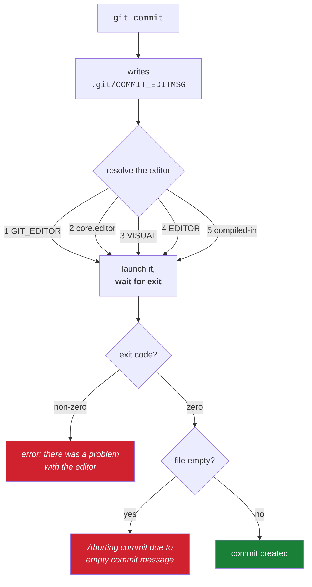

# 3.2 — The editor chain, and escaping the screen you cannot leave

> **One-line answer.** When Git needs prose it writes a file, launches an editor chosen by a five-step
> preference chain, waits for that editor to exit, and reads the file back — so an editor that returns
> immediately looks exactly like a person who wrote nothing.

---

## The story

A form is left on a desk with a note: *fill this in, and put it in the tray when you are done.*

The person comes back later, takes the form from the tray, and reads it. Blank.

Now: did the colleague read it and decide there was nothing to add? Did they never see it? Did they
fill it in on a different copy? From the tray, all three look identical, and the only thing the
returning person actually knows is *the form in the tray is blank*.

That is exactly Git's position. It writes a file, hands it to something, and waits. When control comes
back it reads the file. If the file is empty, Git cannot tell whether you thought about it and changed
your mind, or whether the editor never really opened — and it takes the only safe interpretation
available: **an empty message means do not commit.**

---

## The idea in plain language

Several Git commands need text from you that is too long for a command line: a commit message without
`-m`, a tag annotation, a merge message, the todo list of an interactive rebase.

The sequence is always the same:

1. Git writes a file — `.git/COMMIT_EDITMSG` for a commit — containing a template.
2. Git launches an **editor**, giving it that filename as an argument.
3. Git **waits** for the editor process to exit.
4. Git reads the file back, strips the comment lines, and uses what remains.
5. If what remains is empty, Git aborts.

Step three is where graphical editors go wrong, and step five is where the failure appears.

**Which editor?** A chain, documented in `git help var` and fetched from
<https://git-scm.com/docs/git-var> on 2026-08-23:

> *"The order of preference is `$GIT_EDITOR`, then `core.editor` configuration value, then `$VISUAL`,
> then `$EDITOR`, and then the default chosen at compile time, which is usually vi."*

| Rank | Source | Set it when |
|---|---|---|
| 1 | `GIT_EDITOR` environment variable | For one command — `GIT_EDITOR=cat git commit` |
| 2 | `core.editor` configuration | Your permanent choice for Git ([2.1](../../../day-00-foundry/parts/02-identity/2.1-config-and-scopes.md) for the scopes) |
| 3 | `VISUAL` environment variable | A full-screen editor for every program on the machine |
| 4 | `EDITOR` environment variable | A basic editor for every program on the machine |
| 5 | compiled-in default | Nothing else is set — usually `vi` |

`VISUAL` and `EDITOR` are older Unix conventions honoured by many programs, not by Git alone — which
is why setting `EDITOR` fixes your editor in `crontab` and `gh` at the same time. Day 0's part
[5.2](../../../day-00-foundry/parts/05-cli-tools/5.2-editor-and-pager.md) set the Git-specific one; this part is the
mechanism underneath it.

---

## Why the build needs it

**Day 18** is commit message craft — subject, body, trailers — and none of that shape can be written
with `-m`.

**Day 60** is interactive rebase, where the editor receives a **todo list** that is effectively a
program: lines saying `pick`, `reword`, `squash`. An editor you cannot drive makes that day impossible,
and `GIT_SEQUENCE_EDITOR` — a separate chain for exactly that file — is how Day 61 automates it.

**Day 45** puts conflict markers in front of you, in your editor, at the moment a merge stops.

**Day 96** writes a `commit-msg` hook, which receives the same file this part is about and can reject
what you wrote.

---

## The mechanism

### Which editor will Git use, right now

```sh
git var GIT_EDITOR
```

```
vim
```

**Line by line:**

- `git var` resolves the whole chain and tells you the winner, which `git config --get core.editor`
  cannot do — that reports one link, and may report nothing while an environment variable is quietly
  winning.
- On this machine nothing was configured, so the answer is the compiled-in default.

### Watch each link win in turn

```sh
git config --global core.editor "nano"
echo "core.editor only        -> $(git var GIT_EDITOR)"
echo "with EDITOR and VISUAL  -> $(EDITOR=vim VISUAL=emacs git var GIT_EDITOR)"
git config --global --unset core.editor
echo "no core.editor          -> $(EDITOR=vim VISUAL=emacs git var GIT_EDITOR)"
echo "GIT_EDITOR beats all    -> $(GIT_EDITOR=ed EDITOR=vim VISUAL=emacs git var GIT_EDITOR)"
```

```
core.editor only        -> nano
with EDITOR and VISUAL  -> nano
no core.editor          -> emacs
GIT_EDITOR beats all    -> ed
```

**Line by line:**

- `$( … )` — command substitution: run the command and put its output here
  ([2.2](../02-quoting/2.2-quoting.md)).
- `EDITOR=vim VISUAL=emacs git var …` — set two environment variables for one command
  ([3.1](3.1-environment-variables.md)).
- Line 2: `core.editor` beat both environment variables, because configuration outranks `VISUAL` and
  `EDITOR` in the chain.
- Line 3: with `core.editor` removed, `VISUAL` won over `EDITOR` — the older convention that `VISUAL`
  is the full-screen editor and `EDITOR` the fallback line editor.
- Line 4: `GIT_EDITOR` beat everything, which is what makes it the right tool for a one-off.

### What Git actually hands the editor

```sh
GIT_EDITOR='cat' git commit
```

```
# Please enter the commit message for your changes. Lines starting
# with '#' will be ignored, and an empty message aborts the commit.
#
# On branch main
# Changes to be committed:
#	modified:   reminders.md
#
Aborting commit due to empty commit message.
```

**Line by line:**

- `GIT_EDITOR='cat'` — use `cat` as the "editor". `cat` prints the file and exits, which lets you see
  the template Git prepared without opening anything.
- The blank first line is where your message goes.
- `an empty message aborts the commit` — Git stating the rule from step five.
- Because `cat` changed nothing, the message was empty, and Git aborted. Exit code `1`, no commit made,
  staged changes untouched. **This is precisely what a misconfigured graphical editor looks like.**

### An editor that fails outright

```sh
GIT_EDITOR=false git commit
```

```
error: there was a problem with the editor 'false'
Please supply the message using either -m or -F option.
```

**Line by line:**

- `false` is a real program whose only job is to exit with status `1`
  ([4.1](../04-exit-and-streams/4.1-exit-codes.md)).
- Git checked the editor's exit code, saw a failure, and stopped — a different failure from the empty
  message above, with a different message. **Read which one you got**: "problem with the editor" means
  it ran and failed; "empty commit message" means it ran, succeeded, and wrote nothing.
- The message names the editor in quotes — `'false'` — which is how you discover a typo or an unquoted
  path with a space in it.
- `-m` and `-F` are the two ways to avoid the editor entirely, and `-F -` reads from standard input,
  which is what a script does.

### An editor that writes something

```sh
GIT_EDITOR='printf "written by the editor\n" >' git commit
git log -1 --format='%s'
```

```
[main 8fba92d] written by the editor
 2 files changed, 2 insertions(+)
 create mode 100644 docs/a.md
written by the editor
```

**Line by line:**

- The "editor" here is a shell fragment ending in `>`, so when Git appends the filename the whole thing
  becomes `printf "…" > .git/COMMIT_EDITMSG`. Git runs the editor value **through a shell**, which is
  why this works — and why an editor path containing spaces must be quoted in the configuration.
- Git read the file back, found a message, and committed.
- This is the trick behind non-interactive automation, and it is one step from the real answer:
  `git commit -F message.txt`.

### The `--wait` problem, stated precisely

A graphical editor is usually already running. Launching `code file.txt` sends the file to the running
instance and **the launcher exits immediately** — so Git's step three finishes in milliseconds, and
step four reads a file you have not touched yet.

```sh
git config --global core.editor "code --wait"
```

**Line by line:**

- `--wait` tells the launcher to stay running until the file's tab is closed. Only then does Git
  continue.
- Every graphical editor has an equivalent flag. Without it you get the empty-message abort above,
  which is why that failure is the most common editor problem in this curriculum.
- Verify with `git var GIT_EDITOR`, then test with a real commit. **The quotes matter**: the value
  contains a space, and Day 0's part
  [2.1](../../../day-00-foundry/parts/02-identity/2.1-config-and-scopes.md) writes it into a file where the space
  is fine, but typing it unquoted at the shell would split it
  ([2.1](../02-quoting/2.1-the-line-becomes-words.md)).

### Getting out of `vi`

If the chain landed you in the compiled-in default and the keyboard seems dead:

| Keys | What happens |
|---|---|
| `Esc` then `:wq` then return | Write the file and quit — Git proceeds with your message |
| `Esc` then `:q!` then return | Quit without writing — Git sees an empty message and aborts |
| `i` | Enter insert mode, where typing types |

`vi` starts in *command* mode, where letters are commands rather than text. That is the entire
explanation for "my keyboard does nothing", and knowing the four keys above is worth it even if you
never choose `vi`, because it is the default on servers you did not configure.



---

## The same thing, three ways

| Surface | Writing the prose a change needs | Verdict |
|---|---|---|
| Terminal | The chain above; `git commit` for the editor, `-m` for one line, `-F file` or `-F -` when the text comes from somewhere else | **The only surface with a chain to get wrong** — and the only one where a script can supply the text. |
| github.com | A textarea in the browser: commit messages on the web editor, pull request descriptions, release notes. No chain, no waiting, no empty-message ambiguity | Genuinely the better place to write a long description, and Principle 15 says so without embarrassment. A pull request body is prose for humans; write it where writing is comfortable. |
| `gh` | Uses its own editor setting — `GH_EDITOR`, then `GIT_EDITOR`, then `VISUAL`, then `EDITOR`, per <https://cli.github.com/manual/gh_help_environment> (fetched 2026-08-23) — for `gh pr create` and `gh issue create`, and accepts `--body-file` to skip it | Same idea, one extra variable at the front. `--body-file` is the professional habit, for the same reason `git commit -F` is. |

**Which a professional reaches for:** the editor for commit messages, because a commit message deserves
a body and `-m` discourages one; `-F` or `--body-file` in anything scripted; and the browser for a long
pull request description, where formatting and preview matter more than staying at the keyboard.

---

## When it breaks

**The editor returned immediately and nothing was written.**

```
Aborting commit due to empty commit message.
```

*What it means:* Git got control back with an empty file. Either you genuinely wrote nothing, or your
editor is a launcher that exits at once — the `--wait` case.

*Smallest fix:* add the wait flag for your editor, confirm with `git var GIT_EDITOR`, and commit again.
Nothing was lost; your staged changes are exactly where they were.

**The editor could not run.**

```
error: there was a problem with the editor 'false'
Please supply the message using either -m or -F option.
```

*What it means:* the editor exited non-zero. Read the name in quotes: a typo, a program that is not
installed, or a path with a space that was not quoted in the configuration.

*Smallest fix:* `git var GIT_EDITOR` to see what Git is trying to run, then fix `core.editor`. The
message's own suggestion — `-m` or `-F` — is a good immediate workaround when you are mid-task.

**No editor at all, on a machine that has none.** In a container or a minimal build image, the chain
falls through to a compiled-in default that may not be installed.

*What it means:* an automated context tried to open an editor, which is almost always a sign that a
command was run without the flag that avoids one.

*Smallest fix:* supply the text — `-m`, `-F file`, or `-F -` — rather than installing an editor. A
script that needs an editor is a script that will hang the first time it runs unattended.

**The rebase todo list opened in something you cannot drive.** Day 60's problem, and it uses a
different chain: `GIT_SEQUENCE_EDITOR`, then `sequence.editor`, then whatever `git var GIT_EDITOR`
resolves to — again from <https://git-scm.com/docs/git-var>, fetched 2026-08-23.

*Smallest fix:* `git rebase --abort` gets you out of the operation entirely; then set the editor and
start again.

---

## In production

**Automation never opens an editor.** A release script writes the message to a file and uses `-F`; a
bot passes `-m`; an interactive rebase in CI sets `GIT_SEQUENCE_EDITOR=true` so the todo list is
accepted unmodified. Day 61's `--exec` work and Day 187's release automation both depend on that.

**The commit message is a durable artefact, and the editor is what makes it possible to write one
properly.** Release notes are generated from messages (Day 184), `git log --grep` searches them,
`git blame` surfaces them years later, and Day 18 argues that the body — the *why* — is the part that
survives. A workflow that only ever uses `-m` produces a history of subjects with no reasoning in it.

**Hooks can reject what the editor produced.** A `commit-msg` hook receives the file and can exit
non-zero to refuse it — enforcing a conventional-commit prefix, a ticket reference, a line length.
Day 96 writes one, and this part is why it receives a *file* rather than a string.

**What a senior reviewer says.** On a pull request whose commits are all one-line messages: *"what did
you try that didn't work? Put it in the body — the diff shows what, the message should say why."* The
editor is the tool that makes that possible, and configuring it properly on the first day is why it
gets a part here rather than a footnote later.

**What it costs.** Nothing.

**The interview question this is really testing.** *"Git opened an editor and then said the commit was
aborted. What happened?"* The strong answer separates the two failures: if the editor exited non-zero,
Git says there was a problem with the editor; if it exited cleanly and the file was empty, Git aborts
for an empty message — and the common cause of the second is a graphical editor without its wait flag,
because Git's contract is *launch, wait, read the file back*.

---

## Check yourself

**Run this now.** Predict which of the five links in the chain will supply the answer:

```sh
git var GIT_EDITOR && git config --get core.editor
```

**Line by line:** the first resolves the whole chain and prints the winner; the second prints only the
configuration setting, and exits `1` printing nothing if it is unset
([4.1](../04-exit-and-streams/4.1-exit-codes.md)). If the two disagree — or the second fails while the first prints
something — you have just watched the chain in action, and you know an environment variable or a
compiled-in default is deciding your editor.

**Say this out loud.** Explain why Git cannot tell the difference between "the user decided not to
commit" and "the editor never opened" — and name the one thing about the editor's behaviour that would
make them distinguishable if Git could see it.

---

**Next:** [3.3 — The pager: why the screen stopped, and the keys that move it](3.3-the-pager.md) ·
[back to the hub](../../LESSON.md)
