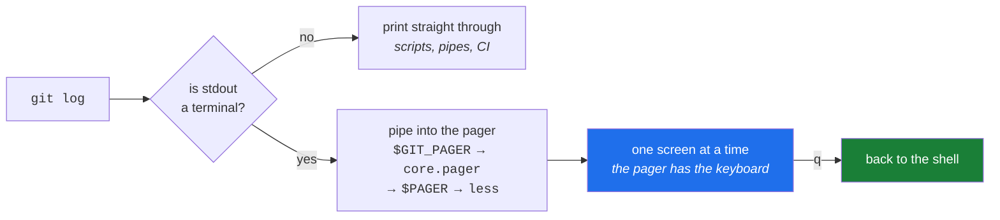

# 3.3 — The pager: why the screen stopped, and the keys that move it

> **One-line answer.** When Git's output is going to a terminal and might not fit, it pipes the output
> through a second program that shows one screenful at a time — so the prompt has not hung, another
> program has the keyboard, and `q` gives it back.

---

## The story

A librarian is asked for everything on a subject and wheels out a trolley.

The person who asked stands there. They cannot read a trolley. What they wanted was the first page, and
then a way to say *next*, and a way to say *stop, that's the one*.

A good librarian does not hand over a trolley. They hand over the first book, open, and wait — and the
waiting is the service, not an obstruction. But somebody who has never been handed a book this way, who
expected a stack on the desk and instead finds a person holding one page and looking at them
expectantly, experiences the pause as a malfunction.

Nothing is broken. Somebody is waiting for you, and you have not learned the word for *next*.

---

## The idea in plain language

A **pager** is a program that displays long text one screenful at a time and waits for a keypress
between screens. On almost every system this curriculum runs on, it is `less`.

Git uses one for commands whose output can be long: `log`, `diff`, `show`, `help`, `branch` on a
repository with many branches. The mechanism is a **pipe** — Git's output goes into the pager instead
of the screen, and the pager draws the screen. Section 04's part
[4.3](../04-exit-and-streams/4.3-stdout-and-stderr.md) is about pipes properly.

Two rules govern when it happens, and both matter:

1. **Only when the output is a terminal.** If you pipe Git into another command or redirect it to a
   file, there is nobody to page for, so Git does not launch one. This is why the same command behaves
   differently in a script — and why a workflow step never hangs waiting for a keypress.
2. **Which pager** is a chain, like the editor's. From `git help var`, fetched from
   <https://git-scm.com/docs/git-var> on 2026-08-23: *"The order of preference is `$GIT_PAGER`, then
   the value of `core.pager` configuration, then `$PAGER`, and then the default chosen at compile time
   (usually less)."*

And one detail that explains most of the pager's behaviour. From Git's own configuration
documentation, fetched from `Documentation/config/core.adoc` in Git's source on 2026-08-23: when the
`LESS` environment variable is unset, **Git sets it to `FRX`**.

| Letter | What it does | Why you notice |
|---|---|---|
| `F` | Quit immediately if the output fits on one screen | Short `git log` does not trap you; long one does |
| `R` | Pass colour codes through | Without it, colour appears as `ESC[31m` gibberish |
| `X` | Do not clear the screen on exit | The output stays in your scrollback afterwards |

That is why Git's pager feels different from running `less` yourself, and why setting `LESS` in your
profile changes Git's behaviour in ways that look unrelated.

---

## Why the build needs it

**Day 23** is `git log`'s flags, and every one of them produces paged output. Searching inside the
pager with `/pattern` is what turns that day from reading into querying.

**Day 26** is `git diff` in all four positions. A diff of any size is read in a pager, and `-S` for
long lines is the difference between a readable column and a wall.

**Day 38** reads `--graph` topology, where scrolling sideways matters because the graph column pushes
the subject line to the right.

**Day 155 onward** runs Git in workflows, where rule one — no terminal, no pager — is what keeps a step
from hanging forever. When a step *does* hang, a forced pager is one of the first things to suspect.

---

## The mechanism

### Which pager, and where from

```sh
git var GIT_PAGER
git config --get core.pager; echo "exit=$?"
```

```
less
exit=1
```

**Line by line:**

- `git var GIT_PAGER` — resolve the whole chain and print the winner, exactly as
  [3.2](3.2-the-editor-chain.md) did for the editor.
- `git config --get core.pager` printed nothing and exited `1`, meaning it is not set — so the answer
  came from further down the chain. Reading both together is how you find out *which link* is
  deciding.

### The pager only appears for a terminal

```sh
git log --oneline -1 | cat
```

```
8fba92d written by the editor
```

**Line by line:**

- `|` — a pipe: send Git's output to `cat` instead of the screen ([4.3](../04-exit-and-streams/4.3-stdout-and-stderr.md)).
- No pager ran. Git detected that its output was not a terminal and printed straight through.
- **This is why every example in this curriculum can be captured as text.** It is also why "Git behaves
  differently in my script" is usually this rule rather than anything mysterious.

### Turning it off deliberately

```sh
git --no-pager log --oneline -1
git -c core.pager=cat log --oneline -1
```

```
8fba92d written by the editor
8fba92d written by the editor
```

**Line by line:**

- `--no-pager` — an option to `git` itself, so it goes **before** the subcommand. Use it when you want
  the output to stay in your scrollback rather than take over the screen.
- `-c core.pager=cat` — the configuration route, for one command
  ([2.1](../../../day-00-foundry/parts/02-identity/2.1-config-and-scopes.md)). Equivalent here, and the form to use
  in a script where you want to be explicit about *why*.
- `GIT_PAGER=cat git log …` is the third spelling, using the environment
  ([3.1](3.1-environment-variables.md)). All three exist because all three layers exist.

### Making it yours

```sh
git config --global core.pager "less -FRX -S"
```

**Line by line:**

- Setting `core.pager` explicitly overrides the chain and lets you add flags.
- `-FRX` — keep Git's three defaults, because setting `core.pager` yourself means Git's `LESS=FRX`
  default no longer applies in the same way. Dropping them by accident is why somebody's pager
  suddenly clears the screen on exit and loses their output.
- `-S` — do not wrap long lines; scroll sideways instead. On wide diffs and `--graph` output this is
  the single most useful flag.
- Per-command pagers exist too: `pager.diff`, `pager.log`, `pager.branch`. `git config --global
  pager.branch false` is a common choice, because a list of branches rarely needs paging and being
  paged for six lines is irritating.

### The keys, which are `less`'s and not Git's

| Key | What it does |
|---|---|
| `q` | **Quit.** The answer to "the terminal is stuck" |
| `Space` / `b` | Forward / back one screen |
| `↓` `↑` or `j` `k` | One line at a time |
| `/pattern` then return | Search forward; `n` for the next match, `N` for the previous |
| `?pattern` | Search backwards |
| `g` / `G` | Jump to the top / the bottom |
| `-S` then return | Toggle line wrapping from inside the pager |
| `h` | The pager's own help — and `q` to leave it again |

**These are `less`'s keys.** They work in `git log`, in `man`, in `git help`, and in every other
program that pages — which is why learning them once pays off far beyond Git.

The most useful of them is `/`. On a long `git log`, typing `/refactor` and pressing return jumps to
the first commit mentioning it. That is a search over the output you already have, without re-running
anything — and Day 23's `--grep` flag is the version that filters before the output is produced, for
when the history is too large to page at all.



---

## The same thing, three ways

| Surface | Reading more output than fits | Verdict |
|---|---|---|
| Terminal | A pager, with search, sideways scrolling and `q` — and `--no-pager` when you would rather have the text in your scrollback | **The fastest surface for searching**, once `/` is a reflex, and the only one that works over SSH on a machine with no browser. |
| github.com | Pagination and infinite scroll: commit lists in pages, diffs collapsed with "Load diff" for large files, and a search box that queries the server rather than the text on screen | **Better for browsing**, worse for "find the one line". A large diff is genuinely easier to read here — Principle 15 again. |
| `gh` | Uses its own pager chain — `GH_PAGER`, then `PAGER`, per <https://cli.github.com/manual/gh_help_environment> (fetched 2026-08-23) — so `gh pr diff` and `gh run view` page too, with the same keys | Same muscle memory, one extra variable at the front. `gh config set pager cat` turns it off globally if you prefer scrollback. |

**Which a professional reaches for:** the terminal with `/` for finding something in output they
already have, and the browser for reading a large change carefully. The habit worth building today is
smaller than either: **`q` without thinking about it**, so a paged screen never registers as a problem.

---

## When it breaks

**The screen filled and the prompt did not come back.**

```
(END)
```

*What it means:* the pager is showing the end of the output and waiting. Git has finished; another
program has the keyboard. Nothing is stuck and nothing is lost.

*Smallest fix:* `q`. If your output ends mid-file rather than at `(END)`, `q` still works — there is no
state to lose, because a pager only reads.

**Colour codes appear as gibberish**, scattered through the text where the colours should be.

To see the bytes themselves rather than their effect, ask for colour and then pipe the result through
something that refuses to interpret it:

```sh
cd sandbox/contract
printf 'read a book\n' >> reminders.md
git diff --color=always -- reminders.md | cat -v
```

```
^[[1mdiff --git a/reminders.md b/reminders.md^[[m
^[[1mindex b9feddc..75635a2 100644^[[m
^[[1m--- a/reminders.md^[[m
^[[1m+++ b/reminders.md^[[m
^[[36m@@ -1 +1,2 @@^[[m
 water the plants^[[m
^[[32m+^[[m^[[32mread a book^[[m
```

**Line by line:**

- `printf … >> reminders.md` — appends a line, so that there is a difference to colour. `>>` appends
  where `>` would replace, which is the distinction
  [4.3](../04-exit-and-streams/4.3-stdout-and-stderr.md) is entirely about. Undo it afterwards with
  `git restore reminders.md`.
- `--color=always` — Git suppresses colour when its output is not going to a terminal, and a pipe is
  not a terminal ([4.3](../04-exit-and-streams/4.3-stdout-and-stderr.md) is why). `always` overrides
  that, which is the only reason there is anything to see here.
- `cat -v` — print non-printing characters visibly instead of acting on them. `^[` is how it writes
  the escape character, byte `0x1b`.
- `^[[32m` — "switch to green"; `^[[m` — "back to normal". The `+` and the added text are wrapped in
  the first, which is why an added line is green.
- **The two short hashes on the `index` line will be identical on your machine**, which is unusual
  enough in this curriculum to be worth stopping on. They are hashes of the file's *contents* before
  and after, not of your commit — and because the sandbox gave everyone the same two lines, everyone
  gets `b9feddc` and `75635a2`. That is content addressing, from Day 0's part
  [1.1](../../../day-00-foundry/parts/01-install/1.1-what-git-actually-is.md), visible in ordinary
  output for the first time.
- **Nothing here is corruption.** The colours you normally see *are* these bytes, acted on rather than
  printed. A pager without `R` prints them, and `less` renders that same escape byte as the text
  `ESC` — so the screen fills with `ESC[32m` where the green should have been.

*What it means:* the pager is not passing colour escape sequences through — the `R` in `LESS=FRX`. This
happens when `LESS` is set in your profile without `R`, or when `core.pager` was set to `less` without
flags.

*Smallest fix:* `git config --global core.pager "less -FRX"`, or add `R` to your `LESS` value. The
same fix applies to `git diff` output through a pipe, where `--color=always` forces colour that would
otherwise be suppressed for a non-terminal.

**The pager clears the screen and your output vanishes when you quit.**

*What it means:* the `X` is missing. Without it, `less` restores the screen as it was before, taking
the output with it.

*Smallest fix:* include `X` in the flags. This is the most common complaint after somebody customises
`core.pager` and drops Git's defaults without noticing.

**A command in a script or a pipeline hangs forever.**

*What it means:* something forced a pager where there is no terminal — `core.pager` set to a program
that always paginates, or `GIT_PAGER` exported into a job's environment
([3.1](3.1-environment-variables.md)). The job waits for a keypress that will never come, and the
runner eventually times out.

*Smallest fix:* `git --no-pager` in scripts, or `GIT_PAGER=cat` in the job's environment. This is one
of the few failures in this day that costs real money, because a hung workflow burns minutes until it
is killed — Day 237 puts numbers on that.

---

## In production

**`GIT_PAGER=cat` belongs in every automation environment.** Belt and braces: Git already declines to
page when the output is not a terminal, but a forced setting somewhere in the environment can override
that, and a hung job is expensive and confusing. Setting it explicitly costs nothing and removes the
class of failure.

**Interactive tools detect terminals for more than paging.** Colour, progress bars and prompts are all
conditioned on whether output is a terminal — which is why `git clone` shows a progress meter for you
and a plain line in a log, and why `--progress` and `--color=always` exist to force the interactive
behaviour when you *want* it in a captured log. Day 205 uses exactly that when capturing API output.

**Paging is a symptom of a repository that has outgrown reading.** When `git log` produces ten thousand
lines, the answer is not a better pager: it is `--grep`, `--author`, `-S` for content search, a
pathspec ([2.3](../02-quoting/2.3-globs-and-pathspecs.md)) or `--since`. Day 23 is that shift — from reading
history to querying it — and the pager's `/` is the last stop before you need it.

**What a senior reviewer says.** On a script containing `git log --oneline | head -20`: *"add
`--no-pager` or `-n 20` — piping into `head` works, but the day someone runs this interactively with a
pager forced on, it hangs."* Small, and correct.

**What it costs.** Nothing, unless it hangs a job — in which case it costs the whole job's minutes.

**The interview question this is really testing.** *"Why does `git log` behave differently in a script
than at your prompt?"* The answer is the terminal check: Git pages, colours and shows progress only
when its output is a terminal, so in a pipe or a file it prints plain text straight through. The
follow-up that shows you have debugged it: *"how would you force either behaviour?"* — `--no-pager` and
`GIT_PAGER=cat` to suppress, `--color=always` and `--progress` to force, and `git -c core.pager=…` when
you want the setting for one command only.

---

## Check yourself

**Run this now.** Predict whether the two commands print the same thing, and whether either of them
takes over your screen:

```sh
git log --oneline -20 | cat && git --no-pager log --oneline -20
```

**Line by line:** the first pipes Git's output into `cat`, so Git sees a pipe rather than a terminal
and does not page; the second asks Git explicitly not to page. Both print the same twenty lines, and
neither takes the screen — which is the rule in this part, demonstrated twice by different routes.
Now run `git log` on its own and press `q`.

**Say this out loud.** A colleague says a command "hung" in their pipeline and works fine on their
laptop. Give the two-sentence explanation, and the one environment variable you would set in the job.

---

**Next:** [4.1 — Exit codes: 0 is success, and the Git commands that answer with a number](../04-exit-and-streams/4.1-exit-codes.md) ·
[back to the hub](../../LESSON.md)
