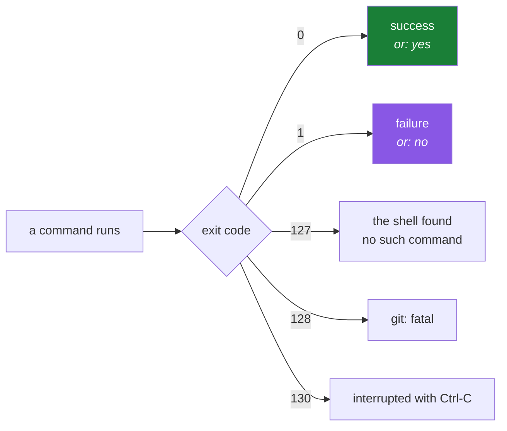

# 4.1 — Exit codes: 0 is success, and the Git commands that answer with a number

> **One-line answer.** Every program ends by handing back a single number — zero for success, anything
> else for a kind of failure — and several Git commands use that number to *answer a question* rather
> than to report a problem, which is what makes them usable in scripts.

---

## The story

A quality inspector on a production line has a stamp and a chalk mark.

The stamp means the part passed. The chalk mark means it did not — and the mark is a different shape
for a crack, a wrong dimension, or a bad finish, so that somebody further down the line can sort the
rejects without re-examining every one.

At the end of the shift the supervisor does not read the inspector's notes. She counts stamps. Every
process built on top of that line — the reject bin, the rework queue, the daily report — reads one
mark per part, and works only because the mark is unambiguous and always present.

Programs do this. Every one of them, every time, ends by leaving a number behind. Most people never
look at it, and everything automated they will ever build reads nothing else.

---

## The idea in plain language

When a program finishes, it returns an **exit code** (or exit status): a whole number between 0 and
255.

- **0 means success.** Exactly one value means everything is fine.
- **Anything else means a failure**, and the specific number can distinguish kinds of failure.

That polarity feels backwards until you see why: there is one way to succeed and many ways to fail, so
the successful case gets the single value and failures get the rest of the range.

The shell keeps the most recent one in a special variable, `$?`. It is set after every command, and it
is overwritten by the next one — including by the `echo` you use to look at it, which is the first trap
in this part.

Some conventional values you will meet:

| Code | Meaning | Where |
|---|---|---|
| `0` | Success | Everywhere |
| `1` | General failure, or "no" | Most programs; `grep` when nothing matched |
| `2` | Misuse, or serious trouble | `ls` on a missing file; many programs for bad usage |
| `127` | Command not found | The **shell**, not the program — nothing ran |
| `128` | Fatal error in Git | Git's convention for `fatal:` messages |
| `130` | Interrupted with `Ctrl-C` | Anything |

### The idea that makes this a Git subject

Some commands use the exit code as a **question's answer** rather than an error report. `git diff
--quiet` prints nothing and exits `1` when there are differences — that is not a failure, it is a
"yes". `git merge-base --is-ancestor A B` prints nothing at all and answers entirely in the exit code.

That is the whole basis of scripting Git: hooks (Day 96), `git bisect run` (Day 102), and every
workflow step (Day 155 onward) are built on commands that answer with a number.

---

## Why the build needs it

**Day 96** writes hooks. A hook that exits non-zero **rejects the operation** — a `pre-commit` hook
returning 1 stops the commit. The exit code is the entire interface.

**Day 102** is `git bisect run`, which finds the commit that introduced a bug by running your script
at each step and reading its exit code: 0 means good, 1–124 mean bad, 125 means skip. A day of work
becomes a command, purely because of this convention.

**Day 155 onward** is Actions, where a step fails if its script's exit code is non-zero — and every
"why did my job pass when the test failed?" is a swallowed exit code.

**Day 143** requires status checks to pass before a merge. Those checks are jobs, and jobs are exit
codes, all the way down.

---

## The mechanism

### Look at the number

```sh
git rev-parse --verify HEAD >/dev/null; echo "rev-parse HEAD -> $?"
git rev-parse --verify no-such-branch; echo "rev-parse bogus -> $?"
```

```
rev-parse HEAD -> 0
fatal: Needed a single revision
rev-parse bogus -> 128
```

**Line by line:**

- `git rev-parse --verify <thing>` — resolve a name to a commit and fail if it does not exist.
- `>/dev/null` — discard the output, because we want the code rather than the SHA
  ([4.3](4.3-stdout-and-stderr.md) is about redirection).
- `;` — run the next command regardless of what happened ([4.2](4.2-chaining-commands.md)).
- `$?` — the exit code of the command that just finished.
- `128` is Git's fatal-error convention, and it pairs with a `fatal:` message on standard error. Note
  the message went to the screen even though we redirected the output — because it is on a different
  stream, which is [4.3](4.3-stdout-and-stderr.md)'s subject.

**The trap:** `$?` is overwritten by every command, including `echo`. This does not work:

```sh
git status
echo "status was $?"
echo "and now $?"     # this is echo's exit code, not git's
```

Capture it immediately, or test it directly with `&&` and `||`
([4.2](4.2-chaining-commands.md)).

### Commands whose exit code is an answer

```sh
git diff --quiet; echo "clean tree -> $?"
printf 'read a book\n' >> reminders.md
git diff --quiet; echo "dirty tree -> $?"
```

```
clean tree -> 0
dirty tree -> 1
```

**Line by line:**

- `git diff --quiet` — do not print anything; report the answer in the exit code. `0` means no
  differences, `1` means there are some.
- **Neither is an error.** `1` here means "yes, there are changes" — the command did exactly what it
  was asked.
- This is the canonical way for a script to ask "is the working tree clean?", and it is the check a
  release script runs before tagging.

These need two branches. The hub's §3 setup created them; if you are reading this part on its own,
`git switch -qc side && git commit -qam "a side commit" && git switch -q main` in a sandbox repository
is the whole prerequisite.

```sh
git merge-base --is-ancestor HEAD HEAD; echo "self -> $?"
git merge-base --is-ancestor side main; echo "side is ancestor of main -> $?"
git merge-base --is-ancestor main side; echo "main is ancestor of side -> $?"
```

```
self -> 0
side is ancestor of main -> 1
main is ancestor of side -> 0
```

**Line by line:**

- `git merge-base --is-ancestor A B` — is commit A an ancestor of commit B? It prints **nothing** in
  either case; the exit code is the entire output.
- A commit is its own ancestor, hence `0` for the first.
- The second and third are opposites, which is how a script decides whether a branch has been merged,
  whether a push would fast-forward, or whether a tag is on the release line. Day 37 is `merge-base`
  properly, and Day 39 uses it for bulk branch cleanup.

```sh
git grep -q "water"; echo "found -> $?"
git grep -q "zebra"; echo "not found -> $?"
git cat-file -e HEAD^{commit}; echo "object exists -> $?"
git cat-file -e deadbeefdeadbeefdeadbeefdeadbeefdeadbeef; echo "object missing -> $?"
```

```
found -> 0
not found -> 1
object exists -> 0
object missing -> 1
```

**Line by line:**

- `git grep -q <pattern>` — search tracked files, print nothing, answer in the code. `0` found, `1`
  not found.
- `git cat-file -e <object>` — does this object exist in the repository? `-e` is "exists": no output,
  just the code. This is how a script checks whether a SHA is present before trying to use it, and it
  is the shape of the check Day 69's recovery work relies on.
- `HEAD^{commit}` — "the commit that HEAD refers to". The `^{type}` syntax is Day 24's, and it is
  quoted in real scripts because `^` and `{}` are shell characters
  ([2.2](../02-quoting/2.2-quoting.md)).

### The shell's own codes

```sh
bash -c 'PATH=/nonexistent; git --version'; echo "exit=$?"
```

```
bash: line 1: git: command not found
exit=127
```

**Line by line:**

- `127` is the shell's code for "I could not find that command". **No program ran**, so this is not
  Git's exit code — it is bash's report about Git's absence.
- Distinguishing `127` from any Git code is genuinely useful in a pipeline: `127` means the tool is
  missing from the image, not that your command was wrong. Day 0's part
  [1.2](../../../day-00-foundry/parts/01-install/1.2-installing-git.md) met the same message from the other side.



---

## The same thing, three ways

| Surface | "Did that work?" | Verdict |
|---|---|---|
| Terminal | The exit code, in `$?` or tested directly with `&&` / `\|\|`. Silent commands like `--is-ancestor` answer *only* this way | **The only machine-readable answer**, and the foundation of every hook, script and workflow in this curriculum. |
| github.com | A green tick or a red cross on a commit, a pull request check, a workflow run — which is a rendering of a process's exit code, several layers up | **The same fact with a friendlier face.** When a check is red, something somewhere returned non-zero, and finding out what is the whole of Day 164's debugging work. |
| `gh` | Exits non-zero when a command fails, and `gh run view --exit-status` exits non-zero when the *run* failed — so a script can act on a workflow's result | The bridge between the two: it turns a green tick back into an exit code your shell can test. |

**Which a professional reaches for:** `&&` and `||` in the moment ([4.2](4.2-chaining-commands.md)),
and `$?` only when they need the specific number. The habit that matters is different from either: in a
script, **check the exit code of every command whose failure would make the next one wrong** — the
alternative is a script that carries on cheerfully after the step that mattered.

---

## When it breaks

**A `fatal:` from Git.**

```
fatal: Needed a single revision
```

*What it means:* exit code `128`, Git's convention for a fatal error. The message goes to standard
error, so it appears on your screen even when you redirect the output — and it disappears from a log
that captures only standard output, which is [4.3](4.3-stdout-and-stderr.md)'s subject.

*Smallest fix:* depends on the message; the useful part here is knowing that `128` means Git decided it
could not continue, as opposed to `1`, which usually means "the answer is no".

**Command not found.**

```
bash: line 1: git: command not found
```

*What it means:* exit code `127`, from the shell. Nothing ran. In a pipeline this is a missing tool in
the image, not a bug in your command.

*Smallest fix:* install it, or fix the PATH. In a workflow, add the setup step that provides it.

**A script that keeps going after a failure.** No error text; the wrong outcome.

*What it means:* by default, a shell script runs the next line regardless of what the previous one
returned. A script that builds, tests and publishes will happily publish after a failed test unless
somebody made the failure stop it.

*Smallest fix:* `set -e` at the top of a script — exit on the first failing command — and better,
`set -euo pipefail`, which also fails on an unset variable and on a failure anywhere in a pipe.
[4.2](4.2-chaining-commands.md) and [4.3](4.3-stdout-and-stderr.md) are the two halves of that.

**`$?` reporting the wrong command.** No error; a confusing result.

*What it means:* you looked at `$?` one command too late. `echo` sets it too.

*Smallest fix:* capture it immediately — `status=$?` on the very next line — or test the command
directly with `&&` and `||`.

---

## In production

**The exit code is the contract every automation layer reads.** A hook's exit code decides whether the
commit happens; a workflow step's decides whether the job continues; a job's decides whether the check
is green; a check's decides whether the merge button works (Day 143). Four layers, one number at each
boundary. That chain is worth holding in your head, because when a merge is blocked you can walk it
downwards to the command that actually returned non-zero.

**Swallowed exit codes are the classic broken pipeline.** `run: make test || true` makes a step always
succeed. So does a `for` loop that ignores failures inside it, and — subtly — a pipeline, because a
shell reports the exit code of the *last* command in a pipe: `make test | tee log.txt` is green even
when the test fails. `set -o pipefail` fixes that specific case, and it is the reason Day 164's
debugging day spends time on it. **A test suite that cannot fail is worse than no test suite**, because
it is trusted.

**Specific codes carry meaning worth honouring.** `git bisect run` treats 125 specially — "cannot test
this commit, skip it" — so a bisect script that returns 125 for a broken build is far more useful than
one that returns 1 and misidentifies the culprit. Day 102 builds exactly that script.

**What a senior reviewer says.** On a workflow step ending in `|| true`: *"that makes this step
unfailable — if it's allowed to fail, use `continue-on-error` so the run still shows it, rather than
hiding it inside the shell."* Making failure visible rather than silent is the recurring theme, and it
is the same instinct as `user.useConfigOnly` in Day 0's part
[2.2](../../../day-00-foundry/parts/02-identity/2.2-identity-in-every-commit.md).

**What it costs.** Nothing.

**The interview question this is really testing.** *"How would you write a script that only pushes when
the working tree is clean?"* The strong answer reaches for a command whose exit code is the answer —
`git diff --quiet && git diff --cached --quiet && git push` — rather than parsing `git status` output
as text. The general principle behind it, which is what the question is actually probing: **parse
machine-readable answers, not human-readable output**, because the human-readable form is allowed to
change and the exit code is not.

---

## Check yourself

**Run this now**, in a repository with no uncommitted changes. Predict both numbers before you press
return:

```sh
git diff --quiet; echo "clean -> $?"; printf 'x\n' >> reminders.md; git diff --quiet; echo "dirty -> $?"
```

**Line by line:** `git diff --quiet` prints nothing and answers in the exit code; `$?` reads it; `;`
runs each command regardless of the last ([4.2](4.2-chaining-commands.md)); the `printf` appends a line
so that the second check has something to find. The answers are `0` then `1`, and the point is that
neither of them is an error. Undo the edit afterwards with `git restore reminders.md`.

**Say this out loud.** Explain why `1` from `git diff --quiet` is not a failure — and then name a
command where `1` genuinely does mean something went wrong, and say how a script could tell the two
apart.

---

**Next:** [4.2 — `&&`, `||`, `;`: chaining, and why hooks and CI live on the difference](4.2-chaining-commands.md) ·
[back to the hub](../../LESSON.md)
