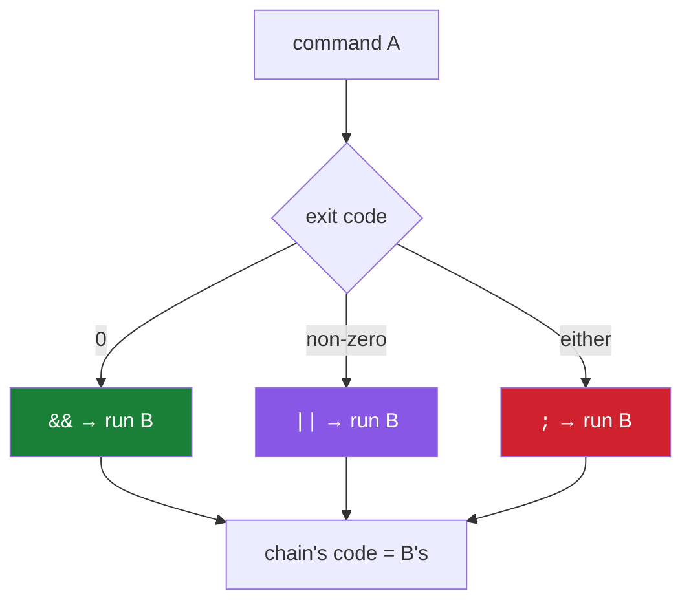

# 4.2 — `&&`, `||`, `;`: chaining, and why hooks and CI live on the difference

> **One-line answer.** `A && B` runs B only if A succeeded, `A || B` runs B only if A failed, and
> `A ; B` runs B regardless — three characters that decide whether a pipeline stops at the broken step
> or publishes anyway.

---

## The story

A pilot's pre-flight checklist has a property that took decades of accidents to establish: it is not a
list of things to do. It is a list of things to *confirm*, in order, where a failed confirmation stops
the sequence.

The distinction sounds pedantic and is the entire safety property. A list of actions performed in
order gets performed in order whether or not each one worked. A list of confirmations does not
continue past a "no", and it takes a deliberate act — a decision, logged, by a person — to override
it.

The accidents that produced this design were not caused by pilots skipping steps. They were caused by
sequences that continued after a step reported a problem, because nothing in the process was built to
stop.

Your shell offers both kinds of list. The difference is one character, and almost nobody is taught
which one they are typing.

---

## The idea in plain language

From [4.1](4.1-exit-codes.md): every command ends with an exit code, and `0` means success. The shell
gives you three ways to join commands, and two of them read that code.

| Operator | Runs the second command | Read it as |
|---|---|---|
| `A && B` | only if A succeeded (exit 0) | "and then" |
| `A \|\| B` | only if A **failed** (non-zero) | "or else" |
| `A ; B` | always | "and separately" |

They are called **short-circuit** operators because the second command is skipped when its outcome is
already decided — the same idea as `and`/`or` in a programming language, which is where the symbols
come from.

A chain has its own exit code: the code of the last command that actually ran. `false && echo hi`
exits `1`, because `echo` never ran and `false`'s code stands.

Two more forms, so that the whole family is in one place:

- `A | B` — a **pipe**, which is a different thing entirely: it connects A's output to B's input rather
  than testing anything. [4.3](4.3-stdout-and-stderr.md) is about pipes, and the interaction between
  pipes and exit codes has a sharp edge that this part shows.
- `A & B` — one ampersand runs A in the background. You will see it in scripts; it is not a chaining
  operator and it is not otherwise used in this curriculum.

---

## Why the build needs it

**Day 96** writes hooks, which are scripts whose exit code decides whether Git proceeds. A hook that
runs three checks with `;` between them reports only the last one's result, and silently permits a
commit that failed the first two.

**Day 102** is `git bisect run`, which needs a script that stops at the right moment and returns a
specific code.

**Day 155 onward** is Actions. Every `run:` step is a shell script, and a step that chains with `;`
where it meant `&&` produces a green build over a failed command — the single most damaging bug class
in continuous integration, because it is silent and the check is trusted.

**Day 187** is release automation, where "tag it, build it, publish it" must not continue past a
failure.

---

## The mechanism

### The three operators

```sh
false && echo "you will not see this"; echo "exit=$?"
false || echo "recovered"; echo "exit=$?"
false; echo "ran anyway (previous exit was $?)"
```

```
exit=1
recovered
exit=0
ran anyway (previous exit was 1)
```

**Line by line:**

- `false` — a real program whose only job is to exit `1`. `true` is its counterpart. They exist
  precisely for demonstrations and tests like this one.
- `false && echo …` — the `echo` was skipped, and the chain's exit code is `1`, from `false`.
- `false || echo "recovered"` — the `echo` **did** run, and because it succeeded, the chain's exit code
  is `0`. That is worth noticing: `||` can turn a failure into a success, which is what makes
  `command || true` the classic way to silence a failing step
  ([4.1](4.1-exit-codes.md) argues against it).
- `false; echo …` — the second command ran regardless, and `$?` inside it still reported `1`, because
  `;` does not consume or alter the previous code.

### A real Git chain

```sh
git rev-parse --verify -q main >/dev/null && echo "main exists"
git rev-parse --verify -q nope >/dev/null || echo "nope does not exist"
```

```
main exists
nope does not exist
```

**Line by line:**

- `git rev-parse --verify <name>` — resolve a name, fail if it does not exist
  ([4.1](4.1-exit-codes.md)).
- `-q` — quiet: suppress the error message, since here the exit code is the answer we want. Without it
  the second line would also print `fatal: Needed a single revision`.
- `>/dev/null` — discard the SHA it prints on success ([4.3](4.3-stdout-and-stderr.md)).
- The two lines together are the shape of every conditional in a Git script: **ask a command, let its
  exit code decide.** No parsing, no string comparison, nothing that breaks when a message is
  reworded.

### The idiom you will type most

```sh
git add -A && git commit -m "add the morning reminder" && git push
```

**Line by line:**

- Three commands, each conditional on the last. If `add` fails, nothing is committed; if the commit is
  refused — by a hook, or because there was nothing staged — nothing is pushed.
- Written with `;` instead, a failed commit would be followed by a push of whatever was there before,
  which is the kind of thing that looks fine until the day it is not.
- This is also why `&&` is worth typing interactively rather than pressing return three times: it
  encodes "only if that worked" into the line, and you find out at the point of failure instead of two
  commands later.

### The sharp edge: pipes swallow failures

```sh
false | true; echo "without pipefail -> $?"
bash -c 'set -o pipefail; false | true; echo "with pipefail -> $?"'
```

```
without pipefail -> 0
with pipefail -> 1
```

**Line by line:**

- `false | true` — a pipeline whose *first* command failed and whose last succeeded.
- By default, **a pipeline's exit code is the exit code of its last command.** So this reports success,
  and the failure vanishes.
- `set -o pipefail` — a shell option making the pipeline report the last **non-zero** code instead.
- **This is the mechanism behind the most trusted broken pipeline in the world:**
  `run: make test | tee test.log` is green even when `make test` fails, because `tee` succeeded. Day
  164 debugs exactly this, and the fix is one line at the top of the script.

### Stopping a whole script at the first failure

```sh
bash -c 'set -e; false; echo "you will not see this"'; echo "script exit=$?"
bash -c 'false; echo "without set -e, this prints"'; echo "script exit=$?"
```

```
script exit=1
without set -e, this prints
script exit=0
```

**Line by line:**

- `set -e` — exit the script as soon as any command fails, without needing `&&` on every line.
- Without it, the script carried on **and exited 0**, because the last command succeeded. A script that
  "finished successfully" having skipped the thing that mattered is precisely the checklist failure
  from the story.
- The professional preamble is three options together:

```sh
set -euo pipefail
```

**Line by line:**

- `-e` — stop on the first failing command.
- `-u` — treat an unset variable as an error rather than an empty string. This is what stops
  `rm -rf "$DIR/"` from becoming `rm -rf /` when `DIR` was never set — the mechanism from
  [3.1](../03-child-processes/3.1-environment-variables.md), with the sharpest possible consequence.
- `-o pipefail` — the pipeline rule from the previous block.
- Three words at the top of every script you write from Day 96 onwards. `set -e` has documented
  exceptions — it does not trigger for a command on the left of `&&`, or one whose result is being
  tested — which is a feature: it lets you write `command || handle_failure` deliberately.



The colouring is deliberate: in a script, `;` between two commands that depend on each other is the one
to be suspicious of.

---

## The same thing, three ways

| Surface | Expressing "only if that worked" | Verdict |
|---|---|---|
| Terminal | `&&`, `\|\|`, `;`, and `set -euo pipefail` at the top of a script | **Where the semantics live.** Everything above it is a wrapper over these three characters. |
| github.com | A workflow's job graph: `needs:` makes one job wait for another to succeed, `if:` conditions run a step only in certain states, and `continue-on-error` marks a step allowed to fail while staying visible | **The same logic, one level up and declared rather than typed** — and visible in the run graph, which is why a reviewer can see the dependency without reading the script. Day 158. |
| `gh` | `gh run view --exit-status` turns a workflow run's result back into an exit code, so `gh run view --exit-status && gh release create …` chains a local action onto a remote outcome | The join between the two worlds: a green tick becomes something `&&` can test. |

**Which a professional reaches for:** `&&` interactively, and `set -euo pipefail` plus explicit checks
in anything written down. The reason for the difference: interactively you are watching, and a script
runs when nobody is watching — which is the whole argument for making failure loud in the second case.

---

## When it breaks

**A script that reports success after a failure.** No error text; a green tick that should be red.

*What it means:* either `;` where `&&` was meant, or a pipeline whose last command succeeded, or a
`|| true` somebody added to get past a problem and never removed.

*Smallest fix:* `set -euo pipefail` at the top, then run the script and see where it now stops. That
stopping point is the bug that was being hidden.

**A `&&` chain that stops earlier than expected.**

```
exit=1
```

*What it means:* it is working. Something in the middle returned non-zero — possibly a command whose
non-zero *is an answer* rather than a failure, like `git diff --quiet` from
[4.1](4.1-exit-codes.md), which returns `1` when there are changes.

*Smallest fix:* run the pieces separately and print `$?` after each. When a "no" answer is the normal
case, `||` is the right operator: `git diff --quiet || echo "there are changes"`.

**`set -e` not stopping where you expected.**

*What it means:* `set -e` deliberately does not trigger inside a condition, on the left of `&&` or
`||`, or in a function whose result is being tested. It is a documented set of exceptions, and it
surprises people who expect it to be absolute.

*Smallest fix:* check the exit code explicitly at the points that matter. In a long script, being
explicit beats relying on a shell option with exceptions.

**`set -u` breaking a script that used to work.**

*What it means:* something references a variable that is not set, and previously it silently became an
empty string. This is a bug being revealed, not created — the empty-string case was doing something,
and it was probably not what you wanted.

*Smallest fix:* provide a default where empty is legitimate: `"${DIR:-/tmp}"` uses `/tmp` when `DIR`
is unset or empty.

---

## In production

**Every CI failure that "passed anyway" is on this page.** A `;` where `&&` belonged, a pipe that
swallowed the code, a `|| true` from a bad afternoon. The countermeasure is structural rather than
careful: `set -euo pipefail` at the top of every script, `continue-on-error: true` in a workflow when a
step is genuinely allowed to fail — because that keeps the failure *visible* rather than hiding it in
the shell — and required status checks (Day 143) so that the merge depends on the result rather than
on somebody reading it.

**Hooks are exit codes with a chain in front of them.** A `pre-commit` hook that runs a formatter, a
linter and a test suite must chain them so that the first failure stops the sequence and returns
non-zero. Day 96 writes one; Day 97 shares it with a team through `core.hooksPath`.

**`git bisect run` is the most elegant use of this whole part.** You give Git a script; Git runs it at
each candidate commit and reads the exit code — 0 means good, 1 to 124 mean bad, 125 means "cannot
test, skip". A hundred-commit search becomes one command, and Day 102 builds the script.

**What a senior reviewer says.** On a multi-command `run:` step joined with `;`: *"use `&&`, or split
these into separate steps — right now step three runs even if step one failed, and the job goes
green."* Splitting into separate steps is often the better fix, because each step's result is then
visible in the run's timeline rather than buried in one step's log.

**What it costs.** Nothing — and it saves the cost of a bad deployment, which is the largest number in
this curriculum.

**The interview question this is really testing.** *"Your CI passes but the tests failed. How does that
happen?"* The strong answer lists the mechanisms rather than guessing: commands joined with `;`
instead of `&&`; a pipeline reporting only its last command's status without `pipefail`; a `|| true`
suppressing the code; or a test runner that genuinely exits 0 on failure. And the fix that covers most
of them in one line: `set -euo pipefail`.

---

## Check yourself

**Run this now.** Predict which of the three `echo`s will print, and what the final exit code will be:

```sh
true && echo "one"; false && echo "two"; false || echo "three"; echo "final=$?"
```

**Line by line:** `true && echo "one"` prints, because `true` succeeded. `false && echo "two"` does not,
because `false` did not. `false || echo "three"` prints, because `||` runs on failure — and because
that `echo` succeeded, the final exit code is `0`. If you predicted `one`, `three`, `final=0`, you have
the model; the last part is the one people miss, and it is why `|| true` makes a step unfailable.

**Say this out loud.** Explain why `make test | tee test.log` can report success when the tests failed
— and give the one-line change that fixes it.

---

**Next:** [4.3 — stdout and stderr: two streams, and why piping Git can lose half the output](4.3-stdout-and-stderr.md) ·
[back to the hub](../../LESSON.md)
