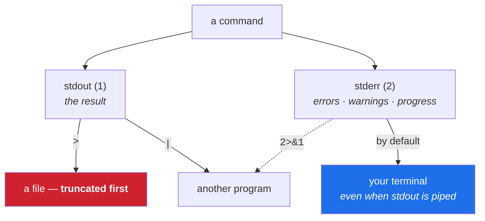

# 4.3 — stdout and stderr: two streams, and why piping Git can lose half the output

> **One-line answer.** Every program writes to two separate channels — results on one, diagnostics on
> the other — so a pipe or a log file that captures only the first will silently drop every warning
> and error, and a `>` that captures the first will silently destroy whatever was in the file.

---

## The story

A restaurant kitchen has two rails: one for finished plates, one for notes back to the front of house.

*Table nine, no plate — we're out of the fish.* That note goes on the second rail. It is not a plate;
it cannot go out to the table; and it must not be lost, because table nine is waiting for something
that is never coming.

One evening the second rail is moved during a refit, and for a week the notes pile up somewhere nobody
is looking. From the dining room the kitchen appears to be working: plates arrive, orders complete. The
only visible symptom is that occasionally a table waits forever, and nobody can say why, because the
explanation was written down and put on a rail that no longer goes anywhere.

Programs have those two rails. Most people know about the first one. Every confusing empty log file in
this curriculum is the second.

---

## The idea in plain language

Every program starts with three connections, numbered:

| Number | Name | Carries |
|---|---|---|
| `0` | **standard input** (stdin) | What the program reads |
| `1` | **standard output** (stdout) | The **result** — the thing the program was asked to produce |
| `2` | **standard error** (stderr) | **Diagnostics** — errors, warnings, progress |

By default both output streams go to your terminal, which is why they look like one thing. They are
not. The separation exists so that the *result* can be redirected somewhere — a file, another program —
while the *complaints* still reach the human.

Git is a heavy user of this, and in a way that catches people:

- `git status`, `git log`, `git diff` write their output on stdout, as you would expect.
- `fatal:`, `warning:` and `hint:` messages go to **stderr**.
- So does progress: `Cloning into 'x'...`, and — surprisingly — **`Switched to branch 'main'`**.

The shell's operators for moving them:

| Operator | Meaning |
|---|---|
| `> file` | Send stdout to a file, **replacing** its contents |
| `>> file` | Send stdout to a file, appending |
| `2> file` | Send stderr to a file |
| `2>&1` | Send stderr to wherever stdout is currently going |
| `> file 2>&1` | Both to one file — **order matters**; `2>&1 > file` does something else |
| `/dev/null` | A destination that discards everything written to it |
| `\|` | Send **stdout only** into another program |

That last row is the one that costs afternoons: **a pipe carries stdout and leaves stderr going to the
screen.**

---

## Why the build needs it

**Day 164** debugs failing workflows, where a log that captured only stdout has no error message in it
and the failure is invisible.

**Day 102** is `git bisect run`, whose script must not have its diagnostics tangled with its result.

**Day 205** calls the API and processes JSON, where a warning mixed into the output stream makes the
JSON unparseable — one reason `gh` writes its warnings to stderr.

**Day 96** writes hooks, which speak to the user through stderr and are consumed by Git through their
exit code.

---

## The mechanism

### Watch them separate

This uses the `side` branch the hub's §3 setup created; any second branch does the same job.

```sh
git checkout side > out.txt 2> err.txt
echo "-- stdout --"; cat out.txt
echo "-- stderr --"; cat err.txt
```

```
-- stdout --
-- stderr --
Switched to branch 'side'
```

**Line by line:**

- `> out.txt` — stdout to a file. `2> err.txt` — stderr to another. The `2` is the stream number, and
  there is no space between it and the `>`.
- **stdout was empty.** `git checkout` produces no *result*; the message telling you what happened is a
  diagnostic.
- `Switched to branch 'side'` is on stderr, which surprises nearly everyone. It is the correct choice:
  the message is for the human, not for a program consuming the output.
- The practical consequence: `git checkout main > log.txt` produces an empty log and a message on your
  screen, which looks like the redirect failed.

The same for `clone`:

```sh
git clone nudge clone-test > c-out.txt 2> c-err.txt
echo "-- stdout --"; cat c-out.txt
echo "-- stderr --"; cat c-err.txt
```

```
-- stdout --
-- stderr --
Cloning into 'clone-test'...
done.
```

**Line by line:**

- Progress and status: all stderr. This is why a cloning progress bar does not corrupt a file you are
  redirecting output into, and why a CI log that captures only stdout shows nothing during a long
  clone.

### Where errors go when you pipe

```sh
git rev-parse --verify nope 2>&1 | head -2; echo "exit=${PIPESTATUS[0]}"
```

```
fatal: Needed a single revision
exit=128
```

**Line by line:**

- `2>&1` — redirect stderr to wherever stdout is currently pointing, which at that moment is the pipe.
  Without it, `head` would receive nothing and the `fatal:` would go to your screen instead.
- `| head -2` — first two lines. A pipe carries stdout only, which is the whole reason `2>&1` was
  needed.
- `${PIPESTATUS[0]}` — a bash array holding the exit code of **each** command in the pipeline;
  index `0` is the first. This is how you recover the code that
  [4.2](4.2-chaining-commands.md)'s `pipefail` discussion said a pipeline normally discards.
- `128` — Git's fatal code ([4.1](4.1-exit-codes.md)).

### Silencing one stream

```sh
git rev-parse --verify -q nope >/dev/null 2>&1 || echo "no such ref"
```

```
no such ref
```

**Line by line:**

- `>/dev/null` — discard stdout. `2>&1` — send stderr to the same place. Together: silence, leaving
  only the exit code.
- `|| echo` — act on the failure ([4.2](4.2-chaining-commands.md)).
- **Order matters.** `>/dev/null 2>&1` sends stdout to `/dev/null` and then points stderr at the same
  destination. Writing `2>&1 >/dev/null` points stderr at the *terminal* (where stdout was at that
  moment) and only then moves stdout — so errors still print. Both forms appear in real scripts and
  only one does what people mean.

### Reading a stream twice

```sh
git log --oneline | tee log.txt | head -3
```

**Line by line:**

- `tee` — write its input to a file **and** pass it along the pipe. Named after a T-shaped pipe
  fitting.
- Useful in CI to keep a log while still processing the output — and the source of the
  `pipefail` trap from [4.2](4.2-chaining-commands.md), because `tee` succeeding masks an earlier
  failure.

---

## The same thing, three ways

| Surface | Separating results from diagnostics | Verdict |
|---|---|---|
| Terminal | Two numbered streams, redirected independently with `>`, `2>`, `2>&1` and `/dev/null`; a pipe carries stdout only | **The only surface where the distinction is visible** — and the only one where you can lose half the output by accident. |
| github.com | A workflow run's log page interleaves both streams into one scrollable log, with timing and grouping. There is no way to view them separately after the fact | Convenient for reading, and the reason a script that discards stderr produces a log page with nothing useful on it — the separation had to be preserved *before* it got there. |
| `gh` | Writes its results on stdout and its warnings on stderr deliberately, so `gh api … \| jq` works without a stray notice breaking the JSON — as seen when `gh ssh-key list` printed `warning: HTTP 404` alongside its output in Day 0's part [4.3](../../../day-00-foundry/parts/04-auth/4.3-registering-and-testing-the-key.md) | The discipline is what makes `gh` scriptable at all: any tool that prints diagnostics on stdout cannot be piped safely. |

**Which a professional reaches for:** `> file 2>&1` when capturing anything they may need to read
later, and `2>/dev/null` almost never — because the message being discarded is exactly the one that
would have explained the failure. In a workflow, the strongest habit is to let the runner capture both
and not manage logging by hand at all.

---

## When it breaks

**A log file that is empty while the screen shows a message.**

```
-- stdout --
-- stderr --
Switched to branch 'side'
```

*What it means:* the message was on stderr and your redirect captured stdout. The command worked
perfectly.

*Smallest fix:* `> file 2>&1` to capture both, in that order.

**A pipeline that sees nothing to process.** `git log | grep something` returns nothing when you can
plainly see the text on screen.

*What it means:* the text you can see is on stderr, and the pipe only carried stdout. Common with
`hint:` and `warning:` lines.

*Smallest fix:* `2>&1 |` to merge the streams into the pipe. Be deliberate about it: merging errors
into a stream that another program is parsing is how a stray warning breaks a JSON parser, which is why
`gh` keeps them separate.

**A file replaced by accident.** No error at all; the file is simply different.

*What it means:* `>` truncated it. See **How to undo it** above — recoverable if Git had a copy, gone
if not.

*Smallest fix:* `git restore <path>` for a tracked file. Then `set -o noclobber` so that the next time
it is refused rather than done.

**`noclobber` refusing a redirect you meant.**

```
bash: line 1: reminders.md: cannot overwrite existing file
```

*What it means:* the protection is working. The file was not touched.

*Smallest fix:* `>|` for that one redirect, or `>>` if you meant to append.

---

## How to undo it

This part is rated `caution` for one character: `>`.

**`>` truncates the target before the command runs.** The file is emptied immediately, whether or not
the command produces anything, and whether or not the command even exists. There is no confirmation
and no undo at the filesystem level.

Rehearse this where it does not matter — `./k sandbox fresh` builds one
([6.2](../../../day-00-foundry/parts/06-sandbox/6.2-the-sandbox.md)) — and watch it happen:

```sh
cat reminders.md
git log --oneline > reminders.md
cat reminders.md
```

```
water the plants
```
```
c45fd75 add the rest
e1c2856 first reminder
```

**Line by line:**

- The first `cat` shows the file's contents. The redirect replaced them entirely with the log output.
  *(The log lines above come from the repository this was captured in; yours will show your own
  commits, and the point is the replacement rather than the contents.)*
- A typo does this: `git log --oneline > reminders.md` when you meant `>>`, or when you meant a
  different filename and tab-completed the wrong one.
- **Nothing warned you**, because this is exactly what `>` is specified to do.

### If the file was tracked and committed

```sh
git restore reminders.md
cat reminders.md
```

```
water the plants
```

**Line by line:**

- `git restore <path>` — overwrite the working-tree file with the committed version. Day 19 is this
  command in full.
- The file is back, byte for byte, because a committed blob is immutable
  ([1.1](../../../day-00-foundry/parts/01-install/1.1-what-git-actually-is.md)).
- On a Git older than 2.23, the equivalent is `git checkout -- reminders.md`, and Day 34 explains why
  there are two spellings.

### If the file was tracked but the change was not committed

You lose the uncommitted work and get back the last committed version — the same command, with a real
loss. Anything staged is still recoverable: `git restore --source=:0 <path>` restores from the index
rather than from HEAD. Day 19 covers both sources, and Day 13 explains what the index is.

### If the file was never tracked

**It is gone.** No reflog, no object, no recovery — Git never had a copy. This is the same lesson as
Day 21's `git clean`, and it is why "commit early" is advice about safety rather than tidiness.

### Preventing it

```sh
set -o noclobber
echo hi > reminders.md
```

```
bash: line 1: reminders.md: cannot overwrite existing file
```

**Line by line:**

- `set -o noclobber` — refuse to truncate an existing file with `>`. Exit code `1`; the file is
  untouched.
- To override it deliberately for one redirect, use `>|`:

```sh
echo hi >| scratch.txt
```

**Line by line:** `>|` means "yes, I do mean to clobber this one". Having to type an extra character
for a destructive act is the same design as `git push --force-with-lease` (Day 81): make the dangerous
form distinguishable from the ordinary one.

`noclobber` is worth putting in your shell profile. It costs one character on the rare occasions you
mean it, and it prevents a class of loss that has no undo for untracked files.

### The already-pushed case

There isn't one — redirection is local. Nothing that `>` destroys was ever published, which is why the
recovery question is entirely about whether Git had a copy. That, in one sentence, is the argument
this whole day has been building towards: **a file Git knows about can be got back, and a file it does
not know about cannot.**



---

## In production

**Log capture in CI is exactly this question.** A step that runs `command > build.log` and then prints
`build.log` on failure shows nothing useful, because the error was on stderr. `command > build.log
2>&1` is the fix, and it is one of the most common review comments on pipeline code. GitHub Actions
captures both streams by default, which is why this is more often a problem in scripts that manage
their own logging.

**The separation is what makes tooling composable.** `git log --format=… | while read …` works because
Git's warnings do not contaminate the data. `gh api … | jq` works for the same reason. Any program that
prints diagnostics on stdout is a program that cannot be piped, which is why "print errors to stderr"
is a rule rather than a preference.

**Progress output is deliberately on stderr.** A long clone or fetch writes progress there so that
redirecting the result to a file leaves the progress visible to the human — and so that the file is not
full of carriage returns. `--progress` forces it on when output is not a terminal
([3.3](../03-child-processes/3.3-the-pager.md)'s rule), which is what you want when capturing a log for later.

**What a senior reviewer says.** On a script that ends `2>/dev/null`: *"you're throwing away the error
message — send it to the log instead, or at least keep the exit code check."* Discarding stderr is
occasionally right and usually a way of hiding something that will be needed later, at three in the
morning.

**What it costs.** Nothing, unless you truncate something Git did not have a copy of — in which case it
costs the file.

**The interview question this is really testing.** *"Why does `git status > log.txt` leave the error on
your screen?"* The answer is the two streams: stdout carries the result, stderr the diagnostics, and
`>` only redirects stdout. The follow-up that shows real use: *"how do you capture both, and what does
`2>&1 > file` do differently from `> file 2>&1`?"* — the first sends stderr to the terminal and only
then moves stdout, so errors still print; the second sends both to the file, because the order in which
the redirections are applied is the order they are written.

---

## Check yourself

**Run this now**, in the sandbox. Predict which of the two files will have content in it:

```sh
git checkout -q -b scratch-branch > out.txt 2> err.txt; wc -c out.txt err.txt
```

**Line by line:** `git checkout -b` creates and switches to a branch; `> out.txt` captures stdout and
`2> err.txt` captures stderr; `wc -c` counts the bytes in each. Even with `-q`, anything Git says about
switching is a diagnostic — so predict which file is empty before you look. Clean up with
`git switch -q -` and `rm out.txt err.txt`.

**Say this out loud.** Explain why `>` is the most dangerous character on this page — and say which
single Git property decides whether an accidental `>` is a five-second annoyance or a lost afternoon.

---

**Previous:** [4.2 — `&&`, `||`, `;`: chaining, and why hooks and CI live on the difference](4.2-chaining-commands.md) ·
[back to the hub](../../LESSON.md)
