# Project Kosha — the master plan

**Git and GitHub, from `git --version` to running a repository other people depend on.**

| | |
|---|---|
| Plan version | **v1.2.0** |
| Days | **253** (Day 0 – Day 252) |
| Phases | **23** (Phase 0 – Phase 22) |
| Concept IDs | **276** |
| Gates | **23** |
| Demo project | `nudge` — a deliberately tiny CLI, described in Part 3 |
| Amendments | `docs/CHANGELOG_PLAN.md` |
| Day map | `docs/CURRICULUM_INDEX.md` |
| Progress | `docs/TRACKER.md` (generated — never hand-edited) |
| Depth contract | **Part 11 of this file** |

This plan is **self-contained**. Every day traces to an ID defined in Part 4, and every ID traces to
a phase in Part 5. Nothing is imported from another curriculum, and no external course, author or
channel is cited anywhere in this repository.

---

## Part 0 — The promise, and the thing that is not the subject

A person who finishes this plan can do three things that most working developers cannot.

**One: explain what Git is doing, not just which command to run.** They can take a repository apart
with plumbing commands, rebuild a commit by hand, and predict — before pressing return — what
`git reset --hard`, `git rebase --onto`, or `git push --force-with-lease` will leave behind.

**Two: recover.** Deleted branch, botched rebase, force-pushed `main`, secret committed to a public
repo, release tagged from the wrong commit. Each of these is a runbook they have executed, not a
paragraph they have read.

**Three: run the platform, not just use it.** Rulesets, CODEOWNERS, required checks, merge queues,
environments, OIDC deployments, Dependabot, CodeQL, secret scanning, provenance attestations,
webhooks, GitHub Apps, and the REST and GraphQL APIs behind all of it.

### What is not the subject

The code is not the subject. `nudge`, the demo project, exists only to give Git something to track
and GitHub something to build. Its entire source is under two hundred lines by Day 252, and a reader
who has never written a line of Python can complete every day. **When a lesson has to choose between
explaining a language feature and explaining a Git behaviour, it explains the Git behaviour and links
the language feature out.**

Nor is any particular editor the subject. Every operation is taught at the terminal first, because
the terminal is the only interface that is the same on every machine and in every year. Where a
graphical equivalent exists — in the GitHub web interface, in VS Code, in `gh` — Part 11.4 requires
the part document to show it, so the reader can move between them without ceremony.

---

## Part 1 — The eighteen principles

These are the rules this repository runs on. Every day, every part document, and the generator skill
in `.claude/skills/day-kosha/` are bound by them.

1. **Every day ends in a repository that changed.** Reading is not a completed day. A day is done
   when a commit, a branch, a PR, a workflow run or a release exists that did not exist this
   morning.
2. **The mechanism before the command.** What an object is before `git add`. What a ref is before
   `git branch`. What a refspec is before `git push`. A learner who knows only commands is stranded
   the first time the command does something surprising.
3. **Break it on purpose.** Every destructive command is executed on a sandbox repository, watched
   as it destroys, and then undone. A person who has never lost a commit does not trust the reflog,
   and a person who does not trust the reflog works timidly forever.
4. **Real error text, verbatim.** Every failure mode is reproduced and its exact message pasted into
   the document. Paraphrased errors are useless, because the reader searches for the string.
5. **Three surfaces, one truth.** Terminal · github.com · `gh`. Whenever the same operation exists
   in more than one place, the part shows all of them and names which one a professional actually
   reaches for, and why.
6. **Depth over density.** One idea, one part document. A day is a short hub plus `parts/` — never
   one long page. A wall of text is not depth; it is depth's disguise.
7. **No clocks.** A day is a unit of subject, not of time. No time estimate, no duration, no pace,
   anywhere — not in frontmatter, not in prose, not in a checklist. **Never trim an explanation
   because a day is getting long; split it into another part instead.**
8. **Assume no prior knowledge, finish at production.** Open where someone who has never met the
   idea can stand. Define every term on first use, including terms from earlier days, with a link.
   End where a professional stands: what changes on a repository with four hundred contributors,
   what a senior reviewer says, what an interviewer probes.
9. **Every destructive part carries an undo.** A part with `danger: caution` or `danger: destructive`
   in its frontmatter must contain a **How to undo it** section with a tested recovery path, or it
   is not written.
10. **Sandbox before the real repository.** Every command that rewrites history, deletes refs, or
    changes remote state is first run in a throwaway repository created by `./k sandbox`. The
    learner's own repositories are never the first place a dangerous command runs.
11. **Nothing from memory.** Web interfaces, menu paths, API shapes and CLI flags change. Every part
    that describes one carries a **Verify before you click** link to live documentation, fetched on
    the day the part is written, with the date recorded.
12. **Free tier, deliberately.** The whole plan runs on a free personal account, one free
    organization, public repositories, and the Actions minutes that come with them. Where a feature
    is paid or enterprise-only, the part says so plainly, explains what it does, and gives the
    free-tier substitute rather than pretending the feature does not exist.
13. **One identity, plus the two things the platform permits.** GitHub's Terms of Service allow one
    person one free personal account, plus one free *machine account* used exclusively for automated
    tasks (§B.3). So Day 0 builds the primary account, a machine account for automation — bots,
    deploy keys, tokens, workflow-authored pull requests — and one free organization, which is where
    rulesets, CODEOWNERS and required reviews are learned. Collaboration days teach the constraint
    rather than faking a colleague: **an author cannot approve their own pull request**, and watching
    a ruleset refuse the merge is the lesson, not an obstacle to it. Where a real second person is
    available, the part says so and the exercise is richer for it. Never simulate a reviewer with a
    second branch, and never use a machine account to impersonate human review.
14. **Cost is a first-class fact.** Actions minutes, storage, LFS bandwidth, Codespaces hours and API
    rate limits are stated in the part that spends them. A pipeline whose cost is unknown is not
    understood.
15. **The GUI is taught, not sneered at.** Reviewing a diff, triaging an issue and configuring a
    ruleset are faster in a browser, and pretending otherwise is posturing. The terminal is the
    foundation; the browser is a tool; the reader learns both and chooses.
16. **From scratch before the tool.** A hand-written pre-commit hook before a hook framework. A
    hand-cut release before a release bot. A hand-written workflow before a Marketplace action. The
    tool is only comprehensible once the thing it replaces is understood.
17. **If reality has changed, stop.** If GitHub has moved a setting, renamed a feature or deprecated
    a flag, the correct response is to halt, say so, and propose an amendment to this plan in
    `docs/CHANGELOG_PLAN.md`. Never silently adapt a lesson to match a changed interface.
18. **Never do the learner's reps.** `TODO(me)` markers stay unsolved. Depth belongs in the
    explanation, never in the answer key.

---

## Part 2 — Who this is for, and what is assumed

**Assumed:** a computer the reader can install software on, an email address, the ability to open a
terminal and type, and enough comfort with a text editor to save a file. Nothing else.

**Not assumed:** any prior Git, any prior GitHub account, any programming language, any experience
with the command line beyond `cd`. Day 1 exists specifically to close the terminal gap — paths,
quoting, `$EDITOR`, pagers, exit codes — because every later day depends on it and most Git material
silently assumes it.

**Three reader profiles the plan is written for**

| Profile | Where they start | What the plan gives them |
|---|---|---|
| Never used Git | Day 0, in order | Everything, in order. Skip nothing. |
| Uses `add`/`commit`/`push`, nothing else | Day 0, still | Days 0–22 will feel fast and will still correct three or four beliefs that are wrong. Phase 1 is where most of that happens. |
| Professional, wants the platform | Day 0 to set up the account, the machine account, the organization and the sandboxes, then Phase 6 onward | Phases 6–10 close the Git gaps; 11–22 are the platform. |

---

## Part 3 — `nudge`, the demo project

`nudge` is a command-line reminder tool. It is chosen for what it makes easy to *teach*, not for what
it does.

```
nudge/
├── nudge.py            # the CLI — under 200 lines at the end of the plan
├── reminders.md        # a human-edited list: the conflict engine of this course
├── CHANGELOG.md        # the release-discipline surface
├── docs/               # the Pages surface
├── themes/             # becomes a submodule in Phase 10
├── assets/banner.png   # the Git LFS surface
└── tests/              # the CI surface
```

**Why this project and not a bigger one**

| Teaching need | What `nudge` provides |
|---|---|
| Real merge conflicts, on demand | `reminders.md` is a hand-edited list; two branches appending to it conflict every time, exactly like a real changelog |
| A version string that must move | `__version__` in `nudge.py` collides on every parallel release branch |
| `git bisect` with a real bug | Phase 10 plants a regression at a known commit in a fifty-commit history |
| Rename and copy detection | The CLI is split into modules mid-plan, on purpose |
| LFS, submodules, subtree | `assets/` and `themes/` exist for exactly this |
| CI that can genuinely fail | `tests/` runs in seconds, so a matrix of nine jobs is free |
| Releases, packaging, provenance | A single-file CLI is the smallest thing that can be legitimately versioned, packaged and signed |

**The four repositories every learner ends up with**

| Repository | Owner | Purpose |
|---|---|---|
| `nudge` | primary account | The main line of work, public from Phase 11 |
| `nudge-themes` | primary account | The submodule target |
| `kosha-sandbox` | primary account | Disposable. `./k sandbox` resets it. Every destructive command is rehearsed here. |
| `nudge` (fork) | **the machine account** | The contributor's view: forks, upstream sync, and pull requests opened from a repository the maintainer identity does not own |

---

## Part 4 — The ID system

Every day cites the IDs it teaches; every part document names the single ID it serves. An ID appears
in exactly one phase.

**Family codes**

| Prefix | Family | Phase |
|---|---|---|
| `G-SET` | Setup and toolchain | 0 |
| `G-OBJ` | The object model | 1 |
| `G-TRE` | The three trees and the daily loop | 2 |
| `G-HIS` | Reading history | 3 |
| `G-BRC` | Branching | 4 |
| `G-MRG` | Merging and conflicts | 5 |
| `G-RWR` | Rewriting history | 6 |
| `G-SAF` | The safety net | 7 |
| `G-RMT` | Remotes and the wire | 8 |
| `G-CFG` | Configuration as code | 9 |
| `G-SUR` | Surgery | 10 |
| `H-PLA` | GitHub the platform | 11 |
| `H-ISS` | Issues and discussions | 12 |
| `H-PRJ` | Projects | 12 |
| `H-PR` | Pull requests and review | 13 |
| `H-ACT` | Actions | 14–15 |
| `H-REL` | Releases, packages, Pages | 16 |
| `H-SEC` | Security and supply chain | 17 |
| `H-API` | The API surface | 18 |
| `H-CSP` | Codespaces and dev environments | 19 |
| `H-OSS` | Working in the open | 20 |
| `H-STR` | Strategy at scale | 21 |
| `X-CAP` | Capstone and gauntlet | 22 |

The full ID-to-day mapping is `docs/CURRICULUM_INDEX.md`. Part 6 below is the day map that generates
it.

---

## Part 5 — The phase map

| Phase | Days | Name | The question it answers | Gate |
|---:|:---:|---|---|:---:|
| 0 | 0–3 | The Foundry | Is my machine, my identity and my account real? | Day 3 |
| 1 | 4–12 | The Object Model | What is Git actually storing? | Day 12 |
| 2 | 13–22 | The Three Trees | What happens between editing a file and committing it? | Day 22 |
| 3 | 23–32 | Reading History | How do I find out what happened, and when, and who? | Day 32 |
| 4 | 33–41 | Branching | What is a branch, really, and how do I hold four at once? | Day 41 |
| 5 | 42–52 | Merging and Conflicts | How does Git combine work, and what do I do when it cannot? | Day 52 |
| 6 | 53–66 | Rewriting History | How do I change the past without lying about it? | Day 66 |
| 7 | 67–74 | The Safety Net | What can I recover, and when does it become truly gone? | Day 74 |
| 8 | 75–88 | Remotes and the Wire | What actually moves between two repositories? | Day 88 |
| 9 | 89–100 | Configuration as Code | How does a repository configure every clone of itself? | Day 100 |
| 10 | 101–112 | Surgery | How do I change history at scale without breaking everyone? | Day 112 |
| 11 | 113–124 | GitHub the Platform | What does GitHub add to Git, precisely? | Day 124 |
| 12 | 125–136 | Issues, Projects, Discussions | How does work get described, tracked and prioritised? | Day 136 |
| 13 | 137–152 | Pull Requests and Review | How does a change get from a branch into `main` safely? | Day 152 |
| 14 | 153–166 | Actions I — Fundamentals | What runs, when, where, and as whom? | Day 166 |
| 15 | 167–180 | Actions II — Real Pipelines | How do I build CI/CD that is fast, cheap and hard to abuse? | Day 180 |
| 16 | 181–190 | Releases, Packages, Pages | How does software leave the repository? | Day 190 |
| 17 | 191–202 | Security and Supply Chain | How does a repository defend itself? | Day 202 |
| 18 | 203–214 | The API Surface | How do I make GitHub do things without clicking? | Day 214 |
| 19 | 215–219 | Environments and the Dev Loop | How does a stranger get productive in one click? | Day 219 |
| 20 | 220–229 | Working in the Open | How do I contribute, and how do I maintain? | Day 229 |
| 21 | 230–241 | Strategy at Scale | Which workflow, and what does it cost at five hundred repos? | Day 241 |
| 22 | 242–252 | Capstone and Gauntlet | Can I do all of it, unprompted, under pressure? | Day 252 |

**The arc**

```mermaid
flowchart LR
    A["Phase 0<br/>foundry"] --> B["Phases 1–3<br/>objects · trees<br/>history"]
    B --> C["Phases 4–7<br/>branch · merge<br/>rewrite · recover"]
    C --> D["Phases 8–10<br/>remotes · config<br/>surgery"]
    D --> E["Phases 11–13<br/>platform · issues<br/>pull requests"]
    E --> F["Phases 14–15<br/>GitHub Actions"]
    F --> G["Phases 16–19<br/>release · security<br/>API · Codespaces"]
    G --> H["Phases 20–21<br/>open source<br/>strategy at scale"]
    H --> I["Phase 22<br/>capstone + gauntlet"]

    style C fill:#8957e5,color:#fff
    style F fill:#1f6feb,color:#fff
    style I fill:#1a7f37,color:#fff
```



**Why the order is this order.** Phases 1–3 are the ones most curricula skip, and skipping them is
why most people are frightened of `rebase`. A reader who knows that a commit is an immutable object
and a branch is a forty-character file understands rewriting history as *writing new objects and
moving a pointer* — which is not frightening at all. Phase 7 deliberately follows Phase 6: the
safety net is taught immediately after the first genuinely dangerous phase, while the fear is fresh
and the reflog means something. GitHub does not appear as a subject until Phase 11 because every
GitHub feature is a policy layered over a Git operation, and a policy is incomprehensible before the
operation it constrains.

---

## Part 6 — The day map

`kind` values are defined in Part 7. A day's part count is decided by the generator skill when the
day is written, from idea boundaries — it is never fixed in advance and never appears in this table.

### Phase 0 — The Foundry (Days 0–3)

| Day | Title | IDs | kind |
|---:|---|---|---|
| 0 | The foundry: Git, identity, GitHub, `gh`, and a sandbox that proves it | G-SET-01…05 | setup |
| 1 | The terminal contract: paths, quoting, editors, pagers, exit codes | G-SET-06 | setup |
| 2 | `nudge`: the demo project, and why it is deliberately small | G-SET-07 | concept |
| 3 | **GATE 0** — a signed commit, pushed from the CLI, verified on the platform, attributed to the right identity | G-SET-08 | gate |

### Phase 1 — The Object Model (Days 4–12)

| Day | Title | IDs | kind |
|---:|---|---|---|
| 4 | Content addressing: why a hash is an address, not a checksum | G-OBJ-01 | concept |
| 5 | The blob: file contents without a name | G-OBJ-02 | lab |
| 6 | The tree: names, modes, and nesting | G-OBJ-03 | lab |
| 7 | The commit object: a snapshot with parents | G-OBJ-04 | lab |
| 8 | Refs and HEAD: the small files that make branches free | G-OBJ-05 | lab |
| 9 | Tags as objects: lightweight versus annotated, at the byte level | G-OBJ-06 | lab |
| 10 | Inside `.git/`: a guided tour of every entry | G-OBJ-07 | concept |
| 11 | Loose objects, packfiles, deltas, and what `git gc` rewrites | G-OBJ-08 | concept |
| 12 | **GATE 1** — build a commit by hand, plumbing only, no porcelain | G-OBJ-09 | gate |

### Phase 2 — The Three Trees and the Daily Loop (Days 13–22)

| Day | Title | IDs | kind |
|---:|---|---|---|
| 13 | Working tree, index, HEAD: the three trees, and every command as a move between them | G-TRE-01 | concept |
| 14 | `git status` as a diagnostic instrument, not a greeting | G-TRE-02 | lab |
| 15 | `git add`: `-A`, `-u`, `-N`, pathspecs, and the files you did not mean | G-TRE-03 | lab |
| 16 | Hunk-level staging: `add -p`, `add -i`, splitting and hand-editing hunks | G-TRE-04 | drill |
| 17 | `git commit`: `--amend`, `--allow-empty`, `--fixup`, `--no-verify` | G-TRE-05 | lab |
| 18 | Commit message craft: subject, body, trailers, and conventional commits | G-TRE-06 | concept |
| 19 | `git restore` and old `checkout --`: undoing before you commit | G-TRE-07 | lab |
| 20 | `.gitignore`: patterns, precedence, negation, and the already-tracked trap | G-TRE-08 | lab |
| 21 | `git clean`: `-n -d -f -x -X`, and the evening it costs you once | G-TRE-09 | incident |
| 22 | **GATE 2** — one clean, reviewable feature on `nudge`, staged by hunks | G-TRE-10 | gate |

### Phase 3 — Reading History (Days 23–32)

| Day | Title | IDs | kind |
|---:|---|---|---|
| 23 | `git log`: the flags that turn noise into a report | G-HIS-01 | lab |
| 24 | gitrevisions in full: `HEAD~3`, `@{u}`, `@{2.days.ago}`, `:/text`, `^{tree}` | G-HIS-02 | concept |
| 25 | Ranges: `A..B`, `A...B`, `--left-right`, `--ancestry-path`, `--first-parent` | G-HIS-03 | concept |
| 26 | `git diff` in all four positions, and `--stat`, `--word-diff`, `--diff-filter` | G-HIS-04 | lab |
| 27 | Rename and copy detection: `-M`, `-C`, and the similarity threshold | G-HIS-05 | lab |
| 28 | The pickaxe: `-S`, `-G`, and `-L` line history | G-HIS-06 | drill |
| 29 | `git blame`: `-C`, `-M`, `-w`, and `.git-blame-ignore-revs` | G-HIS-07 | lab |
| 30 | `git show`, `git shortlog`, `git describe`, `git rev-list --count` | G-HIS-08 | lab |
| 31 | `git range-diff`: reviewing a rebase instead of re-reading it | G-HIS-09 | lab |
| 32 | **GATE 3** — six forensic questions about a repository you did not write | G-HIS-10 | gate |

### Phase 4 — Branching (Days 33–41)

| Day | Title | IDs | kind |
|---:|---|---|---|
| 33 | A branch is a pointer: exactly what `git branch` writes to disk | G-BRC-01 | concept |
| 34 | `git switch` and `git checkout`: the split, and why it happened | G-BRC-02 | lab |
| 35 | Detached HEAD: a position, not an error | G-BRC-03 | lab |
| 36 | Tracking branches, upstreams, and `@{upstream}` | G-BRC-04 | lab |
| 37 | `git merge-base`, `--is-ancestor`, and fork points | G-BRC-05 | concept |
| 38 | Reading `--graph`: topology, merge shapes, and first-parent history | G-BRC-06 | drill |
| 39 | Branch hygiene: naming, `--merged` / `--no-merged`, bulk deletion | G-BRC-07 | lab |
| 40 | Worktrees: four branches checked out at once, no stashing | G-BRC-08 | lab |
| 41 | **GATE 4** — three parallel lines of work, no stash, no confusion | G-BRC-09 | gate |

### Phase 5 — Merging and Conflicts (Days 42–52)

| Day | Title | IDs | kind |
|---:|---|---|---|
| 42 | Fast-forward versus true merge, and `--no-ff` as a deliberate policy | G-MRG-01 | concept |
| 43 | The three-way merge: the merge base does the work | G-MRG-02 | concept |
| 44 | The `ort` strategy, and what changed when it replaced `recursive` | G-MRG-03 | concept |
| 45 | Conflict markers: reading them without guessing | G-MRG-04 | lab |
| 46 | `diff3` and `zdiff3`: putting the base back in the marker | G-MRG-05 | lab |
| 47 | Resolving: `mergetool`, `--ours` / `--theirs`, `restore -s`, and what each really means | G-MRG-06 | lab |
| 48 | Strategy options: `-X ours`, `-X theirs`, `renormalize`, `ignore-space-change` | G-MRG-07 | lab |
| 49 | `git rerere`: teaching Git a resolution once | G-MRG-08 | lab |
| 50 | `.gitattributes` merge drivers: `union`, `binary`, and writing your own | G-MRG-09 | lab |
| 51 | `--abort`, `--continue`, `--quit`, and `merge --squash` | G-MRG-10 | lab |
| 52 | **GATE 5** — a four-file conflict including a lockfile, resolved and defended | G-MRG-11 | gate |

### Phase 6 — Rewriting History (Days 53–66)

| Day | Title | IDs | kind |
|---:|---|---|---|
| 53 | Commits are immutable; branches are not. The whole phase in one idea | G-RWR-01 | concept |
| 54 | `git reset`: `--soft`, `--mixed`, `--hard`, `--keep`, `--merge` | G-RWR-02 | lab |
| 55 | `git commit --amend`, and what amending a pushed commit does to a colleague | G-RWR-03 | lab |
| 56 | `git revert`: the honest undo, including `-m` for merges | G-RWR-04 | lab |
| 57 | `git cherry-pick`: `-x`, `-n`, ranges, conflicts, and mainline | G-RWR-05 | lab |
| 58 | Rebase is replay, not move | G-RWR-06 | concept |
| 59 | `--onto`: the flag that makes rebase general | G-RWR-07 | lab |
| 60 | Interactive rebase: the todo list is a program | G-RWR-08 | lab |
| 61 | `exec` and `break`: fixing every commit in a series | G-RWR-09 | drill |
| 62 | `--fixup`, `--squash`, `--autosquash`, `--autostash` | G-RWR-10 | lab |
| 63 | `--update-refs` and stacked branches | G-RWR-11 | lab |
| 64 | Rebasing merges: `--rebase-merges` versus flattening | G-RWR-12 | concept |
| 65 | The golden rule of rebasing, and the three times you break it safely | G-RWR-13 | concept |
| 66 | **GATE 6** — fourteen messy commits into four reviewable ones | G-RWR-14 | gate |

### Phase 7 — The Safety Net (Days 67–74)

| Day | Title | IDs | kind |
|---:|---|---|---|
| 67 | `git reflog`: the log of everywhere HEAD has been | G-SAF-01 | lab |
| 68 | Recovering a deleted branch, a bad reset, a dropped stash | G-SAF-02 | incident |
| 69 | `git fsck`, dangling objects, and `lost-found` | G-SAF-03 | incident |
| 70 | `git stash`: `push -u -p`, `apply` versus `pop`, `stash branch` | G-SAF-04 | lab |
| 71 | `ORIG_HEAD`, `MERGE_HEAD`, and the state files Git leaves behind | G-SAF-05 | concept |
| 72 | `gc`, `prune`, `reflog expire`: when the net actually disappears | G-SAF-06 | concept |
| 73 | `git maintenance`, commit-graph, and repositories that stay fast | G-SAF-07 | lab |
| 74 | **GATE 7** — destroy and recover, five ways, from memory | G-SAF-08 | gate |

### Phase 8 — Remotes and the Wire (Days 75–88)

| Day | Title | IDs | kind |
|---:|---|---|---|
| 75 | A remote is a name for a URL and a namespace of refs | G-RMT-01 | concept |
| 76 | Remote-tracking refs: `origin/main` is not `main` | G-RMT-02 | concept |
| 77 | Refspecs, in full: the syntax nobody reads and everybody needs | G-RMT-03 | concept |
| 78 | `git fetch`, `FETCH_HEAD`, and `--prune` | G-RMT-04 | lab |
| 79 | `git pull`: merge, rebase, `--ff-only`, and why the default bites | G-RMT-05 | lab |
| 80 | `git push`: upstreams, deleting refs, pushing tags, `--atomic` | G-RMT-06 | lab |
| 81 | Force pushing: `--force-with-lease`, `--force-if-includes`, and the race they close | G-RMT-07 | incident |
| 82 | Protocols: HTTPS, SSH, and what the negotiation actually exchanges | G-RMT-08 | concept |
| 83 | `git ls-remote`: inspecting a repository you have not cloned | G-RMT-09 | lab |
| 84 | Shallow clones, `--deepen`, and their sharp edges | G-RMT-10 | lab |
| 85 | Partial clone: `--filter=blob:none`, `tree:0`, and promisor remotes | G-RMT-11 | lab |
| 86 | Sparse-checkout: cone mode, and the monorepo it exists for | G-RMT-12 | lab |
| 87 | Bare and mirror clones; running your own remote over SSH | G-RMT-13 | lab |
| 88 | **GATE 8** — move work between four repositories without opening a browser | G-RMT-14 | gate |

### Phase 9 — Configuration as Code (Days 89–100)

| Day | Title | IDs | kind |
|---:|---|---|---|
| 89 | `git config`: scopes, precedence, `--show-origin`, `includeIf` | G-CFG-01 | lab |
| 90 | Aliases that pay rent, and shell aliases with `!` | G-CFG-02 | lab |
| 91 | `.gitattributes`: `text`, `eol`, `binary`, `export-ignore` | G-CFG-03 | lab |
| 92 | Line endings across Windows, macOS and Linux, once and for all | G-CFG-04 | incident |
| 93 | Diff drivers for binary and structured files | G-CFG-05 | lab |
| 94 | Clean and smudge filters: content that changes on the way in and out | G-CFG-06 | lab |
| 95 | Git LFS: `track`, `migrate`, `prune`, file locking, and the bill | G-CFG-07 | lab |
| 96 | Client hooks: the eight you will actually write | G-CFG-08 | lab |
| 97 | `core.hooksPath` and hook frameworks: sharing hooks with a team | G-CFG-09 | lab |
| 98 | Signing: SSH keys, GPG keys, vigilant mode, verifying other people | G-CFG-10 | lab |
| 99 | `.mailmap`, credential helpers, and a different identity per directory | G-CFG-11 | lab |
| 100 | **GATE 9** — a repository that configures every clone of itself | G-CFG-12 | gate |

### Phase 10 — Surgery (Days 101–112)

| Day | Title | IDs | kind |
|---:|---|---|---|
| 101 | `git bisect`: binary search over history | G-SUR-01 | lab |
| 102 | `bisect run`: automating the search, and `skip` for broken builds | G-SUR-02 | drill |
| 103 | `git filter-repo`: the tool that replaced `filter-branch`, and why | G-SUR-03 | concept |
| 104 | Removing a leaked secret, properly — including the parts most guides omit | G-SUR-04 | incident |
| 105 | Splitting a directory into its own repository, with history | G-SUR-05 | lab |
| 106 | Joining two repositories into one, with both histories intact | G-SUR-06 | lab |
| 107 | Submodules: the contract, the pain, and the correct workflow | G-SUR-07 | concept |
| 108 | Submodule operations you will need on a bad day | G-SUR-08 | incident |
| 109 | `git subtree`: the other answer, and when it is the right one | G-SUR-09 | lab |
| 110 | Bundles and `git archive`: Git with no network at all | G-SUR-10 | lab |
| 111 | `format-patch`, `am`, `send-email`: the workflow Git was built for | G-SUR-11 | lab |
| 112 | **GATE 10** — extract a module and scrub a secret, and prove both | G-SUR-12 | gate |

### Phase 11 — GitHub the Platform (Days 113–124)

| Day | Title | IDs | kind |
|---:|---|---|---|
| 113 | What GitHub adds to Git, precisely — and what it does not | H-PLA-01 | concept |
| 114 | Accounts, verified emails, 2FA, and how the contribution graph decides | H-PLA-02 | lab |
| 115 | The profile README and the surface a stranger judges you by | H-PLA-03 | lab |
| 116 | Repositories: create, template, fork, import, transfer, archive, delete | H-PLA-04 | lab |
| 117 | Visibility: public, private, internal — and what changing it exposes | H-PLA-05 | concept |
| 118 | Organizations, teams, and the permission matrix | H-PLA-06 | lab |
| 119 | Repository settings, top to bottom, with the consequences of each | H-PLA-07 | lab |
| 120 | Community health files and the `.github` repository | H-PLA-08 | lab |
| 121 | README craft, badges, and the front door | H-PLA-09 | lab |
| 122 | Licensing: choosing one, and what it obliges you and others to do | H-PLA-10 | concept |
| 123 | Search: code search qualifiers, symbol navigation, and blame in the browser | H-PLA-11 | drill |
| 124 | **GATE 11** — a repository that scores full marks on community standards | H-PLA-12 | gate |

### Phase 12 — Issues, Projects, Discussions (Days 125–136)

| Day | Title | IDs | kind |
|---:|---|---|---|
| 125 | Issues: the unit of work, and the anatomy of a good one | H-ISS-01 | concept |
| 126 | Issue templates: legacy Markdown versus issue forms | H-ISS-02 | lab |
| 127 | Labels, milestones, assignees, and types | H-ISS-03 | lab |
| 128 | Task lists, sub-issues, and linking issues to pull requests | H-ISS-04 | lab |
| 129 | Triage: duplicates, transfers, pinning, saved replies, bulk actions | H-ISS-05 | drill |
| 130 | Discussions: categories, answers, polls, and converting from issues | H-ISS-06 | lab |
| 131 | Projects: views, fields, and iterations | H-PRJ-01 | lab |
| 132 | Project workflows and auto-add rules | H-PRJ-02 | lab |
| 133 | Roadmaps, insights, and charts | H-PRJ-03 | lab |
| 134 | Driving a project from the API, because the UI cannot do everything | H-PRJ-04 | lab |
| 135 | Notifications, subscriptions, and an inbox that stays under control | H-ISS-07 | lab |
| 136 | **GATE 12** — a board that updates itself | H-PRJ-05 | gate |

### Phase 13 — Pull Requests and Review (Days 137–152)

| Day | Title | IDs | kind |
|---:|---|---|---|
| 137 | The pull request: an object with refs, not a button | H-PR-01 | concept |
| 138 | Opening one: branch, base, draft, template, `gh pr create` | H-PR-02 | lab |
| 139 | The Files changed tab: diff options, `?w=1`, viewed state, large diffs | H-PR-03 | drill |
| 140 | Reviewing: line comments, suggestions, batching, and the three states | H-PR-04 | lab |
| 141 | Receiving a review without losing the thread | H-PR-05 | concept |
| 142 | CODEOWNERS: automatic reviewers, and the syntax that silently matches nothing | H-PR-06 | lab |
| 143 | Branch protection rules | H-PR-07 | lab |
| 144 | Rulesets: the newer system, and how it layers over protection rules | H-PR-08 | lab |
| 145 | Required status checks, and the check that never reports | H-PR-09 | incident |
| 146 | Merge methods: merge, squash, rebase — and the history each leaves | H-PR-10 | concept |
| 147 | Auto-merge and the merge queue | H-PR-11 | lab |
| 148 | Stacked pull requests on GitHub | H-PR-12 | lab |
| 149 | Fork-based pull requests, maintainer edits, and `pull_request_target` | H-PR-13 | concept |
| 150 | Keeping a fork in sync, three ways | H-PR-14 | lab |
| 151 | Closing keywords, cross-repository links, and the audit trail they build | H-PR-15 | lab |
| 152 | **GATE 13** — a protected repository where a bad pull request cannot merge | H-PR-16 | gate |

### Phase 14 — Actions I: Fundamentals (Days 153–166)

| Day | Title | IDs | kind |
|---:|---|---|---|
| 153 | What Actions is, where it runs, and what it costs | H-ACT-01 | concept |
| 154 | Workflow file anatomy, key by key | H-ACT-02 | lab |
| 155 | Events: `push`, `pull_request`, and the trigger matrix | H-ACT-03 | concept |
| 156 | `workflow_dispatch`, `schedule`, `repository_dispatch`, `workflow_run` | H-ACT-04 | lab |
| 157 | Jobs, steps, and the runner filesystem you are actually standing in | H-ACT-05 | lab |
| 158 | Runners: hosted, larger, ARM, and self-hosted | H-ACT-06 | concept |
| 159 | Contexts and expressions | H-ACT-07 | lab |
| 160 | `if:`, job outputs, and passing data between jobs | H-ACT-08 | lab |
| 161 | Secrets and variables, and where they must never go | H-ACT-09 | lab |
| 162 | `GITHUB_TOKEN`, `permissions:`, and least privilege | H-ACT-10 | lab |
| 163 | Reading a failed run: logs, annotations, re-runs, debug logging | H-ACT-11 | drill |
| 164 | Iterating without pushing forty times: local runners, `gh run watch`, remote shells | H-ACT-12 | lab |
| 165 | The first real pipeline for `nudge` | H-ACT-13 | lab |
| 166 | **GATE 14** — continuous integration that blocks a broken pull request | H-ACT-14 | gate |

### Phase 15 — Actions II: Real Pipelines (Days 167–180)

| Day | Title | IDs | kind |
|---:|---|---|---|
| 167 | Matrix builds: `include`, `exclude`, `fail-fast`, `max-parallel` | H-ACT-15 | lab |
| 168 | Caching: keys, restore keys, scope rules, and cache poisoning | H-ACT-16 | lab |
| 169 | Artifacts, and passing build output between jobs | H-ACT-17 | lab |
| 170 | Concurrency groups and `cancel-in-progress` | H-ACT-18 | lab |
| 171 | Environments, approvals, and deployment protection rules | H-ACT-19 | lab |
| 172 | OIDC: deploying to a cloud with no long-lived secret | H-ACT-20 | lab |
| 173 | Reusable workflows | H-ACT-21 | lab |
| 174 | Composite actions | H-ACT-22 | lab |
| 175 | Writing a JavaScript action | H-ACT-23 | lab |
| 176 | Writing a container action, and publishing to the Marketplace | H-ACT-24 | lab |
| 177 | Service containers and container jobs | H-ACT-25 | lab |
| 178 | Job summaries, problem matchers, and continuous integration output people read | H-ACT-26 | lab |
| 179 | Hardening: pinning by SHA, untrusted input, and script injection | H-ACT-27 | incident |
| 180 | **GATE 15** — a hardened, cached, matrixed pipeline under a minute | H-ACT-28 | gate |

### Phase 16 — Releases, Packages and Pages (Days 181–190)

| Day | Title | IDs | kind |
|---:|---|---|---|
| 181 | Semantic versioning as a promise you have to keep | H-REL-01 | concept |
| 182 | Tags on GitHub, and tag protection | H-REL-02 | lab |
| 183 | Releases, assets, and generated notes with `release.yml` | H-REL-03 | lab |
| 184 | Changelog discipline, and tools that generate one | H-REL-04 | lab |
| 185 | Automating a release with Actions | H-REL-05 | lab |
| 186 | GitHub Packages and the container registry | H-REL-06 | lab |
| 187 | Publishing to a public registry with trusted publishing | H-REL-07 | lab |
| 188 | GitHub Pages: sources, Actions deployment, custom domains | H-REL-08 | lab |
| 189 | Documentation that ships with the code | H-REL-09 | lab |
| 190 | **GATE 16** — `nudge` v1.0.0, released by a tag push and nothing else | H-REL-10 | gate |

### Phase 17 — Security and Supply Chain (Days 191–202)

| Day | Title | IDs | kind |
|---:|---|---|---|
| 191 | The threat model of a repository | H-SEC-01 | concept |
| 192 | The dependency graph and SBOM export | H-SEC-02 | lab |
| 193 | Dependabot alerts and security updates | H-SEC-03 | lab |
| 194 | `dependabot.yml`: version updates, grouping, and pull request noise | H-SEC-04 | lab |
| 195 | Code scanning with CodeQL: default versus advanced setup | H-SEC-05 | lab |
| 196 | Reading and triaging a code scanning alert | H-SEC-06 | drill |
| 197 | Secret scanning and push protection | H-SEC-07 | lab |
| 198 | Custom patterns, and the leaked-credential runbook | H-SEC-08 | incident |
| 199 | Private vulnerability reporting and security advisories | H-SEC-09 | lab |
| 200 | Artifact attestations and build provenance | H-SEC-10 | lab |
| 201 | Tokens: classic PATs, fine-grained PATs, deploy keys, machine users | H-SEC-11 | concept |
| 202 | **GATE 17** — a repository that refuses to leak | H-SEC-12 | gate |

### Phase 18 — The API Surface (Days 203–214)

| Day | Title | IDs | kind |
|---:|---|---|---|
| 203 | `gh`: the full command surface, and the ten you will live in | H-API-01 | lab |
| 204 | `gh api`, `--jq`, `--paginate`, and scripting against JSON | H-API-02 | drill |
| 205 | `gh` aliases, and writing a `gh` extension | H-API-03 | lab |
| 206 | The REST API: resources, pagination, conditional requests | H-API-04 | lab |
| 207 | Rate limits, secondary limits, and backoff that works | H-API-05 | concept |
| 208 | GraphQL, and why Projects needs it | H-API-06 | lab |
| 209 | Webhooks: events, payloads, deliveries, redelivery | H-API-07 | lab |
| 210 | Verifying a webhook signature, and forwarding to localhost | H-API-08 | lab |
| 211 | GitHub Apps versus OAuth apps: identity, permissions, installation tokens | H-API-09 | concept |
| 212 | Building a minimal GitHub App | H-API-10 | lab |
| 213 | Automating your own workflow end to end | H-API-11 | lab |
| 214 | **GATE 18** — a bot that triages issues in a repository you own | H-API-12 | gate |

### Phase 19 — Environments and the Dev Loop (Days 215–219)

| Day | Title | IDs | kind |
|---:|---|---|---|
| 215 | Codespaces: what it is, where it runs, what it costs | H-CSP-01 | concept |
| 216 | `devcontainer.json` in depth | H-CSP-02 | lab |
| 217 | Prebuilds, secrets, forwarded ports, dotfiles | H-CSP-03 | lab |
| 218 | Codespaces versus local versus remote SSH: choosing per project | H-CSP-04 | concept |
| 219 | **GATE 19** — one-click onboarding for `nudge` | H-CSP-05 | gate |

### Phase 20 — Working in the Open (Days 220–229)

| Day | Title | IDs | kind |
|---:|---|---|---|
| 220 | Reading a project before contributing to it | H-OSS-01 | drill |
| 221 | Fork, branch, pull request: the loop done properly | H-OSS-02 | lab |
| 222 | Your first real contribution to a repository you do not own | H-OSS-03 | lab |
| 223 | Review etiquette, from both sides of the diff | H-OSS-04 | concept |
| 224 | DCO, contributor licence agreements, and `--signoff` | H-OSS-05 | concept |
| 225 | The maintainer's side: triage, labels, stale policy, roadmap | H-OSS-06 | lab |
| 226 | Governance, codes of conduct, and the moderation tools | H-OSS-07 | concept |
| 227 | Sponsors, funding files, and sustainability | H-OSS-08 | lab |
| 228 | Archiving, deprecating, and handing a project over | H-OSS-09 | lab |
| 229 | **GATE 20** — a merged pull request in a repository you do not own | H-OSS-10 | gate |

### Phase 21 — Strategy at Scale (Days 230–241)

| Day | Title | IDs | kind |
|---:|---|---|---|
| 230 | GitHub Flow, Git Flow, trunk-based: choosing rather than cargo-culting | H-STR-01 | concept |
| 231 | Release branches, hotfixes, and backports | H-STR-02 | lab |
| 232 | Feature flags instead of long-lived branches | H-STR-03 | concept |
| 233 | The monorepo on GitHub: path filters, CODEOWNERS, sparse checkout | H-STR-04 | lab |
| 234 | The polyrepo, and the coordination tax it charges | H-STR-05 | concept |
| 235 | Migrating into GitHub from elsewhere, with history and metadata | H-STR-06 | lab |
| 236 | Audit log, single sign-on, IP allow lists, organization policies | H-STR-07 | concept |
| 237 | Cost control: minutes, storage, LFS bandwidth, Codespaces hours | H-STR-08 | lab |
| 238 | Incident runbooks: force-pushed `main`, leaked key, bad release | H-STR-09 | incident |
| 239 | Repository hygiene at five hundred repositories | H-STR-10 | lab |
| 240 | Measuring: insights, delivery metrics, and what not to measure | H-STR-11 | concept |
| 241 | **GATE 21** — write your organization's Git and GitHub handbook | H-STR-12 | gate |

### Phase 22 — Capstone and Gauntlet (Days 242–252)

| Day | Title | IDs | kind |
|---:|---|---|---|
| 242 | The brief: `nudge` 2.0 as a public, contributable project | X-CAP-01 | concept |
| 243 | Repository scaffold, rulesets, and CODEOWNERS from scratch | X-CAP-02 | lab |
| 244 | History surgery on the repository you have been accumulating for 240 days | X-CAP-03 | lab |
| 245 | Continuous integration and delivery from zero to green | X-CAP-04 | lab |
| 246 | Security posture, verified against Phase 17 | X-CAP-05 | lab |
| 247 | Release v2.0.0 with provenance | X-CAP-06 | lab |
| 248 | Documentation, Pages, and onboarding | X-CAP-07 | lab |
| 249 | Run a full contribution cycle from a fork, as an outside contributor | X-CAP-08 | lab |
| 250 | The gauntlet, part one: forty recovery scenarios, no notes | X-CAP-09 | drill |
| 251 | The gauntlet, part two: forty platform scenarios, no notes | X-CAP-10 | drill |
| 252 | **GATE 22** — the mastery review | X-CAP-11 | gate |

---

## Part 7 — Day kinds

The `kind` in Part 6 tells the generator how to split the day into parts. It is a shape, not a
difficulty.

| kind | What the day is | How it splits into parts |
|---|---|---|
| `setup` | Installing, configuring, proving a toolchain | One part per tool or configuration file. Each ends with a command that proves it worked. |
| `concept` | A model that must be right before the commands make sense | One claim per part. Diagram-heavy. Code only where it demonstrates the claim. |
| `lab` | A command surface, learned by using it | One part per mechanism → behaviour → edge case → failure mode → production use. |
| `drill` | Fluency through repetition on a surface already understood | One part per scenario class, each ending in reps the learner does. |
| `incident` | A thing has gone wrong; get out of it | One part per stage: what you see · what actually happened · triage · the fix · the prevention · the post-mortem note. |
| `gate` | Proof that the phase landed | One part per acceptance criterion. No new teaching; every part links back to the part that taught it. |

---

## Part 8 — The gates

A gate day is not an exam with a score. It is a list of things the learner must be able to do at a
terminal, unprompted, with the documentation closed. **A gate that is not passed is repeated. Moving
past a failed gate is the one thing that reliably wastes the rest of the plan**, because every phase
after Phase 1 assumes the phase before it.

Every gate follows the same shape:

- **The scenario** — a described situation, written as a colleague would describe it, with no command
  names in it.
- **The acceptance criteria** — between four and twelve, each individually checkable.
- **The proof** — a command, a link, or a `gh` invocation whose output demonstrates the criterion.
- **The defence** — one paragraph the learner says out loud, explaining *why* they did it that way and
  what the alternative would have cost. Understanding that cannot be spoken has not landed.
- **The reset** — how to put the sandbox back so the gate can be attempted again.

---

## Part 9 — Environment, tooling and currency

**Required**

| Tool | Why | Notes |
|---|---|---|
| Git | The subject | The plan assumes a version recent enough for `git switch`, `git restore`, `git maintenance`, `zdiff3` and `--update-refs`. Day 0 records the installed version in `docs/PINS.md`. |
| A terminal | Every command | Windows: Git Bash or WSL. The plan states where behaviour differs. |
| A text editor | Commit messages, workflow files | Any. VS Code paths are given because Claude Code runs there, but nothing depends on it. |
| `gh` | Principle 5 | Every GitHub operation is shown in the browser and in `gh`. |
| A GitHub account, a machine account, a free organization | Principle 13 | All free. The machine account needs its own email address and is used only for automated tasks, per the Terms of Service §B.3. |

**Optional, introduced where they are taught**

`git-filter-repo` (Day 103) · Git LFS (Day 95) · Docker (Days 176–177) · a JavaScript runtime
(Day 175) · Python (already required by `nudge`, used only for `tests/`).

**Currency rule (Principle 11).** GitHub's interface, menu names and feature availability change
without notice, and this plan is written to be re-verified rather than trusted. Every part that
describes a web interface path or a platform limit must:

1. carry a **Verify before you click** section with the live documentation URL, actually fetched on
   the day the part was written;
2. record the verification date in the part's frontmatter as `verified:`;
3. describe the *setting* and its effect, and only then the path to it — so that a moved menu costs
   the reader thirty seconds instead of the lesson.

`docs/PINS.md` records the tool versions the repository was last verified against.

---

## Part 10 — Repository layout

```
kosha/
├── k                          # the daily driver — POSIX shell, no dependencies
├── README.md
├── CLAUDE.md                  # operating rules for the AI pair-programmer
├── docs/
│   ├── 00_MASTER_PLAN_GITHUB.md   # this file
│   ├── CURRICULUM_INDEX.md        # every day, its IDs, its gate
│   ├── CHANGELOG_PLAN.md          # amendments, newest first
│   ├── TRACKER.md                 # generated by ./k tracker — never hand-edited
│   ├── PINS.md                    # tool versions, verification dates
│   ├── GLOSSARY.md                # every term, defined once, linked from everywhere
│   ├── RUNBOOKS.md                # the incident days, collected as an index
│   └── adr/                       # one decision record per phase
├── days/
│   └── day-NN-<slug>/
│       ├── LESSON.md          # the hub — orients and assembles; never teaches
│       ├── CHECKLIST.md       # definition of done
│       ├── parts/             # THE TEACHING
│       │   ├── 01-<section-slug>/
│       │   │   ├── 1.1-<slug>.md
│       │   │   └── 1.2-<slug>.md
│       │   └── 02-<section-slug>/
│       │       └── 2.1-<slug>.md
│       └── lab/               # the learner's own work for this day
├── sandbox/                   # gitignored. ./k sandbox rebuilds it from scratch
├── nudge/                     # the demo project (its own repository, cloned here)
└── .claude/skills/
    ├── day-kosha/     SKILL.md   # write a day
    ├── depth-audit/   SKILL.md   # audit a written day against Part 11
    ├── sandbox/       SKILL.md   # build a repository with a specific shape
    └── plan-amend/    SKILL.md   # amend this plan when reality has changed
```

---

## Part 11 — The depth contract (doc architecture v1.1.0)

**This is the part that decides whether the repository is worth anything.** The generator skill
implements it; `./k depth NN` enforces the mechanical half of it; a human enforces the rest.

### 11.1 The four commitments

Everything below follows from these.

1. **One idea per document.** If a part needs the word "also" to introduce its second half, it is two
   parts.
2. **No clocks.** No time estimate, duration or pace, anywhere. A reader may spend five sittings on
   one part and that is a correct outcome. **Never trim an explanation because the day is getting
   long — split it.**
3. **Zero to production in one document.** Open where a reader who has never heard of the idea can
   stand. End where a professional stands.
4. **Every dangerous idea carries its undo.** Git's power is that it rarely loses data; a document
   that teaches the destruction without the recovery has taught fear instead of skill.

### 11.2 The day shape

```
days/day-NN-<slug>/
├── LESSON.md      # hub: story · part map · setup · build brief · proof · traps · verify · interview · done
├── CHECKLIST.md   # ./k done NN refuses to close the day until this is ticked
├── parts/         # one folder per section: NN-<section-slug>
│   ├── 01-<section-slug>/1.1-<slug>.md
│   └── 02-<section-slug>/2.1-<slug>.md
└── lab/           # the learner's own work
```

- **`parts/` is mandatory.** A day without it is not written.
- **Every part lives in its section's folder.** `parts/01-<section-slug>/1.1-<slug>.md`. Never loose
  in `parts/`. The folder's leading number and the number before the dot must agree.
- **Every section folder is named `NN-<section-slug>`** — two zero-padded digits, a hyphen, then a
  **one- or two-word** slug naming what that section is about. `parts/03-refspecs/`, not `parts/03/`.
  A bare number is a naming bug: `ls days/day-12-*/parts/` must read as a table of contents, so that
  the shape of a day is legible without opening the hub. The slug is the section's subject in the
  fewest words that stay unambiguous within the day — `04-auth`, `02-quoting`, `06-sandbox` — and it
  should echo, not restate, the section heading the hub's §2 gives it.
- **Section numbers group parts that share one mental model** — usually one ID, one stage of a
  pipeline, or one phase of a mechanism. The hub's §2 map states what each section means.
- **Links between parts are relative to the part's own folder**: a sibling is `1.2-<slug>.md`,
  another section is `../01-<section-slug>/1.5-<slug>.md`, the hub is `../../LESSON.md`.
- **Numbering starts at 1 and has no gaps.**
- **The slug says what the part teaches**, never where it sits. `1.4-refspecs-in-full.md`, not
  `1.4-part-four.md`. The same rule governs the section slug: `03-refspecs`, not `03-section-three`.
- **A section folder is renamed only with its links.** The folder name is load-bearing — the hub's §2,
  every cross-section `../NN-<slug>/` link, `prerequisites:` in frontmatter and `docs/GLOSSARY.md`
  all address it. Rename the folder and rewrite every reference to it in the same change, then run
  `./k depth NN`.

### 11.3 The hub never teaches

`LESSON.md` orients and assembles. No `Line by line:` walkthrough appears in it. If the hub is
explaining a mechanism, that explanation belongs in a part and the hub should link to it.

Required sections, in order:

| # | Section | Contains |
|---|---|---|
| — | YAML frontmatter | `day`, `phase`, `phase_name`, `title`, `ids`, `principles`, `kind`, `plan_version`, `parts`, `sandbox`, `generated`, `verified`, `status`, `commit` |
| — | yesterday / today / tomorrow blockquote | Three lines. No time estimate. |
| §1 | The story | A scene. Plain language, no jargon, no code, no command names. |
| §2 | The map | A table of every part — number, linked title, what it answers, `level`, `danger` — grouped by section, with one line saying what each *section* means. **No minutes column, ever.** |
| §3 | Setup — run this | Every `mkdir`, `git init`, `./k sandbox`, `gh repo create` the day needs. Copy-pasteable. |
| §4 | The build brief | What changes in `nudge` or the sandbox today, with `TODO(me)` markers for the learner's reps. |
| §5 | The proof that can fail | The command, check or workflow run that is RED before the day's work and GREEN after. Every day has one. |
| §6 | Blast radius | What today's commands can destroy, which repository they are allowed to touch, and the one-line recovery. |
| §7 | Traps | The mistakes that eat an evening. |
| §8 | Verify before you click | Live documentation URLs, actually fetched, with the date. Never from memory. |
| §9 | Say it in an interview | One paragraph, spoken voice, about today's subject. |
| §10 | Done when | Pointer to `CHECKLIST.md`. Defined by understanding and green proofs, never by elapsed time. |

### 11.4 The part document — the twelve required sections

Every part document carries all twelve, in this order.

**1. Frontmatter**

```yaml
---
day: 12
part: "3.2"
title: Refspecs in full
ids: [G-RMT-03]
level: working            # foundation | working | production
danger: safe              # safe | caution | destructive
sandbox: required         # required | optional | none
prerequisites: ["../02-remotes/2.1-what-a-remote-is.md"]
prev: "3.1-remote-tracking-refs.md"
next: "3.3-fetch-and-fetch-head.md"
verified: 2026-08-23
---
```

No duration field of any kind, ever.

**2. One-line answer.** The claim in one sentence, before anything else. A reader who already knows
the subject should be able to stop here.

**3. The story.** A concrete scene first: a person, a machine, a failure, a decision. **No jargon at
all in this section, and no command names.** It is the hook the definition hangs on, not decoration.
A part whose story is "imagine you are working on a project" has no story.

**4. The idea in plain language.** The concept assuming zero prior knowledge. Every term defined on
first use — *including terms from earlier days*, with a link to the part that introduced them. No
code in this section.

**5. Why the build needs it.** The concrete later day, or the concrete `nudge` operation, that breaks
without this. Not "this is important" — which day, which command, which failure.

**6. The mechanism.** How it actually works. Runnable commands, real output pasted verbatim, the
`.git` files inspected, or the diagram. Nothing skipped as obvious. Where the concept is spatial,
sequential or a state machine, a Mermaid diagram is required, not optional.

**7. Line by line.** A `**Line by line:**` list **immediately after each code or command block**:
every non-obvious token, every flag, and *why that flag and not the other one*. An unexplained
command in a teaching document is a bug in the document.

**8. The same thing, three ways.** A table with three rows — terminal, github.com, `gh` — showing the
same operation on each surface, and one sentence naming which a professional actually reaches for and
why. Where a surface genuinely cannot do it, the row says so and explains the reason. **This section
is what makes the repository a GitHub course rather than a Git course with GitHub bolted on.**

**9. When it breaks.** The **real** error text, verbatim, in a block. What it means. The smallest fix.
At least one failure per part; most parts have three. Paraphrasing an error message defeats the point,
because the reader will search for the string.

**10. How to undo it.** Mandatory when `danger:` is `caution` or `destructive`; omitted only when the
part is `safe`. The exact recovery, tested, including the case where the reader has already pushed.

**11. In production.** The real-system version: what a professional writes instead of the teaching
version; what degrades on a repository with a hundred thousand commits or four hundred contributors;
what a senior reviewer says about this in a pull request; the rate limit, the minute cost, or the
storage cost if there is one; and the interview question that finds out whether the reader has
actually used it. **Not optional.** A part that shows the idea working on three commits and never says
what happens on three hundred thousand has taught half the subject.

**12. Check yourself.** One command to run now whose output the reader can predict before running it,
and one question to answer out loud.

### 11.5 The five tests, applied before writing

| Test | The question | If it fails |
|---|---|---|
| One-idea | Does this need "also" to introduce its second half? | Split it into two parts. |
| Standalone | Can this be read cold, by someone who arrived from a search engine? | Name and link its prerequisite. |
| No-shortcut | Does it say "for now, just accept that"? | Only allowed with a link to the part that explains it. A deferred explanation must have an address. |
| Undo | Does it teach something destructive? | Then §10 exists and has been executed, not imagined. |
| Currency | Does it describe a web interface or a platform limit? | Then §8 and `verified:` are filled from a live fetch. |

### 11.6 Levels

Every part declares one, and a day climbs.

- **`foundation`** — the reader now knows what the thing is and can recognise it.
- **`working`** — the reader can use it on their own repository, unaided.
- **`production`** — the reader knows what changes in a real system: at scale, under concurrency, with
  a team, with a bill attached.

A day that is entirely `foundation` is a tutorial. A day that opens at `production` has skipped the
reader.

### 11.7 Danger ratings

| Rating | Meaning | Requirements |
|---|---|---|
| `safe` | Cannot lose work | None extra |
| `caution` | Can lose uncommitted work, or change shared state | §10 **How to undo it** required; `sandbox: required` |
| `destructive` | Can lose committed work, or rewrite what others have pulled | §10 required; `sandbox: required`; the hub's §6 Blast radius names this part explicitly |

### 11.8 The eight failures this format exists to prevent

1. **Splitting without deepening.** Cutting a shallow page into four shallower pages is not depth.
2. **Summary in place of explanation.** "Rebase replays commits" is a summary. The explanation shows
   the new SHAs and the old ones side by side.
3. **Stopping at the toy example.** Three commits and two branches is where a lesson starts, not where
   it ends.
4. **Assuming the previous day.** Every part names and links its prerequisites, and defines its terms
   again if the definition is short.
5. **A command without its failure.** Every command block is followed, eventually, by the same command
   failing, with the real message.
6. **Trimming to fit.** See Principle 7.
7. **Solving the learner's reps.** `TODO(me)` stays `TODO(me)`.
8. **Teaching the button instead of the operation.** "Click Settings → Branches" ages in weeks. "Set
   the required-checks rule so that a pull request cannot merge until the `test` job reports success —
   which lives under Settings → Rules → Rulesets today" ages in years.

---

## Part 12 — How to run a day

```sh
./k status              # where am I
./k start 12            # print the hub and list its parts
./k new 12              # scaffold days/day-12-<slug>/ from the plan
./k sandbox fresh       # rebuild sandbox/ from scratch
./k sandbox conflict    # build a repository with a guaranteed merge conflict
./k depth 12            # does day 12 satisfy Part 11
./k tracker             # regenerate docs/TRACKER.md
./k done 12             # refuses to close until CHECKLIST.md is ticked and depth is green
```

To write a day that does not exist yet, in Claude Code:

```
/day-kosha 12
```

To audit one that does:

```
/depth-audit 12
```

---

## Part 13 — Amendments

This plan is versioned. Any change to Parts 1, 5, 6 or 11 is a version bump, recorded in
`docs/CHANGELOG_PLAN.md`, newest first, with the reason.

**When to amend rather than adapt (Principle 17).** If GitHub renames a feature, removes a flag,
changes a limit, or a Git release changes a default, the correct response is:

1. Stop writing the day.
2. State what has changed and what evidence says so — the live documentation URL, fetched today.
3. Propose the amendment: which days are affected, which IDs move, what the new text should say.
4. Wait for a human to accept it.
5. Then write.

Silently adapting a lesson to a changed interface produces a repository that disagrees with itself
across phases, which is worse than one that is briefly out of date and says so.

---

*Plan v1.2.0. Depth contract v1.1.0. Amendments in `docs/CHANGELOG_PLAN.md`.*
